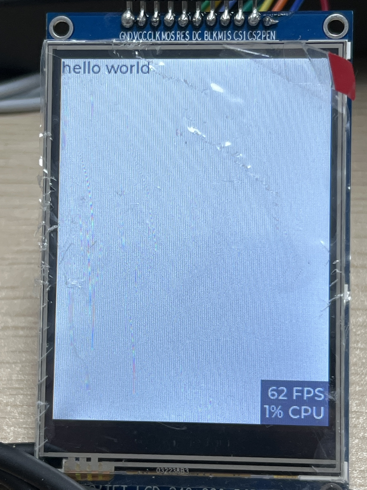

# 屏幕显示

对于期望在屏幕中显示内容，我们将使用与 MicroPython 协作良好的 [LVGL](https://lvgl.io/) 库来作为 UI 库。

本文以 **ST7789V (320x240)** 为例。

## 编译

### 启用配置

```Kconfig
# SPI bus
CONFIG_GPIO=y
CONFIG_SPI=y

# Display
CONFIG_DISPLAY=y
CONFIG_ST7789V=y

# LV_BINDING
CONFIG_MPY_LVGL=y
CONFIG_LV_MEM_CUSTOM=y
CONFIG_LV_Z_DISPLAY_DEV_NAME="DISPLAY"
CONFIG_LV_Z_USE_FILESYSTEM=y
CONFIG_LV_Z_HOR_RES_MAX=240
CONFIG_LV_Z_VER_RES_MAX=320
# CONFIG_LV_USE_FREETYPE=y  # 自定义字体支持，默认关闭
CONFIG_LV_Z_DOUBLE_VDB=y
CONFIG_LV_Z_MEM_POOL_MAX_SIZE=819200

# LVGL
# CONFIG_LV_DPI_DEF=100
CONFIG_LV_COLOR_DEPTH_16=y
```

### 设备树配置

此处主要列举需要使用的参数，需要注意


1. 其中的 Pin 脚相关配置应当根据实际情况接的脚来进行配置。


2. 参数的具体含义参阅 Zephyr SDK 中的 `st7789v.c` 和 `st7789v.h` 以及购置屏幕的商家所提供的配置参数。


3. 这里为了接线方便，占用了一些 `spi0` 的 pin 口，所以把 `spi0` 先禁用了。

```default
#include <dt-bindings/gpio/gpio.h>
&spi0 {
  status = "disabled";
};
&spi1 {
  cs-gpios = <&gpioa 5 GPIO_ACTIVE_LOW>;
  sclk-gpios = <&gpioa 4 GPIO_ACTIVE_LOW>;
  miso-gpios = <&gpioa 6 GPIO_ACTIVE_LOW>;
  mosi-gpios = <&gpioa 7 GPIO_ACTIVE_LOW>;
  status = "okay";

  st7789v@0 {
    compatible = "sitronix,st7789v";
    label = "DISPLAY";

    spi-max-frequency = <20000000>;
    reg = <0>;

    reset-gpios = <&gpioa 19 GPIO_ACTIVE_LOW>;
    cmd-data-gpios = <&gpioa 17 GPIO_ACTIVE_LOW>;

    height = <320>;
    width = <240>;
    x-offset = <0>;
    y-offset = <0>;

    vcom = <0x35>;
    gctrl = <0x35>;
    vrhs = <0x13>;
    vdvs = <0x20>;
    mdac = <0x00>;
    gamma = <0x01>;
    colmod = <0x55>;
    lcm = <0x3c>;
    porch-param = [0c 0c 00 33 33];
    cmd2en-param = [5a 69 02 01];
    pwctrl1-param = [a4 a1];
    pvgam-param = [D0 00 06 09 0B 2A 3C 55 4B 08 16 14 19 20];
    nvgam-param = [D0 00 06 09 0B 29 36 54 4B 0D 16 14 21 20];
    ram-param = [00 F8];
    rgb-param = [CD 08 14];
  };
};
```

### 编译并烧录到设备

参阅 [开始项目](../start#mpy-start) 章节，此处不赘述。

## 使用

烧录完成后，在 `main.py` 中加入对 LVGL 的操作

```python
import lvgl as lv
import time

label = lv.label(lv.scr_act())
label.set_text('hello world')

while True:
  lv.task_handler()
  time.sleep_ms(10)
```

执行命令

```bash
$ lisa mpy run main.py
```

之后你将在可以看到如下画面




在 [LVGL 的文档中](https://docs.lvgl.io/master/index.html) 通常包含 C 与 MicroPython 两种调用方式，你可以参考对应的章节来创建你自己的图形化界面。
