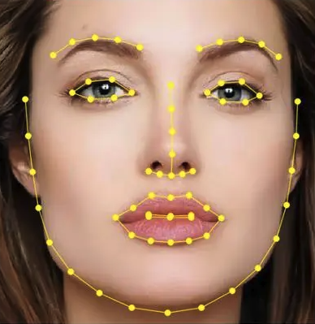
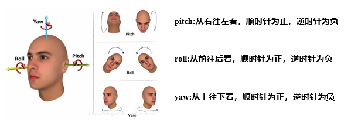

# 功能与场景

## 功能介绍

#### 人脸识别

1. 检测图像中人脸信息，选取画面中分值最高的人脸，返回人脸边界框、人脸标定点、头部姿态角度、人脸识别特征等

2. 人脸标定点图示，支持68个关键点检测

3. 头部姿态角度图示，支持pitch、roll、yaw三个角度

#### 特征比较

将检测到的人脸特征值和本地存储的人脸特征值输入算法进行比对， 并返回比对结果

## 功能演示

<video src="https://iflyos-external.oss-cn-shanghai.aliyuncs.com/public/lsopen/zephyr/%E6%96%87%E6%A1%A3%E8%A7%86%E9%A2%91%E4%BB%93/fd.mp4" controls="controls" width="600" height="500">您的浏览器不支持播放该视频！</video>

## 应用场景

离线人脸识别适用于网络条件不稳定、无网、数据安全性要求高、人脸库较小（20人以下）单台设备的人脸识别场景。常见于人脸门禁、小型企业考勤机、自助终端设备等；

## 详细数据

#### 识别效果

在1m距离内，测试特征底库10个，人脸检测和人脸识别效果分别为：

| 识别能力 | 识别率 | 虚警率 |
| -------- | ------ | ------ |
| 人脸检测 | 99%    | 1%     |
| 人脸识别 | 92%    | 1%     |

:::tip 提示
该模型主要应用于小型的人脸识别场景，建议特征底库不超过20个，否则可能会造成虚警率会上升。
::: 

#### 其他数据

| 功能       | 详细说明                |
| ---------- | ----------------------- |
| 人脸标定   | 平均误差(NME)约为0.04   |
| 头部姿态   | 模型预测平均偏差约为±3° |
| 全流程耗时 | 100ms以内               |

#### 资源占用
由于DSP主要用于算法运行，暂不支持对外开放，开发者仅需关注MCU可用空间即可，以下为MCU内存预分配与实际占用情况：

| 内存类型 | 预分配内存 | 实际占用   |
| -------- | -------- | ------ |
| SRAM     | 320KB    | 120KB  |
| PSRAM    | 4096KB   | 1554KB |

