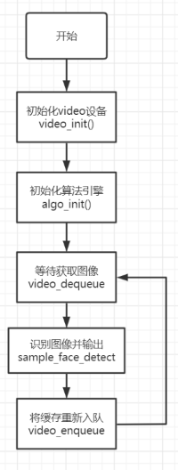

# SDK Sample 说明
本章节对 CSK6S视觉SDK示例 app_algo_fd_sample_for_csk6 进行说明，让开发者能够更快速了解示例的实现逻辑。

## 概述
该 Sample 展示了对SDK接口的基本调用，实现了获取Sensor图像并将算法处理后的结果传输到PC端实时预览。

## 获取 Sample

执行以下命令拉取 [Sample 项目](https://cloud.listenai.com/zephyr/applications/app_algo_fd_sample_for_csk6) 到本地，注意代码仓在本地存放的路径不能有中文名称，否则容易引起错误；
```bash
git clone https://cloud.listenai.com/zephyr/applications/app_algo_fd_sample_for_csk6.git
```

## sample目录结构
```c
app_algo_fd_sample_for_csk6
├─.sdk   //视觉SDK
├─boards //设备树板型文件
├─mock   //图片信息，用于无摄像头时的运行测试
├─remote 
├─resource //资源文件
├─src    //sample 代码
├─CMakeLists.txt
└─prj.conf
```
## 组件配置
项目基础组件配置配置,在prj.conf文件:
```shell
# 日志输出配置
CONFIG_PRINTK=y
CONFIG_DEBUG=y
CONFIG_LOG=y
CONFIG_LOG_MODE_IMMEDIATE=y
# CONFIG_LOG_BUFFER_SIZE=4096
CONFIG_LOG_DETECT_MISSED_STRDUP=n
CONFIG_LOG_BACKEND_SHOW_COLOR=y
CONFIG_LOG_BACKEND_FORMAT_TIMESTAMP=y
CONFIG_LOG_BACKEND_UART=y
CONFIG_LOG_BACKEND_UART_OUTPUT_TEXT=y
# 主线程分配内存大小
CONFIG_MAIN_STACK_SIZE=8192
# 系统堆大小，用户可以根据实际使用情况定义
CONFIG_HEAP_MEM_POOL_SIZE=90000
CONFIG_CSK_HEAP=y
CONFIG_CSK_HEAP_MEM_POOL_SIZE=342736

# avf框架
CONFIG_AVF=y
CONFIG_AVF_DEBUG_LEVEL=1
CONFIG_AVF_USE_BINARY_ARRAY=y
# CONFIG_AVF_DSP_FIRMWARE_LOAD_DEBUG=y

# GPIO配置
CONFIG_GPIO=y
# I2C配置
CONFIG_I2C=y
# dvp接口配置
CONFIG_VIDEO=y
CONFIG_VIDEO_CSK6_DVP=y
CONFIG_VIDEO_GC032A=y
CONFIG_VIDEO_BUFFER_POOL_SZ_MAX=624400
CONFIG_VIDEO_BUFFER_POOL_NUM_MAX=2
CONFIG_VIDEO_CUSTOM_SECTION=y
CONFIG_VIDEO_CUSTOM_SECTION_NAME=".psram_section"

# licak算法底层框架配置 
CONFIG_LICAK=y
CONFIG_LICAK_MODULES_ALG_FD=y

# avf 所需要的 IPM配置
CONFIG_IPM=y
# 缓存
CONFIG_CACHE_MANAGEMENT=y
# USB图像传输配置
CONFIG_WEBUSB=y
CONFIG_WEBUSB_LOG_LEVEL_DBG=y
CONFIG_STDOUT_CONSOLE=y
CONFIG_USB_DEVICE_STACK=y
CONFIG_USB_DEVICE_BOS=y
# UART配置
CONFIG_SERIAL=y
CONFIG_UART_INTERRUPT_DRIVEN=y
CONFIG_UART_LINE_CTRL=y
# 日志相关
CONFIG_LOG=y
CONFIG_LOG_PRINTK=y
CONFIG_USB_DRIVER_LOG_LEVEL_ERR=y
CONFIG_USB_DEVICE_LOG_LEVEL_ERR=y
CONFIG_CONSOLE=y
CONFIG_FPU=y
CONFIG_NEWLIB_LIBC=y
CONFIG_NEWLIB_LIBC_NANO=n
# 仅运行图像采集监视
CONFIG_CAMERA_MONITOR=n
# 固件编译优化提速
CONFIG_SPEED_OPTIMIZATIONS=y
# 分块内存分配提升效率
CONFIG_SHARED_MULTI_HEAP=y

```
:::tip
在使用PC端图像预览工具前，需要将USB数据传输配置 CONFIG_WEBUSB=y 设置为y，重新编译并烧录固件。

:::
## 设备树配置
设备树配置文件`csk6011a_nano.overlay`，在`/boards`目录下：
```c
/delete-node/ &psram_ap;
/delete-node/ &psram_cp;
/delete-node/ &psram_share;
/delete-node/ &wifi_driver_storage;
/delete-node/ &wifi_nvs_storage;
/delete-node/ &storage_partition;

/ {
	chosen {
		/*
		 * shared memory reserved for the inter-processor communication
		 */
		zephyr,ipc_shm = &psram_share;
		zephyr,ipc = &mailbox0;
	};

};
/* psram配置*/
&psram0 {
	psram_cp: psram_cp@30000000 {
		compatible = "listenai,csk6-psram-partition";
		reg = <0x30000000 0x400000>;
		status = "okay";
	};
	psram_ap: psram_ap@30400000 {
		compatible = "zephyr,memory-region","listenai,csk6-psram-partition";
		reg = <0x30400000 0x21d000>;
		status = "okay";
		zephyr,memory-region = "PSRAMAP";
	};
	psram_ap_nocache: psram@3061d000 {
		compatible = "zephyr,memory-region","listenai,csk6-psram-partition";
		reg = <0x3061d000 0x1c3000>;
		status = "okay";
		zephyr,memory-region = "PSRAMAP_NOCACHE";
        zephyr,memory-region-mpu = "RAM_NOCACHE";
	};
	psram_share: psram_share@307e0000 {
		compatible = "listenai,csk6-psram-partition";
		reg = <0x307e0000 0x20000>;
		status = "okay";
	};
};

/* GPIO配置 */
&csk6011a_nano_pinctrl{
                /* uart pin脚配置 */
                pinctrl_uart1_tx_default: uart1_tx_default{
                    pinctrls = <UART1_TXD_GPIOA_10>;
                };
                /* i2c pin脚配置 */
                pinctrl_i2c0_scl_default: i2c0_scl_default{
                        pinctrls = <I2C0_SCL_GPIOB_04>;
                };
                
                pinctrl_i2c0_sda_default: i2c0_sda_default{
                        pinctrls = <I2C0_SDA_GPIOB_03>;
                };
                /* dvp pin脚配置 */
                pinctrl_dvp_clkout_default: dvp_clkout_default{
                    pinctrls = <CLKP_OUT_GPIOA_07>;
                };

               ...
};

/* gc032a摄像头i2c配置 */
&i2c0 {
        status = "okay";
        pinctrl-0 = <&pinctrl_i2c0_scl_default &pinctrl_i2c0_sda_default>; 
        pinctrl-names = "default";

        gc032a: gc032a@21 {
            compatible = "galaxyc,gc032a";
            status = "okay";
            label = "GC032A";
            reg = <0x21>;
            reset-gpios = <&gpioa 6 0>;
            /* 关联gc30a2和dvp */
            port {
                gc032a_ep_out: endpoint {
                    remote-endpoint = <&dvp_ep_in>;
                };
			};
		};

};
/* 串口配置 */
&uart0 {
        current-speed = <921600>;
};

/* 摄像头dvp配置 */
&dvp {
    status = "okay";
    sensor-label = "GC032A";
    clock-prescaler = <6>;
    data-align-type = "high_align";
    pclk-polarity = "post_edge_sampling";
    hsync-polarity = "active_high";
    vsync-polarity = "active_low";

    pinctrl-0 = <
                &pinctrl_dvp_clkout_default 
                &pinctrl_dvp_vsync_default
                &pinctrl_dvp_hsync_default
                &pinctrl_dvp_pclk_default
                &pinctrl_dvp_d4_default
                &pinctrl_dvp_d5_default
                &pinctrl_dvp_d6_default
                &pinctrl_dvp_d7_default
                &pinctrl_dvp_d8_default
                &pinctrl_dvp_d9_default
                &pinctrl_dvp_d10_default
                &pinctrl_dvp_d11_default
                >; 
    pinctrl-names = "default";

  /* 关联gc30a2和dvp */
	port {
		dvp_ep_in: endpoint {
			remote-endpoint = <&gc032a_ep_out>;
		};
	};

};

```

## 软件实现流程图


## 代码实现
```c
...

#define MOCK_DATA (0)

void button_callback(uint32_t event){
    int ret = 0;

    switch(event){
        /* 按键单击：人脸特征值比对 */
        case BUTTON_SINGLE_CLICK:
            if(fr.get_new_feature){
                uint16_t cnt = 0;
                uint8_t done = 0;
                fr.get_new_feature = false;
                
                fd_cmd_compare_feature_data_t data;
                fd_cmd_compare_feature_result_t result;
                data.feature_dim = FD_MAX_FEATURE_DIMS;
                data.feature_src = fr.feature_nvs;//本地特征值
                data.feature_dst = fr.feature;//待比较的人脸特征值

                storage_get_data_cnt(&cnt);
                for(uint32_t i = 0; i < cnt; i++){
                    storage_read_data(i, (void *)fr.feature_nvs, sizeof(fr.feature));
                    /* 人脸特征值比对 */
                    ret = fd_control(fr.fd, FD_CMD_COMPARE_FEATURE, &data, &result);
                    if(ret != 0){
                        LOG_ERR("feature_compare faild %d", ret);
                    }

                    LOG_INF("feature_compare score = %f", result.score);
                    if(result.score > 0.95){
                        done = 1;
                    }
                }
                if(done){
                    webusb_send_message("face_calc_similar: success");

                }else{
                    webusb_send_message("face_calc_similar: fail");
                } 
            }else{
                webusb_send_message("face_calc_similar: fail");
                LOG_INF("not detected face feature");
            }      
            break;
        /* 按键长按：人脸特征值保存 */
        case BUTTON_LONG_PRESS:
            if(fr.get_new_feature){
                uint16_t cnt = 0;
                fr.get_new_feature = false;
                char *txt = csk_malloc(64);
                
                storage_write((void *)fr.feature, sizeof(fr.feature));

                storage_get_data_cnt(&cnt);
                sprintf(txt, "face_recognize: success, count:%d", cnt);
                webusb_send_message(txt);
                csk_free(txt);

				LOG_INF("face feature save success");
            }else{
                webusb_send_message("face_recognize: fail");

                LOG_INF("not detected face feature");
            }  
            break;
        /* 按键双击：清除已存储的人脸特征值 */
        case BUTTON_DOUBLE_CLICK:
            storage_clear_data();
            webusb_send_message("clear_face _data: success, count: 0");
            break;
        default:
            break;
    }
}

void main(void) {

  ...

#ifdef CONFIG_WEBUSB
    static char buffer[sizeof(msg_data_t) * MSGQ_NUMBER];
    k_msgq_init(&fr.msg, buffer, sizeof(msg_data_t), MSGQ_NUMBER);
    /* 注册USB图像到PC端的回调函数 */
    register_webusb_status_cb(webusb_status_callback);
	if (0 != webusb_enable()) {
		LOG_ERR("Failed to enable USB");
		return;
	}

    storage_init();
    /* 按键事件处理，通过按键控制人脸注册、人脸比对、人脸特征值清除 */
    button_proc(button_callback);
#endif

  /* 视频数据初始化 */
  if(video_init()){
    return;
  }

  /* 算法初始化 */
  if(alago_init()){
    return;
  }

  while(1){
#if MOCK_DATA
    struct video_format fmt;
    fmt.width = IMAGE_WIDTH;
    fmt.height = IMAGE_HEIGHT;
    fmt.pitch = fmt.width * 3;
    fmt.pixelformat = VIDEO_PIX_FMT_RGB24;

    sample_face_detect(fr.fd, vbuf, &fmt);
#else
    if (video_dequeue(fr.video, VIDEO_EP_OUT, &vbuf, K_FOREVER)) {
      LOG_ERR("Unable to dequeue video buf");
      break;
    }
    /* 人脸检测 */
    sample_face_detect(fr.fd, vbuf, &fr.fmt);
  
    video_enqueue(fr.video, VIDEO_EP_OUT, vbuf);
#endif

    last = time;
    time = k_uptime_get_32();
    LOG_DBG("FPS: %.2f", 1000.0 / (time - last));
    }
}
...

```
## 算法参数及配置说明
### 算法开放配置的参数
当前视觉SDK，针对头肩检测与手势识别，算法层面支持以下参数参数的配置：

| 参数                                    | type  | 功能说明                                                     | 取值范围 |
| --------------------------------------- | ----- | ------------------------------------------------------------ | -------- |
| FD_PARAM_FACE_DETECT_THRES    | float | **检测框最终门限**     <br /> | 0~1  |
| FD_PARAM_FACE_DETECT_PROBTHRES | float   | **检测框初选门限** <br />  | 0~1  |
| FD_PARAM_FACE_ALIGN_YAWTHRES | float   | **质量检测偏航角门限**  <br /> | 0~ |
| FD_PARAM_FACE_ALIGN_PITCHTHRES  | float   | **质量检测俯仰角门限**                                       | 0~ |
| FD_PARAM_FACE_ALIGN_ROLLTHRES  | float   | **质量检测翻滚角门限**                                       | 0~ |
| FD_PARAM_ANTI_SPOOFING_THRES  | float   | **活体识别门限**                                       | 0~1 |
|   | float   |                                        |  |

### 参数说明

#### FD_PARAM_FACE_DETECT_THRES  

**参数说明:**    

**调优方向：**    

#### FD_PARAM_FACE_DETECT_PROBTHRES 


**参数说明：**     

**调优方向：**    


#### FD_PARAM_FACE_ALIGN_YAWTHRES

**参数说明：**     

**调优方向：**     


#### FD_PARAM_FACE_ALIGN_ROLLTHRES

**参数说明：**    

**调优方向：**    

#### FD_PARAM_ANTI_SPOOFING_THRES

**参数说明：**    

**调优方向：**    

## 参数配置参考

:::tip
以上参数仅供参考