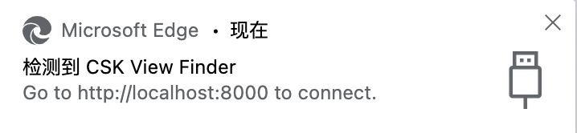
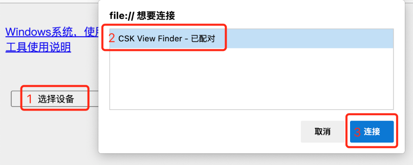
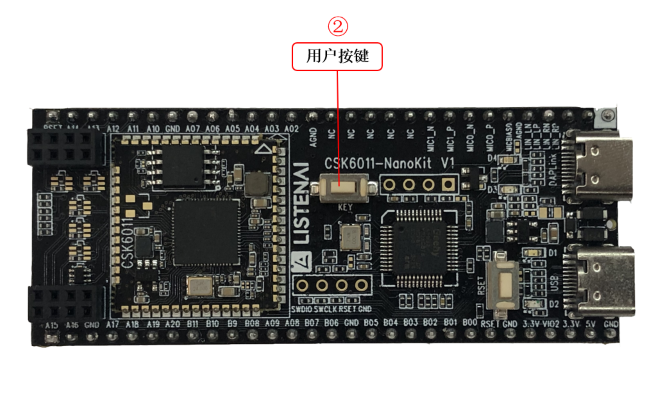

# PC 查看工具

视觉开发套件支持 PC 端查看摄像头预览图和识别结果，方便进行效果调试和问题排查。

## 使用准备

### 第一步：开启 PC 调试模式

开启 PC 调试模式后，设备会在输出算法识别结果的同时，将图像压缩传至 PC 端供用户预览。

在 `app_algo_fd_sample_for_csk6` 项目的根目录下找到 `prj.conf` 文件，将其中的 `CONFIG_WEBUSB=n` 改为 `CONFIG_WEBUSB=y` ，再进行固件编译、烧录。如已开启，则跳到下一步；

```bash
lisa zep build -b csk6011a_nano
lisa zep flash
```

### 第二步：PC 工具获取

拉取 [PC 工具项目](https://cloud.listenai.com/zephyr/applications/csk_view_finder_spd) 到本地

```bash
git clone https://cloud.listenai.com/zephyr/applications/csk_view_finder_spd.git
```

### 第三步：打开工具

使用 Chrome 内核的浏览器，打开项目 `csk_view_finder_spd/src` 目录下的 `index.html` 文件；

### 第四步：安装驱动

- 如果你使用的是 Windows 系统，请点击网页上的【 Windows 系统，使用必读】按钮，按照步骤安装驱动；安装驱动过程，需将 CSK6 USB 接口连接电脑；
- 如果你使用的是 Mac/Linux 系统，请忽略本步骤。

## 开始使用

### 使用工具查看

1. 使用TypeC数据线连接 CSK6 USB 接口至电脑，若在PC端可看到如下图提示，说明设备已被识别成功



2. 点击“选择设备”按钮，选择“CSK View Finder”选项，点击“连接”，即可看到预览图和识别结果；



:::tip 提示
为了保证算法与PC预览的帧率一致，我们会将发送至PC工具的预览图进行缩小，因此你在PC工具所看到的画面质量会有所降低。但这并不影响算法的识别，算法所接收到的是640x480px图像。
::: 

### 使用人脸识别功能

#### 人脸识别

1. 将摄像头朝向人脸，使人脸出现在画面中，当画面出现绿框时，表示检测到人脸；
2. 调整人脸位置和角度，尽量使人脸正对摄像头，当画面绿框转换为黄框时，表示已通过头部姿态检测，已识别出人脸特征值，下一步可进行人脸注册操作。

#### 人脸注册

1. 长按开发板上的“用户按钮”，直到日志信息处出现`face_recognize: success`即表示当前人脸注册成功；
2. 当前Sample支持人脸库最多10个，注册超过10个将从头开始对人脸库进行覆盖。



#### 特征比较

1. 完成人脸注册后，同样将人脸正对摄像头，直至出现黄框，表示当前人脸特征提取成功；
2. 短按开发板上的“用户按钮” ，设备会将当前人脸特征与已注册的人脸库进行逐一比较，如分值超过设定的阈值，则日志信息处会出现`face_calc_similar: success`，如低于设定的阈值，则显示`face_calc_similar: fail`。

#### 清除注册信息

1. 快速双击开发板上的“用户按钮”，日志信息处出现`clear_face _data: success`，则表示人脸库已清除。


### 使用工具记录

点击“开始记录”按钮，工具则开始记录预览图和识别结果；

点击“停止记录”按钮，工具则会将刚才记录的图像和识别结果进行打包压缩；

