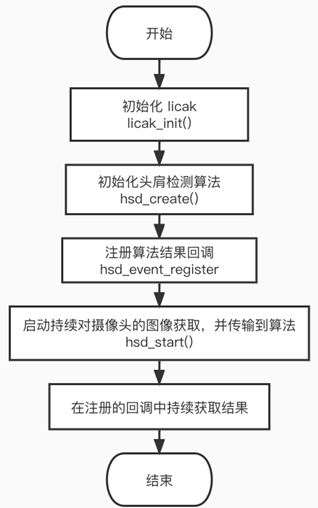

# SDK Sample 说明
本章节对 CSK6S视觉SDK示例 app_algo_hsd_sample_for_csk6 进行说明，让开发者能够更快速了解示例的实现逻辑。

## 概述
该 Sample 展示了对SDK接口的基本调用，实现了获取Sensor图像并将算法处理后的结果传输到PC端实时预览。

## 获取 Sample

执行以下命令拉取 [Sample 项目](https://cloud.listenai.com/zephyr/applications/app_algo_hsd_sample_for_csk6) 到本地，注意代码仓在本地存放的路径不能有中文名称，否则容易引起错误；
```bash
git clone https://cloud.listenai.com/zephyr/applications/app_algo_hsd_sample_for_csk6.git
```

## sample目录结构
```c
app_algo_hsd_sample_for_csk6
├─.sdk   //视觉SDK
├─boards //设备树板型文件
├─mock   //图片信息，用于无摄像头时的运行测试
├─remote 
│  ├─boards
│  └─src
├─resource //资源文件
└─src    //sample 代码
```
## 组件配置
项目基础组件配置配置,在prj.conf文件:
```shell
# 日志输出配置
CONFIG_PRINTK=y
CONFIG_DEBUG=y
CONFIG_LOG=y
CONFIG_LOG_DETECT_MISSED_STRDUP=n
CONFIG_LOG_BACKEND_SHOW_COLOR=y
CONFIG_LOG_BACKEND_FORMAT_TIMESTAMP=y
CONFIG_LOG_BACKEND_UART=y
CONFIG_LOG_BACKEND_UART_OUTPUT_TEXT=y
CONFIG_LOG_BUFFER_SIZE=4096
# 主线程分配内存大小
CONFIG_MAIN_STACK_SIZE=8192
# 系统堆大小，用户可以根据实际使用情况定义
CONFIG_HEAP_MEM_POOL_SIZE=90000
CONFIG_CSK_HEAP=y
CONFIG_CSK_HEAP_MEM_POOL_SIZE=342736

# avf框架
CONFIG_AVF=y
CONFIG_AVF_DEBUG_LEVEL=1
CONFIG_AVF_USE_BINARY_ARRAY=y
# GPIO配置
CONFIG_GPIO=y
# I2C配置
CONFIG_I2C=y
# dvp接口配置
CONFIG_VIDEO=y
CONFIG_VIDEO_CSK6_DVP=y
CONFIG_VIDEO_GC032A=y
CONFIG_VIDEO_BUFFER_POOL_SZ_MAX=624400
CONFIG_VIDEO_BUFFER_POOL_NUM_MAX=3
CONFIG_VIDEO_CUSTOM_SECTION=y
CONFIG_VIDEO_CUSTOM_SECTION_NAME=".psram_section"

# licak算法底层框架配置 
CONFIG_LICAK=y
CONFIG_LICAK_MODULES_ALG_HSD_DBG=y
CONFIG_LICAK_MODULES_ALG_HSD=y

# avf 所需要的 IPM配置
CONFIG_IPM=y
# 缓存
CONFIG_CACHE_MANAGEMENT=y
# USB图像传输配置
CONFIG_WEBUSB=y
CONFIG_WEBUSB_LOG_LEVEL_DBG=y
CONFIG_STDOUT_CONSOLE=y
CONFIG_USB_DEVICE_STACK=y
CONFIG_USB_DEVICE_BOS=y
# 日志相关
CONFIG_LOG_PRINTK=y
CONFIG_USB_DRIVER_LOG_LEVEL_ERR=y
CONFIG_USB_DEVICE_LOG_LEVEL_ERR=y
CONFIG_CONSOLE=y
CONFIG_FPU=y
CONFIG_NEWLIB_LIBC=y
CONFIG_NEWLIB_LIBC_NANO=n

# 仅运行图像采集监视
CONFIG_CAMERA_MONITOR=n
# 固件编译优化提速
CONFIG_SPEED_OPTIMIZATIONS=y
# 分块内存分配提升效率
CONFIG_SHARED_MULTI_HEAP=y
```
:::tip
在使用PC端图像预览工具前，需要将USB数据传输配置 CONFIG_WEBUSB=y 设置为y，重新编译并烧录固件。

:::
## 设备树配置
设备树配置文件`csk6011a_nano.overlay`，在`/boards`目录下：
```c
/delete-node/ &psram_ap;
/delete-node/ &psram_cp;
/delete-node/ &psram_share;

/ {
	chosen {
		/*
		 * shared memory reserved for the inter-processor communication
		 */
		zephyr,ipc_shm = &psram_share;
		zephyr,ipc = &mailbox0;
	};

};
/* psram配置*/
&psram0 {
	psram_cp: psram_cp@30000000 {
		compatible = "listenai,csk6-psram-partition";
		reg = <0x30000000 0x400000>;
		status = "okay";
	};
	psram_ap: psram_ap@30400000 {
		compatible = "zephyr,memory-region","listenai,csk6-psram-partition";
		reg = <0x30400000 0x21d000>;
		status = "okay";
		zephyr,memory-region = "PSRAMAP";
	};
	psram_ap_nocache: psram@3061d000 {
		compatible = "zephyr,memory-region","listenai,csk6-psram-partition";
		reg = <0x3061d000 0x1c3000>;
		status = "okay";
		zephyr,memory-region = "PSRAMAP_NOCACHE";
        zephyr,memory-region-mpu = "RAM_NOCACHE";
	};
	psram_share: psram_share@307e0000 {
		compatible = "listenai,csk6-psram-partition";
		reg = <0x307e0000 0x20000>;
		status = "okay";
	};
};

/* GPIO配置 */
&csk6011a_nano_pinctrl{
                /* uart pin脚配置 */
                pinctrl_uart1_tx_default: uart1_tx_default{
                    pinctrls = <UART1_TXD_GPIOA_10>;
                };
                /* i2c pin脚配置 */
                pinctrl_i2c0_scl_default: i2c0_scl_default{
                        pinctrls = <I2C0_SCL_GPIOB_04>;
                };
                
                pinctrl_i2c0_sda_default: i2c0_sda_default{
                        pinctrls = <I2C0_SDA_GPIOB_03>;
                };
                /* dvp pin脚配置 */
                pinctrl_dvp_clkout_default: dvp_clkout_default{
                    pinctrls = <CLKP_OUT_GPIOA_07>;
                };

               ...
};

/* gc032a摄像头i2c配置 */
&i2c0 {
        status = "okay";
        pinctrl-0 = <&pinctrl_i2c0_scl_default &pinctrl_i2c0_sda_default>; 
        pinctrl-names = "default";

        gc032a: gc032a@21 {
            compatible = "galaxyc,gc032a";
            status = "okay";
            label = "GC032A";
            reg = <0x21>;
            reset-gpios = <&gpioa 6 0>;
            /* 关联gc30a2和dvp */
            port {
                gc032a_ep_out: endpoint {
                    remote-endpoint = <&dvp_ep_in>;
                };
			};
		};

};
/* 串口配置 */
&uart0 {
        current-speed = <921600>;
};

/* 摄像头dvp配置 */
&dvp {
    status = "okay";
    sensor-label = "GC032A";
    clock-prescaler = <6>;
    data-align-type = "high_align";
    pclk-polarity = "post_edge_sampling";
    hsync-polarity = "active_high";
    vsync-polarity = "active_low";

    pinctrl-0 = <
                &pinctrl_dvp_clkout_default 
                &pinctrl_dvp_vsync_default
                &pinctrl_dvp_hsync_default
                &pinctrl_dvp_pclk_default
                &pinctrl_dvp_d4_default
                &pinctrl_dvp_d5_default
                &pinctrl_dvp_d6_default
                &pinctrl_dvp_d7_default
                &pinctrl_dvp_d8_default
                &pinctrl_dvp_d9_default
                &pinctrl_dvp_d10_default
                &pinctrl_dvp_d11_default
                >; 
    pinctrl-names = "default";

  /* 关联gc30a2和dvp */
	port {
		dvp_ep_in: endpoint {
			remote-endpoint = <&gc032a_ep_out>;
		};
	};

};

```

## 软件实现流程图



## 代码实现
```c
...
/* 获取识别结果 */
void on_receive_hsd_result(hsd_t *hsd, hsd_event event, void *data,
    void *user_data) {
  /* 头肩识别结果 */
  if (event == HSD_EVENT_HEAD_SHOULDER) {
    hsd_head_shoulder_detect *result = (hsd_head_shoulder_detect *)data;
    LOG_INF("head shoulder cnt: %d", result->track_count);
    
    ...

  /* 手势识别结果 */
  } else if (event == HSD_EVENT_GESTURE_RECOGNIZE) {
    head_shoulder_detect *result = (head_shoulder_detect *)data;
    LOG_INF("gesture result id: %d ,state: %d", result->id, result->gesture_state);
  }
}

...

void main(void) {

    ...

  /* 系统初始化 */
  if (0 != licak_init()) {
    printk("LICAK init failed,exit.\n");
    return;
  }

  video = device_get_binding(VIDEO_DEV);

  if (video == NULL) {
    LOG_ERR(
        "Video device %s not found, "
        "fallback to software generator.",
        VIDEO_DEV);

    return;
  }
  
  /* video 初始化 */
  struct video_format fmt;
  fmt.pixelformat = VIDEO_PIX_FMT_VYUY;
  fmt.width = IMAGE_WIDTH;
  fmt.height = IMAGE_HEIGHT;
  fmt.pitch = fmt.width * 2;
  if (video_set_format(video, VIDEO_EP_OUT, &fmt)) {
    LOG_ERR("Unable to set video format");
    return;
  }
  
  /* 创建算法引擎实例 */
  hsd_t *hsd = hsd_create(HSD_FLAG_HEAD_SHOULDER | HSD_FLAG_GESTURE_RECOGNIZE);

  if (hsd == NULL) {
    LOG_ERR("Create HSD instance failed.");
    return;
  }

  /* 注册算法结果回调 */
  hsd_event_register(hsd, HSD_EVENT_HEAD_SHOULDER, on_receive_hsd_result, NULL);
  hsd_event_register(hsd, HSD_EVENT_GESTURE_RECOGNIZE, on_receive_hsd_result,
      NULL);

    ...

  /* 配置算法参数 */
  int ret = hsd_set_params(hsd, HSD_PARAM_HEAD_SHOULDER_DETECT_THRES, 0.6f);
  ret = hsd_set_params(hsd, HSD_PARAM_HEAD_SHOULDER_DETECT_LOSS_CNT, 5);
  ret = hsd_set_params(hsd, HSD_PARAM_HEAD_SHOULDER_DETECT_PIXESIZE, 40);
  ret = hsd_set_params(hsd, HSD_PARAM_HEAD_SHOULDER_DETECT_TIMEOUT, 10);

  /* 启动识别 */
  hsd_start(hsd, video);
...

```
## 算法参数及配置说明
### 算法开放配置的参数
当前视觉SDK，针对头肩检测与手势识别，算法层面支持以下参数参数的配置：

| 参数                                    | type  | 功能说明                                                     | 取值范围 |
| --------------------------------------- | ----- | ------------------------------------------------------------ | -------- |
| HSD_PARAM_HEAD_SHOULDER_DETECT_THRES    | float | **头肩检测阈值**     <br /> | (0, 1)   |
| HSD_PARAM_HEAD_SHOULDER_DETECT_LOSS_CNT | int   | **头肩跟踪允许丢失的次数。** <br />  | (1, 10)  |
| HSD_PARAM_HEAD_SHOULDER_DETECT_PIXESIZE | int   | **像素值大小。**  <br /> | (1, 480) |
| HSD_PARAM_HEAD_SHOULDER_DETECT_TIMEOUT  | int   | **头肩检测超时时间。**                                       | (1, 100) |

### 参数说明

#### HSD_PARAM_HEAD_SHOULDER_DETECT_PIXESIZE  

**参数说明:**    
像素值大小，头肩检测框 w，h 要大于该像素值才返回头肩框。

**调优方向：**    
像素值越小，检测距离越远。

#### HSD_PARAM_HEAD_SHOULDER_DETECT_THRES 


**参数说明：**     
头肩检测阈值，大于该阈值认为是有效头肩框并输出头肩框结果。

**调优方向：**    
由于算法鲁棒性问题，阈值太低可能产生较多虚警。


#### HSD_PARAM_HEAD_SHOULDER_DETECT_LOSS_CNT

**参数说明：**     
头肩跟踪允许丢失的次数，主要是指允许容忍检测算法无法连续检测到目标的次数，如果超过允许连续检测丢失的次数，则会删掉跟踪目标。

**调优方向：**     
由于有时头肩检测不一定检测成功，需要通过改参数容忍丢失的次数，下次触发检测时候保证跟踪帧连续。


#### HSD_PARAM_HEAD_SHOULDER_DETECT_TIMEOUT

**参数说明：**    
头肩检测超时时间，是指的跟踪目标在遮挡情况下，允许消失的的最长时。如果在这个时间如果超时，无法再次识别。

**调优方向：**    
在快速移动或者遮挡物的环境下，可根据需要设置超时时间，其他场景下可用默认值或不设置。

## 参数配置参考

| 头肩跟随距离               | 参考参数                          |
| -------------------------- | --------------------------------- |
| 头肩跟随有效范围0~5m<br /> | HSD_PARAM_HEAD_SHOULDER_DETECT_THRES  0.35<br />HSD_PARAM_HEAD_SHOULDER_DETECT_PIXESIZE 15~30 |
| 头肩跟随有效范围0~3m<br /> | HSD_PARAM_HEAD_SHOULDER_DETECT_THRES 0.35<br />HSD_PARAM_HEAD_SHOULDER_DETECT_PIXESIZE 40~60 |

:::tip
以上参数仅供参考，HSD_PARAM_HEAD_SHOULDER_DETECT_PIXESIZE的值可根据PC端预览工具显示的头肩框的w，h来确定，HSD_PARAM_HEAD_SHOULDER_DETECT_THRES则建议使用推荐值0.35。
:::