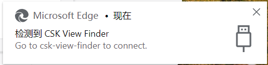
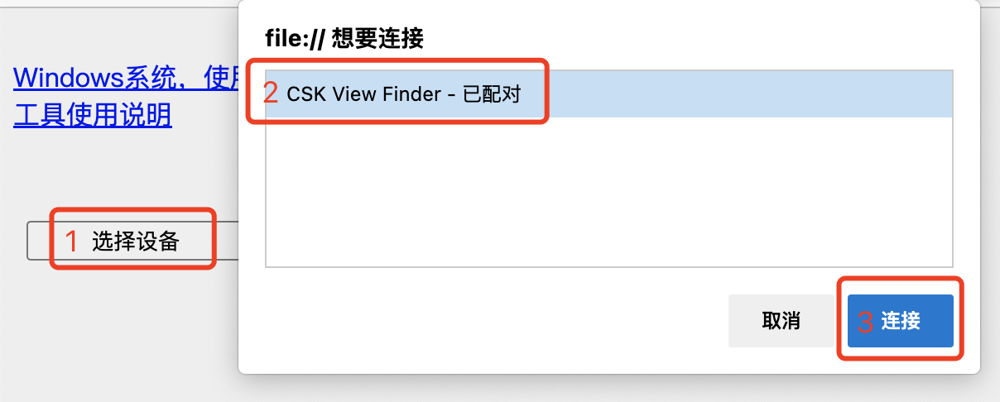

# PC 查看工具

:::caution注意
目前该功能处于实验性阶段，工作可能并不稳定。
:::

视觉开发套件支持 PC 端查看摄像头预览图和识别结果，方便进行效果调试和问题排查。

## 使用准备

### 第一步：开启 PC 调试模式

开启 PC 调试模式后，设备会在输出算法识别结果的同时，将图像压缩传至 PC 端供用户预览。

在 `app_algo_hsd_sample_for_csk6` 项目的根目录下找到 `prj.conf` 文件，将其中的 `CONFIG_WEBUSB=n` 改为 `CONFIG_WEBUSB=y` ，再进行固件编译、烧录。如已开启，则跳到下一步；

```bash
lisa zep build -b csk6011a_nano
lisa zep flash
```

### 第二步：PC 工具获取

拉取 [PC 工具项目](https://cloud.listenai.com/zephyr/applications/csk_view_finder_spd) 到本地

```bash
git clone https://cloud.listenai.com/zephyr/applications/csk_view_finder_spd.git
```

### 第三步：打开工具

使用 Chrome 内核的浏览器，打开项目 `csk_view_finder_spd/src` 目录下的 `index.html` 文件；

### 第四步：安装驱动

- 如果你使用的是 Windows 系统，请点击网页上的【 Windows 系统，使用必读】按钮，按照步骤安装驱动；在安装驱动的过程，需保持 CSK6 USB 接口与电脑的连接；
- 如果你使用的是 Mac/Linux 系统，请忽略本步骤。

## 开始使用

### 使用工具查看

1. 使用TypeC数据线连接 CSK6 USB 接口至电脑，若在PC端可看到如下图提示，说明设备已被识别成功




2. 点击“选择设备”按钮，选择“CSK View Finder”选项，点击“连接”，即可看到预览图和识别结果；

若你使用的是Linux系统，且发现无法识别到USB设备，先请尝试[为USB添加udev规则](/chips/600X/FAQ/faq_env#Linux系统下无法识别到CSK-USB设备)后重试。




:::tip 提示
为了保证算法与PC预览的帧率一致，我们会将发送至PC工具的预览图进行缩小，因此你在PC工具所看到的画面质量会有所降低。但这并不影响算法的识别，算法实际所接收到的图像分辨率为 640x480 px。
:::

### 使用工具记录

点击“开始记录”按钮，工具则开始记录预览图和识别结果；

点击“停止记录”按钮，工具则会将刚才记录的图像和识别结果进行打包压缩。
