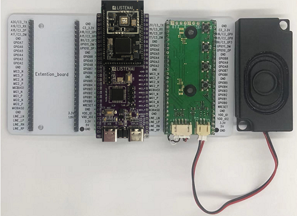

# 播音
## 概述
aplay是CSK6 SDK提供的一个音频播放组件，提供了基础的音频播放接口。本节通过示例调用aplay API接口实现音频播放，开发者可基于aplay完成符合业务开发需要的音频播放器。当前aplay支持的音频格式：16bit 48k wav格式。通过本章节学习，您将了解到：
- aplay音频API接口的基本使用
  

## aplay API接口

### acap_create

```c
acapture_t* acap_create(void);
```

**接口说明**

创建并初始化一个aplay的实例。


### aplay_set_fmt

```c
int aplay_set_fmt(aplay_t* handle, amedia_fmt_t* fmt);
```

***\*接口说明\***

设置播放器数据流格式。

**参数说明**

| 字段   | 说明                     |
| ------ | ------------------------ |
| handle | 指向播放器结构句柄的指针 |
| fmt    | 指向音频格式结构的指针   |

**fmt结构体内容：**

```c
typedef struct{

  amedia_compr_t compr;  /*音频编码格式*/

  int rate;        /*采样率*/

  int channels;      /*通道数量*/

  int bits;        /*位宽 */

  int bitrate;       /*码率*/

}amedia_fmt_t;
```


### aplay_start

```c
int aplay_start(aplay_t* handle);
```

***\*接口说明\***

启动播放。

**参数说明**

| 字段   | 说明                     |
| ------ | ------------------------ |
| handle | 指向播放器结构句柄的指针 |


### aplay_pause

```c
int aplay_pause(aplay_t* handle);
```

***\*接口说明\***

暂停播放。

**参数说明**

| 字段   | 说明                     |
| ------ | ------------------------ |
| handle | 指向播放器结构句柄的指针 |


### aplay_pause_release

```c
int aplay_pause_release(aplay_t* handle);
```

***\*接口说明\***

暂停播放并释放播放器。

**参数说明**

| 字段   | 说明                     |
| ------ | ------------------------ |
| handle | 指向播放器结构句柄的指针 |


### aplay_drain

```c
int aplay_drain(aplay_t* handle);
```

***\*接口说明\***

等待播放器播放完缓存数据后停止播放。

**参数说明**

| 字段   | 说明                     |
| ------ | ------------------------ |
| handle | 指向播放器结构句柄的指针 |


### aplay_stop

```c
int aplay_stop(aplay_t* handle);
```

***\*接口说明\***

停止播放。

**参数说明**

| 字段   | 说明                     |
| ------ | ------------------------ |
| handle | 指向播放器结构句柄的指针 |


### aplay_writei

```c
int aplay_writei(aplay_t* handle,char* data,uint32_t len);
```

***\*接口说明\***

将音频数据写入播放器。

**参数说明**

| 字段   | 说明                         |
| ------ | ---------------------------- |
| handle | 指向播放器结构句柄的指针     |
| data   | 指向等待播放的音频数据的指针 |
| len    | 数据长度                     |

更多aplay API接口描述可以在csk6 sdk `\modules\lib\sof_host\include\avf\modules\audio\aplay.h` 头文件中看到。


## 使用示例
### 准备工作
本示例基于 `CSK6-NanoKit`开发板实现，开发者需要做如下准备：
- 一个`CSK6-NanoKit`开发板。
- speaker扩展板(带功放电路和喇叭)。

开发板连接如下图示: 



### 获取sample项目
通过Lisa命令创建项目：
```
lisa zep create
```


依次按以下目录选择完成aplay sample创建：  
> boards → csk6 → subsys → avf → audio → aplay


### 内置音频文件  
应用加载音频文件的步骤如下：  
**Step1：**音频文件存放在示例的`resource\earthquake_48k_16bit.wav`目录下。

**Step2：**通过Cmake文件将音频文件进行编译加载，`CMakeLists.txt`编译时加载到`test_audio.inc`头文件


```shell
generate_inc_file_for_target(
    app
    resource/earthquake_48k_16bit.wav
    ${gen_dir}/test_audio.inc
)
```

在`dsp_resource.h`引用`test_audio.inc`

```shell
    static const unsigned char test_audio[] = {
    #include "test_audio.inc"
    };
```

**Step3：**在`main.c`引用`dsp_resource.h`:  

```c
    #include "dsp_resource.h"
```

### 设备树配置

在`csk6011a_nano`开发板上系统默认通过LINE_L_N/LINE_L_P输出音频，并且使用`GPIOA_04`作为功放的使能引脚，因此需要在sample中重写`board overlay`完成设备树配置。
```c
 / {
    chosen {
        /*
        * shared memory reserved for the inter-processor communication
        */
        zephyr,ipc_shm = &psram_share;
        zephyr,ipc = &mailbox0;
    };
    /*Audio功放控制节点别名*/
    aliases {
        avf-audio-pwr-amp = &pwr_amp;
    };
    /*Audio功放控制引脚定义*/
    pwr_amp:audio_pwr_amp{
        compatible = "listenai,pwr-amp";
        enalbe-gpios = <&gpioa 4 1>;
        label = "audio_pwr_amp";	
        status = "okay";
    };
 
 };
```
### 组件配置

```shell
# LOG 配置，属于系统配置项
CONFIG_PRINTK=y
CONFIG_DEBUG=y
CONFIG_LOG=y
CONFIG_LOG_MODE_IMMEDIATE=y
CONFIG_LOG_DETECT_MISSED_STRDUP=n
CONFIG_LOG_BACKEND_SHOW_COLOR=y
CONFIG_LOG_BACKEND_FORMAT_TIMESTAMP=y
CONFIG_LOG_BACKEND_UART=y
CONFIG_LOG_BACKEND_UART_OUTPUT_TEXT=y
CONFIG_MAIN_STACK_SIZE=2048

# 给系统动态内存分配的内存空间
# sof峰值占用大概40k，所以这个值应该大于40k，具体设置为多少需要根据app本身对于内存的需求来确定。
CONFIG_HEAP_MEM_POOL_SIZE=92160

# 打开psram配置
CONFIG_CSK6_PSRAM=y
# 引用名为newlib的libc标准库
CONFIG_NEWLIB_LIBC=y

# 打开avf配置项
CONFIG_SOF_HOST=y
CONFIG_AVF_DEBUG_LEVEL=1
CONFIG_AVF_USE_BINARY_ARRAY=y

# 底层硬件通讯
CONFIG_IPM=y

CONFIG_GPIO=y

# 打开cache配置
CONFIG_CACHE_MANAGEMENT=y
```

### 音频框架资源

```c
audio.wav   //本地音频资源
cp.bin      //DSP 固件
res.conf    //应用资源配置项
res.overlay //应用资源设备树配置
```

:::note
编译时音频框架资源将会被打包到zephyr.bin固件中，开发者只需要通过lisa zep flash烧录zephyr.bin即可。
:::

### 主程序实现逻辑
基于csk6 sdk提供的aplay API接口，示例sample运行后加载本地wav音频并完成播放。

### 主程序实现过程

```c
#include "dsp_resource.h"

#include "pwr_amp.c"
#include <avf/framework/avf_platform.h>
#include <avf/slogger.h>
#include <licak/licak.h>
#include <licak/modules/audio/aplay.h>
#include <zephyr.h>

/*拆分音频数据，以便循环写入aplay*/
#define PERIOD_BYTES(fmt) amedia_frames_to_bytes(fmt, 1000)

void main(void)
{
    ...

    /*在调用aplay之前，需要初始化音频框架*/
    licak_init();
    
    memset(&fmt, 0, sizeof(amedia_fmt_t));
    /*解析音频数据*/
    pcm_data = prase_wav_fmt(test_audio, sizeof(test_audio), &fmt);
    if (pcm_data == NULL)
    {
        printk("test audio fmt error!.\n");
        return;
    }

    /*step1: 创建aplay实例*/
    aplay = aplay_create(APLAYER_SUBSTREAM_MAIN);
    if (aplay == NULL)
    {
        printk("acap_create failed!\n");
        return;
    }
    printk("Create aplay success\n");
    

    /*step2: 设置aplay配置参数*/
    if (0 != (iret = aplay_set_fmt(aplay, &fmt)))
    {
        printk("aplay_set_fmt failed!\n");
        return;
    }
    printk("Set audio fmt to aplay success\n");

	/*Enable audio power-amp*/
	audio_pwr_amp_init();
	audio_pwr_amp_enbale();

    /*step3: 开始播放*/
    if (0 != (iret = aplay_start(aplay)))
    {
        printk("aplay_set_fmt failed.\n");
        return;
    }
    printk("Trigger play start success.\n");

	buffer_end = (uint32_t)test_audio + sizeof(test_audio);
	pstart = pcm_data;
	while ((uint32_t)pcm_data < buffer_end) {
		write_bytes = buffer_end - (uint32_t)pcm_data > PERIOD_BYTES(&fmt)
				      ? PERIOD_BYTES(&fmt)
				      : buffer_end - (uint32_t)pcm_data;
		/*step4: write data to aplayer*/
		iret = aplay_writei(aplay, (char *)pcm_data, write_bytes);
		if (iret != write_bytes) {
			printk("aplay_writei failed ret %d.\n", iret);
			break;
		}
		pcm_data += iret;
	}
    printk("Write play audio data compelete total size %d with timestamp %lld ms\n", (uint32_t)(pcm_data - pstart), k_uptime_get());
    
    /*step5: 等待aplay播放完成后停止*/
    if (0 != (iret = aplay_drain(aplay)))
    {
        printk("aplay_drain failed.\n");
        return;
    }
    printk("play drain finsh with timestamp %lld ms\n", k_uptime_get());
    
    /*step6: 注销aplay*/
    if (0 != (iret = aplay_destroy(aplay)))
    {
        printk("aplay_destroy failed.\n");
        return;
    }

    printk("aplay run compelete and exit.\n");
}
```
## 编译和烧录
### 编译

在app根目录下通过以下指令完成编译：
```
lisa zep build -b csk6011a_nano
```
### 烧录   

`csk6011a_nano`开发板通过USB连接PC，通过烧录指令完成烧录：
```
lisa zep flash --runner pyocd
```
### 查看结果

**查看串口日志**

CSK6-NanoKit通过板载DAPlink虚拟串口连接电脑，或者将CSK6-NanoKit的日志串口`A03 TX A02 RX`外接串口板并连接电脑。

- 在电脑端使用串口调试助手查看日志，默认波特率为115200。

日志结果：
```shell
*** Booting Zephyr OS build 30291d12373f  ***
Prepare start play wav and get audio fmt < PCM,sample rate 48000 channels 1 bits 16 >
Create aplay success
Set audio fmt to aplay success
Trigger play start success.
Write play audio data compelete total size 303266 with timestamp 3417 ms
play drain finsh with timestamp 3707 ms
aplay run compelete and exit.
```

演示效果：
<video src="https://iflyos-external.oss-cn-shanghai.aliyuncs.com/public/lsopen/zephyr/%E6%96%87%E6%A1%A3%E8%A7%86%E9%A2%91%E4%BB%93/video_aplay.mp4" controls="controls" width="500" height="300">您的浏览器不支持播放该视频！</video>
