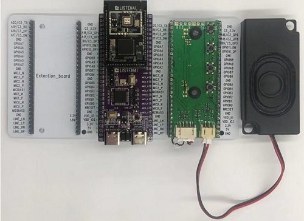

# 录音和播音示例
## 概述
在前两个章节[录音](./audio_record)和[录音](./audio_playback)中我们讲述了csk6提供的录音和播音组件以及基本的使用方法，本章节通过一个录音和播音的实例来加深开发者对于录音和播音接口的使用。

## 使用示例
### 准备工作
### 准备工作
本示例基于 `CSK6-NanoKit`开发板实现，开发者需要做如下准备：
- 一个`CSK6-NanoKit`开发板。
- mic+speaker扩展板，扩展板接两个mic和一个speaker输出。

开发板连接如下图示: 



### 获取sample项目
通过Lisa命令创建项目：
```
lisa zep create
```


依次按以下目录选择完成aplay sample创建：  
> boards → csk6 → subsys → avf → audio → audio_record_play

:::tip
本示例在[录音](./audio_record)章节的基础上添加播音逻辑，开发者可以创建一个录音sample，并在此基础上完善代码逻辑。
:::

## 应用实现
### 设备树配置

在`csk6011a_nano`开发板上系统默认通过LINE_L_N/LINE_L_P输出音频，并且使用`GPIOA_04`作为功放的使能引脚，音频框架使用到了IPC的硬件通讯，因此需要在sample中重写`board overlay`完成设备树配置。
```c
/ {
	chosen {
		/*
		 * shared memory reserved for the inter-processor communication
		 */
		zephyr,ipc_shm = &psram_share;
		zephyr,ipc = &mailbox0;
	};

    /* amp功放使能脚配置 */
    aliases {
		 avf-audio-pwr-amp = &pwr_amp;
	 };
	 pwr_amp:audio_pwr_amp{
		 compatible = "listenai,pwr-amp";
		 enable-gpios = <&gpioa 4 1>;
		 label = "audio_pwr_amp";	
		 status = "okay";
	 };

};
```
### 组件配置

```shell
# LOG 配置，属于系统配置项
CONFIG_PRINTK=y
CONFIG_DEBUG=y
CONFIG_LOG=y
CONFIG_LOG_MODE_IMMEDIATE=y
CONFIG_LOG_DETECT_MISSED_STRDUP=n
CONFIG_LOG_BACKEND_SHOW_COLOR=y
CONFIG_LOG_BACKEND_FORMAT_TIMESTAMP=y
CONFIG_LOG_BACKEND_UART=y
CONFIG_LOG_BACKEND_UART_OUTPUT_TEXT=y
CONFIG_MAIN_STACK_SIZE=2048

# 给系统动态内存分配的内存空间
# sof峰值占用大概40k，所以这个值应该大于40k，具体设置为多少需要根据app本身对于内存的需求来确定，
# 本示例中需要缓存5S的音频，HEAP SIZE应尽可能大，最大不超过300K。
CONFIG_HEAP_MEM_POOL_SIZE=250000

# 打开avf配置项
CONFIG_SOF_HOST=y
CONFIG_AVF_DEBUG_LEVEL=1
CONFIG_AVF_USE_BINARY_ARRAY=y

# 底层硬件通讯配置
CONFIG_IPM=y

# 打开cache配置
CONFIG_CACHE_MANAGEMENT=y
```

### 音频框架资源

```c
cp.bin      //DSP 固件
res.conf    //应用资源配置项
res.overlay //应用资源设备树配置
```

:::note
编译时音频框架资源将会被打包到zephyr.bin固件中，开发者只需要通过lisa zep flash烧录zephyr.bin即可。
:::
### sample实现逻辑
基于csk6 sdk提供的acapture和aplay接口实现5S录音，并通过speaker播放录音。

### sample实现过程

```c
/*
 *
 * SPDX-License-Identifier: Apache-2.0
 */

#include <zephyr.h>
#include <avf/framework/avf_platform.h>
#include <avf/modules/audio/acapture.h>
#include <avf/slogger.h>
#include "dsp_resource.h"

#include <avf/modules/audio/aplay.h>
#include <avf/slogger.h>

/* 音频数据回调的触发线，当硬件fifo数据超过1024时触发回调 */
#define ACAPTURE_DATA_EVENT_THRES (1024)
#define ACAPTURE_DATA_TOTAL_LENGTH (1024 * 100)
/* 音频缓存队列的长度为10 */
#define ACAPTURE_MSGQ_NUMBER (10)
typedef struct{
    char *pdata;
    int datalen;
} msgq_data_t;

struct k_msgq acapture_msgq;

/* 音频数据回调 */
static void acapture_data_process(void *priv, acapture_event_msg_t msg)
{
    acapture_t *handle = (acapture_t *)priv;
    msgq_data_t msgq_data;

    uint32_t avail;
    int32_t readlen;
    int ret = 0;

    /* 查询是否有数据事件通知 */
    if (msg.event_flags & AVF_STREAM_EVENT_THRES_NOTIFY)
    {
        /* avail为当前硬件fifo中实际缓存的音频数据长度(可取出的数据长度) */
        avail = msg.value.value;
        /* 动态申请空间用于存储音频数据 */
        msgq_data.pdata = k_malloc(sizeof(char) * avail);
        if (msgq_data.pdata == NULL){
            SLOGE(LOG_TAG, "[%s %d]k_malloc FAILED!", __FUNCTION__, __LINE__);
            return;
        }
        /* 读取音频数据,该函数必须在事件回调上下文中执行，readlen为acap_get_datai接口实际获取的音频数据长度 */
        readlen = acap_get_datai(handle, msgq_data.pdata, avail);
        if (readlen > 0){
            msgq_data.datalen = readlen;
            /* 将音频数据输出堆叠到缓存队列中，再到在业务逻辑中取出来作处理 */
            ret = k_msgq_put(&acapture_msgq, &msgq_data, K_NO_WAIT);
            if (ret)
            {
                /* 释放掉动态申请空间 */
                k_free(msgq_data.pdata);
                SLOGE(LOG_TAG, "[%s %d]msgq message dropped", __FUNCTION__,
                      __LINE__);
            }
        }else{
            k_free(msgq_data.pdata);
        }
    }
}

void main(void)
{
    /* 录音 */
    
    acapture_t *acapture = NULL;
    /* 配置录音的格式参数：16k 16bit 1ch pcm格式 */
    amedia_fmt_t fmt = {
        .rate = 16000,
        .channels = 1,
        .bits = 16,
        .compr = AMEDIA_COMPR_PCM,
    };
    uint32_t recv_bytes = 0;
    int iret = 0;
    static char buffer[sizeof(msgq_data_t) * ACAPTURE_MSGQ_NUMBER];
    msgq_data_t msgq_data;

    /* 注册并初始化音频框架 */
	licak_init();

    /* 初始化一个工作队列，用于缓存音频数据，队列的长度为50(可根据实际需求设置长度) */
    k_msgq_init(&acapture_msgq, buffer, sizeof(msgq_data_t), ACAPTURE_MSGQ_NUMBER);

    /* step1: 初始化acapture */
    acapture = acap_create();
    if (acapture == NULL)
    {
        printk("acap_create failed!\n");
        return;
    }
    printk("Create acapture success\n");

    /* step2: 设置音频数据回调，当acapture录音音频数据满ACAPTURE_DATA_EVENT_THRES时触发回调 */
    if (0 != (iret = acap_event_register(acapture, AVF_STREAM_EVENT_THRES_NOTIFY,
                                         acapture_data_process, acapture,
                                         ACAPTURE_DATA_EVENT_THRES)))
    {
        printk("Register data event callback failed,iret %d\n", iret);
        return;
    }
    printk("Register data event callback success.\n");

    /* step3: 设置acapture参数 */
    if (0 != (iret = acap_set_fmt(acapture, &fmt)))
    {
        printk("acap_set_fmt failed!\n");
        return;
    }
    printk("Set audio fmt<%d %d %d> to acapture success\n", fmt.rate, fmt.channels, fmt.bits);

    /* step4: 启动capture录音 */
    if (0 != (iret = acap_start(acapture)))
    {
        printk("acap_start failed.\n");
        return;
    }
    printk("Trigger capture start success.\n");

	/*step5: waiting to revice 5S audio data */
	printk("record start\n");
	k_msleep(5000);
    
    /* step6: 停止acapture */
    acap_stop(acapture);

    /* step7: 销毁aplayer */
    if (0 != (iret = acap_destroy(acapture)))
    {
        printk("aplay_destroy failed.\n");
        goto _END;
    }
    printk("acapture run compelete and exit.\n");

    k_msleep(1000);

    /* 播放音频 */
    aplay_t *aplay = NULL;

    /* step1: 创建aplay实例 */
    aplay = aplay_create(APLAYER_SUBSTREAM_MAIN);
    if (aplay == NULL)
    {
        printk("acap_create failed!\n");
        return;
    }
    printk("Create aplay success\n");


    /* step2: 设置aplay配置参数 */
    if (0 != (iret = aplay_set_fmt(aplay, &fmt)))
    {
        printk("aplay_set_fmt failed!\n");
        return;
    }
    printk("Set audio fmt to aplay success\n");

	/*Enable audio power-amp*/
	audio_pwr_amp_init();
	audio_pwr_amp_enbale();

    /* step3: 开始播放 */
    if (0 != (iret = aplay_start(aplay)))
    {
        printk("aplay_set_fmt failed.\n");
        return;
    }
    printk("Trigger play start success.\n");

    for (;;) {
        if (0 != k_msgq_get(&acapture_msgq, &msgq_data, K_NO_WAIT)) {
            break;
        }
        /* step4: 向aplay写入音频数据 */
        iret = aplay_writei(aplay, msgq_data.pdata, msgq_data.datalen);
        if (iret != msgq_data.datalen)
        {
            printk("aplay_writei failed ret %d.\n", iret);
        }

        k_free(msgq_data.pdata);
    }

    /* step5: 等待aplay播放完成后停止 */
    if (0 != (iret = aplay_drain(aplay)))
    {
        printk("aplay_drain failed.\n");
        return;
    }
    printk("play drain finsh with timestamp %lld ms\n", k_uptime_get());

    /* step6: 注销aplay */
    if (0 != (iret = aplay_destroy(aplay)))
    {
        printk("aplay_destroy failed.\n");
        return;
    }
    printk("audio play complete. \n");
}

```
### 编译和烧录
#### 编译

在app根目录下通过以下指令完成编译：
```
lisa zep build -b csk6011a_nano
```
#### 烧录   

`csk6011a_nano`开发板通过USB连接PC，通过烧录指令完成烧录：
```
lisa zep flash --runner pyocd
```
#### 查看结果

**查看串口日志**

CSK6-NanoKit通过板载DAPlink虚拟串口连接电脑，或者将CSK6-NanoKit的日志串口`A03 TX A02 RX`外接串口板并连接电脑。
- 在电脑端使用串口调试助手查看日志，默认波特率为115200。

日志结果：
```shell
*** Booting Zephyr OS build v1.0.3-alpha.1  ***
Create acapture success
Register data event callback success.
Set audio fmt<16000 1 16> to acapture success
Trigger capture start success.
record start
record complete
acapture run compelete and exit.
Create aplay success
Set audio fmt to aplay success
Trigger play start success.
play drain finsh with timestamp 9646 ms
```

演示效果：
<video src="https://iflyos-external.oss-cn-shanghai.aliyuncs.com/public/lsopen/zephyr/%E6%96%87%E6%A1%A3%E8%A7%86%E9%A2%91%E4%BB%93/recordandplay.mp4" controls="controls" width="500" height="300">您的浏览器不支持播放该视频！</video>
