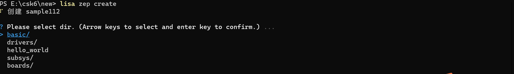

# 自定义板型

## 概述
在前面的[设备树](./device_tree.md)章节中描述了硬件板型资源的层级数据结构和使用方法，csk6 sdk默认支持了`csk6002_9s_nano`等开发板板型，开发者在使用官方的开发板时进行应用开发时可以直接使用这些板型。

但在实际的应用场景中，开发者往往会基于CSK6芯片构建自己的硬件产品，为方便应用开发和项目代码集中管理，开发者可能需要根据自己的硬件情况新增一个板型。

csk6 sdk支持开发者在app应用目录下新增一个应用级别的board，通过本章节的学习，您将了解到：
- 新增一个板型的正确方法
- 如何基于新的硬件新增一个board


## 添加自定义board

csk6 sdk适配了`csk6002_9s_nano`开发板，对应的board配置文件在`zephyr\boards\arm\csk6002_9s_nano`目录下，目录文件结构如下：
```
└── csk6002_9s_nano
    ├──  board.cmake
    ├──  CMakeLists.txt
    ├──  csk6002_9s_nano_defconfig
    ├──  csk6002_9s_nano_pinctrl.dtsi
    ├──  csk6002_9s_nano.dts
    ├──  csk6002_9s_nano.yaml
    ├──  Kconfig.board
    └──  Kconfig.defconfig
```

同样，在app目录下添加boards板型文件时也必须遵守`boards/<arch>/<board_name>`格式，本章节以添加新板型`csk6002_myboard`为例，在app目录下完成新增board的实现。

添加board一般的做法是在SDK的`zephyr/boards`目录下寻找一个使用相同soc的board作为模板，再根据硬件的差异对dts和配置文件进行修改，Zephyr sdk也提供了添加board的sample，位于`zephyr/samples/application_development/out_of_tree_board`目录下。

本章节将基于csk6 sdk 提供的blinky sample项目，新建一个名为`csk6002_myboard`的板型，并使用这个新的板型对blinky sample进行编译与运行。

### 步骤一：创建应用项目
创建blinky sample项目步骤如下：  

依次按以下目录选择完成blinky sample创建：  
> basic → blinky

编译、烧录和运行结果可以在[GPIO](./peripheral/samples/gpio.md)章节中查看。

### 步骤二：在app目录下为新的板型`csk6002_myboard`添加板型配置文件

在刚创建的blinky sample的工程目录下创建 `boards\arm\csk6002_myboard`目录

将SDK的 `zephyr\boards\arm\csk6002_9s_nano` 目录下的所有内容拷贝到`csk6002_myboard`目录下，并把文件的所有 **csk6002_9s_nano** 名称修改为 **csk6002_myboard**。

```
app目录
└── boards
	└── arm
        └── csk6002_myboard
            ├──  board.cmake
            ├──  CMakeLists.txt
            ├──  csk6002_myboard_defconfig
            ├──  csk6002_myboard_pinctrl.dtsi
            ├──  csk6002_myboard.dts
            ├──  csk6002_myboard.yaml
            ├──  Kconfig.board
            └──  Kconfig.defconfig
```
配置文件中的`csk6002_9s_nano`字段需要同步改成`csk6002_myboard`。

- csk6002_myboard_defconfig文件

```
CONFIG_BOARD_csk6002_myboard=y
```

- csk6002_myboard_pinctrl.dtsi文件

```
csk6002_myboard_pinctrl:csk6002_pinctrl
```

- csk6002_myboard.dts文件  

```
#include "csk6002_myboard_pinctrl.dtsi"

/ {
        model = "csk6002 x5 nano";
        compatible = "csk,csk6002_myboard";
```

- csk6002_myboard.yaml文件

```
identifier: csk6002_myboard
```

- Kconfig.board文件

```
config BOARD_csk6002_myboard
```

- Kconfig.defconfig文件

```
if BOARD_csk6002_myboard
config BOARD
   default "csk6002_myboard"
endif # BOARD_csk6002_myboard
```

### 步骤三：修改dts和配置文件
#### .dtsi文件修改
在[设备树](./device_tree.md)章节中我们了解到`.dtsi`文件是被dts包含的文件，是soc或者驱动级的公用描述，如CPU架构、主频、各外设寄存器地址范围等。

参考`csk6002_9s_nano`配置在该文件中完成`uart0`、`i2c0`、`spi0`、 `pwm5`等外设的`pinctrl`配置。
```shell
/* SPDX-License-Identifier: Apache-2.0 */

/ {
        csk6002_myboard_pinctrl:csk6002_pinctrl{
                compatible = "listenai,csk-pinctrl";

                /* UART alternate function */
                pinctrl_uart0_rx_default: uart0_rx_default{
                        pinctrls = <&pinmuxa 2 2>;
                };
                
                pinctrl_uart0_tx_default: uart0_tx_default{
                        pinctrls = <&pinmuxa 3 2>;
                };

                pinctrl_uart1_rx_default: uart1_rx_default{
                };
                
                pinctrl_uart1_tx_default: uart1_tx_default{
                };

                pinctrl_uart2_rx_default: uart2_rx_default{
                };
                
                pinctrl_uart2_tx_default: uart2_tx_default{
                };

                pinctrl_uart3_rx_default: uart3_rx_default{
                };
                
                pinctrl_uart3_tx_default: uart3_tx_default{
                };

                /* I2C alternate function */
                pinctrl_i2c0_scl_default: i2c0_scl_default{
                        pinctrls = <&pinmuxb 0 8>;
                };
                
                pinctrl_i2c0_sda_default: i2c0_sda_default{
                        pinctrls = <&pinmuxb 1 8>;
                };

                pinctrl_i2c1_scl_default: i2c1_scl_default{
                };
                
                pinctrl_i2c1_sda_default: i2c1_sda_default{
                };

                /* SPIC alternate function */
                pinctrl_spi0_cs_default: spi0_cs_default{
                        pinctrls = <&pinmuxa 20 6>;
                };

                pinctrl_spi0_miso_default: spi0_miso_default{
                        pinctrls = <&pinmuxa 17 6>;
                };

                pinctrl_spi0_mosi_default: spi0_mosi_default{
                        pinctrls = <&pinmuxa 18 6>;
                };

                pinctrl_spi0_sclk_default: spi0_sclk_default{
                        pinctrls = <&pinmuxa 19 6>;
                };
                
                pinctrl_spi1_sclk_default: spi1_sclk_default{
                };
                
                pinctrl_spi1_mosi_default: spi1_mosi_default{
                };

                pinctrl_spi1_miso_default: spi1_miso_default{
                };    

                pinctrl_spi1_cs_default: spi1_cs_default{
                };
                
                /* ADC alternate function */
                pinctrl_adc0_ch0_default: adc0_ch0_default{
                };
                
                pinctrl_adc0_ch1_default: adc0_ch1_default{
                };

                pinctrl_adc0_ch2_default: adc0_ch2_default{
                };

                /* PWM alternate function*/
                pinctrl_pwm0_default: pwm0_default{
                };

                pinctrl_pwm1_default: pwm1_default{
                };

                pinctrl_pwm2_default: pwm2_default{
                };

                pinctrl_pwm3_default: pwm3_default{
                };

                pinctrl_pwm4_default: pwm4_default{
                        pinctrls = <&pinmuxa 4 11>;
                };

                pinctrl_pwm5_default: pwm5_default{
                        pinctrls = <&pinmuxa 5 11>;
                };

                pinctrl_pwm6_default: pwm6_default{
                        pinctrls = <&pinmuxb 2 11>;
                };

                pinctrl_pwm7_default: pwm7_default{
                };

        };
};

```
#### .dts文件修改
在[设备树](./device_tree.md)章节中可学习到`.dts`文件是设备树的源文件，用来定义硬件设备的细节，比如定义一个uart设备，并定义其引脚信息等。
参考`csk6002_9s_nano`配置在该文件中完成`leds`、`gpio_keys`、`wifi_module`、`uart0`、`flash0`、 `psram0`、`spi0`等外设的设备树配置。
```shell
/* SPDX-License-Identifier: Apache-2.0 */

/dts-v1/;
#include <csk/csk6.dtsi>
#include <dt-bindings/pwm/pwm.h>
#include "csk6002_myboard_pinctrl.dtsi"

/ {
        model = "csk6002 x5 nano";
        compatible = "csk,csk6002_myboard";
        aliases {
                led0 = &board_led_2;
                sw0 = &user_button_0;
                pwm-led0 = &green_pwm_led;
                i2c-0 = &i2c0;
                i2c-1 = &i2c1;
        };

        chosen {
                zephyr,console = &uart0;
                zephyr,shell-uart = &uart0;
                zephyr,sram = &sram0;
                zephyr,itcm = &itcm0;
                zephyr,flash = &flash0;
                zephyr,code-partition = &slot0_partition;
                /* other chosen settings  for your hardware */
        };

        leds {
                compatible = "gpio-leds";
                board_led_2: board_led_2 {
                        gpios = <&gpioa 5 0>;
                        label = "User BOARD_LED_2";
                };
        };

        pwmleds {
		compatible = "pwm-leds";
		green_pwm_led: green_pwm_led {
			pwms = <&pwm5 5 PWM_POLARITY_NORMAL>;
			label = "User BOARD_LED_2 - PWM0";
		};

	};

        gpio_keys {
                compatible = "gpio-keys";
                user_button_0: button_0 {
                        label = "User SW0";
                        gpios = <&gpiob 5 0>;
                };
        };

        wifi_module: esp32c3 {
                compatible = "wifi,esp32c3";
                label = "WiFi module";
                spi_port = <0>;
                dataready-gpios = <&gpioa 15 0>;
                handshake-gpios = <&gpioa 16 0>;
                reset-gpios = <&gpiob 8 0>;
                status = "okay";
        };

        /*
         * Your board-specific hardware: buttons, LEDs, sensors, etc.
         */
};

&gpt0 {
	status = "okay";

	pwm5: pwm5 {
                clock-prescaler = <128>;
                status = "okay";
	};

};

&gpioa {
        status = "okay";
};

&gpiob {
        status = "okay";
};

&wdt {
        status = "okay";
};

&pwm5 {
        pinctrl-0 = <&pinctrl_pwm5_default>; 
        pinctrl-names = "default";
        status = "okay";
};

&uart0 {
        pinctrl-0 = <&pinctrl_uart0_rx_default &pinctrl_uart0_tx_default>; 
        pinctrl-names = "default";
        current-speed = <115200>;
        status = "okay";
};

&uart1 {
        status = "disabled";
};

&uart2 {
        status = "disabled";
};

&spi0 {
        pinctrl-0 = <&pinctrl_spi0_sclk_default &pinctrl_spi0_mosi_default &pinctrl_spi0_miso_default &pinctrl_spi0_cs_default>; 
        pinctrl-names = "default";
        status = "okay";
};

&spi1 {
        status = "disabled";
};

&i2c0 {
        status = "disabled";
};

&i2c1 {
        status = "disabled";
};

&board_led_2 {
        status = "okay";
};

&mailbox0 {
	status = "okay";
};

&dma0 {
	dma-channels = <6>;
	status = "okay";
};

&rtc1 {
        status = "okay";
};

&flash0 {
        /*
         * For more information, see:
         * http: //docs.zephyrproject.org/latest/guides/dts/index.html#flash-partitions
         */
        partitions {
                compatible = "fixed-partitions";
                #address-cells = <1>;
                #size-cells = <1>;

                /* 256KB for bootloader */
                boot_partition: partition@0 {
                        label = "mcuboot";
                        reg = <0x0 0x40000>;
                        read-only;
                };

                /* application image slot: 512KB */
                slot0_partition: partition@40000 {
                        label = "image-0";
                        reg = <0x40000 0x80000>;
                };

                /* backup slot: 512KB */
                slot1_partition: partition@c0000 {
                        label = "image-1";
                        reg = <0xc0000 0x80000>;
                };

                /* swap slot: 128KB */
                scratch_partition: partition@140000 {
                        label = "image-scratch";
                        reg = <0x140000 0x20000>;
                };

                /* wifi_nvs_storage: 20Kb */
                wifi_nvs_storage: partition@160000 {
                        label = "wifi_nvs_storage";
                        reg = <0x160000 0x5000>;
                };

                /* storage: 6.625MB for storage */
                storage_partition: partition@165000 {
                        label = "storage";
                        reg = <0x165000 0x6a0000>;
                };

        };
};

&psram0 {
        reg = <0x30000000 DT_SIZE_M(8)>;
        #address-cells = <1>;
        #size-cells = <1>;

        /* psram for cp core slot: 6MB */
        psram_cp:psram_cp@30000000{            
                compatible = "listenai,csk6-psram-partition";
                reg = <0x30000000 0x600000>;
                status = "okay";
        };

        /* psram for ap core slot: 1MB */
        psram_ap: psram_ap@30600000 {
                compatible = "listenai,csk6-psram-partition";
                reg = <0x30600000 0x100000>;
                status = "okay";
        };

        /* psram for ap share with cp slot:: 512KB */
        psram_share: psram_share@30700000 {
                compatible = "listenai,csk6-psram-partition";
                reg = <0x30700000 0x80000>;
                status = "okay";
        };
       
};

zephyr_udc0: &usbotg {
        status = "okay";
        num-bidir-endpoints = <6>;
        num-in-endpoints = <6>;
        num-out-endpoints = <6>;
};
```
#### CMake文件修改 
在`CMakeLists.txt`文件中添加`set(BOARD_ROOT ${CMAKE_CURRENT_LIST_DIR})`编译配置，指定项目编译时引用app目录下的board配置：
```
# SPDX-License-Identifier: Apache-2.0

cmake_minimum_required(VERSION 3.20.0)

set(BOARD_ROOT ${CMAKE_CURRENT_LIST_DIR})

find_package(Zephyr REQUIRED HINTS $ENV{ZEPHYR_BASE})
project(blinky)

target_sources(app PRIVATE src/main.c)
```

### 步骤四：编译烧录
#### 编译 

在app根目录下通过一下指令完成编译，编译时指定配置好的新board板型`csk6002_myboard`：
```以下
lisa zep build -b csk6002_myboard
```
#### 烧录  

`csk6002_myboard`开发板通过USB连接PC，通过烧录指令烧录：
```
lisa zep flash
```

:::tip
如果您的硬件板型不带daplink，可通过J-link或串口烧录，详细的烧录方式可在[csk6 烧录](../gdbdebug/csk6_load.md)章节中查看。
:::

#### 查看结果 

CSK6-NanoKit通过板载DAPlink虚拟串口连接电脑，或者将CSK6-NanoKit的日志串口`A03 TX A02 RX`外接串口板并连接电脑。
- 通过lisa提供的`lisa term`命令查看日志
- 或者在电脑端使用串口调试助手查看日志，默认波特率为115200。

以上即为基于csk6 sdk适配`csk6002_myboard`开发板的过程。