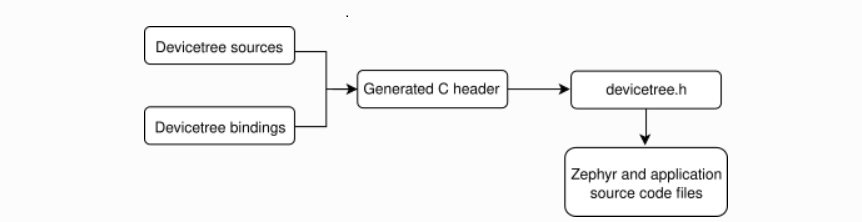
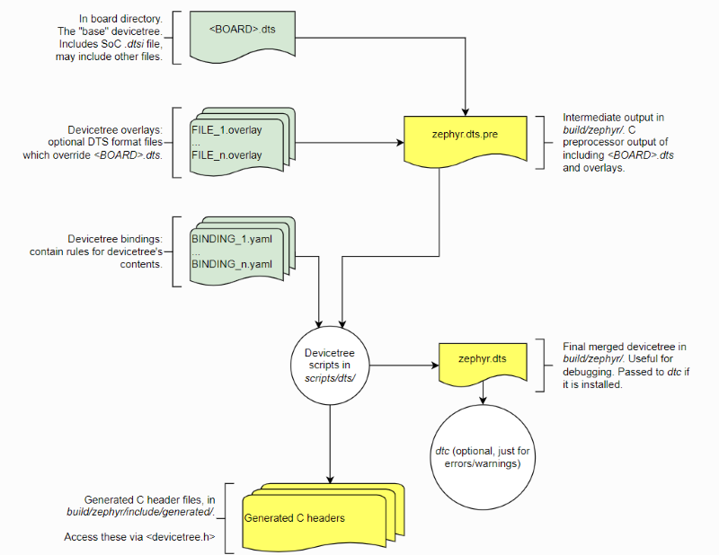

# 设备树

## 概述  
DeviceTree作为一种用来描述板载硬件资源的层级数据结构,由两种元素组成：Node(节点)、Property(属性)。Zephyr使用他来表示支持板子上的可用资源，当然，还包括一些硬件的初始化配置信息。

Linux 内核从 3.x 版本之后开始支持使用设备树，而Zephyr从设计之初就引入了设备树。在此之前，与硬件设备相关的具体信息需要写在驱动代码中，如果外设发生相应的变化，那么驱动代码就需要改动。

zephyr类似于Linux通过设备树来管理硬件，与Linux不同的是，zephyr不直接使用DTB(设备树编译后的二进制文件)，因为运行zephyrOS的硬件大部分是资源受限的嵌入式系统，很多MCU的资源都不够支撑运行一个DTB框架，所以zephyr工程直接将设备树通过脚本处理成c语言头文件，给应用程序调用的设备树API都是一些宏定义或宏函数。

:::note
Zephyr官网针对设备树进行了详细的说明，如果您喜欢查阅Zephyr官网文档，可以到[Devicetree](https://docs.zephyrproject.org/latest/build/dts/index.html?highlight=devicetree)查看设备树相关说明，如果您觉得Zephyr官网文档不好理解，不妨看看本章节对设备树的描述。
:::

## 设备树编译流程 
### 设备树编译整体流程描述
zephyr工程直接将设备树通过脚本处理成c语言头文件，设备树输入文件有两种类型:`.dts source`文件和`.ymal binding`文件。`source`文件包含了设备树的配置信息，`binding`文件描述设备树的规则包括据数据类型等。构建系统使用devicetree源文件和binding来生成生成的C头文件`devicetree.h`，所有包括设备驱动程序、应用程序、测试、内核等开发都可以通过include`devicetree.h`来使用设备树。
以下是该过程的简化视图:

### 设备树编译的输入输出文件

整个流程有4种输入文件:
- sources (.dts) : 一般是board的dts文件
- includes (.dtsi)：被dts包含的dtsi文件，是soc或者驱动级的公用描述
- overlays (.overlay)：对于相同的应用采用不同的板子时，可以在应用下放不同overlay文件配置应用要用的设备
- bindings (.yaml)： binding文件，用于帮助dts生成宏

以上文件通常会出现在下面路径：
```
CSK6 SDK\boards\arm\csk6002_9s_nano\csk6002_9s_nano.dts
CSK6 SDK\boards\arm\csk6002_9s_nano\csk6002_9s_nano_pinctrl.dtsi
app\xxx.overlay
CSK6 SDK\dts\bindings\xxx\xxx.yaml
```
3种输出文件：
- zephyr.dts.pre：这是一个中间输出文件
- zephyr.dts：该文件是dts、dtsi、overlay合并为一个文件，zephyr.dts只是方便调试查看，不会对之后的构建有任何帮助
- devicetree.h：dts最后生成的宏，会被代码引用

以上文件通常会出现在下面路径：
```
app\build\zephyr\zephyr.dts
CSK6 SDK\include\devicetree.h
app\build\zephyr\include\generated\devicetree_fixups.h
app\build\zephyr\include\generated\devicetree_unfixed.h
```
### 使用设备树需要了解的文件
#### dts文件
* **dts**：设备树的源文件，用来定义硬件设备的细节，比如定义一个 *uart* 设备，并定义其引脚信息等；

* **dtsi**：设备树的头文件，*.dts* 可以像*C语言*一样，通过 *#include* 来包含它；

> - *.dtsi* 文件我们用于定义 SoC 的设备，如：CPU架构、主频、各外设寄存器地址范围等；
> - .dts* 文件是基于某个 soc 的开发板设备定义，比如配置外设的使能、引脚，flash的分区等；

dtsi是设备树头文件，类似c语言的.h文件，一般用于描述一个硬件模块，供板级dts或soc级dtsi引用。所以可以把一个固定硬件的设备信息放到.dtsi文件中。比如一个soc，一个型号的soc他的硬件资源是不会变的，所以可以统一写在一个dtsi中供板级dts文件引用。soc模块会包括cpu IP核和uart ip等，那么可以把一个cpu的的硬件资源或者uart资源可以写在dtsi文件中，供soc的dtsi引用。一般情况下，一个板级文件可以定义在多个dts文件中，在设备树编译阶段，会由脚本合并多个dts文件。
#### binding文件
bindings文件在zephyr工程中是以.yaml文件形式存在，bindings顾名思义，绑定或者胶水的意思，他作为c语言和设备树之前的桥梁存在。bingdings可以解释设备树中设备节点的属性代表什么意思。前面提到的将设备树转换为c语言头文件，就是根据bindings文件中定义的规则来转换的。
例如`CSK6 SDK\boards\arm\csk6002_9s_nano\csk6002_9s_nano.dts`中`pwmleds`的配置如下：

```c
    pwmleds {
		compatible = "pwm-leds";
		green_pwm_led: green_pwm_led {
			pwms = <&pwm0 0 PWM_POLARITY_NORMAL>;
			label = "User BOARD_LED_2 - PWM0";
		};

	};
```

对应的bindings文件`CSK6 SDK\dts\bindings\led\pwm-leds.yaml`
```c
description: PWM LEDs parent node

compatible: "pwm-leds"

include:
    - name: base.yaml
      property-allowlist: [label]

properties:
    label:
      description: |
        Human readable string describing the device and used to set the device
        name. It can be passed as argument to device_get_binding() to retrieve
        the device. If this property is omitted, then the device name is set
        from the node full name.

child-binding:
    description: PWM LED child node
    properties:
        pwms:
          required: true
          type: phandle-array

        label:
          required: false
          type: string
          description: |
            Human readable string describing the LED. It can be used by an
            application to identify this LED or to retrieve its number/index
            (i.e. child node number) on the parent device.
```
构建系统会根据dts文件中`compatible` 匹配对应的bindings文件。
#### 设备树头文件devicetree.h
在zephyr中使用设备树，只要include devicetree.h头文件就可以了。这里面主要定义了设备树供c语言调用的API。
`devicetree.h`路径 `CSK6 SDK/include/devicetree.h`
```c
#include <devicetree_unfixed.h>
#include <devicetree_fixups.h>
```
可以看到`devicetree.h` 中包含了 `devicetree_unfixed.h`，`devicetree_fixups.h`，这两个个文件是在编译时产生的。其中
`devicetree_unfixed.h `：根据工程中的设备树生成，把设备树的节点信息转换为宏定义等，供设备树API使用。
`devicetree_fixups.h `：`devicetree_legacy_unfixed.h`的别名。
## 设备树的定义

### 设备树文件结构

#### SDK 内部

非 SDK 开发者一般是不需要关心内部的设备树设计的，但如果你想了解 CSK6 SoC 的设备定义，或者想要 [自定义Board](board.md)的话，你可以通过查阅这部分的 *dts* 文件来深入了解。

> 以下文件是以 sdk 为根目录

```
zephyr
 ├── dts/<ARCH>/<SoC>/*.dtsi
 └── board/<ARCH>/<BOARD>/*.dts
```

#### 项目级别

除了 SDK 支持的芯片、板型以外，开发者也可以在项目中，自定义 *dts* 来增加，或者修改 Board 的定义。

> 以下文件是以应用目录为根目录

```
app
 ├── dts/<ARCH>/<Board>/*.dts
 └── board/<BOARD>.overlay
```

### DTS 语法

DTS 语法与 Linux 设备树保持一致，更多信息可以参阅：[Devicetree spec](https://iflyos-external.oss-cn-shanghai.aliyuncs.com/public/lsopen/zephyr/PDF/devicetree-specification-v0.1-20160524.pdf)。

下面我们主要简单讲解 *DTS* 的一些基本元素。

#### DeviceTree

设备树是由节点(node)组成的，有根节点和子节点。

下面是 *csk6* 的 *dtsi* 的一个示例：

```c
/{
	sram0: memory@80000 {
		compatible = "mmio-sram";
		reg = <0x00080000 (320*1024)>;
	};
    psram0: psram@30000000 {
		compatible = "listenai,csk6-psram";
		reg = <0x30000000 DT_SIZE_M(8)>;
		label = "psram0";
	};
}
```

#### 节点 - Node

在设备树中，**node** 由节点名、节点内容组成的。下面是一个一个典型的形式：

```c
node1@address {
    key=value;
    node2@address{
        key=value;
    }
}
```

**节点名**

其中 `node1` 是它的节点名，`address` 是节点的第一个寄存地址，如果没有寄存器 *@address* 为空。

节点名长度应该小于 *31* 个字符，对于不同类型的设备，[Devicetree spec](https://iflyos-external.oss-cn-shanghai.aliyuncs.com/public/lsopen/zephyr/PDF/devicetree-specification-v0.1-20160524.pdf) 有推荐对应的设备名，但并非强制。

> 注意：根节点名为 */* ，根节点必须有，且只有一个。

**节点属性**

节点的属性是键值对的形式，如：

```c
reg = <0x00080000 (320*1024)>;
```

其中 *reg* 是属性名，<0x00080000 (320*1024)> 是属性值。

**属性名**

属性名有两种情况，一种是**标准**属性名，一种是**非标准**属性名。

对于非标准属性名，一般会添加前缀来进行区分，比如：

```
csk,wifi_module
csk,pinctrl
```

**属性值**

属性值有 7 种类型：

- empty : 空值
- u32 : big-endian 32位整形，如：`current-speed = <115200>;`
- u64 : big-endian 64位整形，分为两个32位整形，如：`reg = <0x00080000 0x00010000>;`
- string : 字符串类型，如：`label = "storage";`
- phandle : 节点引用，如：`i2c-0 = &i2c0;`
- prop-encoded-array : 任意数量的列表，如：`gpios = <&gpiob 5 0>;`
- stringlist : 字符串列表，如：

## 设备树的使用
通过以上章节的描述，我们对设备树有了基本的了解，如何在应用开发中使用设备树？以csk6002_9s_nano开发板为例，在blinky sample中，通过调用devicetree.hAPI接口获取GPIO设实例，从而完成GPIO的控制：
### 设备树API接口
- **可以在`zephyr.dts`中看到`led0`的配置片段**
```c
/dts-v1/;
#include <csk/csk6.dtsi>
#include <dt-bindings/pwm/pwm.h>
#include "csk6002_9s_nano_pinctrl.dtsi"

/ {
        model = "csk6002 9s nano";
        compatible = "csk,csk6002_9s_nano";
        aliases {
                led0 = &board_led_2;
                sw0 = &user_button_0;
                pwm-led0 = &green_pwm_led;
                i2c-0 = &i2c0;
                i2c-1 = &i2c1;
        };

        leds {
                compatible = "gpio-leds";
                board_led_2: board_led_2 {
                        gpios = <&gpioa 5 0>;
                        label = "User BOARD_LED_2";
                };
        };
	};
```

- **在devicetree.h中找到相应的API**
```c
#define DT_NODE_HAS_STATUS(node_id, status) \
	DT_NODE_HAS_STATUS_INTERNAL(node_id, status)

#define DT_ALIAS(alias) DT_CAT(DT_N_ALIAS_, alias)
```
- **在devicetree_unfixed.h 宏定义片段**

```c
/* Existence and alternate IDs: */
#define DT_N_S_leds_S_board_led_2_EXISTS 1
#define DT_N_ALIAS_led0            DT_N_S_leds_S_board_led_2
#define DT_N_NODELABEL_board_led_2 DT_N_S_leds_S_board_led_2
```
以上是`devicetree.h`API接口和`zephyr.dts`的关联方式，我们在备驱动程序、应用程序、测试、内核等开发中只需要`include <devicetree.h>`就可以获取设备树的API接口。
### 在应用开发中使用设备树API接口
以blinky sample为例，通过两种方式获取设备树节点配置信息：
- **方式1：通过`DEVICE_DT_GET(node_id)`这个接口传入`gpioa`的设备树`node_id`来获取`gpioa`实例**

代码实现如下：
```c
#define LED0_NODE_ID DT_NODELABEL(gpioa)

void main(void)
{
	const struct device *dev;
    dev = DEVICE_DT_GET(LED0_NODE_ID);
}
```
那么如何获取`gpioa`的`node_id`？
我们可以通过`devicetree.h`提供的`DT_NODELABEL(label)`这个API接口找到`gpioa`设备树节点：

`gpioa`的`label`可以在`zephyr.dts`中`gpioa`的设备树配置中找到：
```c
gpioa: gpio@45900000 {
        compatible = "listenai,csk-gpio";
        reg = < 0x45900000 0x100000 >;
        interrupts = < 0x11 0x2 >;
        label = "GPIO_A";
        gpio-controller;
        #gpio-cells = < 0x2 >;
        status = "okay";
        phandle = < 0x6 >;
    };
```

拿到`gpioa`设备树节点后，可通GPIO控制接口指定需要操作的GPIO的PIN脚来实现对GPIO的控制：
```c
#define PIN 5
#define FLAGS 0

ret = gpio_pin_configure(dev, PIN, GPIO_OUTPUT_ACTIVE | FLAGS);//配置GPIOA_5

gpio_pin_set(dev, PIN, 1);//拉高GPIOA_5

```
代码实现中使用到了`DEVICE_DT_GET`这个接口获取GPIO实例，通过`node_id`获取指向设备对象的指针，如果您对zephyr API接口不熟悉，可以zephyr官网[zephyr API](https://docs.zephyrproject.org/latest/kernel/drivers/index.html#group__device__model_1ga9a65996ce21f43acb7db061e23b48ec7)中找到对应的描述和使用说明。
以上我们通过`DEVICE_DT_GET`获取了`gpioa`设备树节点，但此后还需要再指定`GPIOA_5`的PIN脚和FLAG才能完成GPIO的控制，是否可以一次获取`zephyr.dts`中`led0`所有的配置属性信息？答案是肯定，接下来我们来看方式2的实现。

- **方式2：通过DT_ALIAS()API找到`led0`设备树配置，并解析`led0`的属性信息：**
在`zephyr.dts`中`led0`的配置信息如下：
```c
        aliases {
                led0 = &board_led_2;
                sw0 = &user_button_0;
                pwm-led0 = &green_pwm_led;
                i2c-0 = &i2c0;
                i2c-1 = &i2c1;
        };

        leds {
                compatible = "gpio-leds";
                board_led_2: board_led_2 {
                        gpios = <&gpioa 5 0>;
                        label = "User BOARD_LED_2";
                };
        };
```
我们在blinky实现代码中可以通过以下方式获取`led0`的属性信息：
```c
#define LED0_NODE DT_ALIAS(led0)//通过alias标签获取led0 node_id

//通过led0 node_id解析led0 lable下的属性信息
#define LED0	DT_GPIO_LABEL(LED0_NODE, gpios)//通过led0 node_id获取gpioa设备树配置
#define PIN	DT_GPIO_PIN(LED0_NODE, gpios)//获取PIN值
#define FLAGS	DT_GPIO_FLAGS(LED0_NODE, gpios)//获取flag值

void main(void)
{
	const struct device *dev;
    dev = device_get_binding(LED0);//获取LED0实例

    gpio_pin_set(dev, PIN, 1);//操作GPIO口
}
```
根据`devicetree.h`中API定义，我们可以找到以下对应关系：
- `DT_ALIAS(led0)`展开以后是`DT_N_ALIAS_led0`，可以在`devicetree_unfixed.h`文件中找到：`#define DT_N_ALIAS_led0 DT_N_S_leds_S_board_led_2`；
- 而`devicetree_unfixed.h`所定义的`DT_N_S_leds_S_board_led_2`的配置则对应`zephyr.dts`中`led0 = &board_led_2`的配置。

以上就是设备树的描述和使用示例，通过本章节的学习，您是否掌握了设备树的基本使用方法？如果您对设备树还有疑问或者有更深刻的理解，可以通过工单的形式向我们反馈，期待您的参与。

