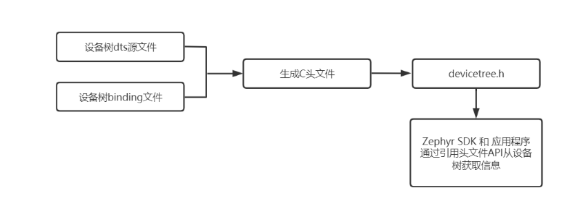

# 设备树


## 概述  
设备树(Device Tree)一种描述硬件资源的数据结构。它通过bootloader将硬件资源传给内核，使得内核和硬件资源描述相对独立。

通过本章节我们将了解到：
1.什么是设备树
2.设备树由什么组成
3.设备树与应用代码的关系
4.如果在开发中使用设备树

## 什么是设备树

设备树(Device Tree)，将这个词分开就是"设备"和"树"，描述设备树的文件叫做DTS(Device Tree Source)，这个DTS文件用来描述目标板硬件信息的源文件，也就是开发板上的设备信息。比如CPU 数量、 内存基地址、IIC 接口上接了哪些设备、SPI 接口上接了哪些设备等等。
树的主干就是系统总线，IIC 控制器、GPIO 控制器、SPI 控制器等都是接到系统主线上的分支。DTS文件的主要功能就是按照图所示的结构来描述板子上的设备信息。

设备树的主要优势：对于同一SOC的不同主板，只需更换设备树文件.dtb即可实现不同主板的无差异支持，而无需更换内核文件。

## Zephyr中的设备树
设备树(DeviceTree)作为一种用来描述板载硬件资源的层级数据结构，由两种元素组成：Node(节点)、Property(属性)。Zephyr使用他来表示支持板子上的可用资源，当然，还包括一些硬件的初始化配置信息。

Linux 内核从3.x版本之后开始支持使用设备树，而Zephyr从设计之初就引入了设备树。在此之前，与硬件设备相关的具体信息需要写在驱动代码中，如果外设发生相应的变化，那么驱动代码就需要改动。

zephyr类似于Linux通过设备树来管理硬件，与Linux不同的是，zephyr不直接使用DTB(设备树编译后的二进制文件)，因为运行zephyrOS的硬件大部分是资源受限的嵌入式系统，很多MCU的资源都不够支撑运行一个DTB框架，所以zephyr工程直接将设备树通过脚本处理成c语言头文件，给应用程序调用的设备树API都是一些宏定义或宏函数。

我们直接来看csk6 sdk `csk6002_9s_nano.dts` 设备树源文件，部分配置内容如下：
```c
/* dts语法版本version 1 */
/dts-v1/;
#include <csk/csk6.dtsi>
#include <dt-bindings/pwm/pwm.h>
/* 引用了csk6 soc的dtsi基础配置 */
#include "csk6002_9s_nano_pinctrl.dtsi" 

/ {  /* 设备树根节点 */   
        model = "csk6002 9s nano";/* board板型名称 */
        compatible = "csk,csk6002_9s_nano";
        /* 定义设备树某个硬件设备的别名，方便通过aliases访问节点的信息 */
        aliases {
                led0 = &board_led_2;
                sw0 = &user_button_0;
                pwm-led0 = &green_pwm_led;
                i2c-0 = &i2c0;
        };

        /* chosen节点 */
        chosen {
                zephyr,console = &uart0;
                zephyr,shell-uart = &uart0;
                zephyr,sram = &sram0;
                zephyr,itcm = &itcm0;
                zephyr,flash = &flash0;
                zephyr,flash_controller = &flash;
                /* other chosen settings  for your hardware */
        };
        
        /* led灯的设备树配置 */
        leds {
                compatible = "gpio-leds";
                board_led_2: board_led_2 {
                        gpios = <&gpioa 5 0>;/* gpio引脚配置 */
                        label = "User BOARD_LED_2";/* label名称 */
                };
        };

        /* pwm led灯的设备树配置 */
        pwmleds {
		    compatible = "pwm-leds";
		    green_pwm_led: green_pwm_led {
			    pwms = <&pwm5 5 PWM_POLARITY_NORMAL>;/* gpio引脚配置 */
			    label = "User BOARD_LED_2 - PWM0";/* label名称 */
		    };
        };

        /* 按键的设备树配置 */
        gpio_keys {
                compatible = "gpio-keys";
                user_button_0: button_0 {
                        label = "User SW0";/* label名称 */
                        gpios = <&gpiob 5 0>;/* gpio引脚配置 */
                };
        };
};

/* i2c0的设备树配置 */
&i2c0 {
        status = "disabled";
};

```
看懂设备树dts文件首先需要了解几个重要的设备树语法。
### 设备树语法
#### 设备树的组成和节点
设备树是由节点(node)组成的，有根节点和子节点。
设备树是采用树形结构来描述板子上的设备信息的文件，每个设备都是一个节点，叫做设备节点，每个节点都通过一些属性信息来描述节点信息，属性就是键—值对。

下面是一个示例设备树 DTS 文件:
```
/dts-v1/;

/ {
        a-node {
                subnode_nodelabel: a-sub-node {
                        foo = <3>;
                        label = "SUBNODE";
                };
        };
};
```
`/dts-v1/;`：dts语法版本version 1。

设备树的节点(node)：
在设备树中，node 由节点名、节点内容组成的。

示例中这个设备树有三个节点：
1. 根节点，dts文件中的`/`是根节点，每个设备树文件只有一个根节点。
2. 一个名为 `a-node`的节点，它是根节点的子节点。
3. 一个名为 `a-sub-node` 的节点，它是 `a-node`的子节点。
4. 节点内容，`a-sub-node`节点内容为：
```
foo = <3>;
label = "SUBNODE";
```

#### 节点名称和属性的取值
- 节点名称

在设备树中，node 由节点名、节点内容组成的。下面是一个一个典型的形式：
```c
node1@address {
    key=value;
    node2@address{
        key=value;
    }
}
```
其中 node1 是它的节点名，address 是节点的第一个寄存地址，如果没有寄存器 @address 为空。
节点名长度应该小于 31 个字符，对于不同类型的设备，Devicetree spec 有推荐对应的设备名，但并非强制。

- 节点属性

节点的属性是键值对的形式，如：
```c
gpios = <&gpiob 5 0>;
```

其中 *reg* 是属性名，<0x00080000 (320*1024)> 是属性值。

- 节点属性名称

属性名有两种情况，一种是**标准**属性名，一种是**非标准**属性名。对于非标准属性名，一般会添加前缀来进行区分，比如：

```
csk,wifi_module
csk,pinctrl
```

- 属性值 

属性值有 7 种类型：

| 属性值 | 属性值描述 | 
| --------------| -------------- |
| u32 | big-endian 32位整形，如：`current-speed = <115200>;` |
| u64 | big-endian 64位整形，分为两个32位整形，如：`reg = <0x00080000 0x00010000>;` |
| string | 字符串类型，如：`label = "storage";` |
| phandle-sss |  节点引用，如：`i2c-0 = &i2c0;`|
| prop-encoded-array |  任意数量的列表，如：`gpios = <&gpiob 5 0>;`|
| stringlist |  字符串列表|

#### 两个特殊的节点：

- `Aliases`节点

`aliases`的意思是“别名”，因此`aliases`节点的主要功能就是定义别名，定义别名的目的就是为了方便访问节点。不过我们一般会在节点命名的时候会加上 label，然后通过&label来访问节点，这样也很方便，而且设备树里面大量的使用&label 的形式来访问节点。
例如 `csk6002_9s_nano.dts`中aliases节点内容如下：
```
        /* aliases节点，定义设备树某个硬件设备的别名，方便通过aliases访问节点的信息 */
        aliases {
                led0 = &board_led_2;
                sw0 = &user_button_0;
                pwm-led0 = &green_pwm_led;
                i2c-0 = &i2c0;
        };
```
- `chosen`节点
chosen 并不是一个真实的设备，chosen节点主要是为uboot向Linux内核传递数据。
例如 `csk6002_9s_nano.dts`中chosen内容如下：
```
        /* chosen节点，指定启动参数，类似u-boot启动内核时指定的bootargs*/
        chosen {
                zephyr,console = &uart0;
                zephyr,shell-uart = &uart0;
                zephyr,sram = &sram0;
                zephyr,itcm = &itcm0;
                zephyr,flash = &flash0;
                zephyr,flash_controller = &flash;
                /* other chosen settings  for your hardware */
        };
```
####  设备树的`label`标签
这个设备节点名称根据Zephyr的设备驱动模型(Device Driver Model)来定义，在应用程序开发中，可以通过`device_get_binding()`接口带入label名称来获取对应硬件设备的设备实例，例如：
在`csk6.dtsi`中i2c的设备树配置如下：
```c
    i2c0: i2c@45600000 {
        compatible = "listenai,csk-i2c";
        reg = <0x45600000 0x100000>;
        interrupts = <14 2>;
        #address-cells = <1>;
        #size-cells = <0>;
        label = "I2C_0";
    };
```

应用开发中可通过I2C的label：`label = "I2C_0"`来获取`I2C0`设备的实例：
```c
const struct device *i2c0_dev = NULL;
void main(void){
    /* 通过label获取i2c0设备实例 */
    i2c0_dev = device_get_binding("I2C_0");
    /* 通过I2C设备实例操作I2C API接口 */
    i2c_write(i2c0_dev, data0, sizeof(data0) - 1, SLAVE_ADDRESS);
}
```
#### 设备树的几个标准属性
节点是由一堆的属性组成，节点都是具体的设备，不同的设备需要的属性不同，用户可以自定义属性。除了用户自定义属性，有很多属性是标准属性，Linux 下的很多外设驱动都会使用这些标准属性，几个常用的标准属性：

- `model` 属性
 model属性通常用来描述设备模块信息。
 ```
model = "csk6002 9s nano";
 ```

- `compatible` 属性

compatible 属性也叫做“兼容性”属性，这是非常重要的一个属性！compatible 属性的值是一个字符串列表，compatible 属性用于将设备和驱动绑定起来。字符串列表用于选择设备所要使用的驱动程序，compatible 属性的值格式如下所示：

```
"manufacturer,model"
```
manufacturer 表示厂商名称，model通常指模块对应的驱动名称。
例如`csk6002_9s_nano.dts`中compatible配置为：
```c
compatible = "csk,csk6002_9s_nano";
```
csk：芯片名称
csk6002_9s_nano：csk板型名称

- `status` 属性

status属性用来描述设备状态信息。

| 值 | 状态描述 | 
| --------------| -------------- |
| okay | 设备可操作 |
| disable | 设备当前不可操作 |
| fail | 设备不可操作，检测到设备发生错误，切不可恢复 |
| fail-sss |  含义同fail，sss为错误内容|

- `reg` 属性
reg 属性的值一般是(address，length)对。reg属性一般用于描述设备地址空间资源信息，一般用来描述外设寄存器地址范围信息。

- `#address-cells`和`#size-cells`属性

这两个属性用于描述子节点的地址信息，可以用在拥有子节点的设备中。#address-cells属性值决定了子节点reg 属性中地址信息所占用的字长(32位)，#size-cells属性值决定了子节点reg属性中长度信息所占的字长(32位)。

通常reg、#address-cells、#size-cells以组合的形式出现，例如`csk6002_9s_nano.dts`中psram0的配置里就使用到了reg、#address-cells、#size-cells来配置地址信息。
```c
&psram0 {
        reg = <0x30000000 DT_SIZE_M(8)>;
        #address-cells = <1>;
        #size-cells = <1>;

        /*psram for cp core slot: 6MB */
        psram_cp:psram_cp@30000000{             
                compatible = "listenai,csk6-psram-partition";
                reg = <0x30000000 0x600000>;
                status = "okay";
        };
        ...
};
```
`#address-cells`表明address这个数据所占用的字长。
`#size-cells`表明length这个数据所占用的字长。
`reg`属性中起始地址所占用的字长为1，地址长度所占用的字长为1。
以上示例配置表示psram_cp起始地址为：0x30000000，地址长度为：0x600000。

- `ranges`属性

ranges属性值可以为空或者按照(child-bus-address,parent-bus-address,length)格式编写的数字矩阵，通常是一个地址映射/转换表，主要有以下这三部分组成：

| 参数 | 含义 | 
| --------------| -------------- |
| child-bus-address | 子总线地址空间的物理地址，由父节点的#address-cells 确定此物理地址所占用的字长 |
| parent-bus-address | 父总线地址空间的物理地址，同样由父节点的#address-cells 确定此物理地址所占用的字长 |
| length | 子地址空间的长度，由父节点的#size-cells 确定此地址长度所占用的字长 |

当ranges属性值为空值时，子地址空间和父地址空间完全相同，不需要进行地址转换。

:::note
设备树DTS语法
DTS 语法与 Linux 设备树保持一致，更多信息可以参阅：[Devicetree spec](https://iflyos-external.oss-cn-shanghai.aliyuncs.com/public/lsopen/zephyr/PDF/devicetree-specification-v0.1-20160524.pdf)。
:::


## Zephyr SDK中的设备树文件

```c
# 设备树源文件
zephyr/boards/arm/csk6002_9s_nano/csk6002_9s_nano.dts 
# 设备树源文件
zephyr/boards/arm/csk6002_9s_nano/csk6002_9s_nano_pinctrl.dtsi 
# 设备树绑定文件
zephyr/dts/bindings/xxx/xxx.yaml  
# 设备树的头文件
zephyr/include/devicetree.h 
# 应用项目设备树配置文件
app/boards/csk6002_9s_nano.overlay  
```
zephyr工程直接将设备树通过脚本处理成C头文件`devicetree.h`，设备树输入文件有两种类型:`source`(.dts)文件和`binding`(.ymal)文件。`source`文件包含了设备树的配置信息，`binding`文件描述设备树的规则包括据数据类型等。所有包括设备驱动程序、应用程序、测试、内核等开发都可以通过include`devicetree.h`来使用设备树。
以下是该过程的简化视图:


#### 设备树源文件(.dts文件)
以`csk6002_9s_nano`板型为例.dts在csk6 sdk中的路径为：
```c
csk6 sdk/boards/arm/csk6002_9s_nano/csk6002_9s_nano.dts
csk6 sdk/boards/arm/csk6002_9s_nano/csk6002_9s_nano_pinctrl.dtsi
```
* **dts**：设备树的源文件，基于某个soc的开发板设备硬件设备的细节，比如定义一个 *uart* 设备、外设的使能、GPIO、flash的分区等并定义其引脚信息等。
* **dtsi**：设备树的头文件，文件我们用于定义 SoC 的设备，如：CPU架构、主频、各外设寄存器地址范围等，*.dts* 可以像*C语言*一样，通过 *#include* 来包含它。

dtsi是设备树头文件，类似c语言的.h文件，一般用于描述一个硬件模块，供板级dts或soc级dtsi引用。所以可以把一个固定硬件的设备信息放到.dtsi文件中。比如一个soc，一个型号的soc他的硬件资源是不会变的，所以可以统一写在一个dtsi中供板级dts文件引用。soc模块会包括cpu IP核和uart ip等，那么可以把一个cpu的的硬件资源或者uart资源可以写在dtsi文件中，供soc的dtsi引用。一般情况下，一个板级文件可以定义在多个dts文件中，在设备树编译阶段，会由脚本合并多个dts文件。

例如：`csk6002_9s_nano.dts`板型文件引用了csk6的基础配置`csk6002_9s_nano_pinctrl.dtsi`文件。
```c
/dts-v1/;
#include <csk/csk6.dtsi>
#include "csk6002_9s_nano_pinctrl.dtsi"
```
#### 设备树绑定文件(.yaml文件)
bindings文件在csk6 sdk中的路径：
`csk6 sdk/dts/bindings/xxx/xxx.yaml`，例如pwm-leds的bindings文件目录为：`csk6 sdk/dts/bindings/led/pwm-leds.yaml`

bindings文件在zephyr工程中是以.yaml文件形式存在，存放在zephyr/dts/bindings目录下, bindings顾名思义绑定的意思，他作为c语言和设备树之前的桥梁存在。用于告诉gen_defines.py dts中哪些信息被生成宏和以什么样的形式生成宏。bingdings可以解释设备树中设备节点的属性代表什么意思。前面提到的将设备树转换为c语言头文件，就是根据bindings文件中定义的规则来转换的。

dts通过note内的compatible属性指和yaml文件名进行匹配
例如`csk6 sdk/boards/arm/csk6002_9s_nano/csk6002_9s_nano.dts`中green_pwm_led配置：

```c
    pwmleds {
		compatible = "pwm-leds";
		green_pwm_led: green_pwm_led {
			pwms = <&pwm0 0 PWM_POLARITY_NORMAL>;
			label = "User BOARD_LED_2 - PWM0";
		};

	};
```
`compatible = "pwm-leds"`指定green_pwm_led的规则文件为`pwm-leds.yaml`，那么它就会去`csk6 sdk/dts/bindings/`去找`led/pwm-leds.yaml`文件来绑定。

#### 设备树头文件(devicetree.h文件)
`devicetree.h`路径：
```
csk6 sdk/include/devicetree.h
```
在zephyr中使用设备树，只要`#include <devicetree.h>`头文件就可以了。这里面主要定义了设备树供的API接口。
在应用项目的main文件中引用devicetree.h即可通过设备树API获取信息，例如：
```c
#include <zephyr.h>
#include <device.h>
#include <devicetree.h>
#include <drivers/gpio.h>

/* 通过devicetree DT_ALIAS接口获取别名为led0的设备树信息  */
#define LED0 DT_GPIO_LABEL(DT_ALIAS(led0), gpios)

void main(void)
{
	const struct device *dev;
	bool led_is_on = true;
	int ret;

    /* 获取gpio实例 */
	dev = device_get_binding(LED0);
}
```
#### 应用项目中的dts文件(.overlay文件)
dts在应用项目中通常以.overlay的形式存在：
```c
app/boards/csk6002_9s_nano.overlay
```
zephyr sdk中的.dts对硬件板型进行了基础的设备树配置，但在应用开发中，经常需要对GPIO进行功能复用，如配置I2C、I2S、SPI等外设功能时，可通过应用目录下的`boards/XXXXX.overlay`增加对应的配置。

例如在I2C sample中，sample在overlay文件中完成gpio引脚复用I2C功能的配置：
```c
&csk6002_9s_nano_pinctrl{
				/* I2C alternate function */
                pinctrl_i2c0_scl_default: i2c0_scl_default{
						pinctrls = <&pinmuxa 4 8>;
                };
                
                pinctrl_i2c0_sda_default: i2c0_sda_default{
						pinctrls = <&pinmuxa 5 8>;
                };

                pinctrl_i2c1_scl_default: i2c1_scl_default{
						 pinctrls = <&pinmuxa 7 9>;
                };
                
                pinctrl_i2c1_sda_default: i2c1_sda_default{
						pinctrls = <&pinmuxa 6 9>;
                };
};

&i2c1 {
        status = "okay";
        pinctrl-0 = <&pinctrl_i2c1_scl_default &pinctrl_i2c1_sda_default>; 
        pinctrl-names = "default";
};

&i2c0 {
        status = "okay";
        pinctrl-0 = <&pinctrl_i2c0_scl_default &pinctrl_i2c0_sda_default>; 
        pinctrl-names = "default";
};
```
### zephyr系统中设备树编译流程


编译输入文件:
- sources (.dts) : 一般是board的dts文件
- includes (.dtsi)：被dts包含的dtsi文件，是soc或者驱动级的公用描述
- overlays (.overlay)：对于相同的应用采用不同的板子时，可以在应用下放不同overlay文件配置应用要用的设备
- bindings (.yaml)： binding文件，用于帮助dts生成宏

以上文件通常会出现在下面路径：
```
CSK6 SDK/boards/arm/csk6002_9s_nano/csk6002_9s_nano.dts
CSK6 SDK/boards/arm/csk6002_9s_nano/csk6002_9s_nano_pinctrl.dtsi
app/board/xxx.overlay
CSK6 SDK/dts/bindings/xxx/xxx.yaml
```
编译输出文件：
- zephyr.dts.pre：这是一个中间输出文件
- zephyr.dts：该文件是dts、dtsi、overlay合并为一个文件，zephyr.dts只是方便调试查看，不会对之后的构建有任何帮助
- devicetree.h：dts最后生成的宏，会被代码引用

以上文件通常会出现在下面路径：
```
app/build/zephyr/zephyr.dts
csk6 sdk/include/devicetree.h
app/build/zephyr/include/generated/devicetree_fixups.h
app/build/zephyr/include/generated/devicetree_unfixed.h
```

`csk6 sdk/include/devicetree.h`即为设备驱动程序、应用程序、测试、内核等最终引用的头文件。

## 在应用开发中使用设备树

通过以上章节的描述，我们对设备树有了基本的了解，如何在应用开发中使用设备树？下面通过几个示例来说明：
### 设备树API接口
应用开发中常用的设备树API接口：
```c
/* 获取设备节点的label值 */
#define DT_LABEL(node_id)

/* 获取设备节点的node id */
#define DT_ALIAS(alias)

/* 获取设备节点的node id */
#define DT_NODELABEL(label)	
```
更多device tree API接口可以在zephyr官网[devicetree.h File Reference](https://docs.zephyrproject.org/latest/doxygen/html/devicetree_8h.html)中查看。

### 应用项目中使用设备树API接口获取设备实例
以blinky sample为例，通过DT_ALIAS()API找到`led0`设备树配置，并解析`led0`的属性信息：
在`zephyr.dts`中`led0`的配置信息如下：
```c
        aliases {
                led0 = &board_led_2;
                sw0 = &user_button_0;
                pwm-led0 = &green_pwm_led;
                i2c-0 = &i2c0;
                i2c-1 = &i2c1;
        };

        leds {
                compatible = "gpio-leds";
                board_led_2: board_led_2 {
                        gpios = <&gpioa 5 0>;
                        label = "User BOARD_LED_2";
                };
        };
```
我们在gpio sample的实现代码中可以通过以下方式获取`led0`的属性信息：
```c
#define LED0_NODE DT_ALIAS(led0)/*通过alias标签获取led0 node_id*/

/*通过led0 node_id解析led0 lable下的属性信息*/
#define LED0	DT_GPIO_LABEL(LED0_NODE, gpios)/*通过led0 node_id获取gpioa设备树配置*/
#define PIN	DT_GPIO_PIN(LED0_NODE, gpios)/*获取gpioa PIN值*/
#define FLAGS	DT_GPIO_FLAGS(LED0_NODE, gpios)/*获取pin flag值*/

void main(void)
{
	const struct device *dev;
    /* 获取LED0实例 */
    dev = device_get_binding(LED0);
    /* 配置gpio */
    ret = gpio_pin_configure(dev, PIN, GPIO_OUTPUT_ACTIVE | FLAGS); 
    /* 操作GPIO口 */
    gpio_pin_set(dev, PIN, 1);
}
```
### 在应用项目开发中重写(.overlay文件)完成引脚功能复用
在I2C sample中使用`i2c0(GPIO_A_04, GPIO_A_05)`和`i2c1(GPIO_A_06, GPIO_A_07)`两组GPIO口作为I2C的master和slave接口，因此需要在设备树中将这两组GPIO复用为I2C引脚功能，可在` .overlay`中添加设备树配置的方式完成GPIO复用I2C功能的配置。

在app目录下增加`csk6002_9s_nano.overlay`文件并添加如下配置：
```c
&csk6002_9s_nano_pinctrl{
                /* 将GPIOA_4配置为i2c0 scl*/
                pinctrl_i2c0_scl_default: i2c0_scl_default{
                /* 将pa4 设置function为8 复用I2C引脚功能 */
                    pinctrls = <&pinmuxa 4 8>;
                };
                /* 将GPIOA_5 i2c0 sda*/
                pinctrl_i2c0_sda_default: i2c0_sda_default{
                     /* 将pa5 设置function为8 复用I2C引脚功能 */
                    pinctrls = <&pinmuxa 5 8>;
                };
                pinctrl_i2c1_scl_default: i2c1_scl_default{
                    pinctrls = <&pinmuxa 7 9>;
                };
                pinctrl_i2c1_sda_default: i2c1_sda_default{
                    pinctrls = <&pinmuxa 6 9>;
                };
};

&i2c1 {
        status = "okay";
        pinctrl-0 = <&pinctrl_i2c1_scl_default &pinctrl_i2c1_sda_default>; 
        pinctrl-names = "default";
};

&i2c0 {
        status = "okay";
        pinctrl-0 = <&pinctrl_i2c0_scl_default &pinctrl_i2c0_sda_default>; 
        pinctrl-names = "default";
};
```

在sample实现代码中使用设备树API接口并完成I2C接口操作：
```c
/*定义一个I2C设备名称，并通过设备树接口获取I2C的设备树信息*/
#define I2C0_DEV_NAME DT_LABEL(DT_ALIAS(i2c_0)) 

/* 从机地址：csk6默认的从机地址为:0x35*/
#define SLAVE_ADDRESS (0x35) 

/* 设置I2C的时钟速率和主从模式*/
uint32_t i2c0_cfg = I2C_SPEED_SET(I2C_SPEED_STANDARD) | I2C_MODE_MASTER;
uint32_t i2c1_cfg = 0;

/* 定义I2C设备实例 */
const struct device *i2c0_dev = NULL;
const struct device *i2c1_dev = NULL;

/* i2c master 初始化 */
void i2c_master_init(void){
    /* 获取I2C设备实例 */
    i2c0_dev = device_get_binding(I2C0_DEV_NAME);
    ...
    /* i2c master configure */
	if (i2c_configure(i2c0_dev, i2c0_cfg)) {
		printk("I2C0 config failed\n");
		return;
	}
}

/* i2c slave 初始化 */
void i2c_slave_init(void)
{   
    /* 获取I2C设备实例 */
	i2c1_dev = device_get_binding(I2C1_DEV_NAME);
	if (i2c1_dev == NULL) {
		printk("I2C1: Device is not found.\n");
	}
    ...
	/* i2c slave configure */
	if (i2c_configure(i2c1_dev, i2c1_cfg)) {
		printk("I2C1 config failed\n");
		return;
	}
}

/* i2c_master_thread实现：*/
void i2c_master_thread(void *v1, void *v2, void *v3)
{
    /* data0填充数据 */
    for (int i = 0; i < sizeof(data0) - 1; i++) {
        data0[i] = i;
    }

    /* 1. master发送数据，slave接收 */
    i2c_write(i2c0_dev, data0, sizeof(data0) - 1, SLAVE_ADDRESS);//master写数据
    ...
    /* 2. master接收数据 */
    i2c_read(i2c0_dev, data0, sizeof(data0), SLAVE_ADDRESS);
    
    ...
}

/* i2c_slave_thread实现 */
void i2c_slave_thread(void *v1, void *v2, void *v3)
{
    /* master发送数据，slave接收 */
    i2c_read(i2c1_dev, data1, sizeof(data1), 0);
    ...
}

void main(void)
{
    /*配置I2C设备*/
    i2c_configure(i2c0_dev, i2c0_cfg);
    i2c_configure(i2c1_dev, i2c1_cfg);

    /*创建一个线程，用于处理从设备的数据收发*/
    k_thread_create(&slave_thread_data, slave_stack_area,
                    K_THREAD_STACK_SIZEOF(slave_stack_area),
                    i2c_slave_thread, NULL, NULL, NULL, pri, 0, K_NO_WAIT);
    
    
    /*创建一个线程，用于处理主设备的数据收发*/
    k_thread_create(&master_thread_data, master_stack_area,
                    K_THREAD_STACK_SIZEOF(master_stack_area), i2c_master_thread, NULL,
                    NULL, NULL, pri, 0, K_NO_WAIT);
}
```
I2C sample更多内容请看[I2C外设使用示例](./peripheral/samples/i2c.md)。

### 根据新的硬件配置板型文件(.dts)
csk6 sdk默认支持了`csk6002_9s_nano`等开发板板型，开发者在使用官方的开发板时进行应用开发时可以直接使用这些板型。但在实际的应用场景中，开发者往往会基于CSK6芯片构建自己的硬件产品，开发者可能需要根据自己的硬件情况新增一个板型，具体实现请学习[自定义板型](./board.md)章节。


以上就是设备树的描述和使用示例，通过本章节的学习，您是否掌握了设备树的基本使用方法？如果您对设备树还有疑问或者有更深刻的理解，可以通过工单的形式向我们反馈，期待您的参与。

