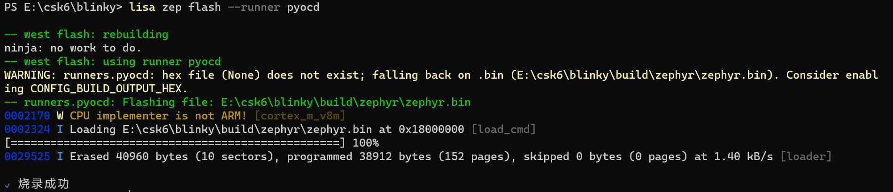

# 第一个应用

## 概述
通过<a href="./getting_start" target="_blank">快速开始</a>章节的学习，开发者已经完成了 CSK6 开发环境的搭建、SDK源码的拉取，并成功在开发板上运行了最简示例 HelloWorld 。在完成基础环境搭建之后，开发者似乎已经迫不及待的开启CSK6的应用开发之路，本章节将基于CSK6开发板为开发者提供第一个应用的开发指引，实现LED灯亮灭的控制，小试牛刀，体验CSK6的开发乐趣。

## 准备开发板
在上手第一个应用开发前，开发者需要准备一块CSK6开发板 CSK60XX-NanoKit，可以通过以下方式获取：
- 联系商务申请；
- 通过[官方商城购买链接](https://shop292274035.taobao.com/?spm=a1z10.3-c.0.0.27bb2c11KnG7SK)购买。

## 确定开发板硬件板型
在开始软件开发前，需要确认手上的开发板的板型，不同的板型在硬件设计上可能存在差异，开发者可以在开发套件章节查看手上的开发板所对应的板型。

CSK6开发板与板型：

| 开发板型号 | 编译所用板型 |
| --------- | ------------ |
| <a href="../overview/nanokit/csk6011_nanokit" target="_blank">CSK6011-NanoKit</a>  | ``csk6011a_nano`` |
| <a href="../overview/nanokit/csk6012_nanokit" target="_blank">CSK6012-NanoKit</a>  | ``csk6012_nano`` |

本章节以**视觉开发套件**中配套的 **CSK6011-NanoKit** 开发板为硬件平台进行演示，编译时使用的板型为 ``csk6011a_nano``。

## 查看硬件板型原理图
本章节目标是实现开发板LED灯亮灭的控制，因此需要确认LED所对应的GPIO引脚，开发者可在NanoKit开发板章节下载对应开发板的原理图。
本章节以 <a href="../overview/nanokit/csk6011_nanokit" target="_blank">CSK6011-NanoKit开发板</a> 为例，LED灯对应的控制引脚为GPIOB_06：


## 应用开发
### 新建项目
本章节在 HelloWorld 最简项目的基础上实现LED灯的控制操作，因此开发者需要新建一个 HelloWorld 项目，创建项目指令：
```
lisa zep create
```

创建项目后目录结构如下：   
```c
hello_world
├─src    //项目代码主目录
├─CMakeLists.txt //CMake 编译文件
└─prj.conf  //项目配置文件
```

:::note

lisa zep 命令行工具 (lisa-zephyr-cli-tool) 是基于 Lisa 生态的一个命令行插件。使用它你能更便捷地对 CSK6 应用程序进行 构建、 烧录、 调试 等等功能，是CSK6开发必需的工具，开发者可在完成本章节的学习后认真查阅 <a href="../tool/lisa_plugin_zephyr/index" target="_blank">lisa zephyr 命令行工具</a> 章节，了解更多关于 `Lisa zephyr` 命令。

:::
### 组件配置 
LED灯控制的应用需要通过GPIO来控制，故需要在项目配置文件 `应用根目录/prj.conf` 文件中添加GPIO配置:
```shell
# 打开GPIO配置
CONFIG_GPIO=y
```
:::note

`prj.conf`配置
:::

### CMake配置
应用项目下的C文件通过`CMakeLists.txt`配置进行编译，如下所示：
```c
target_sources(app PRIVATE src/main.c)
```
:::note

开发者可在完成本章节的学习后认真查阅 <a href="../build/cmake/index" target="_blank">构建系统CMake</a> 章节，了解更多关于 CMake 配置信息。
:::

### 设备树配置
在`hello_world`根目录下创建`boards`目录，并增加`csk6011a_nano.overlay`设备树配置文件：

```c
hello_world
├─boards //设备树板型文件
    └─csk6011a_nano.overlay  //设备树配置文件
...
```
在`csk6011a_nano.overlay`文件中添加控制 led 的 GPIO 配置，具体内容如下：
```c
 /  /*根节点*/
 {
    /*定义别名为led0的gpio设备树*/ 
    
    aliases {
            led0 = &board_led_0_label;/* led0别名映射到led0设备树node label */
    };

    
    leds {
            compatible = "gpio-leds";/* 设置led设备树的ymal绑定文件 */
            board_led_0_label: board_led_0_nodeid { /* node label和node id，皆可自定义命名 */
                    gpios = <&gpiob 6 GPIO_ACTIVE_LOW>; /* GPIO逻辑电平模式设置 */
                    label = "User LED1"; /* 节点的 label 属性，通过传入device_get_binding()接口可以获取gpio设备实例 */
        };
    };
 
 };
```

**设备树配置说明：**  

| 字段                       | 说明                                                         |
| -------------------------- | ------------------------------------------------------------ |
| board_led_0_label          | led 设备树的 node label，可通过 node label 获取 led 设备树的配置信息 |
| board_led_0_nodeid         | led 设备树的 node id，可通过 node id获取 led 设备树的配置信息 |
| gpios = <&gpiob 6 GPIO_ACTIVE_LOW>;       | &gpiob 6：GPIO引脚；<br /> GPIO_ACTIVE_LOW gpio flag配置,当GPIO被配置为 GPIO_ACTIVE_LOW 时，GPIO上出现低电平时表示逻辑电平1 |
| label = "User LED1" | led 节点的 label 属性(Label propert)，通过传入device_get_binding()接口可以获取gpio设备的设备实例 |

:::note

zephyr类似于Linux通过设备树来管理硬件，把硬件配置信息放在设备树的配置文件`dts`中,在应用程序中获取硬件的配置信息。   
设备树是CSK6开发必备的知识，开发者可在完成本章节的学习后认真查阅 <a href="../build/dts/intro" target="_blank">设备树</a> 章节，以掌握设备树配置的精髓。

:::

### LED灯控制代码实现
基于 HelloWorld 应用增加LED灯的控制逻辑，具体如下：
```c
#include <zephyr/zephyr.h>
#include <zephyr/drivers/gpio.h>

/* 1000 msec = 1 sec */
#define SLEEP_TIME_MS   1000

/* 通过别名获取 "led0" 设备树 node id */
#define LED0_NODE DT_ALIAS(led0)

 /* 通过 node id 获取 led0 设备树信息 */
static const struct gpio_dt_spec led = GPIO_DT_SPEC_GET(LED0_NODE, gpios);

void main(void)
{
    printk("Hello World! %s\n", CONFIG_BOARD);
    
    int ret;
    /* 检查硬件设备是否就绪 */
    if (!device_is_ready(led.port)) {
        return;
    }

    /* 将GPIO配置为输出并将其初始化为逻辑电平1 */
    ret = gpio_pin_configure_dt(&led, GPIO_OUTPUT_ACTIVE);
    if (ret < 0) {
        return;
    }

    while (1) {
        /* GPIO电平反转控制 */
        ret = gpio_pin_toggle_dt(&led);
        if (ret < 0) {
            return;
        }
        k_msleep(SLEEP_TIME_MS);
    }
}
```

:::note
更多的 gpio 接口可以在SDK `zephyr\include\zephyr\drivers\gpio.h`头文件里查看。
:::

**开发者可能对以上某些代码段感到疑惑？**

为此，CSK6 SDK提供了丰富的示例和实现过程的讲解，在完成本章节的LED灯控制应用的开发之后，开发者可通过示例的学习更进一步掌握CSK6的开发技巧：
  - <a href="./application_development" target="_blank">应用开发</a>

  - <a href="./peripheral/overview" target="_blank">外设驱动说明及使用示例</a>
  - <a href="./kernel/overview" target="_blank">系统内核及使用示例</a>
  - <a href="./modules/overview" target="_blank">系统组件及使用示例</a>
  - <a href="./audio/overview" target="_blank">音频组件及使用示例</a>
  - <a href="./network/overview" target="_blank">网络模块及使用示例</a>


### 编译和烧录
#### 编译
在sample根目录下通过以下指令完成编译：
```
lisa zep build -b csk6011a_nano
```
-b 后的参数为开发板对应的板型，本章节使用的开发板对应的板型为：**csk6011a_nano** 。
#### 烧录
将开发板的DAPLink USB通过USB数据线连接PC，通过烧录指令烧录：
```
lisa zep flash --runner pyocd
```
完成烧录后，可看到终端输出 “烧录成功” 的提示，如图：


:::note

开发者可在完成本章节的学习后认真查阅 <a href="../gdbdebug/csk6_load" target="_blank">CSK6烧录</a> 章节，以掌握更多关于CSK6烧录的内容。

:::
### 预期结果

开发板上的LED灯(绿)以1S的周期循环亮灭。如果您在本章节的指引下顺利的完成了LED灯控制应用的开发，那么恭喜您在CSK6应用开发的道路上又走出了坚实的一步！

## 请求帮助
如果在开发过程中遇到问题，可联系FAE提供支持，或者在聆思维护的代码仓库托管站点 LSCloud 中反馈你所遇到的问题或提交特性适配请求。

- **在 LSCloud 中提交工单** ： 请参考 <a href="../quick_start/doc_issue" target="_blank">反馈章节</a> 更详尽地了解如何使用 [工单](https://cloud.listenai.com/zephyr/zephyr/-/issues) 来提交问题。
