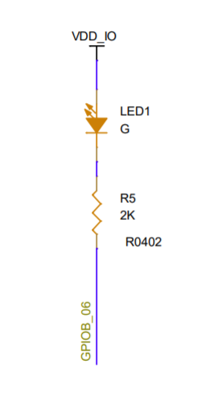

# 第一个应用

## 概述
通过[快速开始](./getting_start.md)章节的学习，开发者已经完成了 CSK6 开发环境的搭建、SDK源码的拉取，并成功在开发板上运行了最简示例 HelloWord 。在完成基础环境搭建之后，开发者似乎已经迫不及待的开启CSK6的应用开发之路，本章节将基于CSK6开发板为开发者提供第一个应用的开发指引，实现LED灯亮灭的控制，小试牛刀，体验CSK6的开发乐趣。

## 准备开发板
在上手第一个应用开发前，开发者需要准备一块CSK6开发板 CSK-6-NanoKit，可以通过以下方式获取：
- 联系商务申请；
- 通过官网购买链接购买。

## 确定开发板硬件板型
在开始软件开发前，需要确认手上的开发板的板型，不同的板型在硬件设计上可能存在差异，开发者可以在开发套件章节查看手上的开发板所对应的板型。

NanoKit开发板板型：
- [csk6002-9s-nano](../overview/nanokit/nanokit_csk6002_9s_nano.md)   

- [csk6011a-9s-nano](../overview/nanokit/nanokit_csk6002_9s_nano.md)

本章节以CSK-6-NanoKit `csk6002-9s-nano`板型为例。

## 查看硬件板型原理图
本章节目标是实现开发板LED灯亮灭的控制，因此需要确认LED所对应的GPIO引脚，开发者可在NanoKit开发板章节下载对应开发板的原理图。
本章节以`csk6002-9s-nano`为例，LED灯对应的控制引脚为GPIOA_5：

## 应用开发
### 新建项目
本章节在 HelloWord 最简项目的基础上实现LED灯的控制操作，因此开发者需要新建一个 HelloWord 项目，创建项目指令：
```
lisa zep create
```
:::note

lisa zep 命令行工具 (lisa-zephyr-cli-tool) 是基于 Lisa 生态的一个命令行插件。使用它你能更便捷地对 CSK6 应用程序进行 构建、 烧录、 调试 等等功能，是CSK6开发必需的工具，开发者可在完成本章节的学习后认真查阅 [lisa zephyr 命令行工具](../tool/lisa_plugin_zephyr/index.md) 章节，了解更多关于 `Lisa zephyr` 命令。

:::
### 组件配置 
LED灯控制的应用需要通过GPIO来控制，故需要在项目配置文件 `应用根目录/prj.conf` 文件中添加GPIO配置:
```shell
# 打开GPIO配置
CONFIG_GPIO=y
```
:::note

`prj.conf`配置
:::

### CMake配置
应用项目下的C文件通过`CMakeLists.txt`配置进行编译，如下所示：
```c
target_sources(app PRIVATE src/main.c)
```
:::note

开发者可在完成本章节的学习后认真查阅 [构建系统CMake](../build/cmake/index.md) 章节，了解更多关于 CMake 配置信息。
:::

### 设备树配置
在`app/boards/`目录下增加`csk6002_9s_nano.overlay`文件并添加led的GPIO配置，具体内容如下：
```c

 / 
 {
    leds {
            compatible = "gpio-leds";
            board_led_2_label: board_led_2_nodeid {
                    gpios = <&gpioa 5 0>;
                    label = "User BOARD_LED_2";
            };
    };
 
 };
```

**设备树配置说明：**  

| 字段                       | 说明                                                         |
| -------------------------- | ------------------------------------------------------------ |
| board_led_2_label          | led2 设备树的 node label，可通过 node label 获取 led2 设备树的配置信息 |
| board_led_2_nodeid         | led2 设备树的 node id，可通过 node id获取 led2 设备树的配置信息 |
| gpios = <&gpioa 5 0>       | &gpioa 5：gpioa_5；<br />0：gpio flag配置为0，在本示例中没有用到该flag |
| label = "User BOARD_LED_2" | led2 节点 的 label 属性(Label propert)，通过传入device_get_binding()接口可以获取gpio设备的实例 |

:::note

zephyr类似于Linux通过设备树来管理硬件，把硬件配置信息放在设备树的配置文件`dts`中,在应用程序中获取硬件的配置信息。   
设备树是CSK6开发必备的知识，开发者可在完成本章节的学习后认真查阅 [设备树](../build/dts/intro.md) 章节，以掌握设备树配置的精髓。

:::

### LED灯控制代码实现
基于 HelloWord 应用增加LED灯的控制逻辑，具体如下：
```c
#include <Zephyr.h>
#include <device.h>
#include <devicetree.h>
#include <drivers/gpio.h>

/* 1000 msec = 1 sec */
#define SLEEP_TIME_MS   1000

/* 通过label获取board_led_2的GPIO配置信息 */
#define LED0	DT_GPIO_LABEL(DT_NODELABEL(board_led_2), gpios)
#define PIN	DT_GPIO_PIN(DT_NODELABEL(board_led_2), gpios)

void main(void)
{
	printk("Hello World! %s\n", CONFIG_BOARD);
    
    const struct device *dev;
	bool led_is_on = true;
	int ret;

    printk("LED0 %s \n", LED0);
    printk("PIN %d \n", PIN);

    /* 获取GPIOA设备实例 */
	dev = device_get_binding(LED0);
	if (dev == NULL) {
		return;
	}
    
	/* 将GPIO配置为输出并将其初始化为逻辑电平1 */
	ret = gpio_pin_configure(dev, PIN, GPIO_OUTPUT_ACTIVE);
	if (ret < 0) {
		return;
	}

    /* LED输出控制 */
	while (1) {
		gpio_pin_set(dev, PIN, (int)led_is_on);
		led_is_on = !led_is_on;
		k_msleep(SLEEP_TIME_MS);
	}
}
```

**开发者可能对以上某些代码段感到疑惑？**

为此，CSK6 SDK提供了丰富的示例和实现过程的讲解，在完成本章节的LED灯控制应用的开发之后，开发者可通过示例的学习更进一步掌握CSK6的开发技巧：
  - [应用开发](./application_development.md)

  - [外设驱动说明及使用示例](./peripheral/overview)
  - [系统内核及使用示例](./kernel/overview)
  - [系统组件及使用示例](./modules/overview)
  - [音频组件及使用示例](./audio/overview)
  - [网络模块及使用示例](./network/overview)

:::
### 编译和烧录
#### 编译
在sample根目录下通过以下指令完成编译：
```
lisa zep build -b csk6002_9s_nano
```
-b 后的参数为开发板对应的板型，本章节使用的开发板对应的板型为：csk6002_9s_nano。
#### 烧录
`csk6002_9s_nano`通过USB连接PC，通过烧录指令烧录：
```
lisa zep flash --runner pyocd
```
完成烧录后，可看到终端输出 “烧录成功” 的提示，如图：


:::note

开发者可在完成本章节的学习后认真查阅 [CSK6烧录](../gdbdebug/csk6_load.md) 章节，以掌握更多关于CSK6烧录的内容。

:::
### 预期结果


预期的效果如上图片所示，开发板上的LED灯(绿)以1S的周期循环亮灭。

如果您在本章节的指引下顺利的完成了LED灯控制应用的开发，那么恭喜您在CSK6应用开发的道路上又走出了坚实的一步！

## 请求帮助
如果在开发过程中遇到问题，可联系FAE提供支持，或者在聆思维护的代码仓库托管站点 LSCloud 中反馈你所遇到的问题或提交特性适配请求。

- **在 LSCloud 中提交工单** ： 请参考 [反馈章节](../quick_start/doc_issue.md) 更详尽地了解如何使用 [工单](https://cloud.listenai.com/zephyr/zephyr/-/issues) 来提交问题。
