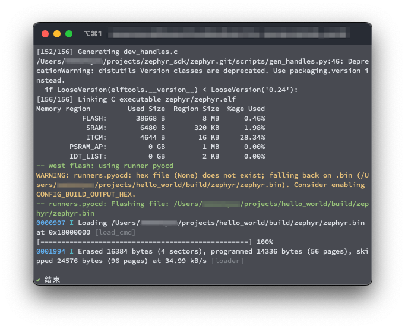
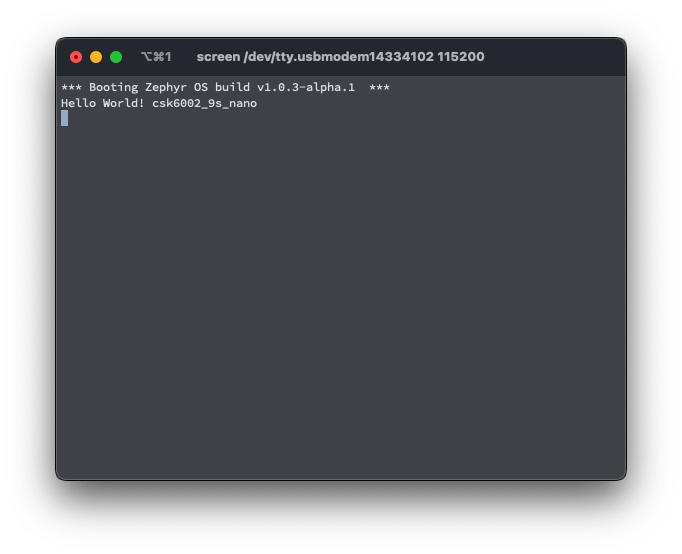
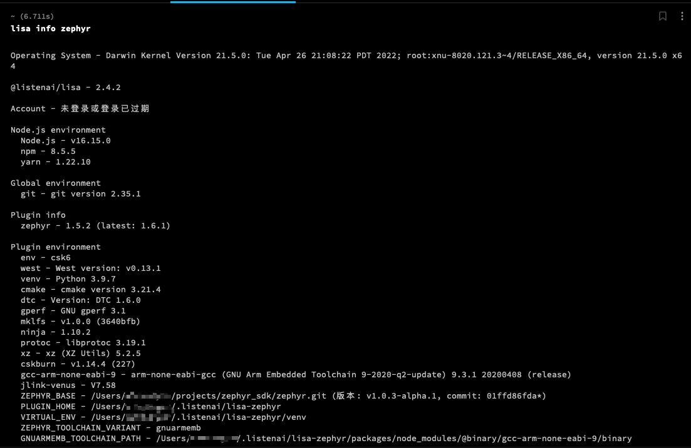
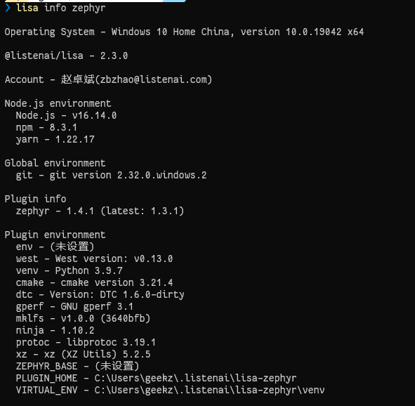

import Tabs from '@theme/Tabs';
import TabItem from '@theme/TabItem';

# 快速开始

学习本文后，你将可以：

- 在 Ubuntu 、 macOS 、 Windows 上（ [安装 Linux 主机依赖](./getting_started/installation_linux.md) 章节介绍了在其他 Linux 发行版上如何做）设置好了用命令行式的 CSK6 开发环境；
- 获取到 SDK 源码；
- 构建、在开发板上烧录并使一个示例程序可成功运行。

## 选择并更新操作系统

选择你正在使用的操作系统。

<div style={{
    border: 'solid 1px #80808080',
    padding: 12,
    borderRadius: 12
  }}>
<Tabs
    defaultValue="windows"
    values={[
        {label: 'Ubuntu', value: 'ubuntu'},
        {label: 'Windows', value: 'windows'},
        {label: 'macOS', value: 'mac'}
    ]}
>
  <TabItem value="ubuntu">

该引导支持 Ubuntu 18.04 LTS 及更新的版本

```bash
sudo apt update
sudo apt upgrade
```

  </TabItem>

  <TabItem value="windows">

选择 开始菜单 > 设置 > 更新与安全 > Windows 更新。点击检查更新，并安装任何可用的更新。
  </TabItem>

  <TabItem value="mac">

在 macOS Mojave 或更新的版本中，选择 系统偏好设置 > 软件更新。如果有可用更新，点击立即更新。

在其他版本中，请参考 [Apple 支持的此文章](https://support.apple.com/en-us/HT201541)。
  </TabItem>

</Tabs>
</div>

## 安装依赖

接下来，你需要安装一些主机上必要的依赖。

<div style={{
    border: 'solid 1px #80808080',
    padding: 12,
    borderRadius: 12
  }}>
<Tabs
    defaultValue="windows"
    values={[
        {label: 'Ubuntu', value: 'ubuntu'},
        {label: 'Windows', value: 'windows'},
        {label: 'macOS', value: 'mac'}
    ]}
>

  <TabItem value="ubuntu">

使用 <code>apt</code> 安装必要的依赖:

```bash
sudo apt install --no-install-recommends git wget
```

  </TabItem>
  <TabItem value="windows">
参考 <a href="https://git-scm.com/download/win">下载 Windows 上的 Git</a> 中的说明进行安装。
  </TabItem>
  <TabItem value="mac">
请在终端运行`xcode-select --install`确定是否已经安装开发者工具:
  </TabItem>
</Tabs>
</div>


## 获取 CSK6 配套工具并获取 SDK 

接着，安装 lisa zephyr 工具，并通过工具初始化 CSK6 SDK 环境。

<div style={{
    border: 'solid 1px #80808080',
    padding: 12,
    borderRadius: 12
  }}>
<Tabs
    defaultValue="win"
    values={[
        {label: 'Windows', value: 'win' },
        {label: 'macOS、Ubuntu', value: 'unix' }
    ]}
>
  <TabItem value="win">
    
<p>下载 <a href="https://castor.iflyos.cn/castor/v3/lisaPluginZephyr/download?platform=windows">Lisa & Zephyr Installer</a> 并运行，根据安装引导进行安装。</p>

> **Lisa & Zephyr Installer** 是面向 Windows 操作系统的开发的 CSK6 开发环境一体化安装包，支持 SDK 一键拉取与配置，方便开发者快速构建开发环境。

安装完成后，开始获取 CSK6 SDK ：

```bash
lisa zep use-sdk --default
```

该命令会在 `C:\Users\用户名\.listenai` 目录下，拉取 SDK 并进行初始化。

:::tip 提示
若需要自定义 SDK 的存放路径，可执行:

```bash
lisa zep use-sdk {自定义路径} --default
```
:::

  </TabItem>
  <TabItem value="unix">

在 **用户权限** 下执行：

<Tabs
    defaultValue="curl"
    values={[
        {label: '使用 curl', value: 'curl'},
        {label: '使用 wget', value: 'wget'}
    ]}
>

<TabItem value="curl">

```bash
curl -o- https://cdn.iflyos.cn/public/cskTools/lisa-zephyr-install.sh | bash
```
</TabItem>
<TabItem value="wget">

```bash
wget -qO- https://cdn.iflyos.cn/public/cskTools/lisa-zephyr-install.sh | bash
```
</TabItem>
</Tabs>

安装 zephyr 对应环境：

```bash
lisa zep install
```

安装完成后，开始获取 CSK6 SDK ：

```bash
lisa zep use-sdk --default
```

该命令会在 `~/.listenai` 目录下，拉取 SDK 并进行初始化。

:::tip 提示
若需要自定义 SDK 的存放路径，可执行:

```bash
lisa zep use-sdk {自定义路径} --default
```
:::

  </TabItem>
</Tabs>
</div>

## 编译 Hello world 示例

选择一个目录用于存放我们即将创建的项目，在这个目录下执行以下命令

```bash
lisa zep create
```

该命令会列出当前CSK6适配的项目sample，我们可选择任意一个作为我们的工程模板，创建在当前目录中。此处我们选择 hello_world 进行创建。

cd 进刚创建的 hello_world 项目，执行编译命令。

```bash
cd hello_world
lisa zep build -b csk6002_9s_nano
```

## 烧录示例程序

以使用 **CSK-6-NanoKit 开发板** 为例，使用 Type-C 数据线连接开发板的 **DAPLINK USB** 。

执行以下指令：

```console
$ lisa zep flash
```

若烧录成功你将看到



通过串口调试工具找到开发板对应的串口，以 115200 的波特率进行连接（在下图示例中使用 `screen` 工具连接串口）。对开发板复位后，可看到串口输出：



> 如果你需要了解更多关于开发板使用的说明，可参考 [NanoKit 开发板](../overview/nanokit) 。

## 下一步

这里提供一些下一步的建议，帮助你了解更多如何在 CSK6 上进行开发：

- 尝试其他的 [使用示例](./peripheral/overview)
- 学习有关 `应用开发` 和 `lisa zep 工具使用`
- 学习 lisa zep 的 `烧录与调试` 特性，或者更多关于 `烧录与硬件调试` 的内容

## 安装过程疑难解答

这里包含一些关于与安装过程相关的问题如何解决的议题。

### 更新 SDK 后再次检查 SDK 环境

当需要检查 SDK 环境是否有问题时，通常先执行以下命令

 ```bash
lisa info zephyr
```

正常情况下你将看到列出结果类似下图



当 SDK 环境 **不完整** 时，可能会出现某些项显示为「未设置」，例如



若遇到类似上图中显示的「未设置」的提示，请运行下述命令，工具会尝试修复当前 SDK 环境

```bash
lisa zep doctor
```

## 请求帮助

你可以在聆思维护的代码仓库托管站点 LSCloud 中反馈你所遇到的问题或提交特性适配请求。

- **在 LSCloud 中提交工单** ： 请参考 [反馈章节](../quick_start/doc_issue.md) 更详尽地了解如何使用 [工单](https://cloud.listenai.com/zephyr/zephyr/-/issues) 来提交问题。
### 如何提问

:::tip 注意
在你提交一个新工单之前，请先尝试在已有的工单中搜索你的问题。你的问题可能在此之前已经有对应的答案了。
:::

当你新建工单时，应当按照模板要求填写对应描述。并且，当你进行描述时请尽量注意，不要只是含糊地说例如「这个跑不起来」或者询问「这个功能能不能用？」之类的问题。你应当尽可能描述这些内容：

1. 你想要达成什么目标
2. 你已经做了什么尝试（例如你输入过的命令）
3. 出现了什么现象（例如每一条命令的输出）

### 使用复制/粘贴

反馈问题时，请对文本信息进行 **复制/粘贴** ，而不是对它拍照或截图。这里的文本信息指代用于描述问题的源代码、终端命令或他们的输出。

这样做可以使得帮我们在尝试帮你解决问题时更容易看清楚问题，也更便于其他的用户搜索到相关的内容。