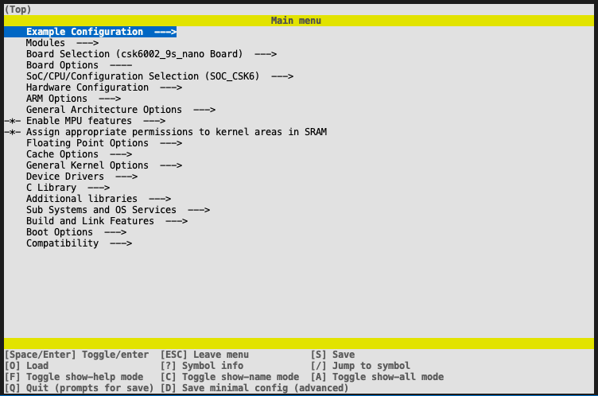
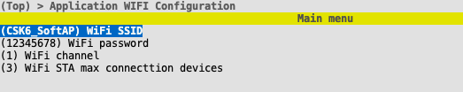

# 应用项目配置

CSK6 SDK 提供了很多功能，这些功能并不会全部启用。当想要使用某个功能的时候，就需要用到工程配置了。CSK6的应用工程，主要通过 *menuconfig* 来进行。

*menuconfig* 是一个可以在终端显示的图形化配置工具，不仅可以方便对配置选项的查看、设置等，也可以自动处理选项之间的依赖关系。

下面内容主要讲解与配置相关的操作。

> 以下操作，基于已经有的项目进行，可以通过 `lisa zep create` 一个 *hello_world* 示例来进行。

## 使用 menuconfig 配置

通过 menuconfig 界面化的配置，不仅可以快速查换相关的配置，

### 进入配置

执行以下命令，可以开始对一个项目进行配置：

```
cd hello_world
lisa zep build -t menuconfig -b csk6002_9s_nano
```

> 提示：如果已经 build 过，可以不带 *-b* 选项 

执行这个命令后，你将看到下图的界面：



### 常用操作

* 上下方向键：移动选项光标；

* 右方向键|空格|回车：选择选项 or 进入选项；

* 左方向键|ESC：返回 or 退出；

* /：进入选项搜索（按 *esc* 返回）；

* shift + ? ：显示选项信息；

* shift + s： 保存配置；

* shift + q： 保存配置；


> 特别注意:
> 通过界面保存的配置，只存在构建产物(*build*)目录下，所以它的生效只在当前构建周期内。如果 *build* 目录被删除，或者在构建时使用 *-p* 选项，原来的配置将会失效。


## 使用 prj.conf 配置

*prj.conf* 是应用目录下的配置文件。在这个文件里直接添加相关配置，可以对整个项目生效。如：

```shell
CONFIG_WIFI=y
```

**板级配置**

如果针对某一个 *Board* ，需要增加一些特殊的配置，比如这个项目在使用 *-b csk6002_9s_nano* 时，想要默认打开 PSRAM 时，那么可以在 *app/boards/* 目录下，创建一个 *csk6002_9s_nano.conf* 文件，在这个文件里，添加以下配置：

```shell
CONFIG_CSK6_PSRAM=y
```


## 添加自定义配置

当应用程序较大时，希望通过宏配置，来对应用程序进行配置，使其可以编译出不同功能的固件。CSK6的构建系统，提供了以下方式，开发者可以在 *app* 里添加自定义配置选项，而配置的使用方法与上述保持一致。

### 创建应用的 Kconfig

在 *app* 目录下，添加名为 *Kconfig* 的文件，可配置的选项，就在这个文件里面进行编辑。

*Kconfig* 基本内容如下：

```
source "Kconfig.zephyr"
```

* *source* ：导入 SDK 的系统配置；

添加完以上基本内容后，就可以按照 [Kconfig语法](https://www.baidu.com/s?wd=kconfig%20%E8%AF%AD%E6%B3%95) 来添加应用需要的配置了。

下面是一个 Kconfig 示例：

```
menu "Application WIFI Configuration"

    config DEFAULT_WIFI_SSID
        string "WiFi SSID"
        default "CSK6_SoftAP"

    config DEFAULT_WIFI_PASSWORD
        string "WiFi password"
        default "12345678"

    config DEFAULT_WIFI_CHANNEL
        int "WiFi channel"
        default 1

    config DEFAULT_WIFI_MAX_CONNECTTION
        int "WiFi STA max connecttion devices"
        default 3
endmenu

source "Kconfig.zephyr"
```

### 使用项目自定义配置

项目的自定义配置使用方式，与 SDK 的配置是一样的。

```
cd hello_world
lisa zep build -t menuconfig -b csk6002_9s_nano
```

执行上述命令，打开 menuconfig 界面后，你可看到第一项就是刚才添加的 *Application WIFI Configuration* ，选择进入后就可以看到对应的配置项了。如下图：



