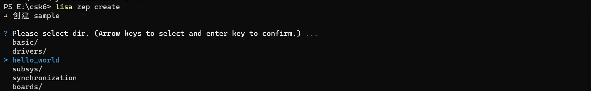

# 同步之多线程

## 概述

在zephyr系统中，应用开发必定会使用到多线程，多线程在同时运行时会被调度器同时调度，从系统层面来看线程是并行运行，系统对并行运行的线程有先后执行的要求，多线程间需要资源共享或配合时就需要线程同步功能。嵌入式操作系统都会提供线程同步手段，Zephyr也不例外，Zephyr提供了信号量，互斥锁，轮询三种内核对象作为多线程同步的方式。
本章节给开发者介绍Zephyr系统线程同步中多线程的实现，通过本章节学习，开发者可以了解到：
- 多线程基本信息和使用场景
- 多线程的实现方法

## 多线程
多线程在项目中主要用来解决并发任务执行，本章节我们通过一个简单的示例来说明多线程的实现，示例中创建两个线程`threadA`和`threadB`，并在每个线程中循环打印`Hello World`。

:::tip
本章节需要开发者基于csk6 sdk提供的`hello_world`示例基础上实现多线程开发，以增强对csk6 sdk的了解和提升实操能力。
:::

## 创建项目
通过Lisa命令创建`hello_world`项目：
```
lisa zep create
```

> sample → hello_world
完成`hello_world`项目创建后，可参考以下章节**API接口**和**代码实现**完成多线程示例的实现。


### 项目配置 
```shell
CONFIG_STDOUT_CONSOLE=y
# enable to use thread names
CONFIG_THREAD_NAME=y
CONFIG_SCHED_CPU_MASK=y
```

### 常用API接口
```c
/*创建线程*/
k_tid_t k_thread_create(struct k_thread * new_thread, k_thread_stack_t * stack, size_t stack_size, 
k_thread_entry_t entry, void * p1, void * p2, void * p3, int prio, uint32_t options, k_timeout_t delay)
参数说明：
new_thread	线程对象
stack	    指向堆栈空间的指针
stack_size	以字节为单位的堆栈大小
entry	    线程入口函数
p1	        第一个入口点参数
p2	        第二个入口点参数  
p3	        第三个入口点参数
prio	    线程优先级
options	    线程选项
delay	    调度延迟 

/*启动线程*/
void k_thread_start(k_tid_t thread)
/*设置线程名称*/
int k_thread_name_set(k_tid_t thread, const char * str)
```
更多`thread API`接口可以在zephyr官网[Thread APIS](https://docs.zephyrproject.org/latest/doxygen/html/group__thread__apis.html)中找到。

### 代码实现
```c
/* 线程堆栈空间 */
#define STACKSIZE 1024
/* 线程优先级 */
#define PRIORITY 7
/* 延迟时间（ms） */
#define SLEEPTIME 500

/* 线程B */
void threadB(void *dummy1, void *dummy2, void *dummy3)
{
	ARG_UNUSED(dummy1);
	ARG_UNUSED(dummy2);
	ARG_UNUSED(dummy3);

     while (1){
        k_msleep(2000);
        printk("threadB: Hello World on %s!\n", CONFIG_BOARD);
    }
}

/* 线程A */
void threadA(void *dummy1, void *dummy2, void *dummy3)
{
	ARG_UNUSED(dummy1);
	ARG_UNUSED(dummy2);
	ARG_UNUSED(dummy3);

    while (1){
        k_msleep(1000);
        printk("threadA: Hello World on %s!\n", CONFIG_BOARD);
    }
    
}

void main(void)
{
    /* 创建线程 */
    k_thread_create(&threadA_data, threadA_stack_area,
            K_THREAD_STACK_SIZEOF(threadA_stack_area),
            threadA, NULL, NULL, NULL,
            PRIORITY, 0, K_FOREVER);
    k_thread_name_set(&threadA_data, "thread_a");

    k_thread_create(&threadB_data, threadB_stack_area,
            K_THREAD_STACK_SIZEOF(threadB_stack_area),
            threadB, NULL, NULL, NULL,
            PRIORITY, 0, K_FOREVER);
    k_thread_name_set(&threadB_data, "thread_b");

    /* 启动线程 */
    k_thread_start(&threadA_data);
    k_thread_start(&threadB_data);
}
```
## 编译和烧录
- **编译** 

在app根目录下通过一下指令完成编译：
```
lisa zep build -b csk6002_9s_nano
```
- **烧录**   

`csk6002_9s_nano`开发板通过USB连接PC，通过烧录指令开始烧录：
```
lisa zep flash --runner pyocd
```
- **查看结果**  

可通过lisa提供的`lisa term`命令查看日志：
```
lisa term
```
或者将`csk6002_9s_nano`的日志串口`A03 TX A02 RX`接串口板连接电脑，在电脑端使用串口调试助手查看日志，波特率为115200。

预期日志输出结果：
```shell
*** Booting Zephyr OS build fd53c115d07a  ***
threadA: Hello World on csk6002_9s_nano!
threadB: Hello World on csk6002_9s_nano!
threadA: Hello World on csk6002_9s_nano!
threadA: Hello World on csk6002_9s_nano!
threadB: Hello World on csk6002_9s_nano!
threadA: Hello World on csk6002_9s_nano!
threadA: Hello World on csk6002_9s_nano!
threadB: Hello World on csk6002_9s_nano!
```
