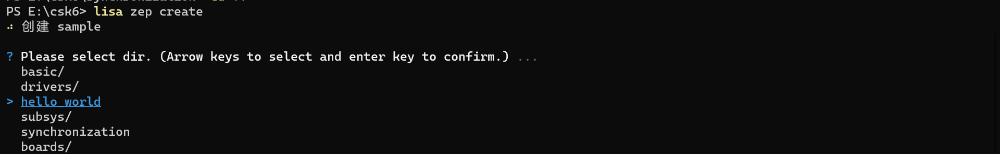

# 线程间同步之信号量
## 概述
应用开发使用多线程的情况下，各个线程在运行时会被调度器同时调度，从系统层面来看线程是并行运行，系统对并行运行的线程有先后执行的要求，因此多线程间在存在资源共享或配合的情况时就需要线程同步功能。

嵌入式操作系统都会提供线程同步手段，Zephyr也不例外，Zephyr提供了信号量，互斥锁，轮询三种内核对象作为多线程同步的方式。


在上一个章节-多线程示例中，两个线程分别执行了各自日志输出的任务，然而在实际的项目开发中往往会遇到多个线程协同或需要操作同一个函数的场景，此时就需要用到信号量。

本章节在上个章节-同步之多线程基础上讲解信号量的使用场景和使用方法，通过本章节学习，开发者可以了解到：
- 信号量的基本信息和使用场景
- 信号量的使用方法

## 信号量(Semaphore)
信号量是用于控制多个线程对一组资源的访问，使用信号量在生产者(ISR/Thread)和消费者(thread)之间同步。
信号量有以下特性：
- Zephyr的信号量在初始化时可以指定初始化计数值和最大计数值，生产者give时计数值+1，但不会超过最大值，消费者take时计数值-1，直到为0。
- 每次信号量give都会引发调度。
- 如果多个线程都在等待信号量，新产生的信号量会被等待时间最长的最高优先级线程接收。

### 常用API接口
```c
/*初始化信号量*/
K_SEM_DEFINE(name, initial_count, count_limit )	
/*初始化信号量*/
int k_sem_init(struct k_sem * sem, unsigned int initial_count, unsigned int limit)
/*等待信号量*/
int k_sem_take(struct k_sem * sem, k_timeout_t timeout)	
/*发送信号量*/
void k_sem_give(struct k_sem * sem)
```
更多`Semaphore API`接口 可以在zephyr官网[Semaphore APIS](https://docs.zephyrproject.org/latest/doxygen/html/group__semaphore__apis.html)中找到。

### 信号量的使用
以下是一个信号量使用例程，该示例创建了一个动态信号量，初始化两个线程，其中一个线程发送信号量，另一个线程接收信号量并执行相应的操作。实现代码如下：
**信号量初始化**
一个信号量使用一个类型为 k_sem 的变量定义，有两种方式可以完成信号量的初始化：     

- 方法1，使用宏：
```c
K_SEM_DEFINE(my_sem, 0, 1);
```

- 方法2，使用函数 
```c
struct k_sem my_sem;

k_sem_init(&my_sem, 0, 1);
```

**发送信号量**  

在thread或者ISR中发送信号量。
```c
void productor_thread(void *arg)
{
    ...
    uint8_t count = 0;
    while(1){
        if(ciunt <= 100){
            count++;     
        }else{
            return;
        }
        /* count 每计数 20 次，释放一次信号量 */
        if(0 == (count % 20)){
            k_sem_give(&my_sem);
            printk("productor thread give semaphore");
        }
    }
}
```
**接收信号量**

一般情况下接收信号量的thread是消费者。
```c
void consumer_thread(void)
{
    ...
    uint8_t number = 0;
    while(1){
        /* 等待信号量，获取到信号量，则执行 number 自加的操作 */
        if (k_sem_take(&my_sem, K_MSEC(50)) != 0) {
            printk("Input data not available!");
        } else {
            number++;
            printk("consumer thread number %d ", number);
        }
    }
}
```

以上是信号量的基本使用示例，在上一章节同步之多线程中，开发者已经实现了两个线程的创建，两个线程分别完成了`hello world`日志输出。

在学习本章节**信号量的使用**之后，开发者可以在多线程的sample基础上实现如下目标：
- 多线程通过信号量同步的方式共同调用日志输出函数，实现`hello world`日志ping-pong输出的目标。

:::tip
如果您已经完成了上一章节同步之多线程的开发示例，可以跳过**创建项目**步骤在多线程的sample上继续完成以上目标的实现。
:::

## 获取sample项目
通过Lisa命令创建`hello_world`项目：
```
lisa zep create
```

> sample → hello_world
完成`hello_world`项目创建，参考以下**代码实现**完成应用逻辑开发。

:::tip
csk6 sdk中提供了该信号量示例的sample，如果您想快速体验实现结果，可使用`lisa zep create`命令完成sample创建，示例路径`samples-->synchronization`。
:::

## 代码实现 
**定义两个信号量**
```c
K_SEM_DEFINE(threadA_sem, 1, 1);
K_SEM_DEFINE(threadB_sem, 0, 1);
```
**编写一个helloLoop函数，实现hello world打印输出，并提供信号量参数输入**
```c
void helloLoop(const char *my_name,
	       struct k_sem *my_sem, struct k_sem *other_sem)
{
    const char *tname;
    uint8_t cpu;
    struct k_thread *current_thread;

    while (1) {
        /* take my semaphore */
        k_sem_take(my_sem, K_FOREVER);

        current_thread = k_current_get();
        tname = k_thread_name_get(current_thread);
#if CONFIG_SMP
        cpu = arch_curr_cpu()->id;
#else
        cpu = 0;
#endif
        /* 打印 "hello" */
        if (tname == NULL) {
            printk("%s: Hello World from cpu %d on %s!\n",
                my_name, cpu, CONFIG_BOARD);
        } else {
            printk("%s: Hello World from cpu %d on %s!\n",
                tname, cpu, CONFIG_BOARD);
        }

        k_busy_wait(100000);
        k_msleep(SLEEPTIME);
        k_sem_give(other_sem);
    }
}
```
**创建两个线程，并在线程中完成helloLoop的调用**
```c
/* 线程堆栈空间 */
#define STACKSIZE 1024
/* 线程优先级 */
#define PRIORITY 7
/* 延迟时间（ms） */
#define SLEEPTIME 500

/* 线程B实现 */
void threadB(void *dummy1, void *dummy2, void *dummy3)
{
	ARG_UNUSED(dummy1);
	ARG_UNUSED(dummy2);
	ARG_UNUSED(dummy3);

	/* 线程B传入信号量调用helloLoop实现打印 */
	helloLoop(__func__, &threadB_sem, &threadA_sem);
}

/* 线程A实现 */
void threadA(void *dummy1, void *dummy2, void *dummy3)
{
	ARG_UNUSED(dummy1);
	ARG_UNUSED(dummy2);
	ARG_UNUSED(dummy3);

	/* 线程A传入信号量调用helloLoop实现打印 */
	helloLoop(__func__, &threadA_sem, &threadB_sem);
}

K_THREAD_STACK_DEFINE(threadA_stack_area, STACKSIZE);
static struct k_thread threadA_data;

K_THREAD_STACK_DEFINE(threadB_stack_area, STACKSIZE);
static struct k_thread threadB_data;

void main(void)
{
    /* 创建线程 */
    k_thread_create(&threadA_data, threadA_stack_area,
            K_THREAD_STACK_SIZEOF(threadA_stack_area),
            threadA, NULL, NULL, NULL,
            PRIORITY, 0, K_FOREVER);
    k_thread_name_set(&threadA_data, "thread_a");

    k_thread_create(&threadB_data, threadB_stack_area,
            K_THREAD_STACK_SIZEOF(threadB_stack_area),
            threadB, NULL, NULL, NULL,
            PRIORITY, 0, K_FOREVER);
    k_thread_name_set(&threadB_data, "thread_b");

    /* 启动线程 */
    k_thread_start(&threadA_data);
    k_thread_start(&threadB_data);
}
```

## 编译和烧录
- **编译** 

在app根目录下通过以下指令完成编译：
```
lisa zep build -b csk6002_9s_nano
```
- **烧录**   

`csk6002_9s_nano`开发板通过USB连接PC，通过烧录指令开始烧录：
```
lisa zep flash --runner pyocd
```
- **查看结果**  

可通过lisa提供的`lisa term`命令查看日志：
```
lisa term
```
或者将`csk6002_9s_nano`的日志串口`A03 TX A02 RX`接串口板连接电脑，在电脑端使用串口调试助手查看日志，波特率为115200。

日志输出结果：
```shell
*** Booting Zephyr OS build fd53c115d07a  ***
thread_a: Hello World from cpu 0 on csk6002_9s_nano!
thread_b: Hello World from cpu 0 on csk6002_9s_nano!
thread_a: Hello World from cpu 0 on csk6002_9s_nano!
thread_b: Hello World from cpu 0 on csk6002_9s_nano!
thread_a: Hello World from cpu 0 on csk6002_9s_nano!
thread_b: Hello World from cpu 0 on csk6002_9s_nano!
thread_a: Hello World from cpu 0 on csk6002_9s_nano!
thread_b: Hello World from cpu 0 on csk6002_9s_nano!
thread_a: Hello World from cpu 0 on csk6002_9s_nano!
thread_b: Hello World from cpu 0 on csk6002_9s_nano!
thread_a: Hello World from cpu 0 on csk6002_9s_nano!

```


