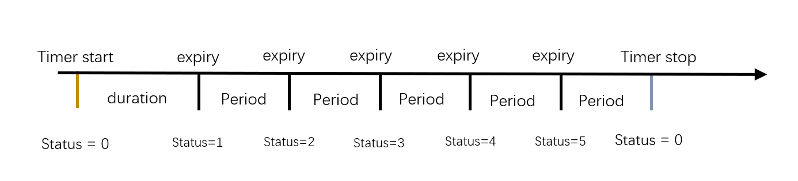

# Timer定时器

Timer定时器是Zephyr RTOS中的一个内核对象，它使用内核的系统时钟实现计数和定时器。用户可以使用Timer在实现有较高时间精度要求的业务功能，如周期性任务、时序控制等。

通过本章节的学习，您将学习到：
- Timer的特性与常用接口
- Timer的基本使用方法
- 在CSK6芯片上使用Timer实现一个周期性执行操作的应用

## Timer介绍

用户可根据需要对一个Timer进行配置，并通过注册回调的方式指定Timer到期时执行的操作，实现计时结束后执行指定操作。Timer也可以用于周期性计数。

### timer的特性

- **timer可定义的数量：**

    在内存足够的前提下，内核不限制timer的数量。

- **timer关键参数：**

    duration：设定timer第一次到期的时间。
    period: timer第一次到期后的触发时间间隔。

- **timer回调注册：**

    可注册到期回调函数，在duration或period到期后在时钟中断中回调该函数。
    可注册停止回调函数，在执行stop timer的线程中回调该函数。

- **timer计数状态获取：**

    timer提供了一个status值，用来标记上一次读取状态到当前这个时间段内timer到期了多少次。


### Timer工作的示例图


duration：设定timer第一次到期的时间。
period: timer第一次到期后的触发时间间隔。
expiry：触发回调。

## Timer使用示例

### 常用API接口

静态定义并初始化timer

```c
#define K_TIMER_DEFINE(name, expiry_fn, stop_fn)
```

该定时器定义之后，可以在模块外部使用。

**参数说明**

| 字段      | 说明                             |
| --------- | -------------------------------- |
| name      | 声明为struct k_timer的结构体变量 |
| expiry_fn | 定时器每次到期时，调用的回调函数 |
| stop_fn   | 定时器stop之后，调用的回调函数   |

<br/>

初始化定时器

```c
void k_timer_init(struct k_timer *timer, k_timer_expiry_t expiry_fn, k_timer_stop_t stop_fn);
```

此该函数在首次使用计定时器之前初始化定时器。

**参数说明**

| 字段      | 说明                                      |
| --------- | ----------------------------------------- |
| timer     | 传入声明后的struct k_timer 结构体变量指针 |
| expiry_fn | 定时器每次到期时，调用的回调函数          |
| stop_fn   | 定时器stop之后，调用的回调函数            |

<br/>

启动定时器

```c
void k_timer_start(struct k_timer *timer, k_timeout_t duration, k_timeout_t period);
```

启动定时器并重置定时器状态为0，duration必须大于0，period为非负数。

**参数说明**

| 字段     | 说明                                                         |
| -------- | ------------------------------------------------------------ |
| timer    | 传入声明定义后的struct k_timer 结构体变量指针                |
| duration | 指定定时器第一次超时之前的时间间隔，以毫秒为单位。它必须大于0 |
| period   | 指定在第一个定时器结束后所有定时器之间的时间间隔，以毫秒为单位。它必须是非负的。period为0意味着定时器是一个一次性定时器，在一次超时后停止。 |

<br/>

停止定时器

```c
void k_timer_stop(struct k_timer *timer);
```

停止定时器，如果初始化时候配置了对应的停止回调函数，则会回调函数。停止一个未启动的定时器不会有任何影响。

**参数说明**

| 字段  | 说明                                          |
| ----- | --------------------------------------------- |
| timer | 传入声明定义后的struct k_timer 结构体变量指针 |

<br/>

读取定时器状态

```c
uint32_t k_timer_status_get(struct k_timer *timer);
```

读取定时器的状态，该状态表示自上次读取其状态以来定时器已到期的次数，每次读取后会重置状态为0。

**参数说明**

| 字段  | 说明                                          |
| ----- | --------------------------------------------- |
| timer | 传入声明定义后的struct k_timer 结构体变量指针 |

<br/>

等待定时器到期

```c
uint32_t k_timer_status_sync(struct k_timer *timer);
```

等待定时器到期。调用该函数会阻塞线程，直到定时器的状态为非零（表示自上次检查以来它至少已过期一次）或定时器停止。如果定时器状态已非零，或定时器已停止，则该函数解除阻塞。调用该函数会将定时器的状态重置为0。注意，不允许在中断处理函数中使用该函数。函数返回定时器的状态值。

**参数说明**

| 字段  | 说明                                          |
| ----- | --------------------------------------------- |
| timer | 传入声明定义后的struct k_timer 结构体变量指针 |

<br/>

获取定时器超时到期的系统时间

```c
k_ticks_t k_timer_expires_ticks(const struct k_timer *timer);
```

获取定时器超时到期时候的系统时间，以系统ticks为单位。该函数返回定时器下一次到期时候的系统时间，以系统ticks为单位。如果定时器未运行，则返回当前系统时间。

**参数说明**

| 字段  | 说明                                          |
| ----- | --------------------------------------------- |
| timer | 传入声明定义后的struct k_timer 结构体变量指针 |

<br/>

获取定时器超时到期的剩余时间

```c
k_ticks_t k_timer_remaining_ticks(const struct k_timer *timer)
```

获取定时器超时到期前的剩余时间，以系统ticks为单位，计算运行的定时器下次过期前剩余的时间，如果定时器未运行，则返回0。

**参数说明**

| 字段  | 说明                                          |
| ----- | --------------------------------------------- |
| timer | 传入声明定义后的struct k_timer 结构体变量指针 |

<br/>

获取定时器超时到期前的剩余时间

```c
uint32_t k_timer_remaining_get(struct k_timer *timer);
```

计算运行定时器下次到期前剩余的（近似）时间，以毫秒(ms)为单位。如果定时器未运行，则返回0。

**参数说明**

| 字段  | 说明                                          |
| ----- | --------------------------------------------- |
| timer | 传入声明定义后的struct k_timer 结构体变量指针 |

更多 **Timer API**可以参考Zephyr官网[Timer APIS](https://docs.zephyrproject.org/latest/doxygen/html/group__timer__apis.html)。

<br/>

### 创建一个`hello_world`
开发者可基于`hello_world`项目按照以下步骤添加timer的代码并运行，以此更好的掌握csk6 sdk提供的timer的使用方法。
首先创建一个`hello_world`项目，可参考快速上手章节：[快速开始](../getting_start.md)。

### Timer功能使用
初始化timer有两种方式：

**方式一：**

```c
/* 定义初始化timer */
struct k_timer reset_counter_timer;
k_timer_init(&reset_counter_timer, timer_handler_expiry, timer_handler_stop);
```

**方式二：** 

```c
/* 定义初始化timer */
K_TIMER_DEFINE(reset_counter_timer, timer_handler_expiry, timer_handler_stop);
```

**主函数实现：**

```c
#include <zephyr.h>

int counter = 0;

/* timer到期回调函数 */
static void timer_handler_expiry(struct k_timer *dummy)
{   
    counter++;
	printk("counter %d \n", counter);    
}

/* timer停止回调函数 */
static void timer_handler_stop(struct k_timer *dummy)
{
    counter = 0;
	printk("stop timer and reset counter to zero\n");
}

/* 定义初始化timer */
 K_TIMER_DEFINE(reset_counter_timer, timer_handler_expiry, timer_handler_stop);

void main(void)
{
    printk("Hello World! %s\n", CONFIG_BOARD);

    printk("timer sample start");

    /* 启动timer，duration为1秒， period为2秒 */
    k_timer_start(&reset_counter_timer, K_MSEC(1000), K_MSEC(2000));

    k_msleep(10000);
    /* 10秒 后获取timer触发的次数,每次读取后status都会被清0 */
    int status = k_timer_status_get(&reset_counter_timer);
    printk("timer status %d\n", status);

    /* 等待timer触发后打印触发的次数 */
    int status_sync = k_timer_status_sync(&reset_counter_timer);
    printk("timer status sync %d\n", status_sync);

    /* 2秒 后停止timer */
    k_msleep(2000);
    /* 停止 timer */
    k_timer_stop(&reset_counter_timer);
}
```
## 编译和烧录
- **编译** 

在app根目录下通过以下指令完成编译：
```
lisa zep build -b csk6002_9s_nano
```
- **烧录**   

`csk6002_9s_nano`开发板通过USB连接PC，通过烧录指令开始烧录：
```
lisa zep flash
```
- **查看结果**  

将`csk6002_9s_nano`的日志串口`A03 TX A02 RX`接串口板连接电脑，在电脑端使用串口调试助手查看日志，波特率为115200。

日志输出结果：
```shell
*** Booting Zephyr OS build fd53c115d07a  ***
[17:55:16.469] 
[17:55:16.475] Hello World! csk6002_9s_nano
[17:55:16.475] timer csk6002_9s_nano
[17:55:17.475] counter 1 
[17:55:19.471] counter 2 
[17:55:21.471] counter 3 
[17:55:23.471] counter 4 
[17:55:25.471] counter 5 
[17:55:26.471] timer status 5
[17:55:27.472] counter 6 
[17:55:27.476] timer status sync 1
[17:55:29.476] counter 7 
[17:55:29.476] stop timer and reset counter to zero

```
从日志可以看到，timer在1秒后第一次触发回调函数，之后以2秒的周期触发回调，直到应用程序主动停止timer。

:::tip
因为timer的回调是在中断中执行，所以在回调函数中不能做耗时操作。
timer不能保证精确的定时，但其精度比k_sleep/k_usleep高，测量执行时间时不建议使用k_timer，建议读系统硬件时钟。
:::

## 耗时操作处理
当timer触发回调后需要处理耗时操作时，可配合k_work使用，将耗时操作放在workqueue中执行，基于以上代码实现示例如下：
```c
/* k_work回调函数，用于处理耗时操作 */
void work_handler(struct k_work *work)
{
    while(int i=0, i<100, i++){
        printk("do something \n");
    }
}

/* 定义初始化一个k_work */
K_WORK_DEFINE(a_work, work_handler);

/* timer到期回调函数 */
static void timer_handler_expiry(struct k_timer *dummy)
{   
    counter++;
	printk("counter %d \n", counter);
    /*发送k_work信号量*/
    k_work_submit(&a_work);    
}
```
更多关于k_work使用可参考Zephyr官网[Workqueue Threads](https://docs.zephyrproject.org/latest/kernel/services/threads/workqueue.html)章节、[Work Queue APIs](https://docs.zephyrproject.org/latest/doxygen/html/group__workqueue__apis.html)章节。

