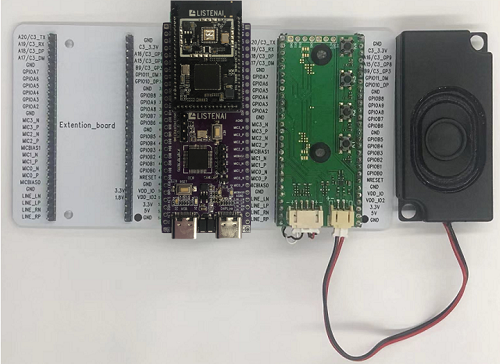

# 音频播放
## 概述
本节介绍CSK6 SDK的提供的aplay音频播放组件，通过示例调用aplay API接口实现音频播放，aplay是CSK6 SDK提供的最基本的音频播放接口，开发者可基于aplay完成符合业务开发需要的音频播放器。通过本章节学习，您将了解到：
- aplay音频API接口的基本使用

aplay支持的音频格式：16bit-48k-pcm格式。

## 准备工作
本示例基于 `csk6002_9s_nano`开发板实现，开发者需要做如下准备：
- 一个`csk6002_9s_nano`开发板。
- speaker扩展板(带功放电路和喇叭)。

开发板连接如下图示: 



## 创建项目
通过Lisa命令创建项目：
```
lisa zep create
```


依次按一下目录选择完成aplay sample创建：  
> boards → csk6 → subsys → avf → audio → aplay
## 应用实现
**内置音频文件**   
应用加载音频文件的步骤如下：  
- 音频文件存放在示例的`resource\earthquake_48k_16bit.wav`目录下。
- 通过Cmake将音频文件编译加载到flash
    `CMakeLists.txt`编译时加载到`test_audio.inc`头文件
    ```shell
    generate_inc_file_for_target(
    app
    resource/earthquake_48k_16bit.wav
    ${gen_dir}/test_audio.inc
    )
    ```
    在`dsp_resource.h`引用`test_audio.inc`
    ```shell
    static const unsigned char test_audio[] = {
    #include "test_audio.inc"
    };
    ```
    在`main.c`引用`dsp_resource.h`:  
    ```c
    #include "dsp_resource.h"
    ```
- 

 
**设备树配置**   
在`csk6002_9s_nano`开发板上使用到了功放的使能引脚`GPIOA_04`，因此需要在sample中重写`boad overlay`完成设备树配置。
```c
 / {
    chosen {
        /*
        * shared memory reserved for the inter-processor communication
        */
        zephyr,ipc_shm = &psram_share;
        zephyr,ipc = &mailbox0;
    };
    /*Audio功放控制节点别名*/
    aliases {
        avf-audio-pwr-amp = &pwr_amp;
    };
    /*Audio功放控制引脚定义*/
    pwr_amp:audio_pwr_amp{
        compatible = "listenai,pwr-amp";
        enalbe-gpios = <&gpioa 4 1>;
        label = "audio_pwr_amp";	
        status = "okay";
    };
 
 };
```
**组件配置**   
```shell
# LOG 配置，属于系统配置项
CONFIG_PRINTK=y
CONFIG_DEBUG=y
CONFIG_LOG=y
CONFIG_LOG_MODE_IMMEDIATE=y
CONFIG_LOG_DETECT_MISSED_STRDUP=n
CONFIG_LOG_BACKEND_SHOW_COLOR=y
CONFIG_LOG_BACKEND_FORMAT_TIMESTAMP=y
CONFIG_LOG_BACKEND_UART=y
CONFIG_LOG_BACKEND_UART_OUTPUT_TEXT=y
CONFIG_MAIN_STACK_SIZE=2048

# 给系统动态内存分配的内存空间
# sof峰值占用大概40k，所以这个值应该大于40k，具体设置为多少需要根据app本身对于内存的需求来确定。
CONFIG_HEAP_MEM_POOL_SIZE=92160

# 打开psram配置
CONFIG_CSK6_PSRAM=y
# 引用名为newlib的libc标准库
CONFIG_NEWLIB_LIBC=y

# 打开avf配置项
CONFIG_SOF_HOST=y
CONFIG_AVF_DEBUG_LEVEL=1
CONFIG_AVF_USE_BINARY_ARRAY=y

# 底层硬件通讯
CONFIG_IPM=y

CONFIG_GPIO=y

# 打开cache配置
CONFIG_CACHE_MANAGEMENT=y
```

:::tip
名词说明：
avf 全称：audio video framework，系统音视频框架   
sof 全称：sound open firmware，系统音频框架  

avf和sof的关系：avf是一个host端的业务框架，avf的底层驱动会引用sof提供的接口。
:::

**主程序实现逻辑**  
基于csk6 sdk提供的aplay API接口，示例sample运行后加载本地wav音频并完成播放。

**API接口**  
```c
/*创建一个aplay实例*/
aplay_t* aplay_create(aplyer_type_e type);
参数说明：
type：音频类型

/*设置播放器数据流格式*/
int aplay_set_fmt(aplay_t* handle, amedia_fmt_t* fmt);
参数说明：
typedef struct{
    amedia_compr_t compr;   /*audio encode type*/
    int rate;               /*sampling bit rate*/
    int channels;           /*channel number*/
    int bits;               /*bits */
    int bitrate;            /*encode bitrate*/
}amedia_fmt_t;

/*注册avf流框架*/
avf_stream_platform_t* avf_stream_platform_register(char* fw_data,uint32_t fw_size,char* tplg_data,uint32_t tplg_size);

/*启动播放*/
int aplay_start(aplay_t* handle);

/*暂停播放*/
int aplay_pause(aplay_t* handle);

/*暂停播放并释放播放器*/
int aplay_pause_release(aplay_t* handle);

/*等待播放器播放完缓存数据后停止播放*/
int aplay_drain(aplay_t* handle);

/*停止播放*/
int aplay_stop(aplay_t* handle);

/*销毁aplay实例*/
int aplay_destroy(aplay_t* handle);

/*将音频数据写入播放器*/
int aplay_writei(aplay_t* handle,char* data,uint32_t len);
```   
更多aplay API接口描述可以在csk6 sdk`\modules\lib\sof_host\include\avf\modules\audio\aplay.h`头文件中看到。

**主程序实现过程**
```c
/*拆分音频数据，以便循环写入aplay*/
#define PERIOD_BYTES(fmt) amedia_frames_to_bytes(fmt, 1000)

void main(void)
{
    ...

    /*在调用aplay之前，需要注册avf流框架到系统*/
    avf_stream_platform_register(dsp_firmware, sizeof(dsp_firmware), dsp_tplg, sizeof(dsp_tplg));
    memset(&fmt, 0, sizeof(amedia_fmt_t));
    /*解析音频数据*/
    pcm_data = prase_wav_fmt(test_audio, sizeof(test_audio), &fmt);
    if (pcm_data == NULL)
    {
        printk("test audio fmt error!.\n");
        return;
    }

    /*step1: 创建aplay实例*/
    aplay = aplay_create(APLAYER_SUBSTREAM_MAIN);
    if (aplay == NULL)
    {
        printk("acap_create failed!\n");
        return;
    }
    printk("Create aplay success\n");
    

    /*step2: 设置aplay配置参数*/
    if (0 != (iret = aplay_set_fmt(aplay, &fmt)))
    {
        printk("aplay_set_fmt failed!\n");
        return;
    }
    printk("Set audio fmt to aplay success\n");

    /*step3: 开始播放*/
    if (0 != (iret = aplay_start(aplay)))
    {
        printk("aplay_set_fmt failed.\n");
        return;
    }
    printk("Trigger play start success.\n");

    buffer_end = test_audio + sizeof(test_audio);
    pstart = pcm_data;
    while (pcm_data < buffer_end)
    {
        /*按1000个周期拆分音频数据，每次写入固定长度数据，直到写完*/
        write_bytes = buffer_end - (uint32_t)pcm_data > PERIOD_BYTES(&fmt) ? PERIOD_BYTES(&fmt) : buffer_end - (uint32_t)pcm_data;
        /*step4: 向aplay写入音频数据*/
        iret = aplay_writei(aplay, pcm_data, write_bytes);
        if (iret != write_bytes)
        {
            printk("aplay_writei failed ret %d.\n", iret);
            break;
        }
        pcm_data += iret;
    }
    printk("Write play audio data compelete total size %d with timestamp %lld ms\n", (uint32_t)(pcm_data - pstart), k_uptime_get());
    
    /*step5: 等待aplay播放完成后停止*/
    if (0 != (iret = aplay_drain(aplay)))
    {
        printk("aplay_drain failed.\n");
        return;
    }
    printk("play drain finsh with timestamp %lld ms\n", k_uptime_get());
    
    /*step6: 注销aplay实例*/
    if (0 != (iret = aplay_destroy(aplay)))
    {
        printk("aplay_destroy failed.\n");
        return;
    }

    printk("aplay run compelete and exit.\n");
}
```
## 编译和烧录
- **编译**  

在app根目录下通过以下指令完成编译：
```
lisa zep build -b csk6002_9s_nano
```
- **烧录**     

`csk6002_9s_nano`开发板通过USB连接PC，通过烧录指完成烧录：
```
lisa zep flash
```
- **查看结果**  

可通过lisa提供的`lisa term`命令查看日志：
```
lisa term
```
或者将`csk6002_9s_nano`的日志串口`A03 TX A02 RX`接串口板连接电脑，在电脑端使用串口调试助手查看日志，波特率为115200。

日志结果：
```shell
*** Booting Zephyr OS build 30291d12373f  ***
Prepare start play wav and get audio fmt < PCM,sample rate 48000 channels 1 bits 16 >
Create aplay success
Set audio fmt to aplay success
Trigger play start success.
Write play audio data compelete total size 303266 with timestamp 3417 ms
play drain finsh with timestamp 3707 ms
aplay run compelete and exit.
```

演示效果：
<video src="https://iflyos-external.oss-cn-shanghai.aliyuncs.com/public/lsopen/zephyr/%E6%96%87%E6%A1%A3%E8%A7%86%E9%A2%91%E4%BB%93/video_aplay.mp4" controls="controls" width="500" height="300">您的浏览器不支持播放该视频！</video>
