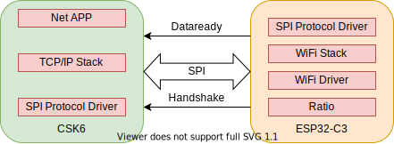
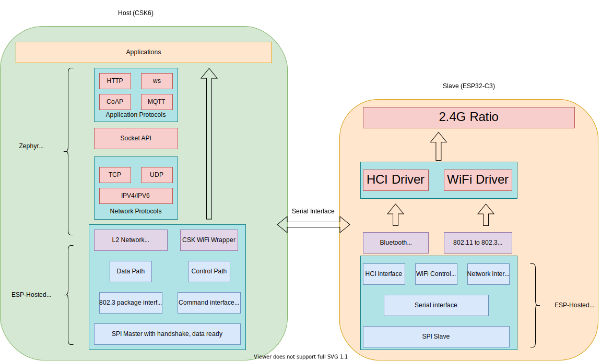
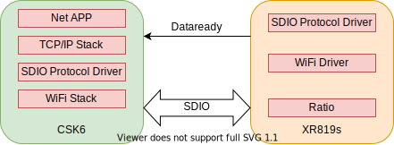

## 概述

CSK WiFi 驱动使用外挂 WiFi 芯片方案来进行 WiFi 网络通信，为应用程序提供联网功能。应用程序使用 CSK WiFi 接口在驱动初始化完毕、连接上 WiFi 热点后，可使用通用的网络 API (BSD Socket) 进行网络应用程序的开发。驱动当前支持的 WiFi 芯片 & 功能如下：

|          | WiFi Station | WiFi SoftAP | WiFi Scanning |
| :------: | :----------: | :---------: | :-----------: |
| ESP32-C3 |   &#10004;   |  &#10004;   |   &#10004;    |
|  XR819s  |   &#10004;   |             |   &#10004;    |


## 基本架构

### CSK-ESP32C3

[ESP32C3](https://www.espressif.com.cn/sites/default/files/documentation/esp32-c3_datasheet_cn.pdf) 是一款 2.4GHz WiFi & Ble 5.0 Combo SoC，内置 Flash & RAM、常规外设接口与射频电路，可进行二次固件开发。 CSK6 与 ESP32-C3 使用全双工 SPI 协议作为数据通信接口，CSK6 系统上运行网络应用程序、TCP/IP 协议栈以及与 ESP32-C3 通信的驱动程序。ESP32-C3 系统上运行 WiFi 协议栈(包含 `wpa_supplicant` & `net80211`)、WiFi 射频驱动程序以及与 CSK6 通信的驱动程序。因此，在 CSK6 端调用 WiFi 的控制接口连接上路由器后，用户可使用通用的 BSD Socket 等网络接口进行网络应用程序的开发。



<center style="font-size:24px;color:#C0C0C0">CSK-ESP32C3 Architecture</center>

#### 驱动实现

`CSK-ESP32C3` 方案的驱动设计基于 [ESP-Hosted](https://github.com/espressif/esp-hosted) 开源项目，ESP-Hosted 是乐鑫原厂发起的一个公开项目，作用为把 ESP 系芯片作为从机并且为主机提供 WiFi 连接与控制能力，从而使主机可以通过 WiFi 代理的方式进行网络通信。在 ESP-Hosted 方案中，使用全双工 SPI 协议作为 ESP32 与 CSK6001 底层链路通信协议，通过使用额外的两个 GPIO  作为接口同步(Handshake pin)与异步通知(Dataready pin) 从而实现全双工**异步** SPI 通信，在这基础之上抽象出`Serial Interface` 串行设备接口为 WiFi 与 BLE 提供底层串行通信能力。驱动分为两个部分，Host 端(CSK6) 与 Slave 端(ESP32-C3) :



<center style="font-size:24px;color:#C0C0C0">Driver Software Architecture</center>

##### Host

Host 驱动主要分为三个部分，`ESP-Hosted Driver`, `Zephyr L2 Network Driver`, `CSK WiFi 链路控制接口`。

`ESP-Hosted Driver` 使用 SPI Master 作为主要接口，并且使用两个额外的 GPIO(Handshake, Data Ready) 用来实现通用串行接口 —— **Generic Serial Interface**，具备全双工异步通信能力。基于这一接口，进而派生出**虚拟串行接口**（Virtual Serial Interface）,**控制/命令接口**（Control/Command Interface），**虚拟网络接口**（Virtual Network Interface）来对通信链路数据进行分组管理与派发。虚拟串行接口用来传递蓝牙 HCI 命令，用以实现 Host 端的 BLE 通信；控制/命令接口用来传递 WiFi 链路控制命令与事件（WiFi Station connect，WiFi AP Start 等），用以实现在 Host 端控制 WiFi 链路的功能。虚拟网络接口用来传递网络数据包，实现网络数据包（IP 层与传输层数据包）的双向透传，然后对接进 Zephyr 的网络子系统中。

##### slave

TODO

##### Zephyr 网络协议栈适配

网络协议栈适配的终极目标是如何把 ESP32-C3 端的 WiFi 网络数据包灌进 Zephyr 的网络子系统中，并且把 Zephyr 网络协议栈中的数据包通过 ESP32-C3 WiFi 发送到空气中。网络协议栈的适配代码处于一个胶水层，一头”粘“着 Zephyr `L2 Network Device Driver`，一头”粘“着 `ESP-Hosted` 虚拟网络接口。由于从 ESP32-C3 传输过来的网络数据包是以以太网格式进行封包的，因此可直接对接进 Zephyr 的以太网驱动中。 Zephyr L2 Network Device Driver 主要需要实现下面几个接口以及接收回调：

```c
static int csk_eth_dev_init(const struct device *dev);
static void csk_wifi_netif_init(struct net_if *netif);
static void csk_wifi_receive_pkt(struct network_handle *virtual_netif, void *arg);
static int csk_wifi_send_pkt(const struct device *dev, struct net_pkt *pkt);
```

`csk_eth_dev_init()` 会传递给`NET_DEVICE_DT_INST_DEFINE()`这个实例化宏，在网络设备驱动初始化时会首先调用 `csk_eth_dev_init()`，在 CSK WiFi 驱动中主要用来初始化 ESP-Hosted，注册一些底层必要的 Event Handler.

`csk_wifi_netif_init()` 这个函数的作用是初始化 Ethernet 与网络接口（Network Interface,这里说的网络接口在一般的协议栈中都是一个底层网口的抽象概念，与网络层数据包直接关联）。这个函数在 `csk_eth_dev_init()` 之后被系统统一初始化函数调用，从这里开始，网络数据包真正与网络接口关联起来，而网络接口也与具体的硬件( MAC 地址)关联起来。

`csk_wifi_send_pkt()` 与 `csk_wifi_receive_pkt()` 这两条函数是网络数据包的收发函数，前者是 Zephyr Ethernet 驱动中必须要提供的一个发送网络数据包接口，用来发送从网络协议栈出来的数据；后者是接收网络数据包的回调函数，在调用 `csk_wifi_netif_init()` 时会注册进 ESP-Hosted 的虚拟网络接口中，一旦有网络数据来临会触发一下这个回调函数，在这个函数里面需要把 ESP32-C3 传输过来的网络数据重新组装成 Zephyr Net Package 格式后再灌进 Zephyr 网络协议栈中。

### CSK-XR819s

XR819s 是一款 2.4GHz WiFi & Ble 5.0 通道芯片 (WiFi & Ble Transceiver)，不可进行二次开发。 CSK6 与 XR819s 使用 SDIO 协议作为数据通信接口，CSK6 系统上运行网络应用程序、TCP/IP 协议栈、WiFi 协议栈(包含 `wpa_supplicant` & `net80211`) 以及 与 XR819s 通信的驱动程序。XR819s 系统上运行着 WiFi 射频驱动程序以及与 CSK6 通信的驱动程序。因此，在 CSK6 端调用 WiFi 的控制接口连接上路由器后，用户可使用通用的 BSD Socket 等网络接口进行网络应用程序的开发。



<center style="font-size:24px;color:#C0C0C0">CSK-XR819s Architecture</center>

#### 驱动实现

TODO

## 已知问题

1. 使用 `CSK-XR819s` 方案时，由于 WiFi 底层软件设计缺陷，在 WiFi 连接出现四路握手失败时，无法区分出是密码错误还是其他异常。因此当出现此情况时，统一往应用层抛出密码错误异常，应用程序在接收到密码错误异常时，也应该进行重连 WiFi 的操作(一般第二次重连依然收到密码错误异常时，可认为是真正的密码错误并且停止重连)。

2. 使用 `CSK-XR819s` 方案时，由于 WiFi 底层软件设计缺陷，在射频天线电路工作异常或者性能较低时，有一定概率出现扫描超时或者其他问题导致触发 XR819s 复位，因此在应用软件开发前，应该要先确保射频天线电路工作良好。

## 应用参考

### 示例

- [WiFi Station](https://cloud.listenai.com/zephyr/zephyr/-/tree/master/samples/boards/csk6/network/wifi_sta)

  > 这个示例演示了如何使用 WiFi 驱动接口来初始化 WiFi 、连接到热点并且获取动态 IP

- [WiFi SoftAP](https://cloud.listenai.com/zephyr/zephyr/-/tree/master/samples/boards/csk6/network/wifi_softap)

  > 这个示例演示了如何使用 WiFi 驱动接口来初始化 WiFi 、建立一个热点，接受 WiFi Station 设备连接（由于当前 net 协议栈暂时不支持 DHCP Server, 因此无法给连接上的 WiFi Station 设备分配一个 IPv4 地址）

- [WiFi Scan AP](https://cloud.listenai.com/zephyr/zephyr/-/tree/master/samples/boards/csk6/network/wifi_scan_ap)

  > 这个示例演示了如何使用 WiFi 驱动接口来初始化 WiFi 、发起一次扫描获取周围的 WiFi Station 设备信息并打印出来

### API 指南

关于 CSK WiFi 驱动的相关接口细节，请参考 [csk_wifi.h](https://cloud.listenai.com/zephyr/zephyr/-/blob/master/drivers/wifi/csk6/include/csk6/csk_wifi.h)