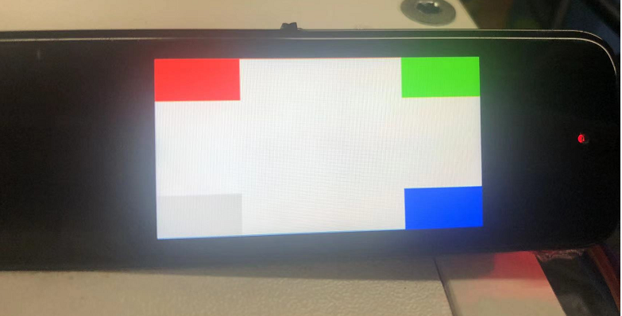
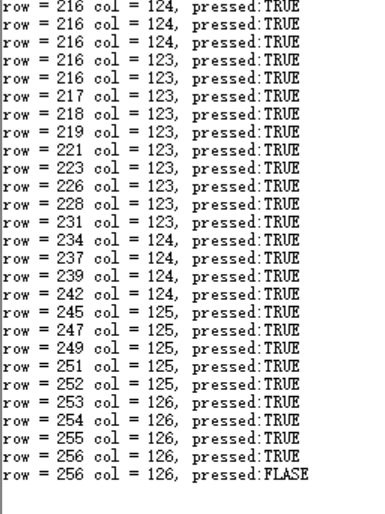
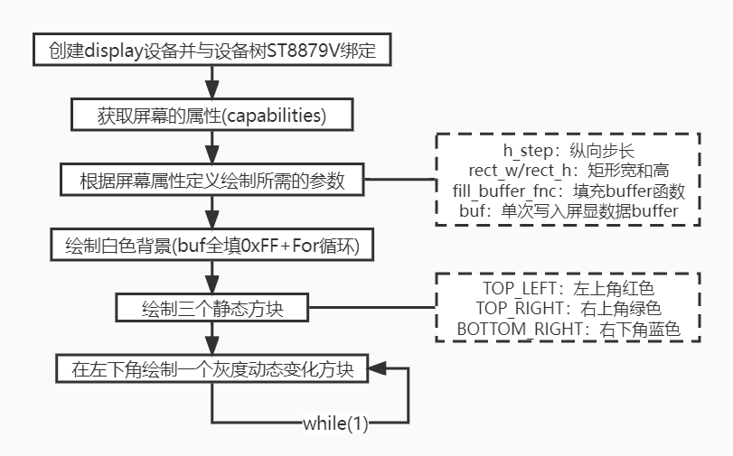

# 显示/触摸

本节将主要介绍使用CSK6芯片对显示类设备(显示屏)与触摸输入设备(触控屏)的使用。

在本章节中，我们将通过一个显示&触控综合Sample：

- 了解在Zephyr中显示设备驱动、触屏设备驱动等相关知识；
- 使用SPI接口，驱动ST7789V SPI屏幕进行内容显示；
- 使用I2C接口，获取BL6XXX 触控屏用户输入状态。

:::info 
本章节使用的实验硬件平台为 **扫描笔开发板**，对应SDK板型为 **csk6012_9s_scanpen**

使用的Sample为 samples/board/csk6/driver/display_kscan ，使用以上硬件平台进行本实验时，请与FAE确认使用的SDK版本。

后续NanoKit开发板将提供用于显示/触摸实验的配件板，敬请期待。
:::

## Sample的使用

在对显示与触摸驱动与Sample进行讲解前，我们先在我们的开发板上运行一个集成了显示与触摸应用的Sample，以获得更直观的感受。

**Step 1： 创建Sample**

在希望创建此工程的目录下执行  ``lisa zep create`` 指令，在模板选择中依次选择 boards/csk6/driver/display_kscan

**Step 2： 编译**

在刚创建的Sample工程目录中执行 ``lisa zep build -b csk6012_9s_scanpen`` 指令，指定我们使用的开发板板型进行编译。

**Step 3： 烧录&观察设备运行情况**

编译完成后，执行 ``lisa zep flash --runner pyocd`` 指令进行固件烧录

烧录完成后，可观察到设备显示屏出现【白色背景+三静态方块+一动态方块】的图像，如图：


打开调试串口，可观察到当用手触摸屏幕时，屏幕会实时输出触摸点的坐标与状态，如图：



## 显示
### 显示屏驱动模型
Zephyr具备标准的display驱动接口，用于向支持显示的设备输出UI内容。

Zephyr的display驱动模型位于SDK的 ``\include\drivers\display.h`` 文件，驱动模型中定义了可供上层应用调用的关键接口，如 **读/写framebuffer** 、**开/关屏幕** 、**获取屏幕设备信息** 、 **设置亮度/对比度/像素格式/方向** 等，更详细的驱动模型信息，读者可自行阅读 ``display.h`` 文件，参照其注释进行了解，在后续的屏显应用开发中，我们也会频繁调用到此驱动模型中定义的这些接口。

针对不同的显示屏设备，需要根据其硬件特性实现 ``display.h`` 中struct display_driver_api中定义的内函数指针对应的函数，如下：

```c
	struct display_driver_api {
			display_blanking_on_api blanking_on;
			display_blanking_off_api blanking_off;
			display_write_api write;
			display_read_api read;
			display_get_framebuffer_api get_framebuffer;
			display_set_brightness_api set_brightness;
			display_set_contrast_api set_contrast;
			display_get_capabilities_api get_capabilities;
			display_set_pixel_format_api set_pixel_format;
			display_set_orientation_api set_orientation;
		};
```

在上述需要适配的驱动接口中，write(写framebuffer)和get_capabilities(获取设备属性)是必须实现的，其他接口可使用空函数实现。

我们在 ``\drivers\display`` 目录中可看到已完成适配的屏显设备驱动，其中包括了我们这次要使用的ST7789V (display_st7789v.c/.h)，因此我们在进行简单的配置后就可以在应用中对ST7789V SPI屏幕进行显示控制了。

### 显示屏配置相关说明
#### 设备树中对显示屏的硬件定义

``boards\arm\csk6012_9s_scanpen\csk6012_9s_scanpen.dts`` 是我们正在使用的扫描开发板板型对应的设备树文件，在这个文件中，我们可看到ST7789V SPI屏幕的相关定义，如下：

```c
	&spi0 {
			status = "okay";
			miso-gpios = <&gpioa 13 0>;
			mosi-gpios = <&gpioa 10 0>;
			sclk-gpios = <&gpioa 11 0>;
			cs-gpios = <&gpioa 12 0>;
		
				st7789v@0 {
					compatible = "sitronix,st7789v";
					label = "ST7789V";
					status = "okay";
					spi-max-frequency = <20000000>;
					reg = <0>;
					cmd-data-gpios = <&gpioa 14 1>;
					reset-gpios = <&gpioa 15 1>;
					pinmuxs = <&pinmuxa 14 1>, <&pinmuxa 15 0>;
					width = <320>;
					height = <170>;
					x-offset = <0>;
					y-offset = <35>;
					……
				};
		};
```

结合原理图可看出DTS文件描述了ST7789V SPI屏与CSK6芯片的硬件连接关系，且对屏幕关键的参数与寄存器进行了定义，从而在我们执行编译指令指定csk6012_9s_scanpen板型时，建立硬件与驱动模型之间的关系。

#### 工程目录下prj.conf的配置

在我们的display_kscan例程主目录下，可见 ``prj.conf`` 文件，其屏显相关内容与注释如下：

```shell
	# 启用GPIO驱动(屏幕控制引脚使用)
	CONFIG_GPIO=y
	# 启用display驱动
	CONFIG_DISPLAY=y
	# 启用SPI驱动(屏幕使用SPI作为数据总线)
	CONFIG_SPI=y
	# 启用ST7789V设备(关联设备驱动文件)
	CONFIG_ST7789V=y
	
```

### Sample屏显代码说明
在display_kscan这个例程中，主程序对显示屏进行了初始化，并依次展示简单图形的绘制和图形的动态灰度调整功能，其主要流程如下(暂不包含触摸屏KSCAN相关)，读者可参照此流程图对照源码进行阅读：


## 触摸
### 触摸驱动模型
Zephyr具备kscan（keyboard scan matrix）驱动模型，其驱动程序用于检测矩阵键盘或带有按钮的设备中的按键。 由于kscan驱动模型并不定义键值，而是通过按键的行列坐标来标识按键，而用户触碰触摸屏本质上也是生成一个行列坐标，因此kscan驱动模型也适用于触摸屏。

与display驱动类似，kscan驱动模型位于SDK的 ``include\drivers\kscan.h`` 文件，kscan驱动模型中定义了一组很简洁的接口和回调，如下：

```c
	// 注册一个callback，当按键发生时通过callback通知应用。
	int kscan_config(struct device *dev,kscan_callback_t callback);
	
	// 应用注册callback后，通过该API使能callback，使能后有按键发生才会调用callback
	int kscan_enable_callback(struct device *dev);
	
	// 禁止callback，当按键发生时不调用callback，相当于是禁止键盘使用
	int kscan_disable_callback(struct device *dev);

```

当按键(触屏操作)发生时，驱动会调用注册的callback来通知应用有按键发生，callback的形式如下：

```c
	typedef void (*kscan_callback_t)(struct device *dev, u32_t row, u32_t column, bool pressed);
	
	// row：触摸点所在行
	// column：触摸点所在列
	// pressed：true=触摸按下, false=触摸松开

```

与其他设备驱动一样，针对不同的触摸屏设备(触摸IC)，需要根据其硬件特性实现kscan设备模型驱动中定义的三个内部函数，并通过kscan_driver_api注册即可完成驱动，我们的SDK已经适配了我们使用的触摸IC——BL6XXX(kscan_bl6xxx.c)，此处不再赘述。

### 触摸屏配置相关说明
#### 设备树中对触摸屏的硬件定义
与display设备一样，在 ``boards\arm\csk6012_9s_scanpen\csk6012_9s_scanpen.dts`` 中也对触摸屏IC的硬件特性进行了描述，触摸屏IC与CSK6芯片间采用I2C接口进行通信，如下：

```c
		&i2c0 {
			status = "okay";
			pinmuxs = <&pinmuxb 2 8>, <&pinmuxb 3 8>;
			pinmux-names = "SCL", "SDA";

			bl6xxx@0 {
					compatible = "betterlife,bl6xxx";
					reg = <0>;
					label = "BL6XXX";
					status = "okay";
					int-gpios = <&gpioa 3 0>;
					reset-gpios = <&gpioa 2 0>;
			};
	};
```

#### 工程目录下prj.conf的配置
在display_kscan例程主目录下的 ``prj.conf`` 文件，一样可见与kscan相关的配置选项：

```shell

	# 启用kscan驱动
	CONFIG_KSCAN=y
	# 启用I2C驱动
	CONFIG_I2C=y
	# 启用BL6XXX设备
	CONFIG_KSCAN_BL6XXX=y
	
```

### Sample触控代码说明
Kscan使用比较简单，在固件代码中配置好后，注册callback函数，在enable callback直接之后，就可以了坐等callback接受触屏按键了，在display_kscan这个例程中，关键的操作与注释如下：

```c

	// 创建、绑定一个KSCAN设备，DISPLAY_KSAN_DEV_NAME通过DTS关联至BL6XXX
	const struct device *kscan_dev = device_get_binding(DISPLAY_KSAN_DEV_NAME);
	
	// 注册回调，在k_callback中可看到对应的坐标与状态printk输出操作
	kscan_config(kscan_dev, k_callback);
	
	// 使能回调
	kscan_enable_callback(kscan_dev);
	
```

如上，仅需以上配置，遍在一个应用中注册了触摸屏回调，用户可根据实际业务需要，处理callback中的设备数据。


:::tip 	
Zephyr支持使用LVGL进行GUI界面的开发，详见 LVGL 章节。
:::