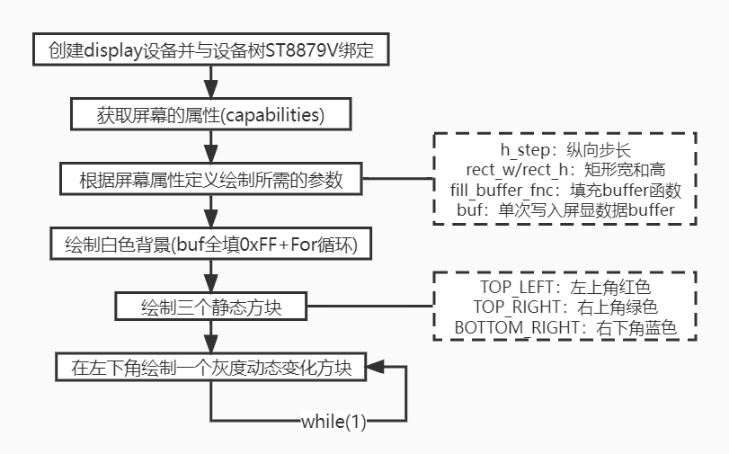

# 显示&触摸

## 概述
本节将主要通过显示&触控综合Sample来介绍基于CSK6 SDK的显示屏和触控屏的基本使用。通过本章节学习，您将了解到：

- Zephyr中显示设备驱动、触屏设备驱动等相关知识。
- 驱动ST7789V SPI屏幕进行内容显示。
- 使用I2C接口，获取BL6XXX 触控屏用户输入状态。
### LCD屏显示实现
csk6 sdk 驱动模型中定义了可供上层应用调用的关键接口，如 读/写framebuffer 、开/关屏幕 、获取屏幕设备信息 、 设置亮度/对比度/像素格式/方向等。
在csk6 sdk的`\drivers\display`目录中可看到sdk已完成了屏显设备驱动的适配，其中包含本示例中使用的`ST7789V (display_st7789v.c/.h)`，只需要在示例中完成驱动的配置即可使用改显示屏。

#### LCD屏显示逻辑
在display_kscan这个例程中，主程序对显示屏进行了初始化，并依次展示简单图形的绘制和图形的动态灰度调整功能，其主要流程如下(暂不包含触摸屏KSCAN相关)：



如上，此例程调用了display驱动模型中若干核心的显示接口进行内容显示，开发者可根据自己需要，绘制自己的UI页面。

#### Display常用API接口

获取显示功能

```c
void display_get_capabilities(const struct device *dev, struct display_capabilities *capabilities)
```

**参数说明**

| **字段**     | 说明                      |
| ------------ | ------------------------- |
| dev          | 指向display设备实例的指针 |
| capabilities | 指向要填充功能结构的指针  |

**写入要显示的数据**

```c
int display_write(const struct device *dev, const uint16_t x, const uint16_t y, const struct display_buffer_descriptor *desc, const void *buf)
```

| **字段** | 说明                         |
| -------- | ---------------------------- |
| dev      | 指向display设备实例的指针    |
| x        | x坐标点                      |
| y        | y坐标点                      |
| desc     | 指向描述显示区布局缓存的指针 |
| buf      | 指向显示区数组的指针         |

**关闭显示消隐**

```c
int display_blanking_off(const struct device *dev)
```

**参数说明**

| **字段** | 说明                      |
| -------- | ------------------------- |
| dev      | 指向display设备实例的指针 |

更详细的显示驱动API接口请查阅zephyr官网[Display Interface](https://docs.zephyrproject.org/latest/doxygen/html/group__display__interface.html)。

:::note

显示消隐:动态显示过程中，若进行片选切换时没有对上一片显示的内容进行清空，则会导致当前数码管中出现上一片内容的余影,从而使显示模糊，影响了整个显示效果。

:::

### 触摸屏功能实现 

Zephyr具备kscan（keyboard scan matrix）驱动模型，其驱动程序用于检测矩阵键盘或带有按钮的设备中的按键。由于kscan驱动模型并不定义键值，而是通过按键的行列坐标来标识按键，而用户触碰触摸屏本质上也是生成一个行列坐标，因此kscan驱动模型也适用于触摸屏。csk6sdk中默认适配的触摸IC:BL6XXX(kscan_bl6xxx.c)

与display驱动类似，kscan驱动模型位于SDK的 `\include\drivers\kscan.h` 文件，kscan驱动模型中定义了一组很简洁的接口和回调。

#### kscan常用API接口：

**注册一个callback，当按键发生时通过callback通知应用**

```c
int kscan_config(struct device *dev,kscan_callback_t callback);
```

**参数说明**

| **字段** | 说明                   |
| -------- | ---------------------- |
| dev      | 指向kcan设备实例的指针 |
| callback | 按键回调函数           |


**使能callback回调**

```c
int kscan_enable_callback(struct device *dev);
```

**参数说明**

| **字段** | 说明                   |
| -------- | ---------------------- |
| dev      | 指向kcan设备实例的指针 |


 **关闭callback回调**

```c
int kscan_disable_callback(struct device *dev);
```

**参数说明**

| **字段** | 说明                   |
| -------- | ---------------------- |
| dev      | 指向kcan设备实例的指针 |


**触摸回调函数**

```c
typedef void (*kscan_callback_t)(struct device *dev, u32_t row, u32_t column, bool pressed);
```

**参数说明**

| **字段** | 说明                          |
| -------- | ----------------------------- |
| dev      | 指向kcan设备实例的指针        |
| row      | 触摸点所在行                  |
| column   | 触摸点所在列                  |
| pressed  | true=触摸按下, false=触摸松开 |


## 使用示例

### 准备工作
本示例基于 CSK6-NanoKit开发板实现，要准备一块触控显示屏(使用 ST7789V 显示芯片的LCD屏及BL6133 触控芯片的TP)，把触控显示器接到CSK6-NanoKit开发板上。

### 获取sample项目
通过Lisa命令创建项目：
```
lisa zep create
```


依次按以下目录选择完成display_kscan sample创建：  
> boards → csk6 → driver → display_kscan


#### **显示屏设备树配置**  

本示例显示屏使用到了`CSK6-NanoKit`开发板的SPI0接口，具体为：

`spi0_sclk(pa15)、spi0_mosi(pa10)、spi0_miso(pa17)、 spi0_cs(pa12)`。

此外还有uart(日志输出)`pb10` 、`pb11`等接口的使用，因此需要在 `.overlay`中完成外设接口的配置，具体实现如下：

在应用项目下的`boards/csk6002_9s_nano.overlay`文件添加如下设备树配置：

```c
&csk6002_9s_nano_pinctrl{
            /* 日志串口配置 */
            pinctrl_uart0_rx_default: uart0_rx_default{
                    pinctrls = <&pinmuxb 10 2>;
            };
            
            pinctrl_uart0_tx_default: uart0_tx_default{
                    pinctrls = <&pinmuxb 11 2>;
            };
   
            /* 显示屏SPI接口配置 */
            pinctrl_spi0_sclk_default: spi0_sclk_default {
                    pinctrls = < &pinmuxa 15 6 >;
            };
            pinctrl_spi0_mosi_default: spi0_mosi_default {
                    pinctrls = < &pinmuxa 10 6 >;
            };
            pinctrl_spi0_miso_default: spi0_miso_default {
                    pinctrls = < &pinmuxa 17 6 >;
            };
            pinctrl_spi0_cs_default: spi0_cs_default {
                    pinctrls = < &pinmuxa 12 6 >;
            }; 
};
```
#### **显示屏组件配置**    

在prj.conf文件中打开显示屏功能配置:

```shell
CONFIG_HEAP_MEM_POOL_SIZE=16384
CONFIG_LOG=y

# GPIO功能配置
CONFIG_GPIO=y
# 显示功能配置
CONFIG_DISPLAY=y
# spi功能配置
CONFIG_SPI=y
# ST7789V显示屏驱动配置
CONFIG_ST7789V=y

```

#### LCD显示主程序

```c
void main(void)
{
	size_t x;
	size_t y;
	size_t rect_w;
	size_t rect_h;
	size_t h_step;
	size_t scale;
	size_t grey_count;
	uint8_t *buf;
	int32_t grey_scale_sleep;
	const struct device *display_dev;
	struct display_capabilities capabilities;
	struct display_buffer_descriptor buf_desc;
	size_t buf_size = 0;
	fill_buffer fill_buffer_fnc = NULL;

	LOG_INF("Display sample for %s", DISPLAY_DEV_NAME);
	
    /* kscan初始化 */
	kscan_init();
	
    /* 获取display设备实例 */
	display_dev = device_get_binding(DISPLAY_DEV_NAME);

	if (display_dev == NULL) {
		LOG_ERR("Device %s not found. Aborting sample.",
			DISPLAY_DEV_NAME);
		RETURN_FROM_MAIN(1);
	}
	
    /* 获取显示功能 */
	display_get_capabilities(display_dev, &capabilities);

	if (capabilities.screen_info & SCREEN_INFO_MONO_VTILED) {
		rect_w = 16;
		rect_h = 8;
	} else {
		rect_w = 2;
		rect_h = 1;
	}

	h_step = rect_h;
	scale = (capabilities.x_resolution / 8) / rect_h;

	rect_w *= scale;
	rect_h *= scale;

	if (capabilities.screen_info & SCREEN_INFO_EPD) {
		grey_scale_sleep = 10000;
	} else {
		grey_scale_sleep = 100;
	}

	buf_size = rect_w * rect_h;

	if (buf_size < (capabilities.x_resolution * h_step)) {
		buf_size = capabilities.x_resolution * h_step;
	}
	
    /* 色块配置 */
	switch (capabilities.current_pixel_format) {
	case PIXEL_FORMAT_ARGB_8888:
		fill_buffer_fnc = fill_buffer_argb8888;
		buf_size *= 4;
		break;
	case PIXEL_FORMAT_RGB_888:
		fill_buffer_fnc = fill_buffer_rgb888;
		buf_size *= 3;
		break;
	case PIXEL_FORMAT_RGB_565:
		fill_buffer_fnc = fill_buffer_rgb565;
		buf_size *= 2;
		break;
	case PIXEL_FORMAT_BGR_565:
		fill_buffer_fnc = fill_buffer_bgr565;
		buf_size *= 2;
		break;
	case PIXEL_FORMAT_MONO01:
	case PIXEL_FORMAT_MONO10:
		fill_buffer_fnc = fill_buffer_mono;
		buf_size /= 8;
		break;
	default:
		LOG_ERR("Unsupported pixel format. Aborting sample.");
		RETURN_FROM_MAIN(1);
	}

	buf = k_malloc(buf_size);

	if (buf == NULL) {
		LOG_ERR("Could not allocate memory. Aborting sample.");
		RETURN_FROM_MAIN(1);
	}
    
    (void)memset(buf, 0xFFu, buf_size);

    buf_desc.buf_size = buf_size;
    buf_desc.pitch = capabilities.x_resolution;
    buf_desc.width = capabilities.x_resolution;
    buf_desc.height = h_step;

    /*整屏填充白色背景*/
    for (int idx = 0; idx < capabilities.y_resolution; idx += h_step) {
        display_write(display_dev, 0, idx, &buf_desc, buf);
    }

    /*左上角填充红色块*/
    fill_buffer_fnc(TOP_LEFT, 0, buf, buf_size);
    x = 0;
    y = 0;
    display_write(display_dev, x, y, &buf_desc, buf);

    /*右上角填充绿色块*/
    fill_buffer_fnc(TOP_RIGHT, 0, buf, buf_size);
    x = capabilities.x_resolution - rect_w;
    y = 0;
    display_write(display_dev, x, y, &buf_desc, buf);

    /*右下角填充蓝色块*/
    fill_buffer_fnc(BOTTOM_RIGHT, 0, buf, buf_size);
    x = capabilities.x_resolution - rect_w;
    y = capabilities.y_resolution - rect_h;
    display_write(display_dev, x, y, &buf_desc, buf);
	
    /* 关闭显示消隐 */
    display_blanking_off(display_dev);

    grey_count = 0;
    x = 0;
    y = capabilities.y_resolution - rect_h;

    /*左下角灰色动态色块*/
    while (1) {
        fill_buffer_fnc(BOTTOM_LEFT, grey_count, buf, buf_size);
        display_write(display_dev, x, y, &buf_desc, buf);
        ++grey_count;
        k_msleep(grey_scale_sleep);
    }
```


#### **触摸屏设备树配置**  

触摸屏使用到了i2c0接口，具体为：

`i2c0_scl(pb2)、i2c0_sda(pb3)`。

因此需要在 `boad overlay`中完成外设接口的配置，具体实现如下：

在`app/boards/`目录下的`csk6002_9s_nano.overlay`文件并添加如下设备树配置：

```shell
&csk6002_9s_nano_pinctrl{
   // ...
    /* 触摸屏I2C接口配置 */
    pinctrl_i2c0_scl_default: i2c0_scl_default{
            pinctrls = <&pinmuxb 2 8>;
    };
    
    pinctrl_i2c0_sda_default: i2c0_sda_default{
            pinctrls = <&pinmuxb 3 8>;
    }; 
};
```
#### **触摸屏组件配置**  

在prj.conf文件中打开触摸屏功能配置:

```shell
# 触摸配置
CONFIG_KSCAN=y
# I2C功能配置
CONFIG_I2C=y
# 触摸屏屏驱动配置
CONFIG_KSCAN_BL6XXX=y
```
#### **触控代码实现**    

Kscan使用比较简单，在固件代码中配置好后，注册callback函数，当触摸事件出发时在callback回调函数获取坐标点，在display_kscan这个例程中，关键的操作与注释如下：

```c
/* 触摸回调函数，打印坐标 */
static void k_callback(const struct device *dev, uint32_t row, uint32_t col,
		       bool pressed)
{
	ARG_UNUSED(dev);
	printk("row = %u col = %u, pressed:%s\n", row, col, pressed ? "TRUE" : "FLASE");
}

void kscan_init(void)
{	
    /* 获取kscan设备实例 */
	const struct device *kscan_dev = device_get_binding(DISPLAY_KSAN_DEV_NAME);

	if (!device_is_ready(kscan_dev)) {
		LOG_ERR("kscan device %s not ready", kscan_dev->name);
		return;
	}
	
    /* 注册回调，在k_callback中可看到对应的坐标与状态printk输出操作 */
	kscan_config(kscan_dev, k_callback);
    /* 使能回调 */
	kscan_enable_callback(kscan_dev);
}

void main(void)
{
	kscan_init();
	...
}
```
如上，仅需增加回调配置，即可在一个应用中注册触摸屏回调，开发者可根据实际业务需要，处理callback中的设备数据。

### 编译和烧录
- **编译** 

在app根目录下通过以下指令完成编译：
```
lisa zep build -b csk6002_9s_nano
```
- **烧录**   

`csk6002_9s_nano`开发板通过USB连接PC，通过烧录指令开始烧录：
```
lisa zep flash --runner pyocd
```
- **查看结果**  

烧录完成后，可观察到设备显示屏出现【白色背景+三静态方块+一动态方块】的图像，如图：


打开调试串口（pb10、pb11），可观察到当用手触摸屏幕时，屏幕会实时输出触摸点的坐标与状态，日志信息如下：

```shell
*** Booting Zephyr OS build fd53c115d07a  ***
[00:00:00.027,000] 0m<inf
> csk6_spi: CS control inhibited (no GPIO device)
[00:00:00.153,000] 0m<inf> sample: Display sample for ST7789V
row = 61 col = 149, pressed:FLASE
row = 61 col = 149, pressed:TRUE
row = 61 col = 149, pressed:TRUE
row = 297 col = 145, pressed:FLASE
row = 297 col = 145, pressed:TRUE
row = 297 col = 145, pressed:TRUE
row = 297 col = 145, pressed:FLASE
row = 279 col = 15, pressed:FLASE
row = 279 col = 15, pressed:TRUE
row = 279 col = 15, pressed:TRUE
```

:::tip

本章节提供的sample与LVGL sample示例是两种不同的实现方式，本章节提供sample通过屏幕驱动接口完成内容的写入，而LVGL则自带了丰富的GUI控件可以供开发者直接使用，可以让界面开发更方便快捷，详见[LVGL](./lvgl.md)章节。
:::