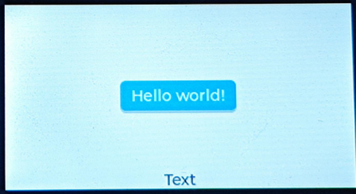

# LVGL

本节将主要介绍使用在CSK6的Zephyr SDK中，如何使用LVGL对显示屏进行GUI的输出，通过本章节我们将掌握：

- 对LVGL的基本认识
- 对LVGL一些关键概念的理解
- 在CSK6开发板上运行一个LVGL Sample

:::info 
本章节使用的实验硬件平台为 **扫描笔开发板**，对应SDK板型为 **csk6012_9s_nano**

使用的Sample为 samples/boards/csk6/subsys/display/lvgl ，使用以上硬件平台进行本实验时，需要准备ST7789V显示屏和SPI转接板，通过杜邦线完成接线，具体连接方式请与FAE确认。
后续NanoKit开发板将提供用于LVGL实验的配件板，敬请期待。
:::

## LVGL简介
LVGL全称Light and Versatile Graphics Library，是一个开源的GUI库，具备资源消耗小、可移植度高的特点，因此很适合在嵌入式设备上使用。

作为一个图形库，LVGL也自带了丰富的GUI控件可以供开发者直接使用，如常用的按钮，图表，列表，滑块等，此外还支持多种图形动画的调用，相比传统驱屏绘制GUI，开发者不需要大量的代码编写量和反复的效果验证，就可以搭建出一个比较满意的GUI。


## LVGL关键概念

在开始LVGL的Sample实验前，让我们先简单了解一下LVGL一些比较重要的概念，方便对后续Sample验证的理解。

**Display：** 在LVGL中一个物理显示器对应一个Display，LVGL支持多个物理显示器，如果开发的是像扫描词典笔这类只有一个屏幕设备，则在这个LVGL工程只有一个Display。

**Screen：** 一个Display创建多个Screen，可以理解为页面，Screen上可以添加各种LVGL支持的Widgets(组件)

**Object：** 是LVGL构成GUI的基本单位，每个Widgets都属于Object，上面的Screen(页面)也是一个Object。object使用父子树形结构，只允许有一个父节点，允许有多个子节点。screen做为根节点，允许没有父节点。

:::tip
更多的LVGL重要功能说明，可访问 [LVGL文档中心](https://docs.lvgl.io/7.11/overview/index.html) 进行了解。
:::

## LVGL Sample运行

**Step 1： 创建Sample**

通过Lisa命令创建项目：
```
lisa zep create
```

依次按以下目录选择完成adc sample的创建：  
> boards → csk6 → subsys → display → lvgl

**Step 2： 组件配置**

``lvgl`` 工程通用配置文件 ``prj.conf`` ，在文件中增加以下配置选项：
```shell

    CONFIG_HEAP_MEM_POOL_SIZE=16384
    CONFIG_MAIN_STACK_SIZE=2048

    CONFIG_DISPLAY=y
    CONFIG_DISPLAY_LOG_LEVEL_ERR=y

    CONFIG_LOG=y
    CONFIG_LOG_STRDUP_BUF_COUNT=16

    CONFIG_LVGL=y
    CONFIG_LVGL_USE_LABEL=y
    CONFIG_LVGL_USE_CONT=y
    CONFIG_LVGL_USE_BTN=y
    CONFIG_LVGL_USE_THEME_MATERIAL=y

	# 启用GPIO驱动(屏幕控制引脚使用)
    CONFIG_GPIO=y
    # 启用SPI驱动(屏幕使用SPI作为数据总线)
    CONFIG_SPI=y
    # 启用ST7789V设备(关联设备驱动文件)
    CONFIG_ST7789V=y

    CONFIG_I2C=y
    CONFIG_KSCAN_BL6XXX=y
```
针对csk6002_9s_nano开发板的硬件配置：
``lvgl`` 工程目录下`boards/csk6002_9s_nano.conf`增加如下配置：   
```shell
    CONFIG_KSCAN=y
    CONFIG_LVGL_POINTER_KSCAN_SWAP_XY=y
    CONFIG_LVGL_POINTER_KSCAN=y
    CONFIG_LVGL_POINTER_KSCAN_DEV_NAME="BL6XXX"

    CONFIG_DISPLAY=y
	# 开发板使用的屏幕是 ST7789V
    CONFIG_LVGL_DISPLAY_DEV_NAME="ST7789V"
    # 开发板使用的屏幕宽
    CONFIG_LVGL_HOR_RES_MAX=320
    # 开发板使用的屏幕高
    CONFIG_LVGL_VER_RES_MAX=170
    CONFIG_LVGL_DPI=100
```

**Step 3： 编译**

在当前工程目录中执行 ``lisa zep build -b csk6012_9s_nano`` 指令，指定我们使用的开发板板型进行编译。

**Step 4： 烧录&观察屏幕输出内容**

编译完成后，执行 ``lisa zep flash --runner pyocd`` 指令进行固件烧录

烧录完成后，可观察到设备显示屏出现图像，中央有一个text内容为"Hello world!"的lable，下方为一个不断递增的计数值，如图：



## Sample代码说明
LVGL Sample简单展示了object的创建和lable控件的使用，主要代码及注释如下：
```c
	// 创建两个label对象
	lv_obj_t *hello_world_label;
	lv_obj_t *count_label;

	// 创建一个display设备
	const struct device *display_dev;
	
	// 进行设备的绑定，CONFIG_LVGL_DISPLAY_DEV_NAME已在prj.conf中定义为ST7789V
	display_dev = device_get_binding(CONFIG_LVGL_DISPLAY_DEV_NAME);
	
	// 将创建的对象做为lable使用，设置text内容为"Hello world!"
	lv_label_set_text(hello_world_label, "Hello world!");
	// 对这个lable做位置的排列，位置为页面正中间，后面两个参数为x/y坐标偏移量
	lv_obj_align(hello_world_label, NULL, LV_ALIGN_CENTER, 0, 0);
	
	// 将count_label作为一个lable，并将其父节点配置为默认的screen
	count_label = lv_label_create(lv_scr_act(), NULL);
	// 对这个lable做位置的排列，位置为底部的中间
	lv_obj_align(count_label, NULL, LV_ALIGN_IN_BOTTOM_MID, 0, 0);
	
	// 执行任务handler，进行屏幕内容刷新
	lv_task_handler();
	display_blanking_off(display_dev);
	
	// 一个while(1)循环中，每个1秒做一次count_label的text的数值递增1
	while (1) {
		if ((count % 100) == 0U) {
			sprintf(count_str, "%d", count/100U);
			lv_label_set_text(count_label, count_str);
		}
		// 需要定期执行lv_task_handler
		lv_task_handler();
		k_sleep(K_MSEC(10));
		++count;
	}
```


 	
在本文中，LVGL Sample仅简单展示了LVGL的GUI功能，更多的控件、高级功能应用用户可以自行阅读LVGL库接口说明或前往 [LVGL官方文档](https://docs.lvgl.io/7.11/overview/index.html) 进行了解。
