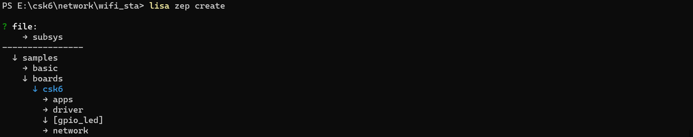
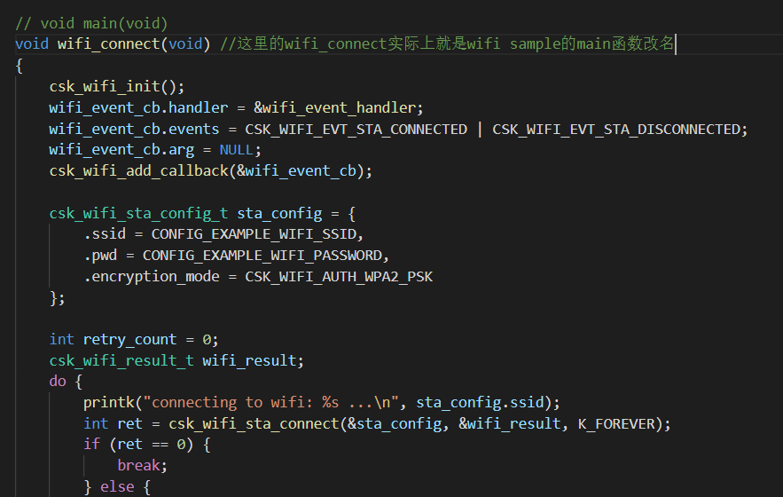
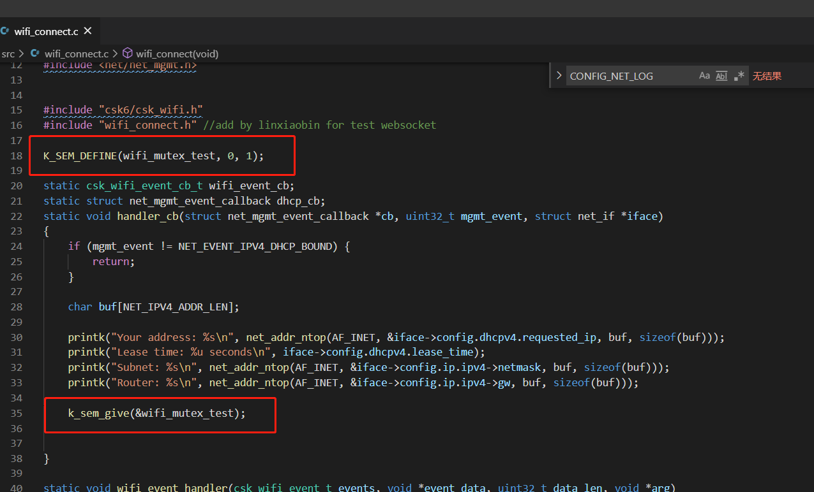
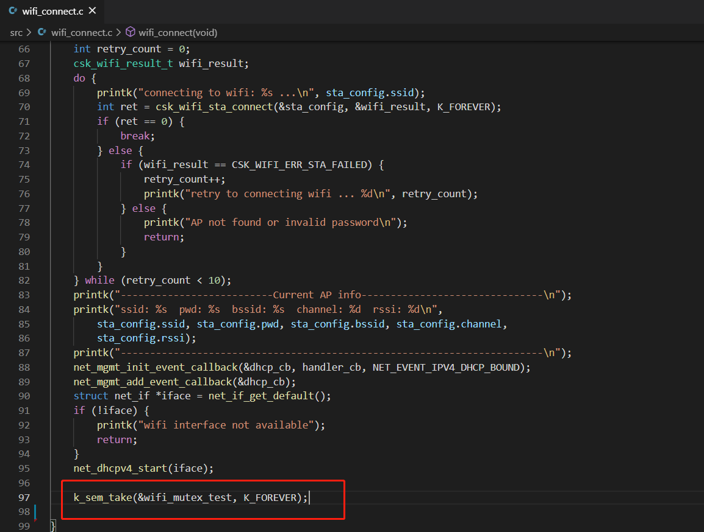
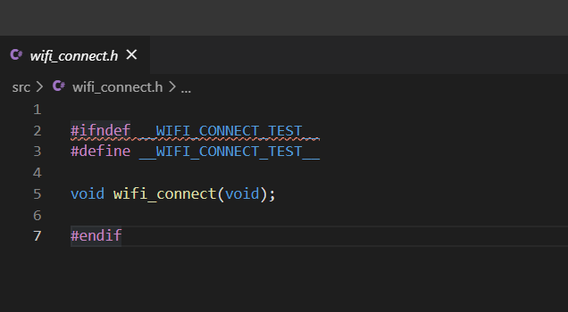
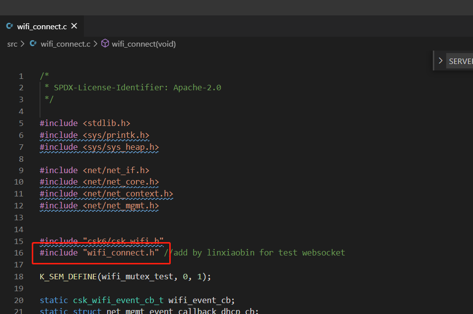
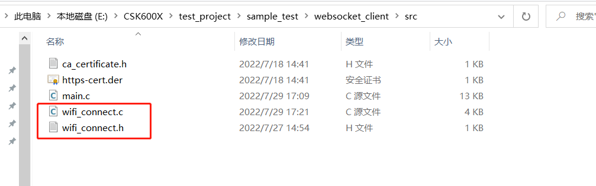
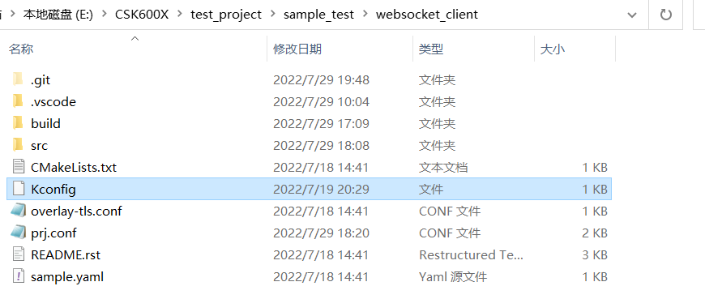

# 网络连接

## 概述
CSK6-NanoKit开发板提供了网络连接及进行websocket收发数据的示例。

WIFI网络连接部分可以详见[WIFI连接](./wifi_connect.md)。

## 相关 API接口
### websocket_connect

```c
int websocket_connect(int http_sock, struct websocket_request *req, int32_t timeout, void *user_data);
```

连接到提供websocket服务的服务器。建立连接后调用回调。返回的值是一个新的套接字描述符，可用于使用BSD套接字API发送/接收数据。

返回websocket id，该id用于`websocket_send_msg()`和`websocket_recv_msg()`的API接口。

参数说明：

| 参数      | 说明                                                         |
| --------- | ------------------------------------------------------------ |
| http_sock | 服务器的套接字id。请注意，此套接字用于进行HTTP握手等操作，实际的websocket连接是通过返回的websocket id完成的。注意，此函数返回后，http_sock不能关闭，因为它用于将websocket数据包传递到Websocket服务器。 |
| req       | websocket请求的信息，用户必须填充req结构体中的信息内容       |
| timeout   | 等待连接的超时时间，以毫秒(ms)为单位。`SYS_FOREVER_MS`表示永远等待。 |
| user_data | 传递给回调函数的用户数据                                     |

<br/>

### websocket_send_msg

```c
int websocket_send_msg(int ws_sock, const uint8_t *payload, size_t payload_len,
		       enum websocket_opcode opcode, bool mask, bool final,
		       int32_t timeout);
```

发送websocket数据。该函数接口会给待发送的数据，先添加上websocket的header信息再发送。

成功返回发送的字节数，大于或等于0，失败返回值小于0。

**参数说明：**

| 参数        | 说明                                                         |
| ----------- | ------------------------------------------------------------ |
| ws_sock     | websocket id，`websocket_connect`接口的返回值                |
| payload     | 待发送的数据                                                 |
| payload_len | 待发送数据的长度                                             |
| opcode      | 发送数据的格式，参照下述`enum websocket_opcode`枚举          |
| mask        | 掩码操作，表示是否要对数据进行掩码操作                       |
| final       | 是否是发送的最后一条数据。<br/>如果final为false（分段发送的消息数据），那么发送的第一条数据消息的opcode参数设置成适当的值，后续子序列发送的时候，opcode必须或上`WEBSOCKET_OPCODE_CONTINUE`。<br/>如果final为true且只剩下这条消息数据，则opcode应该设置适当的值，如`WEBSOCKET_OPCODE_DATA_TEXT`或`WEBSOCKET_OPCODE_DATA_BINARY`。 |
| timeout     | 发送数据的超时时间，以毫秒(ms)为单位，值`SYS_FOREVER_MS`表示永远等待。 |

`enum websocket_opcode`枚举值如下：

```c
enum websocket_opcode  {
	WEBSOCKET_OPCODE_CONTINUE     = 0x00,
	WEBSOCKET_OPCODE_DATA_TEXT    = 0x01,
	WEBSOCKET_OPCODE_DATA_BINARY  = 0x02,
	WEBSOCKET_OPCODE_CLOSE        = 0x08,
	WEBSOCKET_OPCODE_PING         = 0x09,
	WEBSOCKET_OPCODE_PONG         = 0x0A,
};
```

<br/>

### websocket_recv_msg

```c
int websocket_recv_msg(int ws_sock, uint8_t *buf, size_t buf_len,
		       uint32_t *message_type, uint64_t *remaining,
		       int32_t timeout);
```

接收websocket数据。该函数接口会将收到的数据，去掉websocket的header信息。

成功返回接收到的字节数，大于或等于0，失败返回值小于0。

**参数说明：**

| 参数         | 说明                                                         |
| ------------ | ------------------------------------------------------------ |
| ws_sock      | websocket id，`websocket_connect`接口的返回值                |
| buf          | 存放收到的数据的缓存                                         |
| buf_len      | buf的缓存大小                                                |
| message_type | 消息类型                                                     |
| remaining    | 接收完该消息后，还剩多少数据                                 |
| timeout      | 接收数据的超时时间，以毫秒(ms)为单位，值`SYS_FOREVER_MS`表示永远等待。 |

<br/>

更多websocket API接口描述请查看CSK6 SDK websocket头文件描述：[`include\net\websocket.h`](https://cloud.listenai.com/zephyr/zephyr/-/blob/master/include/net/websocket.h))。

## 使用示例

### 实现逻辑

本示例实现以下业务逻辑：

- 连接一个AP热点，并获取地址信息，热点配置：ssid: xiaowei-yyds pwd: xiaowei-yyds（WIFI网络连接部分解析可以详见[WIFI连接](./wifi_connect.md)）。
- 使用websocket连接服务器。（本示例的服务器由websocket工具软件搭建）

### 准备工作

本示例基于CSK6-NanoKit开发板基于[WIFI连接](./wifi_connect.md)章节示例代码进行改造，连接完wifi后进行websocket网络。
- CSK6-NanoKit开发板
- 手机或路由器设置一个WiFi热点，本示例中使用热点(ssid: xiaowei-yyds pwd: xiaowei-yyds)的做测试
- 改造wifi sameple示例代码作为本章节的websocket 代码接口使用
- 本示例websocket代码基于zephyr提供的websocket示例代码作为自己的工程改造，改造前源代码可参考路径`sdk/zephyr/samples/net/sockets/websocket_client`

### 获取wifi sample项目
通过Lisa命令创建项目：
```
lisa zep create
```

按以下目录选择完成sample创建：  

> boards → csk6 → network → wifi_sta

sample 创建完成。

### wifi示例代码改造

- 将wifi的main函数，改造成接口的形式，接口名改为：wifi_connect，并在文件中加入信号量阻塞，以便直到wifi连通后，才可以往下运行websocket的示例，信号量相关章节可以查看[线程间同步之信号量](../kernel/sync_semaphore.md)；
- 本地创建wifi_connect.h空文件，并将wifi_connect.c中的wifi_connect接口添加进去以便在其他地方可以调用；
- 将wifi示例代码的文件夹中的main.c改名为wifi_connect.c，并且在wifi_connect.c中调用`#include"wifi_connect.h"`;
- 将改造后的代码以及Kconfig文件，放到自己的websocket工程目录下；
- 将wifi的prj.conf内容，添加到websocket工程目录下的prj.conf中；

如下所示：

#### 步骤一：

main接口改名为wifi_connect



定义初始化全局的信号量`K_SEM_DEFINE(wifi_mutex_test, 0, 1);`

并在`handler_cb`函数接口中添加`k_sem_give(&wifi_mutex_test);`



在`wifi_connect`接口最后添加`k_sem_take(&wifi_mutex_test, K_FOREVER);`



#### 步骤二：

创建头文件wifi_connect.h



#### 步骤三：

头文件包含到c文件中



#### 步骤四：

将改造后的wifi相关加入websocket的工程目录





（websocket的工程目录中的代码，取自zephyr中sdk做改造，源路径为`sdk/zephyr/samples/net/sockets/websocket_client`）

#### 步骤五：

wifi的prj.conf内容添加到websocket工程目录下的prj.conf中，修改后的`prj.conf`内容如下：

```shell
# 打开WiFi驱动配置
CONFIG_WIFI=y
CONFIG_CSK_WIFI_STATION=y
CONFIG_NET_L2_ETHERNET=y

# 打开NET网络配置
CONFIG_NETWORKING=y
CONFIG_NET_DHCPV4=y
CONFIG_NET_IPV4=y
CONFIG_NET_SOCKETS=y
CONFIG_TEST_RANDOM_GENERATOR=y
CONFIG_NET_SOCKETS_POSIX_NAMES=y

# 网络管理配置
CONFIG_NET_MGMT=y
CONFIG_NET_MGMT_EVENT=y
CONFIG_NET_MGMT_EVENT_STACK_SIZE=4096

# 网络线程栈配置
CONFIG_NET_RX_STACK_SIZE=2048
CONFIG_NET_TX_STACK_SIZE=2048
# 网络的内存池配置
CONFIG_NET_PKT_RX_COUNT=16
CONFIG_NET_PKT_TX_COUNT=16
CONFIG_NET_BUF_RX_COUNT=64
CONFIG_NET_BUF_TX_COUNT=64
CONFIG_NET_CONTEXT_NET_PKT_POOL=y

# 引用名为newlib的libc标准库
CONFIG_NEWLIB_LIBC=y

# SYSTEM WORKQUEU线程栈
CONFIG_SYSTEM_WORKQUEUE_STACK_SIZE=2048
# 系统堆，分配内存，可根据实际使用配置
CONFIG_HEAP_MEM_POOL_SIZE=60000
CONFIG_MAIN_STACK_SIZE=10000
CONFIG_INIT_STACKS=y

# 打开LOG配置
CONFIG_LOG=y
CONFIG_WIFI_LOG_LEVEL_DBG=y

CONFIG_NET_TCP=y
CONFIG_NET_SHELL=y
CONFIG_NET_STATISTICS=y

# Sockets
CONFIG_NET_SOCKETS_POLL_MAX=4

# HTTP & Websocket
CONFIG_HTTP_CLIENT=y
CONFIG_WEBSOCKET_CLIENT=y

CONFIG_LOG_MODE_IMMEDIATE=y
CONFIG_NET_LOG=y
```

### main.c代码示例

```c
/*
 * Copyright (c) 2019 Intel Corporation
 *
 * SPDX-License-Identifier: Apache-2.0
 */

#include <logging/log.h>
LOG_MODULE_REGISTER(net_websocket_client_sample, LOG_LEVEL_DBG);

#include <net/net_ip.h>
#include <net/socket.h>
#include <net/tls_credentials.h>
#include <net/websocket.h>
#include <random/rand32.h>
#include <shell/shell.h>

#include "ca_certificate.h"

#include "wifi_connect.h"

#define SERVER_PORT 8080

#if 0 //这里也可以从prj.conf中配置
#if defined(CONFIG_NET_CONFIG_PEER_IPV6_ADDR)
#define SERVER_ADDR6  CONFIG_NET_CONFIG_PEER_IPV6_ADDR
#else
#define SERVER_ADDR6 ""
#endif

#if defined(CONFIG_NET_CONFIG_PEER_IPV4_ADDR)
#define SERVER_ADDR4  CONFIG_NET_CONFIG_PEER_IPV4_ADDR
#else
#define SERVER_ADDR4 "192.168.101.10"
#endif

#else

#define SERVER_ADDR4 "192.168.101.10" //这里的地址，是准备发送websocket数据的目标服务器地址，
								   //本示例使用的是自己电脑搭建的服务器地址
#endif

/* Generated by http://www.lipsum.com/
 * 2 paragraphs, 178 words, 1160 bytes of Lorem Ipsum
 */
#if 0
static const char lorem_ipsum[] =
	"Lorem ipsum dolor sit amet, consectetur adipiscing elit. "
	"Vestibulum ultricies sapien tellus, ac viverra dolor bibendum "
	"lacinia. Vestibulum et nisl tristique tellus finibus gravida "
	"vitae sit amet nunc. Suspendisse maximus justo mi, vitae porta "
	"risus suscipit vitae. Curabitur ut fringilla velit. Donec ac nisi "
	"in dui semper lobortis sed nec ante. Sed nec luctus dui. Sed ut "
	"ante nisi. Mauris congue euismod felis, et maximus ex pellentesque "
	"nec. Proin nibh nisl, semper at nunc in, mattis pharetra metus. Nam "
	"turpis risus, pulvinar sit amet varius ac, pellentesque quis purus."
	" "
	"Nam consequat purus in lacinia fringilla. Morbi volutpat, tellus "
	"nec tempus dapibus, ante sem aliquam dui, eu feugiat libero diam "
	"at leo. Sed suscipit egestas orci in ultrices. Integer in elementum "
	"ligula, vel sollicitudin velit. Nullam sit amet eleifend libero. "
	"Proin sit amet consequat tellus, vel vulputate arcu. Curabitur quis "
	"lobortis lacus. Sed faucibus vestibulum enim vel elementum. Vivamus "
	"enim nunc, auctor in purus at, aliquet pulvinar eros. Cras dapibus "
	"nec quam laoreet sagittis. Quisque dictum ante odio, at imperdiet "
	"est convallis a. Morbi mattis ut orci vitae volutpat."
	"\n";

#else
static const char lorem_ipsum[] =
	"wo wo wo wo aaaaa dffghhh"
	"\n";
#endif

#define MAX_RECV_BUF_LEN 512 //(sizeof(lorem_ipsum) - 1)

const int ipsum_len = MAX_RECV_BUF_LEN;

//这里的buf正式使用的时候，需要申请大一点，避免接收数据太多而导致内存溢出
//这里申请的内存大小，要注意依据prj.conf文件中的内存字段大小，避免超出运行内存导致溢出
static uint8_t recv_buf_ipv4[MAX_RECV_BUF_LEN];
static uint8_t recv_buf_ipv6[MAX_RECV_BUF_LEN];

#define EXTRA_BUF_SPACE 30

static uint8_t temp_recv_buf_ipv4[MAX_RECV_BUF_LEN + EXTRA_BUF_SPACE];
static uint8_t temp_recv_buf_ipv6[MAX_RECV_BUF_LEN + EXTRA_BUF_SPACE];

//创建socket
static int setup_socket(sa_family_t family, const char *server, int port,
			int *sock, struct sockaddr *addr, socklen_t addr_len)
{
	const char *family_str = family == AF_INET ? "IPv4" : "IPv6";
	int ret = 0;

	memset(addr, 0, addr_len);

	if (family == AF_INET) {
		net_sin(addr)->sin_family = AF_INET;
		net_sin(addr)->sin_port = htons(port);
		inet_pton(family, server, &net_sin(addr)->sin_addr);
	} else {
		net_sin6(addr)->sin6_family = AF_INET6;
		net_sin6(addr)->sin6_port = htons(port);
		inet_pton(family, server, &net_sin6(addr)->sin6_addr);
	}

	*sock = socket(family, SOCK_STREAM, IPPROTO_TCP);

	if (*sock < 0) {
		LOG_ERR("Failed to create %s HTTP socket (%d)", family_str,
			-errno);
	}
	return ret;
fail:
	if (*sock >= 0) {
		close(*sock);
		*sock = -1;
	}

	return ret;
}

//连接socket
static int connect_socket(sa_family_t family, const char *server, int port,
			  int *sock, struct sockaddr *addr, socklen_t addr_len)
{
	int ret;

	ret = setup_socket(family, server, port, sock, addr, addr_len);
	if (ret < 0 || *sock < 0) {
		return -1;
	}

	ret = connect(*sock, addr, addr_len);
	if (ret < 0) {
		LOG_ERR("Cannot connect to %s remote (%d)",
			family == AF_INET ? "IPv4" : "IPv6",
			-errno);
		ret = -errno;
	}

	return ret;
}

//连接websocket的回调函数
static int connect_cb(int sock, struct http_request *req, void *user_data)
{
	printk("Websocket %d for %s connected.", sock, (char *)user_data);
	return 0;
}

static size_t how_much_to_send(size_t max_len)
{
	size_t amount;

	do {
		amount = sys_rand32_get() % max_len;
	} while (amount == 0U);

	return amount;
}

//websocket发送数据
static ssize_t sendall_with_ws_api(int sock, const void *buf, size_t len)
{
	return websocket_send_msg(sock, buf, len, WEBSOCKET_OPCODE_DATA_TEXT,
				  true, true, SYS_FOREVER_MS);
}

static ssize_t sendall_with_bsd_api(int sock, const void *buf, size_t len)
{
	return send(sock, buf, len, 0);
}

//websocket接收数据
static void recv_data_wso_api(int sock, size_t amount, uint8_t *buf,
			      size_t buf_len, const char *proto)
{
	uint64_t remaining = ULLONG_MAX;
	int total_read;
	uint32_t message_type;
	int ret, read_pos;

	read_pos = 0;
	total_read = 0;

	while (remaining > 0) {
		ret = websocket_recv_msg(sock, buf + read_pos,
					 buf_len - read_pos,
					 &message_type,
					 &remaining,
					 0);
		if (ret <= 0) {
			if (ret == -EAGAIN) {
				k_sleep(K_MSEC(50));
				continue;
			}

			LOG_DBG("%s connection closed while "
				"waiting (%d/%d)", proto, ret, errno);
			break;
		}

		read_pos += ret;
		total_read += ret;
	}

	if (remaining != 0 || total_read != amount ||
	    /* Do not check the final \n at the end of the msg */
	    memcmp(lorem_ipsum, buf, amount - 1) != 0) {
		LOG_ERR("%s data recv failure %zd/%d bytes (remaining %" PRId64 ")",
			proto, amount, total_read, remaining);
		LOG_HEXDUMP_DBG(buf, total_read, "received ws buf");
		LOG_HEXDUMP_DBG(lorem_ipsum, total_read, "sent ws buf");
	} else {
		LOG_DBG("%s recv %d bytes", proto, total_read);
	}
}

static void recv_data_bsd_api(int sock, size_t amount, uint8_t *buf,
			      size_t buf_len, const char *proto)
{
	int remaining;
	int ret, read_pos;

	remaining = amount;
	read_pos = 0;

	while (remaining > 0) {
		ret = recv(sock, buf + read_pos, buf_len - read_pos, 0);
		if (ret <= 0) {
			if (errno == EAGAIN || errno == ETIMEDOUT) {
				k_sleep(K_MSEC(50));
				continue;
			}

			LOG_DBG("%s connection closed while "
				"waiting (%d/%d)", proto, ret, errno);
			break;
		}

		read_pos += ret;
		remaining -= ret;
	}

	if (remaining != 0 ||
        //最后一个字符是'\n'，注意别比较进去
	    memcmp(lorem_ipsum, buf, amount - 1) != 0) {
		LOG_ERR("%s data recv failure %zd/%d bytes (remaining %d)",
			proto, amount, read_pos, remaining);
		LOG_HEXDUMP_DBG(buf, read_pos, "received bsd buf");
		LOG_HEXDUMP_DBG(lorem_ipsum, read_pos, "sent bsd buf");
	} else {
		LOG_DBG("%s recv %d bytes", proto, read_pos);
	}
}

//websocket发送数据以及等待接收回来的数据
static bool send_and_wait_msg(int sock, size_t amount, const char *proto,
			      uint8_t *buf, size_t buf_len)
{
	static int count;
	int ret;

	if (sock < 0) {
		return true;
	}

	memcpy(buf, lorem_ipsum, amount);
	buf[amount] = '\n';

    /* 使用专用websocket API和通用BSD套接字API每2次发送一次消息。
     * 真正的应用程序不会像这样做，但在这里我们想要测试这两个API。
     */
	if (count % 2) {
		ret = sendall_with_ws_api(sock, buf, amount + 1);
	} else {
		ret = sendall_with_bsd_api(sock, buf, amount + 1);
	}

	if (ret <= 0) {
		if (ret < 0) {
			LOG_ERR("%s failed to send data using %s (%d)", proto,
				(count % 2) ? "ws API" : "socket API", ret);
		} else {
			LOG_DBG("%s connection closed", proto);
		}

		return false;
	} else {
		LOG_DBG("%s sent %d bytes", proto, ret);
	}

	if (count % 2) {
		recv_data_wso_api(sock, amount + 1, buf, buf_len, proto);
	} else {
		recv_data_bsd_api(sock, amount + 1, buf, buf_len, proto);
	}

	count++;

	return true;
}

void main(void)
{
    //以下字符只是一个演示作用，不是固定写死的字符
	const char *extra_headers[] = {
		"Origin: http://foobar\r\n",
		NULL
	};
	int sock4 = -1, sock6 = -1;
	int websock4 = -1, websock6 = -1;
	int32_t timeout = 3 * MSEC_PER_SEC;
	struct sockaddr_in6 addr6;
	struct sockaddr_in addr4;
	size_t amount;
	int ret;
	//以下代码是wifi中的sample代码，在这里联wifi，连接不上会阻塞在这里，
    //wifi名字可以在Kconfig文件中去修改默认，
    //也可以在wifi_connect.c文件中去强制定义对应的宏即可
/**********************************begin:add to connect wifi**********************************/
	printk("-----------------------wifi connect begin-----------------------\r\n");
	wifi_connect(); 
	printk("-----------------------wifi connect over-----------------------\r\n");
/**********************************end:  add to connect wifi**********************************/

#if 0
	if (IS_ENABLED(CONFIG_NET_SOCKETS_SOCKOPT_TLS)) {
		ret = tls_credential_add(CA_CERTIFICATE_TAG,
					 TLS_CREDENTIAL_CA_CERTIFICATE,
					 ca_certificate,
					 sizeof(ca_certificate));
		if (ret < 0) {
			LOG_ERR("Failed to register public certificate: %d",
				ret);
			k_sleep(K_FOREVER);
		}
	}
#endif

	if (IS_ENABLED(CONFIG_NET_IPV4)) {
		(void)connect_socket(AF_INET, SERVER_ADDR4, SERVER_PORT,
				     &sock4, (struct sockaddr *)&addr4,
				     sizeof(addr4));
	}

	if (sock4 < 0) {
		LOG_ERR("Cannot create HTTP connection.");
		k_sleep(K_FOREVER);
	}

	printk("socket =(%d) \r\n", sock4);
	k_sleep(K_MSEC(100));

	if (sock4 >= 0 && IS_ENABLED(CONFIG_NET_IPV4)) {
		struct websocket_request req;

		memset(&req, 0, sizeof(req));

		req.host = SERVER_ADDR4;
		req.url = "/";
		req.optional_headers = extra_headers;
		req.cb = connect_cb;
		req.tmp_buf = temp_recv_buf_ipv4;
		req.tmp_buf_len = sizeof(temp_recv_buf_ipv4);

		websock4 = websocket_connect(sock4, &req, timeout, "IPv4");
		if (websock4 < 0) {
			LOG_ERR("Cannot connect to %s:%d", SERVER_ADDR4, SERVER_PORT);
			close(sock4);
		}
	}

	printk(" websock4 =(%d) \r\n", websock4);
	k_sleep(K_MSEC(100));

	if (websock4 < 0) {
		LOG_ERR("No IPv4 connectivity");
		k_sleep(K_FOREVER);
	}

	while (1) {
		amount = how_much_to_send(ipsum_len);

		if (websock4 >= 0 &&
		    !send_and_wait_msg(websock4, amount, "IPv4",
				       recv_buf_ipv4, sizeof(recv_buf_ipv4))) {
			break;
		}

		k_sleep(K_MSEC(250));
	}

	if (websock4 >= 0) {
		close(websock4);
	}

	if (websock6 >= 0) {
		close(websock6);
	}

	k_sleep(K_FOREVER);
}
```

### 测试说明

因为本示例需要连接到websocket，本示例使用的websocket是使用网络下载的工具作为websocket的服务器，用户测试需要发送到有意义的websocket服务器地址才可以进行收发，或者自行搭建即可。这里对服务器的搭建暂时不做过多解释，用户可以自行查找搭建方式。

### 测试目标

CSK6-NanoKit启动后，往目标服务器发送代码中写死的自定义的数据，且等待接收服务器返回的数据并打印出来，如下图所示：


### 编译和烧录

#### 编译

在app根目录下通过以下指令完成编译：
```shell
lisa zep build -b csk6002_9s_nano
```
#### 烧录

CSK6-NanoKit通过USB连接PC，通过烧录指令开始烧录：
```shell
lisa zep flash --runner pyocd
```
#### 查看结果 

**查看日志：**

CSK6-NanoKit通过板载DAPlink虚拟串口连接电脑，或者将CSK6-NanoKit的日志串口`A03 TX A02 RX`外接串口板并连接电脑。
- 在电脑端使用串口调试助手查看日志，默认波特率为115200。

```shell

[17:05:46.941]收←◆*** Booting Zephyr OS build v1.0.3-alpha.2  ***
-----------------------wifi connect begin-----------------------
xradio_generate_random_mac_addr, 11, generate random mac addr
mac_addr: '44:29:04:e3:49:64'
[xr_taskqueue_start_thread , 132]+-+0x8f098 :umac,8192


uart:~$ 
[17:05:47.810]收←◆
wlan information ===================================================
firmware:
    version : R0-XR_C07.08.52.65_02.65 Mar  5 2021 11:45:46 
    buffer  : 30
driver:
    version : XR_V02.05_20220524v1
mac address:
    in use        : 44:29:04:e3:49:64
    in use        : 44:29:04:e3:49:65
====================================================================

[00:00:00.904,000] <dbg> csk_wifi.wlan_event_handler: Got wlan event [WLAN_EVENT_FW_STARTUP_DONE], current state[WIFI_SM_ON_STARTUP]
uart:~$ [00:00:00.920,000] <dbg> csk_wifi.wifi_obj_set_sm: (91)STA_SM: current[WIFI_SM_ON_STARTUP], next[WIFI_SM_STARTUP_DONE]
uart:~$ [00:00:00.935,000] <inf> csk_wifi: WiFi module startup done
uart:~$ 
[17:05:47.923]收←◆wlan_sta_set_autoconnect enable :0 
connecting to wifi: xiaowei-yyds ...
[00:00:00.990,000] <dbg> csk_wifi.wifi_obj_set_sm: (91)STA_SM: current[WIFI_SM_STARTUP_DONE], next[WIFI_SM_STA_ON_CONNECT_SCAN]
uart:~$ 
[17:05:48.969]收←◆EVENT NOTIFY WLAN_EVENT_SCAN_SUCCESS
[00:00:02.033,000] <dbg> csk_wifi.wlan_event_handler: Got wlan event [WLAN_EVENT_SCAN_SUCCESS], current state[WIFI_SM_STA_ON_CONNECT_SCAN]
uart:~$ [00:00:02.050,000] <inf> csk_wifi: STA_SM[WIFI_SM_STA_ON_CONNECT_SCAN]: scan success
uart:~$ [00:00:02.061,000] <dbg> csk_wifi.wifi_obj_set_sm: (91)STA_SM: current[WIFI_SM_STA_ON_CONNECT_SCAN], next[WIFI_SM_STA_ON_CONNECT]
uart:~$ sta: Trying to associate with c2:d0:2b:4c:44:67 (SSID='xiaowei-yyds' freq=2422 MHz)

[17:05:49.184]收←◆sta: Associated with c2:d0:2b:4c:44:67
sta: WPA: Key negotiation completed with c2:d0:2b:4c:44:67 [PTK=CCMP GTK=CCMP]
sta: CTRL-EVENT-CONNECTED - Connection to c2:d0:2b:4c:44:67 completed [id=0 id_str=]
[00:00:02.277,000] <dbg> csk_wifi.wlan_event_handler: Got wlan event [WLAN_EVENT_CONNECTED], current state[WIFI_SM_STA_ON_CONNECT]
uart:~$ [00:00:02.293,000] <inf> csk_wifi: STA_SM[WIFI_SM_STA_ON_CONNECT]: connected
uart:~$ [00:00:02.303,000] <dbg> csk_wifi.wifi_obj_set_sm: (91)STA_SM: current[WIFI_SM_STA_ON_CONNECT], next[WIFI_SM_STA_CONNECTED]
uart:~$ [WiFi sta] connected
--------------------------Current AP info-------------------------------
ssid: xiaowei-yyds  pwd: xiaowei-yyds  bssid: c2:d0:2b:4c:44:67  channel: 3  rssi: -49
------------------------------------------------------------------------

[17:05:52.343]收←◆[00:00:05.403,000] <inf> net_dhcpv4: Received: 192.168.101.215
uart:~$ Your address: 192.168.101.215
Lease time: 86400 seconds
Subnet: 255.255.255.0
Router: 192.168.101.1
-----------------------main 369 wifi connect over-----------------------
[WAR:1533]drop=1333, fctl=0x00d0.
 socket =(0) 

[17:05:53.403]收←◆[00:00:06.464,000] <err> net_websocket_client_sample: --------------111111111111111111--------------.

uart:~$ 
[17:05:54.932]收←◆Websocket 1 for IPv4 connected.
[17:05:56.936]收←◆ websock4 =(1) 

[17:05:57.938]收←◆[00:00:10.999,000] <dbg> net_websocket_client_sample.send_and_wait_msg: IPv4 sent 26 bytes
uart:~$ 
[17:06:09.233]收←◆[00:00:22.293,000] <err> net_websocket_client_sample: IPv4 data recv failure 26/26 bytes (remaining 0)
uart:~$ [00:00:22.306,000] <dbg> net_websocket_client_sample.received bsd buf
                                                     31 32 33 34 35 37 38 39  e8 af b7 e8 bf 9b e8 a1 |12345789 ........
                                                     8c e6 b3 a8 e5 86 8c ef  bc 8c                   |........ ..      
uart:~$ [00:00:22.340,000] <dbg> net_websocket_client_sample.sent bsd buf
                                                     77 6f 20 77 6f 20 77 6f  20 77 6f 20 61 61 61 61 |wo wo wo  wo aaaa
                                                     61 20 64 66 66 67 68 68  68 0a                   |a dffghh h.      
uart:~$ 
[17:06:09.564]收←◆[00:00:22.624,000] <dbg> net_websocket_client_sample.send_and_wait_msg: IPv4 sent 4 bytes
uart:~$ [00:00:22.636,000] <err> net_websocket_client_sample: IPv4 data recv failure 4/12 bytes (remaining 0)
uart:~$ [00:00:22.649,000] <dbg> net_websocket_client_sample.received ws buf
                                                     e5 b0 8a e9 87 8d e5 88  9b e4 bd 9c             |........ ....    
uart:~$ [00:00:22.671,000] <dbg> net_websocket_client_sample.sent ws buf
                                                     77 6f 20 77 6f 20 77 6f  20 77 6f 20             |wo wo wo  wo     
uart:~$ 
[17:06:09.883]收←◆[00:00:22.943,000] <dbg> net_websocket_client_sample.send_and_wait_msg: IPv4 sent 8 bytes
uart:~$ 
[17:06:23.683]收←◆[00:00:36.743,000] <err> net_websocket_client_sample: IPv4 data recv failure 8/26 bytes (remaining -18)
uart:~$ [00:00:36.757,000] <dbg> net_websocket_client_sample.received bsd buf
                                                     35 35 36 36 37 37 38 38  e8 af b7 e8 bf 9b e8 a1 |55667788 ........
                                                     8c e6 b3 a8 e5 86 8c ef  bc 8c                   |........ ..      
uart:~$ [00:00:36.790,000] <dbg> net_websocket_client_sample.sent bsd buf
                                                     77 6f 20 77 6f 20 77 6f  20 77 6f 20 61 61 61 61 |wo wo wo  wo aaaa
                                                     61 20 64 66 66 67 68 68  68 0a                   |a dffghh h.      
uart:~$ 
[17:06:24.013]收←◆[00:00:37.074,000] <dbg> net_websocket_client_sample.send_and_wait_msg: IPv4 sent 17 bytes
uart:~$ [00:00:37.087,000] <err> net_websocket_client_sample: IPv4 data recv failure 17/12 bytes (remaining 0)
uart:~$ [00:00:37.100,000] <dbg> net_websocket_client_sample.received ws buf
                                                     e5 b0 8a e9 87 8d e5 88  9b e4 bd 9c             |........ ....    
uart:~$ [00:00:37.122,000] <dbg> net_websocket_client_sample.sent ws buf
                                                     77 6f 20 77 6f 20 77 6f  20 77 6f 20             |wo wo wo  wo     
uart:~$ 
[17:06:24.336]收←◆[00:00:37.395,000] <dbg> net_websocket_client_sample.send_and_wait_msg: IPv4 sent 8 bytes
uart:~$ 
```

如日志所示，CSK6-NanoKit成功连接热点并获取IP地址，并且收发websocket数据成功。

注意，websocket接口功能还在完善中，后续会持续更新本文档。
