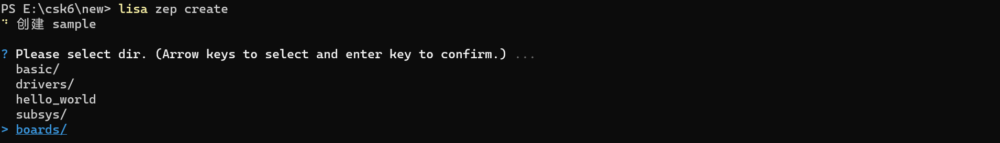

# WIFI连接

## 概述
CSK6-NanoKit开发板提供了WiFi网络连接的能力，本章节通过示例介绍WiFi网络连接API接口的基本使用方法。

## WiFi API接口
**CSK WiFi 驱动初始化** 

```
int csk_wifi_init(void);
```

参数说明：

| 返回值 | 说明                       |
| ------ | -------------------------- |
| 0      | 初始化成功                 |
| error  | 初始化错误（详见错误状态） |


**注册WiFi回调事件**

```
int csk_wifi_add_callback(csk_wifi_event_cb_t *wifi_event_cb);
```

**参数说明：**

| 参数          | 说明                   |
| ------------- | ---------------------- |
| wifi_event_cb | 应用程序的回调结构指针 |


**注销WiFi回调事件**

```
int csk_wifi_remove_callback(csk_wifi_event_cb_t *wifi_event_cb);
```

**参数说明**

| 参数          | 说明                   |
| ------------- | ---------------------- |
| wifi_event_cb | 应用程序的回调结构指针 |


**扫描附近的AP设备**

```
int csk_wifi_scan_ap(csk_wifi_scan_info_t **ap_info, csk_wifi_result_t *result, k_timeout_t timeout);
```

**参数说明：**

| 参数    | 说明                        |
| ------- | --------------------------- |
| ap_info | 指向 WiFi AP 信息结构的指针 |
| result  | 指向WIFI操作结果的指针      |
| timeout | 扫描超时时间                |


**建立WiFi连接**

```
int csk_wifi_sta_connect(csk_wifi_sta_config_t *sta_config, csk_wifi_result_t *result, k_timeout_t timeout);
```

**参数说明：**

| 参数       | 说明                           |
| ---------- | ------------------------------ |
| sta_config | 指向WIFI Station配置结构的指针 |
| result     | 指向WIFI操作结果的指针         |
| timeout    | 连接超时时间                   |


**断开WiFi连接**

```
int csk_wifi_sta_disconnect(csk_wifi_result_t *result, k_timeout_t timeout);
```

**参数说明：**

| 参数       | 说明                           |
| ---------- | ------------------------------ |
| sta_config | 指向WIFI Station配置结构的指针 |
| result     | 指向WIFI操作结果的指针         |
| timeout    | 连接超时时间                   |


**WiFi API接口状态列表：**

| 状态类型                      | 说明                                                         |
| ----------------------------- | ------------------------------------------------------------ |
| CSK_WIFI_SUCCESS              | WIFI operation successful                                    |
| CSK_WIFI_ERR_STA_FAILED       | Unknown Station exception, will be raised in Station mode. TODO: remove it |
| CSK_WIFI_ERR_AP_FAILED        | Unknown SoftAP exception, will be raised in SoftAP mode. TODO: remove it |
| CSK_WIFI_ERR_AP_NOT_FOUND     | AP ssid not found, will be raised in Station mode            |
| CSK_WIFI_ERR_INVALID_PASSWORD | Invalid WIFI password, will be raised in Station mode        |
| CSK_WIFI_ERR_SCAN_FAILED      | WiFi scan neighboring AP devices failed                      |


更多WiFi API接口请查看CSK6 SDK wifi头文件描述：`drivers\wifi\csk6\include\csk6\csk_wifi.h`。


## 使用示例

### 实现逻辑

本示例实现以下业务逻辑：

- 连接一个AP热点，并获取地址信息，热点配置：`ssid: TP-LINK_LINGSI  pwd: a123456789`。

### 准备工作

本示例基于CSK6-NanoKit开发板实现WiFi连接，并获取WiFi连接信息。
- CSK6-NanoKit开发板
- 手机或路由器设置一个WiFi热点(ssid: TP-LINK_LINGSI  pwd: a123456789)

### 获取sample项目
通过Lisa命令创建项目：
```
lisa zep create
```

按以下目录选择完成adc sample创建：  

> boards → csk6 → network → wifi_sta

sample 创建完成。

### 示例项目组件配置

组件配置文件路径：`sample/prj.conf`

本示例需要打开以下件组件配置:

```
# 打开WiFi驱动配置
CONFIG_WIFI=y
CONFIG_CSK_WIFI_STATION=y
CONFIG_NET_L2_ETHERNET=y

# 打开NET网络配置
CONFIG_NETWORKING=y
CONFIG_NET_DHCPV4=y
CONFIG_NET_IPV4=y
CONFIG_NET_SOCKETS=y
CONFIG_TEST_RANDOM_GENERATOR=y
CONFIG_NET_SOCKETS_POSIX_NAMES=y

# 网络管理配置
CONFIG_NET_MGMT=y
CONFIG_NET_MGMT_EVENT=y
CONFIG_NET_MGMT_EVENT_STACK_SIZE=4096

# 网络线程栈配置
CONFIG_NET_RX_STACK_SIZE=2048
CONFIG_NET_TX_STACK_SIZE=2048
# 网络的内存池配置
CONFIG_NET_PKT_RX_COUNT=16
CONFIG_NET_PKT_TX_COUNT=16
CONFIG_NET_BUF_RX_COUNT=64
CONFIG_NET_BUF_TX_COUNT=64
CONFIG_NET_CONTEXT_NET_PKT_POOL=y

# 引用名为newlib的libc标准库
CONFIG_NEWLIB_LIBC=y

# SYSTEM WORKQUEU线程栈
CONFIG_SYSTEM_WORKQUEUE_STACK_SIZE=2048
# 系统堆，分配内存，可根据实际使用配置
CONFIG_HEAP_MEM_POOL_SIZE=35840
CONFIG_MAIN_STACK_SIZE=4096
CONFIG_INIT_STACKS=y

# 打开LOG配置
CONFIG_LOG=y
CONFIG_WIFI_LOG_LEVEL_DBG=y
```


### 应用实现

#### 主函数实现
```c
void main(void)
{
    /* CSK WiFi 驱动初始化 */
    csk_wifi_init();

    /* 配置WiFi回调事件参数 */
    wifi_event_cb.handler = &wifi_event_handler;
    wifi_event_cb.events = CSK_WIFI_EVT_STA_CONNECTED | CSK_WIFI_EVT_STA_DISCONNECTED;
    wifi_event_cb.arg = NULL;

    /* 注册WiFi回调事件 */
    csk_wifi_add_callback(&wifi_event_cb);

    /* WiFi参数跑配置 */
    csk_wifi_sta_config_t sta_config = {
        .ssid = "listenai",
        .pwd = "a123456789",
        .encryption_mode = CSK_WIFI_AUTH_WPA2_PSK
    };

    int retry_count = 0;
    csk_wifi_result_t wifi_result;
    do {
        printk("connecting to wifi: %s ...\n", sta_config.ssid);
        /* 连接WiFi */
        int ret = csk_wifi_sta_connect(&sta_config, &wifi_result, K_FOREVER);
        if (ret == 0) {
            break;
        } else {
            if (wifi_result == CSK_WIFI_ERR_STA_FAILED) {
                retry_count++;
                printk("retry to connecting wifi ... %d\n", retry_count);
            } else {
                printk("AP not found or invalid password\n");
                return;
            }
        }
    } while (retry_count < 10);

    /* 打印已连接WiFi信息 */
    printk("--------------------------Current AP info-------------------------------\n");
    printk("ssid: %s  pwd: %s  bssid: %s  channel: %d  rssi: %d\n",
        sta_config.ssid, sta_config.pwd, sta_config.bssid, sta_config.channel,
        sta_config.rssi);
    printk("------------------------------------------------------------------------\n");
    /* 初始化并注册 DHCP BOUND 事件，设备获取 ipv4 地址后产生回调 */
    net_mgmt_init_event_callback(&dhcp_cb, handler_cb, NET_EVENT_IPV4_DHCP_BOUND);
    net_mgmt_add_event_callback(&dhcp_cb);
    struct net_if *iface = net_if_get_default();
    if (!iface) {
        printk("wifi interface not available");
        return;
    }
    /* 开启dhcp client */
    net_dhcpv4_start(iface);
}
```

#### WiFi连接的回调
WiFi连接回调，WiFi连接成功或失败都会触发回调：

```c
static void wifi_event_handler(csk_wifi_event_t events, void *event_data, uint32_t data_len, void *arg)
{
    if (events & CSK_WIFI_EVT_STA_CONNECTED) {
        printk("[WiFi sta] connected\n");
    } else if (events & CSK_WIFI_EVT_STA_DISCONNECTED) {
        printk("[WiFi sta] disconnected\n");
    } else {
        abort();
    }
}
```

WiFi回调事件列表：

```c
typedef enum {
    CSK_WIFI_EVT_STA_CONNECTED =        BIT(0),     /* WIFI-Station connected event bit */
    CSK_WIFI_EVT_STA_DISCONNECTED =     BIT(1),     /* WIFI-Station disconnected event bit */
    CSK_WIFI_EVT_AP_STARTED =           BIT(2),     /* WIFI-SoftAP stared event bit */
    CSK_WIFI_EVT_AP_STOPPED =           BIT(3),     /* WIFI-SoftAP stopped event bit */
    CSK_WIFI_EVT_AP_STACONNECTED =      BIT(4),     /* WIFI-SoftAP station connected event bit */
    CSK_WIFI_EVT_AP_STADISCONNECTED =   BIT(5),     /* WIFI-SoftAP station disconnected event bit */
    CSK_WIFI_EVT_SCAN_DONE =            BIT(6),     /* WIFI-SoftAP scan done event bit */
} csk_wifi_event_t;
```


### 编译和烧录
#### 编译

在app根目录下通过以下指令完成编译：
```
lisa zep build -b csk6002_9s_nano
```
#### 烧录

CSK6-NanoKit通过USB连接PC，通过烧录指令开始烧录：
```
lisa zep flash --runner pyocd
```
#### 查看结果 

**查看日志：**

CSK6-NanoKit通过板载DAPlink虚拟串口连接电脑，或者将CSK6-NanoKit的日志串口`A03 TX A02 RX`外接串口板并连接电脑。
- 通过lisa提供的`lisa term`命令查看日志
- 或者在电脑端使用串口调试助手查看日志，默认波特率为115200。

```
*** Booting Zephyr OS build 1ecc9604fbc0  ***
wifi test
xradio_generate_random_mac_addr, 11, generate random mac addr
mac_addr: '44:29:04:e9:84:69'
[xr_taskqueue_start_thread , 132]+-+0x8ae68 :umac,8192
[00:00:00.006,000] <dbg> csk_wifi.wifi_obj_set_sm: (91)STA_SM: current[WIFI_SM_ON_STARTUP], next[WIFI_SM_ON_STARTUP]

wlan information ===================================================
firmware:
    version : R0-XR_C07.08.52.65_02.65 Mar  5 2021 11:45:46 
    buffer  : 30
driver:
    version : XR_V02.05_20220524v1
mac address:
    in use        : 44:29:04:e9:84:69
    in use        : 44:29:04:e9:84:6a
====================================================================

wlan_sta_set_autoconnect enable :0 
connecting to wifi: TP-LINK_LINGSI ...
[00:00:00.902,000] <dbg> csk_wifi.wlan_event_handler: Got wlan event [WLAN_EVENT_FW_STARTUP_DONE], current state[WIFI_SM_ON_STARTUP]
[00:00:00.902,000] <dbg> csk_wifi.wifi_obj_set_sm: (91)STA_SM: current[WIFI_SM_ON_STARTUP], next[WIFI_SM_STARTUP_DONE]
[00:00:00.902,000] <inf> csk_wifi: WiFi module startup done
[00:00:00.941,000] <dbg> csk_wifi.wifi_obj_set_sm: (91)STA_SM: current[WIFI_SM_STARTUP_DONE], next[WIFI_SM_STA_ON_CONNECT_SCAN]
EVENT NOTIFY WLAN_EVENT_SCAN_SUCCESS
sta: Trying to associate with 0a:dd:a8:7f:59:60 (SSID='TP-LINK_LINGSI' freq=2462 MHz)
sta: Associated with 0a:dd:a8:7f:59:60
sta: WPA: Key negotiation completed with 0a:dd:a8:7f:59:60 [PTK=CCMP GTK=CCMP]
sta: CTRL-EVENT-CONNECTED - Connection to 0a:dd:a8:7f:59:60 completed [id=0 id_str=]
[WiFi sta] connected
--------------------------Current AP info-------------------------------
ssid: TP-LINK_LINGSI  pwd: a123456789  bssid: 0a:dd:a8:7f:59:60  channel: 11  rssi: -57
------------------------------------------------------------------------
[00:00:05.001,000] <dbg> csk_wifi.wlan_event_handler: Got wlan event [WLAN_EVENT_SCAN_SUCCESS], current state[WIFI_SM_STA_ON_CONNECT_SCAN]
[00:00:05.001,000] <inf> csk_wifi: STA_SM[WIFI_SM_STA_ON_CONNECT_SCAN]: scan success
[00:00:05.001,000] <dbg> csk_wifi.wifi_obj_set_sm: (91)STA_SM: current[WIFI_SM_STA_ON_CONNECT_SCAN], next[WIFI_SM_STA_ON_CONNECT]
[00:00:05.228,000] <dbg> csk_wifi.wlan_event_handler: Got wlan event [WLAN_EVENT_CONNECTED], current state[WIFI_SM_STA_ON_CONNECT]
[00:00:05.228,000] <inf> csk_wifi: STA_SM[WIFI_SM_STA_ON_CONNECT]: connected
[00:00:05.228,000] <dbg> csk_wifi.wifi_obj_set_sm: (91)STA_SM: current[WIFI_SM_STA_ON_CONNECT], next[WIFI_SM_STA_CONNECTED]
Your address: 192.168.43.71
Lease time: 3599 seconds
Subnet: 255.255.255.0
Router: 192.168.43.1

```

如日志所示，CSK6-NanoKit成功连接热点(`ssid: listenai  pwd: a123456789`)并获取IP地址。

