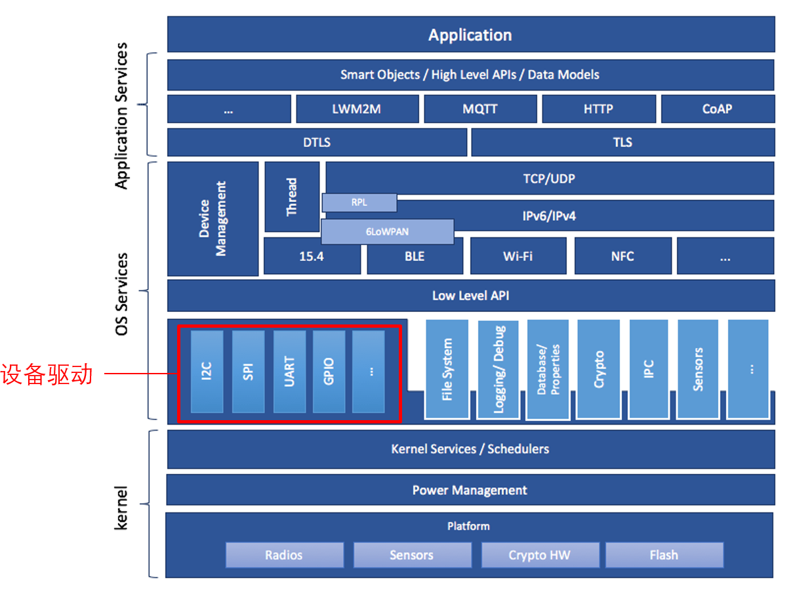

# 外设驱动的使用

## 概述

本节主要介绍在CSK6 SDK中的外设驱动使用方法。通过本章节，你将了解：

- 在系统架构中外设驱动的位置

- 外设驱动模型的介绍

- 上手使用一个外设驱动的方法

## 外设驱动及sample章节目录：
* 章节一:[GPIO](./samples/gpio)
* 章节二:[PWM](./samples/pwm)
* 章节三:[UART](./samples/uart)
* 章节四:[I2C](./samples/i2c)
* 章节五:[SPI](./samples/spi)
* 章节六:[ADC](./samples/adc)
* 章节七:[RTC](./samples/rtc)
* 章节八:[WatchDog](./samples/watchdog)

## Zephyr OS 中的外设驱动

CSK6 SDK使用 Zephyr 作为RTOS，下图为 Zephyr OS 的系统架构图：



通过上图我们可以了解到，在 Zephyr OS 的系统架构中，有底层往上层可分为 **Kernel、OS服务、应用服务** 三层，它们各有分工，对应的功能大致如下：

| 分层 | 功能说明 |
| ---- | ---- |
| Kernel | 提供Kernel service <br/> 任务调度 <br/> 电源管理 <br/> 平台相关的特殊驱动(eg:加密硬件，Flash…) |
| OS服务 | **设备驱动** <br/> 设备管理 <br/> 网络实现与接口、网络层和传输层协议栈 |
| 应用服务 | 网络应用协议及高层级接口 <br/> 标准化的数据模型 <br/> 提供智能物件对象 |

其中，嵌入式应用开发中经常使用的**设备驱动**位于OS服务层，设备驱动模块为用户提供了统一的底层驱动接口。CSK6 SDK同样在这个模块中对CSK6芯片的各类外设进行了驱动适配，开发者可以通过调用外设驱动提供的接口轻松使用CSK6芯片的丰富外设，如GPIO、UART、SPI、I2C等。

## 使用外设驱动

### 外设驱动的API
在SDK Zephyr目录下的 **include/driver** 目录中，我们可看到经常使用的设备外设的头文件，这些是常见外设驱动的公共API头文件，通过这些头文件，我们可以快速了解到不同外设单元具备哪些API接口能力。

以熟悉的GPIO为例，在 `gpio.h` 文件中，我们可以看到gpio驱动提供的API接口：
```c
// 配置指定GPIO引脚
__syscall int gpio_pin_configure(const struct device *port,gpio_pin_t pin,gpio_flags_t flags);
// 设置指定GPIO引脚状态
static inline int gpio_pin_set(const struct device *port, gpio_pin_t pin,int value);
// ……
```
后续在应用开发中，当我们需要对芯片GPIO进行控制时，也将使用到这里的API接口。

:::tip
我们也可以通过访问[Zephyr OS的API文档](https://zephyr-docs.listenai.com/reference/peripherals/gpio.html) ，了解外设驱动支持的API接口
:::

### 驱动的实现
在SDK Zephyr目录下的 **driver** 目录中，存放着各类驱动模块的实现，在此目录的gpio文件中，我们也可以发现有一个名为`gpio_csk6.c`的文件，该文件便是CSK6芯片对于GPIO外设驱动模块的实现。

一般在开发过程中，我们只需根据具体业务需要调用外设驱动提供的API接口即可，无需关注其具体实现。

### 外设驱动的使用
当我们在业务开发过程中想要使用某个外设驱动时，一般可采用以下步骤对指定外设驱动进行调用：
- Step 1：在业务代码文件中增加对应外设驱动的头文件
```c
 #include <drivers/xxx.h>
```

- Step 2: 创建一个设备类型，并对设备进行绑定
```c
const struct device *dev;
dev = device_get_binding(xxx);
```

- Step 3：在业务代码中调用该外设驱动提供的API接口，对指定外设进行配置与控制
```c
xxx_configure(dev, xxx, xxx);
xxx_set(dev, xxx, xxx);
```

:::note
通过本节内容，我们大致了解了驱动外设在CSK6 SDK中使用方式，在接下来的章节里我们将提供更多常用的外设驱动使用示例讲解，来帮助大家进一步掌握常用外设驱动的使用。
:::


