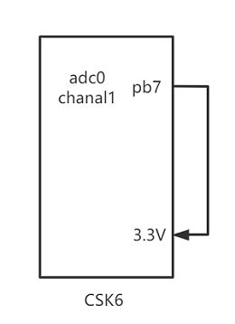

# SAR ADC

## 概述
ADC(Analog to Digital) 模拟转数字是经常使用的外设，本章节将通过两个示例讲解如何使用CSK6 SDK的ADC接口实现外部电压的检测。

CSK6 ADC驱动具有如下特性： 
- 12-bit精度, 最多3个外部通道输入，2个内部通道。
- 24MHz ADC时钟源，采样率最高1MHz。
- 使用内部3.3V参考电压。

## 使用示例

### 常用 API 接口

<br/>

配置采样通道

```c
int adc_channel_setup(const struct device *dev, const struct adc_channel_cfg *channel_cfg);
```

采样通道配置，成功返回0，失败返回非0。

**参数说明**

| 字段        | 说明                 |
| ----------- | -------------------- |
| dev         | 指向ADC Device的指针 |
| channel_cfg | 采样通道配置         |

<br/>

获取内部参考电压

```c
uint16_t adc_ref_internal(const struct device *dev);
```

获取内部参考电压，返回与ADC_REF_INTERNAL相对应的电压，以毫伏(mV)为单位。

返回大于0的正值则是参考电压值，返回0表示参考电压信息不可用。

**参数说明**

| 字段 | 说明                 |
| ---- | -------------------- |
| dev  | 指向ADC Device的指针 |

<br/>

获取采样值

```c
int adc_read(const struct device *dev, const struct adc_sequence *sequence);
```

获取采样值，如果从用户模式调用，回调的sequence.options都必须是NULL。

adc_read的函数返回值见下述说明。

**参数说明**

| 字段     | 说明                     |
| -------- | ------------------------ |
| dev      | 指向ADC Device的指针     |
| sequence | 指定请求的采样序列的结构 |

<br/>

**返回值说明**

| 返回值   | 说明                                                 |
| -------- | :--------------------------------------------------- |
| 0        | 成功                                                 |
| -EINVAL  | 传入的参数有误                                       |
| -ENOMEM  | 用于采样的buf定义太小，无法保存所有请求的采样结果    |
| -ENOTSUP | 请求的操作模式不支持                                 |
| -EBUSY   | 在前一个采样仍在进行时触发了另一个采样，则返回-EBUSY |

<br/>

采样值转电压(mV)

```c
int adc_raw_to_millivolts(int32_t ref_mv, enum adc_gain gain, uint8_t resolution, int32_t *valp);
```

将原始ADC采样值转换为以毫伏（mV）为单位的电压，返回0表示成功，非0表示失败。

**参数说明**

| 字段       | 说明                                                         |
| ---------- | ------------------------------------------------------------ |
| ref_mv     | 测量的参考电压，单位为毫伏，该值可能是从adc_ref_internal()函数调用获取，或者从外部获取的参考电压值。 |
| gain       | 用于采样输入的ADC增益配置                                    |
| resolution | 样本绝对值中的位数，对于差分采样，该值必须小于adc_sequence结构体里面的resolution值 |
| valp       | 输入时指向原始采样值的指针，成功转换后指向相应的毫伏值。如果转换失败，则存储值保持不变。 |

更多ADC driver APIs接口可以在zephyr官网[ADC driver APIs](https://docs.zephyrproject.org/latest/doxygen/html/group__adc__interface.html)中看到。

<br/>


## 使用示例
### 准备工作
本示例基于 `csk6011a_nano`开发板的`adc0 ch1(gpiob_7)`引脚实现外部电压检测，在运行示例前需要做如下准备：
- 准备一个`csk6011a_nano`开发板，并将`adc0 ch1(gpiob_7)`引脚接稳压电源(或者把`gpiob_7`接到开发板的3.3V电源脚)。如下图示：  


### 获取sample项目
通过Lisa命令创建项目：
```
lisa zep create
```

依次按以下目录选择完成adc sample的创建：  
> boards → csk6 → driver → adc


### 设备树配置
在`csk6011a_nano`开发板上使用到了`adc0 ch1(gpiob_7)`，因此需要在sample中完成设备树配置，通过重写`board overlay`的方式完成ADC引脚和通道的配置。
`app/board/csk6011a_nano.overlay`详细配置：
```c
/*给pinctrl_adc0_ch1_default配置对应的gpio pin脚*/
&csk6011a_nano_pinctrl{
                pinctrl_adc0_ch0_default: adc0_ch0_default{

                };
                /* 将gpiob7复用为adc0功能*/
                pinctrl_adc0_ch1_default: adc0_ch1_default{
					pinctrls = <&pinmuxb 7 16>;
                };

                pinctrl_adc0_ch2_default: adc0_ch2_default{
                };

};

/* zephyr,user 节点的 io-channels 属性中指定的 ADC 通道*/
/ {
    zephyr,user {
        io-channels = <&adc0 1>, <&adc0 5>, <&adc0 6>;
    };
};

/* adc0设备树配置，使用pinctrl_adc0_ch1_default的pin脚配置*/
&adc0 {
		pinctrl-0 = <&pinctrl_adc0_ch1_default>; 
        pinctrl-names = "default";
        status = "okay";
};
```
### 组件配置
在prj.conf文件中打开uart功能配置:
```shell
# adc配置
CONFIG_ADC=y 
CONFIG_LOG=y
CONFIG_LOG_MODE_MINIMAL=y
```

### 应用逻辑实现
**adc初始化：**

```c
/*获取设备树中io_channels配置的通道数量*/
#define ADC_NUM_CHANNELS    DT_PROP_LEN(DT_PATH(zephyr_user), io_channels)

/*获取ADC设备树node id*/
#define ADC_NODE		DT_PHANDLE(DT_PATH(zephyr_user), io_channels)

/*采样精度设置*/
#define ADC_RESOLUTION	11 
/*采样增益设置*/
#define ADC_GAIN		ADC_GAIN_1
/*参考电压配置(内部3.3V)*/
#define ADC_REFERENCE		ADC_REF_INTERNAL

/* 解析设备树io_channels配置获取通道信息<&adc0 1>, <&adc0 5>, <&adc0 6>*/
static uint8_t channel_ids[ADC_NUM_CHANNELS] = {
    DT_IO_CHANNELS_INPUT_BY_IDX(DT_PATH(zephyr_user), 0),
	DT_IO_CHANNELS_INPUT_BY_IDX(DT_PATH(zephyr_user), 1),
	DT_IO_CHANNELS_INPUT_BY_IDX(DT_PATH(zephyr_user), 2)
};
```

**主函数实现：**

```c
void main(void)
{
    /*获取adc设备实例*/
    const struct device *dev_adc = DEVICE_DT_GET(ADC_NODE);
    ...

    /*设置使用到的每个adc通道*/
    for (uint8_t i = 0; i < ADC_NUM_CHANNELS; i++) {
        channel_cfg.channel_id = channel_ids[i];
        adc_channel_setup(dev_adc, &channel_cfg);
        sequence.channels |= BIT(channel_ids[i]);
    }

    /*获取参考电压(内部)*/
    int32_t adc_vref = adc_ref_internal(dev_adc);
    printk("adc_vref %d.\n", adc_vref);

    while (1) {
        /*获取adc采样值*/
        err = adc_read(dev_adc, &sequence);

        for (uint8_t i = 0; i < ADC_NUM_CHANNELS; i++) {
            int32_t raw_value = sample_buffer[i];

            if (adc_vref > 0) {
                int32_t mv_value = raw_value - 2048;
                /*将获取的采样值转换为电压值(mV)*/
                adc_raw_to_millivolts(adc_vref, ADC_GAIN_1,
                    ADC_RESOLUTION, &mv_value);
                /*打印原始采样值和转换后电压值*/
                printk(" adc(%d)= %d mV  ", raw_value, mv_value);
            }
        }
    }
}
```
代码处理中在原始采样值和转换电压值前将原始采样值减2048：
```c
mv_value = raw_value - 2048;
```

**这样处理的原因：**    

通常被采集电压为0V ~ 3.3V，为匹配运算，在采样值转电压值前减2048采样值，并将采样精度设置为11bit，通过`adc_raw_to_millivolts`接口转换后的电压值(mV)范围及为0V ~ 3.3V。


| 参考电压 | 待采样电压值范围 | 采样精度 | 采样值 |0V对应的采样值 |
| --------------| -------------- | -------- | -------------| -------------|
| 3.3V | -3.3V~3.3V | 12it | 0~4096 | 2048 |
| 3.3V | 0V~3.3V | 11bit | 0~2048 | 0 |


### 编译和烧录
#### 编译  

在app根目录下通过以下指令完成编译：
```
lisa zep build -b csk6011a_nano
```
#### 烧录     

`csk6011a_nano`开发板通过USB连接PC，通过烧录指令完成烧录：
```
lisa zep flash --runner pyocd
```
#### 查看结果 

CSK6-NanoKit通过板载DAPlink虚拟串口连接电脑，或者将CSK6-NanoKit的日志串口`A03 TX A02 RX`外接串口板并连接电脑。
- 通过lisa提供的`lisa term`命令查看日志
- 或者在电脑端使用串口调试助手查看日志，默认波特率为115200。

```
*** Booting Zephyr OS build 1ce26fc41a1d  ***
ADC Sample start
adc_vref 3300.
 adc(4095)= 3298 mV   adc(2429)= 613 mV   adc(3304)= 2023 mV  
 adc(4095)= 3298 mV   adc(2429)= 613 mV   adc(3330)= 2065 mV  
 adc(4095)= 3298 mV   adc(2429)= 613 mV   adc(3343)= 2086 mV  
 adc(4095)= 3298 mV   adc(2429)= 613 mV   adc(3347)= 2093 mV  
 adc(4095)= 3298 mV   adc(2429)= 613 mV   adc(3344)= 2088 mV  
 adc(4095)= 3298 mV   adc(2428)= 612 mV   adc(3346)= 2091 mV  
 adc(4095)= 3298 mV   adc(2429)= 613 mV   adc(3349)= 2096 mV
```
 - 参考电压： 
 通过日志可以看到 adc内部参考电压为：`adc_vref 3300`。
 - adc0 ch1:  
 `adc0 ch1(gpiob_7)`原始采样值为`4095`，转换后电压值为：`3298 mV`，和参考电压基本一致。
 - adc0 ch5: 
`adc0 ch5`为内部adc通道，电压值应为`1/8VCC(VCC=5.0V)`，实际采样值为`2429`，转换后电压值为：`613 mV`，与预期结果基本一致。
 - adc0 ch6:  
`adc0 ch6`在本sample中未使用，故忽略输出结果。

:::note
更多关于ADC的详细信息可以在芯片规格书对应章节中查阅。
:::