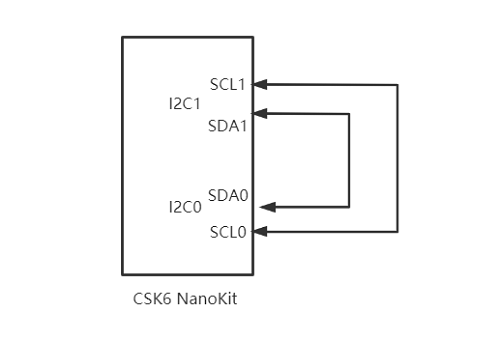
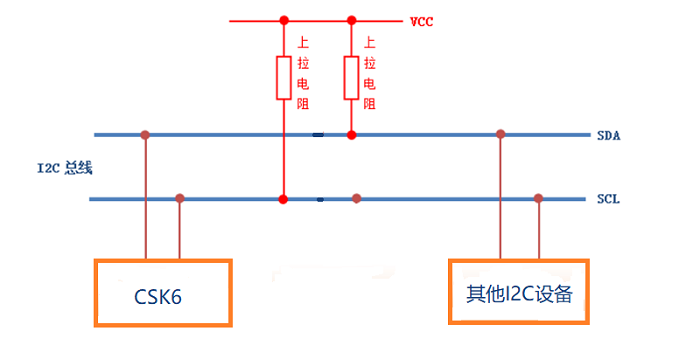
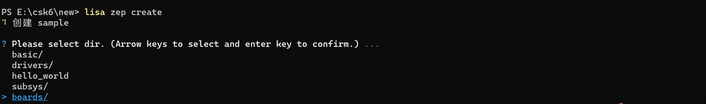
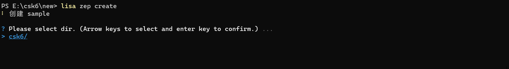
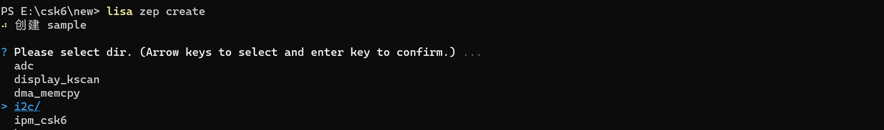
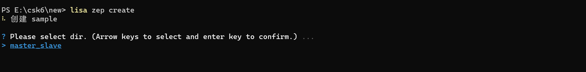

# I2C

## 概述
I2C是我们常用的外设功能之一，CSK6 SDK I2C外设驱动采用标准的I2C总线协议，本节我们将通过示例讲解如何使用CSK6 SDK的I2C API接口实现数据的收发，更多关于I2C API描述可以在zephyr官网[I2C Interface](https://docs.zephyrproject.org/latest/doxygen/html/group__i2c__interface.html)中看到。

CSK6 芯片有两个I2C 硬件外设。
CSK6 I2C驱动功能特性如下：
- 支持主设备或从设备。
- 支持三种可选传输速度模式 Standard-mode (100 kb/s)、Fast-mode (400 kb/s) 和Fast-mode plus (1 Mb/s)。
- 支持DMA传送。
- 支持主发、主收、从发、从收模式。
- 支持多主机模式。
- 支持地址参数为 7-bit和10-bit。
- 支持general call模式。
- 支持时钟延展。


## 准备工作
本示例基于 `csk6002_9s_nano`开发板实现，使用了两组I2C作为主从设备进行数据的通讯，其中
- `i2c0(GPIO_A_04, GPIO_A_05)`作为主设备(master)
- `i2c1(GPIO_A_06, GPIO_A_07)`作为从设备(slave)
使用杜邦线将`i2c0(GPIO_A_04, GPIO_A_05)`和`i2c1(GPIO_A_06, GPIO_A_07)`通连接，如下图示：


:::tip
通常I2C通讯SCL和SDA之间都需要接上拉电阻(大小由速度和容性负载决定一般在3.3K-10K之间)以保证数据的稳定性，减少干扰，如下图示:
:::


## 创建项目
通过Lisa命令创建项目：
```
lisa zep create
```






## 代码实现
### I2C设备树配置
`csk6002_9s_nano`开发板提供了多组I2C。本示例使用`i2c0(GPIO_A_04, GPIO_A_05)`和`i2c1(GPIO_A_06, GPIO_A_07)`两组GPIO口，因此需要在设备树中将这两组GPIO复用为I2C引脚功能，可通过`boad overlay`的方式完成I2C引脚的配置。
- 在app目录下增加`csk6002_9s_nano.overlay`文件并添加如下配置：
```c
/*
 * SPDX-License-Identifier: Apache-2.0
 *
 * Copyright (c) 2022 Listenai
 */

&csk6002_9s_nano_pinctrl{
                /* 将GPIOA_4配置为i2c0 scl*/
                pinctrl_i2c0_scl_default: i2c0_scl_default{
                /* 将pa4 设置function为8 复用I2C引脚功能 */
                    pinctrls = <&pinmuxa 4 8>;
                };
                /* 将GPIOA_5 i2c0 sda*/
                pinctrl_i2c0_sda_default: i2c0_sda_default{
                     /* 将pa5 设置function为8 复用I2C引脚功能 */
                    pinctrls = <&pinmuxa 5 8>;
                };
                pinctrl_i2c1_scl_default: i2c1_scl_default{
                    pinctrls = <&pinmuxa 7 9>;
                };
                pinctrl_i2c1_sda_default: i2c1_sda_default{
                    pinctrls = <&pinmuxa 6 9>;
                };

};

&i2c1 {
        status = "okay";
        pinctrl-0 = <&pinctrl_i2c1_scl_default &pinctrl_i2c1_sda_default>; 
        pinctrl-names = "default";
};

&i2c0 {
        status = "okay";
        pinctrl-0 = <&pinctrl_i2c0_scl_default &pinctrl_i2c0_sda_default>; 
        pinctrl-names = "default";
};
```
:::note
如果您对想了解更多关于设备树的信息，请查看[设备树](../../device_tree.md)章节。
:::
### 应用逻辑实现分析
本实例中主要实现了以下数据收发：
- master一次向slave发送256个字节数据，slave接收256字节数据并通过串口打印输出
- slave一次向master发送256个字节数据，master接收256字节数据并通过串口打印输出
- master每隔10S发送一次256个字节数据并以此循环，slave接收数据并打印输出

本示例中主要用到3个I2C API接口：
```c
/*i2c控制器配置*/
i2c_configure()
/*i2c写数据*/
i2c_write()
/*i2c读数据*/
i2c_read()
```
**I2C初始化：**
```c
/*定义一个I2C设备名称，并通过设备树接口获取I2C的设备树信息*/
#define I2C0_DEV_NAME DT_LABEL(DT_ALIAS(i2c_0)) 

/* 从机地址：csk6默认的从机地址为:0x35*/
#define SLAVE_ADDRESS (0x35) 

/* 设置I2C的时钟速率和主从模式*/
uint32_t i2c0_cfg = I2C_SPEED_SET(I2C_SPEED_STANDARD) | I2C_MODE_MASTER;
uint32_t i2c1_cfg = 0;

/*定义I2C设备实例*/
const struct device *i2c0_dev = NULL;
const struct device *i2c1_dev = NULL;

/*定义用于I2C主从设备数据收发的数组，长度为256个字节*/
uint8_t data0[256] = { 0 };
uint8_t data1[256] = { 0 };

void main(void)
{
    /*配置I2C设备*/
    i2c_configure(i2c0_dev, i2c0_cfg);
    i2c_configure(i2c1_dev, i2c1_cfg);

    /*创建一个线程，用于处理从设备的数据收发*/
    k_thread_create(&slave_thread_data, slave_stack_area,
                    K_THREAD_STACK_SIZEOF(slave_stack_area),
                    i2c_slave_thread, NULL, NULL, NULL, pri, 0, K_NO_WAIT);
    /*创建一个线程，用于处理主设备的数据收发*/
    k_thread_create(&master_thread_data, master_stack_area,
                    K_THREAD_STACK_SIZEOF(master_stack_area), i2c_master_thread, NULL,
                    NULL, NULL, pri, 0, K_NO_WAIT);
}
```
**master和slave数据收发实现**
i2c_master_thread实现：
```c
void i2c_master_thread(void *v1, void *v2, void *v3)
{
    /* data0填充数据 */
    for (int i = 0; i < sizeof(data0) - 1; i++) {
        data0[i] = i;
    }

    /* 1. master发送数据，slave接收 */
    i2c_write(i2c0_dev, data0, sizeof(data0) - 1, SLAVE_ADDRESS);//master写数据
    ...
    /* 2. master接收数据 */
    i2c_read(i2c0_dev, data0, sizeof(data0), SLAVE_ADDRESS);
    ...
    /* 3. master间隔10S循环发送数据 */
    while (1) {
        k_msleep(10000);
        i2c_write(i2c0_dev, data0, sizeof(data0) - 1, SLAVE_ADDRESS);  
    }
}
```
i2c_slave_thread实现：
```c
void i2c_slave_thread(void *v1, void *v2, void *v3)
{
    /* master发送数据，slave接收 */
    i2c_read(i2c1_dev, data1, sizeof(data1), 0);

    /* 通过串口打印数据 */
    for (int i = 0; i < sizeof(data1); i++) {
        printk("data1[%d]: %d\n", i, data1[i]);
    }
    ...
    /* 清空数据并重新填装 */
    memset(data1, sizeof(data1), 0);
    for (int i = 0; i < sizeof(data1); i++) {
        data1[i] = 256 - i;
    }
    ...
    /* 2.slave发送数据，master接收 */
    i2c_write(i2c1_dev, data1, sizeof(data1) - 1, 0);
    ...
    /* 3. slave循环等待数据 */
    while (1) {
        memset(data1, sizeof(data1), 0);
        i2c_read(i2c1_dev, data1, sizeof(data1), 0);
    }
}
```
## 编译和烧录
- **编译**

在app根目录下通过一下指令完成编译：
```
lisa zep build -b csk6002_9s_nano
```
- **烧录**   

`csk6002_9s_nano`通过USB连接PC，通过烧录指令开始烧录：
```
lisa zep flash --runner pyocd
```
- **查看结果**  

可通过lisa提供的`lisa term`命令查看日志：
```
lisa term
```
或者将`csk6002_9s_nano`的日志串口`A03 TX A02 RX`接串口板连接电脑，在电脑端使用串口调试助手查看日志，波特率为115200。

**slave接收到master发送的数据结果应为：**
```
data1[0]: 0
data1[1]: 1
data1[2]: 2
data1[3]: 3
...
data1[252]: 252
data1[253]: 253
data1[254]: 254
data1[255]: 0
```
**master接收到slave发送的数据结果应为：**
```
slave send data
data0[0]: 0
data0[1]: 255
data0[2]: 254
data0[3]: 253
...
data0[252]: 4
data0[253]: 3
data0[254]: 2
data0[255]: 1
```