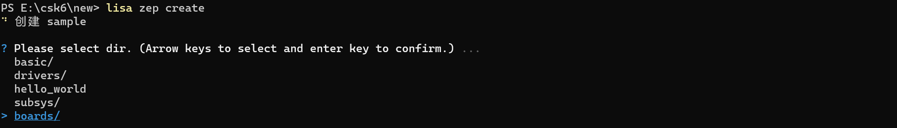

# RTC

## 概述
RTC(Real Time Clock)实时时钟是应用开发中常用的外设，本章节提供一个基于counter计数器API接口实现闹钟功能的示例来介绍RTC的使用。

CSK6 RTC驱动具有如下特性：
- 时钟源（时钟分频器前）频率为32.768KHz。
- 可以设置秒、分和小时的定时中断。

### 常用 API 接口

**获取最大的定时时间**

```c
uint32_t counter_get_top_value(const struct device *dev);
```

获取最大的定时时间，在csk6上返回的top value为:4296508s(1193h) 。

**参数说明**

| 字段 | 说明     |
| ---- | -------- |
| dev  | 设备指针 |

<br/>

**在空闲的运行模式下启动计数器**

```c
int counter_start(const struct device *dev);
```

启动计数器，返回0表示成功，失败返回非0。

**参数说明**

| 字段 | 说明     |
| ---- | -------- |
| dev  | 设备指针 |

<br/>

**停止计数器**

```c
int counter_stop(const struct device *dev);
```

停止计数器，返回0表示成功，失败返回非0。

**参数说明**

| 字段 | 说明     |
| ---- | -------- |
| dev  | 设备指针 |

<br/>

**获取当前计数器值**

```c
int counter_get_value(const struct device *dev, uint32_t *ticks);
```

获取当前计数器值，返回0表示成功，失败返回非0。

**参数说明**

| 字段  | 说明                           |
| ----- | ------------------------------ |
| dev   | 设备指针                       |
| ticks | 指向当前计数器值存储位置的指针 |

<br/>

**设置闹钟**

```c
int counter_set_channel_alarm(const struct device *dev,
                              uint8_t chan_id,
                              const struct counter_alarm_cfg *alarm_cfg);
```

设置闹钟，当前CSK6仅支持channel id 为0，在闹钟到期之后，不需要禁用即可再次设置。在闹钟到期且调用回调函数的过程中，对应的通道被视为可用，可以在其他地方被使用。返回0表示成功，失败返回非0，具体返回值见下图所示。

**参数说明**

| 字段      | 说明     |
| --------- | -------- |
| dev       | 设备指针 |
| chan_id   | 通道 id  |
| alarm_cfg | 闹钟配置 |

**返回值说明**

| 返回值   | 说明                                       |
| -------- | ------------------------------------------ |
| 0        | 成功                                       |
| -ENOTSUP | 请求无效（设备不支持中断或请求通道id失败） |
| -EINVAL  | 闹钟配置无效                               |
| -ETIME   | 闹钟的值设置太迟                           |

更多计数器API接口可以在zephyr官网[counter interface APIs](https://docs.zephyrproject.org/latest/doxygen/html/group__counter__interface.html)中看到。

<br/>

## 使用示例
### 准备工作  
本示例基于 `csk6011a_nano`开发板来实现，需要做如下准备：
- 准备一个`csk6011a_nano`开发板
- 通过串口连接PC端查看日志

### 获取sample项目
通过Lisa命令创建项目：
```
lisa zep create
```


依次按以下目录选择完成adc sample创建：  
> boards → csk6 → driver → rtc

### 组件配置
在prj.conf文件中打开rtc功能配置:
```shell
CONFIG_STDOUT_CONSOLE=y
CONFIG_PRINTK=y

#计时器
CONFIG_COUNTER=y

#CSK6计时器
CONFIG_COUNTER_CSK6=y
```

### 示例逻辑

基于CSK6驱动提供的RTC时钟，调用counter计数器接口设置一个2秒的闹钟，闹钟时间到时触发中断回调，并在回调中做响应的处理。


### 应用逻辑实现
**创建线程**

```c
int pri = k_thread_priority_get(k_current_get());
k_thread_create(&rtc_thread_data, rtc_stack_area,
                K_THREAD_STACK_SIZEOF(rtc_stack_area),
                rtc_thread, NULL, NULL, NULL, pri, 0, K_NO_WAIT);
```

**设置一个2秒的闹钟：**

```c
/*设置中断回调处理*/
static void sec_counter_callback(const struct device *dev,
				 uint8_t id,
				 uint32_t ticks,
				 void *ud)
{
	printk("Counter alarm callback at %u ms, id %d, ticks %u, ud %p\n",
	       k_uptime_get_32(), id, ticks, ud);
}

/*闹钟业务逻辑实现*/
void rtc_thread(void *v1, void *v2, void *v3){

    /* 获取RTC设备实例 */
    const struct device *rtc = NULL;
    rtc = DEVICE_DT_GET(DT_NODELABEL(rtc1));
    ...
    uint32_t now;
    uint32_t delay_time = 2;/*单位/S*/
    struct counter_alarm_cfg alarm_cfg;
    alarm_cfg.flags = 0;
    alarm_cfg.callback = sec_counter_callback;
    /* 在闹钟开始前获取当前计数器值 */
    counter_get_value(rtc, &now);
    alarm_cfg.ticks = now + delay_time;  /* 闹钟时间设置为2s，从当前计数器值开始 */
    alarm_cfg.user_data = &alarm_cfg;

    /* 在闹钟开始前当前计数器值 */
    counter_get_value(rtc, &now);
    printk("get RTC ticks value befor alarm start: %ds\n", ticks);

    /* 设置闹钟，当前CSK6仅支持channel id 为0 */	
    counter_set_channel_alarm(rtc, 0, &alarm_cfg);

    /* 在闹钟结束后获取当前计数器值 */
    k_msleep(3000);
    counter_get_value(rtc, &ticks);
    printk("RTC value: %ds\n", ticks);
}
```
### 编译和烧录
#### 编译 

在app根目录下通过以下指令完成编译：
```
lisa zep build -b csk6011a_nano
```
#### 烧录   

`csk6011a_nano`开发板通过USB连接PC，通过烧录指令完成烧录：
```
lisa zep flash
```
#### 查看结果

CSK6-NanoKit通过板载DAPLink虚拟串口连接电脑，或者将CSK6-NanoKit的日志串口`A03 TX A02 RX`外接串口板并连接电脑。
- 在电脑端使用串口调试助手查看日志，默认波特率为115200。


```
*** Booting Zephyr OS build fd83997719ed  ***
RTC name: RTC_1
RTC top value is 4296508s
======RTC device alarm start======
get current counter value: 0s
Counter alarm callback at 2385 ms, id 0, ticks 2, ud 0x81820
get counter value after alarm end: 2s
======RTC device alarm end======

```
 从日志可以看到，闹钟在2秒后触发了中断，符合示例实现的预期，以上就是本章节所提供的RTC使用示例。