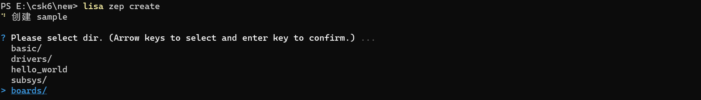
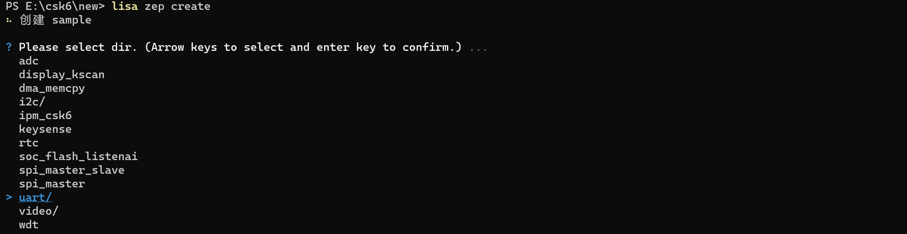
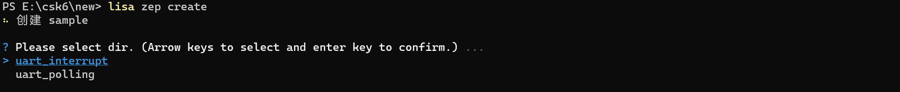

# I2C

## 概述
UART是我们最常用的外设功能之一，本章节将通过两个示例讲解如何使用CSK6 SDK的UART API接口实现数据的收发：
- uart_polling 轮寻方式获取串口数据。
- uart_interrupt 中断回调的方式获取串口数据。

CSK6 芯片有4组UART硬件外设(其中1组作为debug)。
CSK6 UART驱动功能特性如下：
- 支持 RTS/CTS 流控。
- 支持DMA传送(参数可配置)。

## 准备工作
本示例基于 `csk6002_9s_nano`开发板实现，使用了`uart0(GPIO_A_03, GPIO_A_06)`这组串口，在准备开发之前需要做如下准备：
- 使用杜邦线将开发板上的uart0的TX、RX、GND和串口转接板接入PC。


- PC端打开串口调试助手，波特率设置为115200，数据位8，无校验位，停止位1，接收和发送数据格式都设置为HEX，如下图示：


## 创建项目
通过Lisa命令创建项目：
```
lisa zep create
```




## 代码实现
### I2C设备树配置
`csk6002_9s_nano`开发板提供了多组UART。本示例使用`uart0(GPIO_A_03, GPIO_A_06)`，因此需要在设备树中将这组GPIO复用为UART0引脚功能，可通过`boad overlay`的方式完成，具体实现如下：
- 在app目录下的`csk6002_9s_nano.overlay`文件并添加如下串口配置：
```
&csk6002_9s_nano_pinctrl{
    pinctrl_uart0_rx_default: uart0_rx_default{
        pinctrls = <&pinmuxa 6 2>;              //rx pin
    };
    
    pinctrl_uart0_tx_default: uart0_tx_default{
        pinctrls = <&pinmuxa 3 2>;              //tx pin
    };
};
```
### 组件配置
在prj.conf文件中打开uart功能配置:
```
CONFIG_LOG=y
CONFIG_UART_INTERRUPT_DRIVEN=y
CONFIG_UART_CSK6=y
```
### 应用逻辑实现分析
上文提到有两种数据接收的实现方式，下面我们来详细介绍中断回调和轮询接收这两种数据接收方式：  
- 通过轮训的方式读取上位机发送给CSK6的数据，每次读一个char类型数据，并将接收到的数据发送给上位机。
- 通过中断回调的方式读取上位机发送给CSK6的数据，并将接收到的数据发送给上位机。

#### 轮询方式接收数据（uart polling）
**API 接口**
轮询获取数据的方式中主要用到以下UART API接口，`uart_poll_in`每次接收一个char，循环接收直到所有数据都接收完成。更多Polling UART API接口描述可以在zephyr官网[Polling UART API](https://docs.zephyrproject.org/latest/doxygen/html/group__uart__polling.html)。
```C
/*从上位机接收一个char*/
uart_poll_in()
/*给上位机发送一个char*/
uart_poll_out()
```

**轮询获取数据**
```C
/*通过uart设备树label获取nodeid*/
#define UART0 DT_NODELABEL(uart0)

void main(void)
{
	/* 获取uart设备实例 */
	const struct device *uart = DEVICE_DT_GET(UART0);

	while(1){
		if(uart_poll_in(uart, &rx_char) == 0)	/*从上位机接收一个char*/
			uart_poll_out(uart, rx_char);		/*给上位机发送一个char*/
	}
	return;
}
```
#### 中断回调方式接收数据 （uart interrupt）
**API 接口**
本示例中主要用到一下几个Interrupt UART API接口，更多API接口描述可以在zephyr官网[Interrupt-driven UART API](https://docs.zephyrproject.org/latest/doxygen/html/group__uart__interrupt.html)中看到。
```C
/*中断回调处理*/
uart_rx_callback(const struct device *dev, void *user_data)
/*中断回调设置*/
void uart_irq_callback_user_data_set(const struct device *dev,
						   uart_irq_callback_user_data_t cb,
						   void *user_data)
/*进入中断处理调用*/
int uart_irq_update(const struct device * dev)
/*查询是否有中断挂起*/
int uart_irq_is_pending(const struct device * dev)
/*检查 UART RX 缓冲区是否有接收到字符*/
int uart_irq_rx_ready(const struct device * dev)
/*读取字符串*/
int uart_fifo_read(const struct device *dev, uint8_t *rx_data,
				 const int size)
/*发送字符串*/
int uart_fifo_fill(const struct device *dev,
				 const uint8_t *tx_data,
				 int size)
```
**串口初始化**
```C
/*通过uart设备树label获取nodeid*/
#define UART0 DT_NODELABEL(uart0)

void main(void)
{
	/* 获取uart设备实例 */
    const struct device *uart = DEVICE_DT_GET(UART0);

	/* 设置中断回调函数 */
	uart_irq_callback_user_data_set(uart, uart_rx_callback, NULL);

	/* 使能RX中断处理 */
	uart_irq_rx_enable(uart);
}
```
**中断回调处理：**
```C
static void uart_rx_callback(const struct device *dev, void *user_data){
    /*进入中断处理调用*/
    uart_irq_update(dev);
    /*查询是否有中断挂起*/					
    while (uart_irq_is_pending(dev)) {
        /*检查 UART RX 缓冲区是否有接收到字符*/
        if (uart_irq_rx_ready(dev)) {
            int recv_len;
            /*读取上位机发送字符串*/
            recv_len = uart_fifo_read(dev, rx_buffer, 1);
            /*把读到的字符串重新发送给上位机*/
            uart_fifo_fill(dev, rx_buffer, recv_len);
        }
    }
}
```

## 编译和烧录
- **编译**
在app根目录下通过一下指令完成编译：
```
lisa zep build -b csk6002_9s_nano
```
- **烧录**   

`csk6002_9s_nano`通过USB连接PC，通过烧录指令开始烧录：
```
lisa zep flash --runner pyocd
```
- **查看结果**  

上位机给CSK6发送一串指令：`FF 01 02 03 04 05 06 07 08 09 0A FF`，CSK6接收指令并给上位机回传，如下图示：
