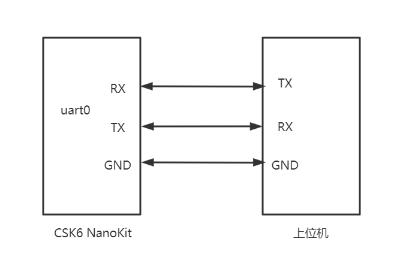

# UART

## 概述
UART是最常用的外设功能之一，csk6 sdk中串口数据通信方式有两种：轮询(polling)和中断(interrupt)，本章节将通过示例介绍 串口 API接口和使用方法。

CSK6 提供了3组UART外设（UART0、UART1、UART2)，  UART驱动具有如下特性：

- 支持 RTS/CTS 流控。
- 支持DMA传送(参数可配置)。

## 示例一：UART轮询方式接收数据（polling）

### 常用 API 接口

**串口接收数据**

```c
int uart_poll_in(const struct device *dev, unsigned char *p_char)
```

从设备中读取一个字符作为输入，这个接口检查接收方是否存在有效数据。当接收方存在有效数据时，该接口从设备中读取一个字符，存储到 p_char 指向的地址，并将调用线程返回0，否则返回 -1，该接口是一个非阻塞调用。

**参数说明**

| 字段   | 说明          |
| ------ | ------------- |
| dev    | UART 设备实例 |
| p_char | 字符指针      |

<br/>

**串口发送数据**

```c
void uart_poll_out(const struct device *dev, unsigned char out_char)
```

写一个字符到设备输出，这个接口会检查发射的transmitter是否已经填满数据，当transmitter未满时，该接口会向数据寄存器写入一个字符。否则，该接口将等待并阻塞调用它的线程，是一个阻塞调用。

**参数说明**

| 字段     | 说明           |
| -------- | -------------- |
| dev      | UART 设备实例  |
| out_char | 等待发送的字符 |

<br/>

更多 UART Polling API接口描述请查阅zephyr官网[Polling UART API](https://docs.zephyrproject.org/latest/doxygen/html/group__uart__polling.html)。


### 使用示例

#### 准备工作
本示例基于 `csk6011a_nano`开发板实现，使用了`uart0(GPIO_A_03, GPIO_A_06)`这组串口，在开发之前需要做如下准备工作：
- 将开发板上的uart0通过串口转接板接入PC端。



- PC端打开串口调试助手，波特率设置为115200，数据位8，无校验位，停止位1，接收和发送数据格式都设置为HEX，如下图示：


#### 获取sample项目
通过Lisa命令创建项目：
```
lisa zep create
```


依次按以下目录选择完成uart sample创建：  
> boards → csk6 → driver→ uart → uart_polling

#### 组件配置

组件配置文件路径：`sample/prj.conf`。

本示例需要打开以下件组件配置:

```shell
# 日志配置
CONFIG_LOG=y
# 串口配置
CONFIG_UART_INTERRUPT_DRIVEN=y
CONFIG_UART_CSK6=y
```

#### 设备树配置

`csk6011a_nano`开发板提供了多组UART。本示例使用`uart0(GPIO_A_03, GPIO_A_02)`，因此需要在设备树中将这组GPIO复用为UART0引脚功能，可通过`board overlay`的方式完成，具体实现如下：

- 在sample/boards目录下的`csk6011a_nano.overlay`文件并添加如下串口配置：
```c
&pinctrl{
    pinctrl_uart0_rx_default: uart0_rx_default{
        pinctrls = <UART0_RXD_GPIOA_02>;              //rx pin
    };
    
    pinctrl_uart0_tx_default: uart0_tx_default{
        pinctrls = <UART0_TXD_GPIOA_03>;              //tx pin
    };
};
```
### 应用实现逻辑
通过轮询的方式读取上位机发送给CSK6的数据，每次读一个char类型数据，并将接收到的数据发送给上位机。

### 应用实现
```c
/*
 * Copyright (c) 2012-2014 Wind River Systems, Inc.
 *
 * SPDX-License-Identifier: Apache-2.0
 */
#include <kernel.h>
#include <zephyr.h>
#include <sys/printk.h>
#include <string.h>
#include <devicetree.h>
#include <logging/log.h>
#include <drivers/uart.h>

LOG_MODULE_REGISTER(sample, LOG_LEVEL_INF);
/*通过uart设备树label获取nodeid*/
#define UART0		DT_NODELABEL(uart0)

void main(void)
{
	char rx_char;
    /* 获取uart设备实例 */
	const struct device *uart = DEVICE_DT_GET(UART0);
	if(!device_is_ready(uart)){
		LOG_ERR("device:%s is not ready!", uart->name);
		return;
	}
	while(1){
        /*从上位机接收一个char*/
		if(uart_poll_in(uart, &rx_char) == 0){
            /*给上位机发送一个char*/ 
            uart_poll_out(uart, rx_char);	            
        }	
			
	}
	return;
}
```
#### **编译和烧录**

#### 编译
在app根目录下通过以下指令完成编译：
```
lisa zep build -b csk6011a_nano
```
#### 烧录

`csk6011a_nano`开发板通过USB连接PC，通过烧录指令开始烧录：
```
lisa zep flash --runner pyocd
```
#### 查看结果

上位机给CSK6发送一串指令：`FF 01 02 03 04 05 06 07 08 09 0A FF`，CSK6接收指令并给上位机回传，如下图示：


## 示例二：UART中断方式接收数据（interrupt）

### **常用 API 接口**

**设置 IRQ(中断) 回调函数指针**

```c
void uart_irq_callback_user_data_set(const struct device *dev,
						   uart_irq_callback_user_data_t cb,
						   void *user_data)
```

**参数说明**

| 字段      | 说明                   |
| --------- | ---------------------- |
| dev       | UART 设备实例          |
| cb        | 指向回调函数的指针     |
| user_data | 要传递给回调函数的数据 |

<br/>

**在 ISR(中断服务) 中开始处理中断**

```c
int uart_irq_update(const struct device * dev)
```

**参数说明**

| 字段 | 说明          |
| ---- | ------------- |
| dev  | UART 设备实例 |

<br/>

**检查是否有 IRQ(中断) 挂起。**

```c
int uart_irq_is_pending(const struct device * dev)
```

**参数说明**

| 字段 | 说明          |
| ---- | ------------- |
| dev  | UART 设备实例 |

<br/>

**检查 UART RX 缓冲区是否有接收到字符**

```c
int uart_irq_rx_ready(const struct device * dev)
```

**参数说明**

| 字段 | 说明          |
| ---- | ------------- |
| dev  | UART 设备实例 |

<br/>

**从 FIFO 读取数据**

```c
int uart_fifo_read(const struct device *dev, uint8_t *rx_data,
				 const int size)
```

**参数说明**

| 字段    | 说明          |
| ------- | ------------- |
| dev     | UART 设备实例 |
| rx_data | 数据容器      |
| size    | 数据容器大小  |

<br/>

**用数据填充 FIFO**

```c
int uart_fifo_fill(const struct device *dev,
				 const uint8_t *tx_data,
				 int size)
```

**参数说明**

| 字段    | 说明             |
| ------- | ---------------- |
| dev     | UART 设备实例    |
| tx_data | 要发送的数据     |
| size    | 要发送的数据长度 |

<br/>

更多 UART Polling API接口描述请查阅zephyr官网[Interrupt-driven UART API](https://docs.zephyrproject.org/latest/doxygen/html/group__uart__interrupt.html)。


### 使用示例

#### 准备工作

本示例基于 `csk6011a_nano`开发板实现，使用了`uart0(GPIO_A_03, GPIO_A_02)`这组串口，在开发之前需要做如下准备工作：

- 使用杜邦线将开发板上的uart0的TX、RX、GND和串口转接板接入PC。


- PC端打开串口调试助手，波特率设置为115200，数据位8，无校验位，停止位1，接收和发送数据格式都设置为HEX，如下图示：


#### 获取sample项目

通过Lisa命令创建项目：

```
lisa zep create
```


依次按以下目录选择完成uart sample创建：  

> boards → csk6 → driver→ uart → uart_interrupt

#### 组件配置

组件配置文件路径：`sample/prj.conf`。

本示例需要打开以下件组件配置:

```shell
# 日志配置
CONFIG_LOG=y
# 串口配置
CONFIG_UART_INTERRUPT_DRIVEN=y
CONFIG_UART_CSK6=y
```

#### 设备树配置

`csk6011a_nano`开发板提供了多组UART。本示例使用`uart1(GPIO_A_04, GPIO_A_05)`，因此需要在设备树中将这组GPIO复用为UART0引脚功能，可通过`board overlay`的方式完成，具体实现如下：

- 在sample/boards目录下的`csk6011a_nano.overlay`文件并添加如下串口配置：

```c
/* 串口1 波特率、引脚等配置 */
&uart1 {
    pinctrl-0 = <&pinctrl_uart1_rx_default &pinctrl_uart1_tx_default>; 
    pinctrl-names = "default";
    current-speed = <115200>;
    status = "okay";
};

/* 串口 引脚配置 */
&pinctrl{
    pinctrl_uart0_rx_default: uart0_rx_default{
        pinctrls = <UART0_RXD_GPIOA_02>;              //rx pin
    };
    
    pinctrl_uart0_tx_default: uart0_tx_default{
        pinctrls = <UART0_TXD_GPIOA_03>;              //tx pin
    };

    pinctrl_uart1_rx_default: uart1_rx_default{
        pinctrls = <UART0_TXD_GPIOA_05>;              //rx pin
    };
    
    pinctrl_uart1_tx_default: uart1_tx_default{
        pinctrls = <UART0_RXD_GPIOA_04>;              //tx pin
    };
};
```

### 应用实现逻辑

通过中断回调的方式读取上位机发送给CSK6的数据，并将接收到的数据发送给上位机

### 应用实现

**串口初始化**

```c
#include <kernel.h>
#include <zephyr.h>
#include <sys/printk.h>
#include <string.h>
#include <devicetree.h>
#include <logging/log.h>
#include <drivers/uart.h>
LOG_MODULE_REGISTER(sample, LOG_LEVEL_INF);
#define UART0		DT_NODELABEL(uart0)
uint8_t rx_buffer[100];

/* 中断回调处理 */
static void uart_rx_callback(const struct device *dev, void *user_data){
	/* 进入中断处理调用 */
    uart_irq_update(dev);	
    /*查询是否有中断挂起*/	
	while (uart_irq_is_pending(dev)) {
        /*检查 UART RX 缓冲区是否有接收到字符*/
		if (uart_irq_rx_ready(dev)) {
			int recv_len;
             /*读取上位机发送字符串*/
			recv_len = uart_fifo_read(dev, rx_buffer, 1);
            /*把读到的字符串重新发送给上位机*/
			uart_fifo_fill(dev, rx_buffer, recv_len);
		}
	}
}


void main(void)
{
    /* 获取uart设备实例 */
	const struct device *uart = DEVICE_DT_GET(UART0);
	if(!device_is_ready(uart)){
		LOG_ERR("device:%s is not ready!", uart->name);
		return;
	}

	LOG_INF("devices %s is ready", uart->name);

	/* 设置中断回调函数 */
	uart_irq_callback_user_data_set(uart, uart_rx_callback, NULL);

	/* 使能RX中断处理 */
	uart_irq_rx_enable(uart);

	while(1){
		k_msleep(20);
	}
	return;
}

```

#### **编译和烧录**

#### 编译

在app根目录下通过以下指令完成编译：

```
lisa zep build -b csk6011a_nano
```

#### 烧录

`csk6011a_nano`开发板通过USB连接PC，通过烧录指令开始烧录：

```
lisa zep flash --runner pyocd
```

#### 查看结果

上位机给CSK6发送一串指令：`FF 01 02 03 04 05 06 07 08 09 0A FF`，CSK6接收指令并给上位机回传，如下图示：
