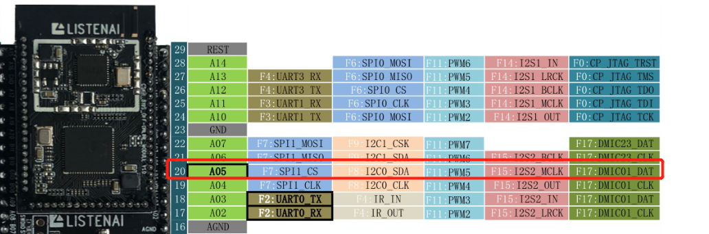
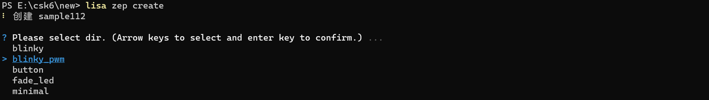
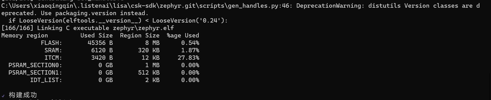

# Blinky pwm

## 概述
Blinky pwm是一个简单的应用程序，通过pwm控制LED灯的闪烁频率，`CSK6 SDK`提供了基础的实现示例，本章节教你如何基于`csk6002_9s_nano`开发板实现pwm控制LED灯的闪烁。
Blinky pwm sample中通过pwm控制LED灯以1hz的频率闪烁，每4秒频率翻倍直到64hz，此后每4秒频率减半，直到恢复到1hz完成一个闪烁周期，以先快后慢的闪烁方式循环。
部分PWM硬件无法实现1hz的频率控制，这个sample在启动时会对硬件进行校准，适当减小最大PWM周期，直到找到匹配硬件的值。

## 准备工作
首先，实现Blinky_pwm示例的预期效果需要硬件开发板上必须有一个GPIO(带pwm输出功能)连接了一个LED灯，在`csk6002_9s_nano`开发板上是有这个设计的，通过查看开发板底板原理图，你可以看到LED对应的电路设计如下图所示，我们可以看到LED1(Green)对应的控制引脚为:GPIOA_05，GPIOA_05可复用为pwm输出功能。



## 创建项目
`CSK6 SDK`提供了Blinky_pwm的sample，你可以通过一下指令创建一个Blinky_pwm项目：
```
lisa zep create
```



Blinky pwm sample创建成功。

## 实现过程
### 组件配置
在prj.conf文件中添加项目基础组件配置配置:
```
CONFIG_STDOUT_CONSOLE=y
CONFIG_PRINTK=y
CONFIG_LOG=y
CONFIG_LOG_PRINTK=y
CONFIG_LOG_MODE_IMMEDIATE=y
CONFIG_PWM_LOG_LEVEL_DBG=y
...
CONFIG_PWM=y
```
### 设备树配置
- 首先，我们需要在当前boad设备树中添加`pwm`的配置，即在`csk6002_9s_nano.dts`中实现`pwmleds`的配置，详细配置如下:
```
 {
        model = "csk6002 9s nano";
        compatible = "csk,csk6002_9s_nano";
    aliases {
            ...
            pwm-led0 = &green_pwm_led;
            ...
    };
    ...
    pwmleds {
		compatible = "pwm-leds";
		green_pwm_led: green_pwm_led {
			pwms = <&pwm5 5 PWM_POLARITY_NORMAL>;
			label = "User BOARD_LED_2 - PWM0";
		};
    ...
};
```
**NOTE**:在`csk6002_9s_nano.dts`设备树配置中已经默认添加了`pwmleds`的配置，所以你无需再增加，当你在适配一个新的板子创建新的boad时，需要确保`pwmleds`的配置是存在的。

- 其次，在sample代码中获取设备树pwm_led0配置，并通过pwm输出配置实现LED闪烁频率控制
```
#define PWM_LED0_NODE	DT_ALIAS(pwm_led0)
#if DT_NODE_HAS_STATUS(PWM_LED0_NODE, okay)
#define PWM_CTLR	DT_PWMS_CTLR(PWM_LED0_NODE)
#define PWM_CHANNEL	DT_PWMS_CHANNEL(PWM_LED0_NODE)
#define PWM_FLAGS	DT_PWMS_FLAGS(PWM_LED0_NODE)
...

```
### pwm输出配置及逻辑控制 
- 获取`pwm_led0`设备实例
```
const struct device *pwm;
pwm = DEVICE_DT_GET(PWM_CTLR);
```
对硬件进行校准，适当减小最大PWM周期，到找匹配硬件的值:
```
/*
    * In case the default MAX_PERIOD_USEC value cannot be set for
    * some PWM hardware, decrease its value until it can.
    *
    * Keep its value at least MIN_PERIOD_USEC * 4 to make sure
    * the sample changes frequency at least once.
    */
printk("Calibrating for channel %d...\n", PWM_CHANNEL);
max_period = MAX_PERIOD_USEC;
while (pwm_pin_set_usec(pwm, PWM_CHANNEL,
            max_period, max_period / 2U, PWM_FLAGS)) {
    max_period /= 2U;
    if (max_period < (4U * MIN_PERIOD_USEC)) {
        printk("Error: PWM device "
                "does not support a period at least %u\n",
                4U * MIN_PERIOD_USEC);
        return;
    }
}
```
- pwm输出配置实现LED闪烁频率控制：
```
period = max_period;
	while (0) {
		ret = pwm_pin_set_usec(pwm, PWM_CHANNEL,
				       period, period / 2U, PWM_FLAGS);
        ...
		period = dir ? (period * 2U) : (period / 2U);
		if (period > max_period) {
			period = max_period / 2U;
			dir = 0U;
		} else if (period < MIN_PERIOD_USEC) {
			period = MIN_PERIOD_USEC * 2U;
			dir = 1U;
		}

		k_sleep(K_SECONDS(4U));
	}
```

## 编译和烧录
- **编译**
在sample根目录下通过一下指令完成编译：
```
lisa zep build -b csk6002_9s_nano
```
编译成功：

- **烧录**
`csk6002_9s_nano`通过USB连接PC，通过烧录指令开始烧录：
```
lisa zep flash --runner pyocd
```
烧录成功：

- **效果**
预期的效果应如下视频所示，开发板上的LED灯(绿)以先快后慢的方式循环闪烁，如果在你的卡发板上实现了这个效果，那么恭喜，你顺利的完成了LED的控制，在CSK6的开发上又迈出了一步！

<video src="https://iflyos-external.oss-cn-shanghai.aliyuncs.com/public/lsopen/zephyr/%E6%96%87%E6%A1%A3%E8%A7%86%E9%A2%91%E4%BB%93/blinky_pwm.mp4" controls="controls" width="500" height="300">您的浏览器不支持播放该视频！</video>