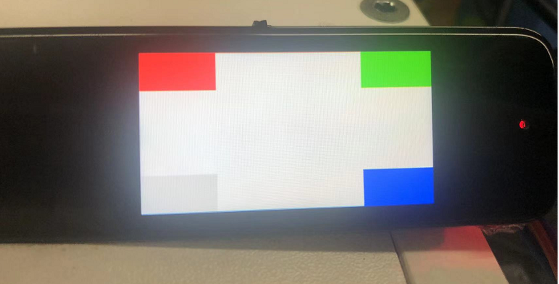

# DisplayKscan

## 概述
本节将主要通过显示&触控综合Sample来介绍基于CSK6 SDK的显示屏和触控屏的基本使用。通过本章节学习，您将了解到：

- Zephyr中显示设备驱动、触屏设备驱动等相关知识。
- 驱动ST7789V SPI屏幕进行内容显示。
- 使用I2C接口，获取BL6XXX 触控屏用户输入状态。

## 准备工作
本示例基于 `csk6002_9s_nano`开发板实现，需要准备ST7789V显示屏和BL6XXX触控屏、SPI转接板，SPI转接板通过杜邦线和`csk6002_9s_nano`开发板完成接线。

:::note
本章节提供的sample与LVGL sample示例是两种不同的实现方式，LVGL自带了丰富的GUI控件可以供开发者直接使用，而本章节提供sample通过屏幕驱动接口完成内容的写入。
SPI转接板和`csk6002_9s_nano`开发板具体连接方式请与FAE确认。后续NanoKit开发板将提供用于本示例的配件板，敬请期待。
:::

## 创建项目
通过Lisa命令创建项目：
```
lisa zep create
```


依次按以下目录选择完成display_kscan sample创建：  
> boards → csk6 → driver → display_kscan

## 编译和烧录
- **编译** 

在app根目录下通过一下指令完成编译：
```
lisa zep build -b csk6002_9s_nano
```
- **烧录**   

`csk6002_9s_nano`开发板通过USB连接PC，通过烧录指令开始烧录：
```
lisa zep flash --runner pyocd
```
- **查看结果**  

烧录完成后，可观察到设备显示屏出现【白色背景+三静态方块+一动态方块】的图像，如图：


打开调试串口，可观察到当用手触摸屏幕时，屏幕会实时输出触摸点的坐标与状态，日志信息如下：

```shell
*** Booting Zephyr OS build fd53c115d07a  ***
[00:00:00.027,000] 0m<inf
> csk6_spi: CS control inhibited (no GPIO device)
[00:00:00.153,000] 0m<inf> sample: Display sample for ST7789V
row = 61 col = 149, pressed:FLASE
row = 61 col = 149, pressed:TRUE
row = 61 col = 149, pressed:TRUE
row = 297 col = 145, pressed:FLASE
row = 297 col = 145, pressed:TRUE
row = 297 col = 145, pressed:TRUE
row = 297 col = 145, pressed:FLASE
row = 279 col = 15, pressed:FLASE
row = 279 col = 15, pressed:TRUE
row = 279 col = 15, pressed:TRUE
```

## 代码实现分析
### 显示屏显示实现
csk6 sdk 驱动模型中定义了可供上层应用调用的关键接口，如 读/写framebuffer 、开/关屏幕 、获取屏幕设备信息 、 设置亮度/对比度/像素格式/方向等。
在csk6 sdk的`\drivers\display`目录中可看到sdk已完成了屏显设备驱动的适配，其中包含本示例中使用的`ST7789V (display_st7789v.c/.h)`，只需要在示例中完成驱动的配置即可使用改显示屏。

更详细的显示驱动API接口可以在zephyr官网[Display Interface](https://docs.zephyrproject.org/latest/doxygen/html/group__display__interface.html)中找到。

**显示屏设备树配置**  
本示例显示屏使用到了`csk6002_9s_nano`开发板的SPI0接口，具体为：`spi0_sclk(pa15)、spi0_mosi(pa10)、spi0_miso(pa17)、 spi0_cs(pa12)`，触摸屏使用到了i2c0接口，具体为：`i2c0_scl(pb2)、i2c0_sda(pb3)`，此外还有uart等接口的使用，因此需要在 `boad overlay`中完成外设接口的配置，具体实现如下：
- 在app目录下的`csk6002_9s_nano.overlay`文件并添加如下串口配置：
```c
&csk6002_9s_nano_pinctrl{
            /* 日志串口配置 */
            pinctrl_uart0_rx_default: uart0_rx_default{
                    pinctrls = <&pinmuxb 10 2>;
            };
            
            pinctrl_uart0_tx_default: uart0_tx_default{
                    pinctrls = <&pinmuxb 11 2>;
            };
   
            /* 显示屏SPI接口配置 */
            pinctrl_spi0_sclk_default: spi0_sclk_default {
                    pinctrls = < &pinmuxa 15 6 >;
            };
            pinctrl_spi0_mosi_default: spi0_mosi_default {
                    pinctrls = < &pinmuxa 10 6 >;
            };
            pinctrl_spi0_miso_default: spi0_miso_default {
                    pinctrls = < &pinmuxa 17 6 >;
            };
            pinctrl_spi0_cs_default: spi0_cs_default {
                    pinctrls = < &pinmuxa 12 6 >;
            }; 
};
```
**显示屏组件配置**    
在prj.conf文件中打开显示屏功能配置:
```shell
CONFIG_HEAP_MEM_POOL_SIZE=16384
CONFIG_LOG=y

CONFIG_GPIO=y
# 显示功能配置
CONFIG_DISPLAY=y
# spi功能配置
CONFIG_SPI=y
# ST7789V显示屏驱动配置
CONFIG_ST7789V=y

```
**显示屏显示逻辑**  
在display_kscan这个例程中，主程序对显示屏进行了初始化，并依次展示简单图形的绘制和图形的动态灰度调整功能，其主要流程如下(暂不包含触摸屏KSCAN相关)：


如上，此例程调用了display驱动模型中若干核心的显示接口进行内容显示，开发者可根据自己需要，绘制自己的UI页面。

**颜色块填充** 
```c
    (void)memset(buf, 0xFFu, buf_size);

    buf_desc.buf_size = buf_size;
    buf_desc.pitch = capabilities.x_resolution;
    buf_desc.width = capabilities.x_resolution;
    buf_desc.height = h_step;

    /*整屏填充白色背景*/
    for (int idx = 0; idx < capabilities.y_resolution; idx += h_step) {
        display_write(display_dev, 0, idx, &buf_desc, buf);
    }

    /*左上角填充红色块*/
    fill_buffer_fnc(TOP_LEFT, 0, buf, buf_size);
    x = 0;
    y = 0;
    display_write(display_dev, x, y, &buf_desc, buf);

    /*右上角填充绿色块*/
    fill_buffer_fnc(TOP_RIGHT, 0, buf, buf_size);
    x = capabilities.x_resolution - rect_w;
    y = 0;
    display_write(display_dev, x, y, &buf_desc, buf);

    /*右下角填充蓝色块*/
    fill_buffer_fnc(BOTTOM_RIGHT, 0, buf, buf_size);
    x = capabilities.x_resolution - rect_w;
    y = capabilities.y_resolution - rect_h;
    display_write(display_dev, x, y, &buf_desc, buf);

    display_blanking_off(display_dev);

    grey_count = 0;
    x = 0;
    y = capabilities.y_resolution - rect_h;

    /*左下角灰色动态色块*/
    while (1) {
        fill_buffer_fnc(BOTTOM_LEFT, grey_count, buf, buf_size);
        display_write(display_dev, x, y, &buf_desc, buf);
        ++grey_count;
        k_msleep(grey_scale_sleep);
    }
```

### 触摸屏功能实现 
Zephyr具备kscan（keyboard scan matrix）驱动模型，其驱动程序用于检测矩阵键盘或带有按钮的设备中的按键。由于kscan驱动模型并不定义键值，而是通过按键的行列坐标来标识按键，而用户触碰触摸屏本质上也是生成一个行列坐标，因此kscan驱动模型也适用于触摸屏。

与display驱动类似，kscan驱动模型位于SDK的 `\include\drivers\kscan.h` 文件，kscan驱动模型中定义了一组很简洁的接口和回调，如下：
```c
// 注册一个callback，当按键发生时通过callback通知应用。
int kscan_config(struct device *dev,kscan_callback_t callback);

// 应用注册callback后，通过该API使能callback，使能后有按键发生才会调用callback
int kscan_enable_callback(struct device *dev);

// 禁止callback，当按键发生时不调用callback，相当于是禁止键盘使用
int kscan_disable_callback(struct device *dev);
```
当按键(触屏操作)发生时，驱动会调用注册的callback来通知应用有按键发生，callback的形式如下：  
```c
typedef void (*kscan_callback_t)(struct device *dev, u32_t row, u32_t column, bool pressed);

// row：触摸点所在行
// column：触摸点所在列
// pressed：true=触摸按下, false=触摸松开
```
与其他设备驱动一样，针对不同的触摸屏设备(触摸IC)，需要根据其硬件特性实现kscan设备模型驱动中定义的三个内部函数，并通过kscan_driver_api注册即可完成驱动，我们的SDK已经适配了我们使用的触摸IC——BL6XXX(kscan_bl6xxx.c)，此处不再赘述。

**触摸屏设备树配置**  
```shell
    /* 触摸屏I2C接口配置 */
    pinctrl_i2c0_scl_default: i2c0_scl_default{
            pinctrls = <&pinmuxb 2 8>;
    };
    
    pinctrl_i2c0_sda_default: i2c0_sda_default{
            pinctrls = <&pinmuxb 3 8>;
    }; 
```
**组件配置**  
在prj.conf文件中打开触摸屏功能配置:
```shell
# 触摸配置
CONFIG_KSCAN=y
# I2C功能配置
CONFIG_I2C=y
# 触摸屏屏驱动配置
CONFIG_KSCAN_BL6XXX=y
```
**触控代码实现**    
Kscan使用比较简单，在固件代码中配置好后，注册callback函数，在enable callback直接之后，就可以了坐等callback接受触屏按键了，在display_kscan这个例程中，关键的操作与注释如下：
```c
// 创建、绑定一个KSCAN设备，DISPLAY_KSAN_DEV_NAME通过DTS关联至BL6XXX
const struct device *kscan_dev = device_get_binding(DISPLAY_KSAN_DEV_NAME);

// 注册回调，在k_callback中可看到对应的坐标与状态printk输出操作
kscan_config(kscan_dev, k_callback);

// 使能回调
kscan_enable_callback(kscan_dev);
```
如上，仅需增加回调配置，即可在一个应用中注册触摸屏回调，开发者可根据实际业务需要，处理callback中的设备数据。

:::tip
csk6 skd支持LVGL组件进行GUI界面的开发，可以让界面开发更方便快捷，详见[LVGL](../../modules/lvgl.md)章节。
:::