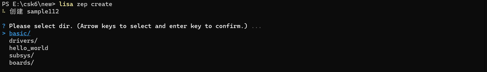
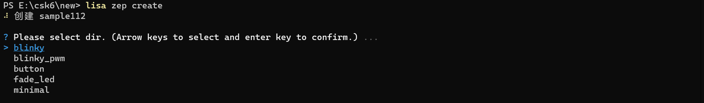
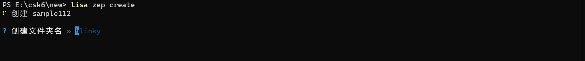
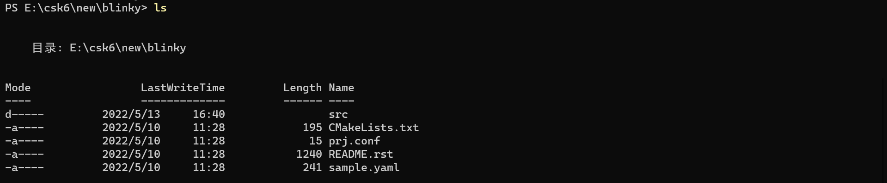
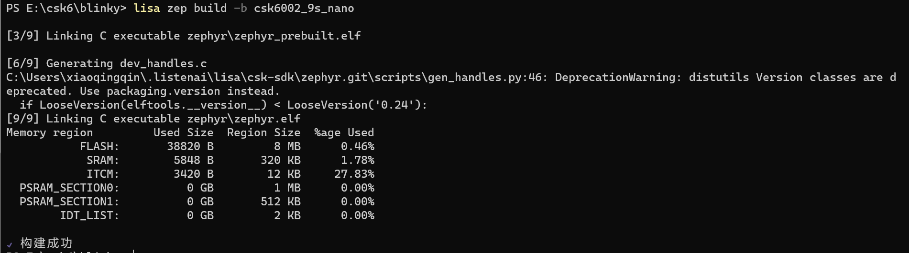
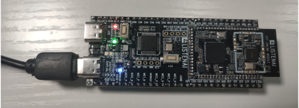
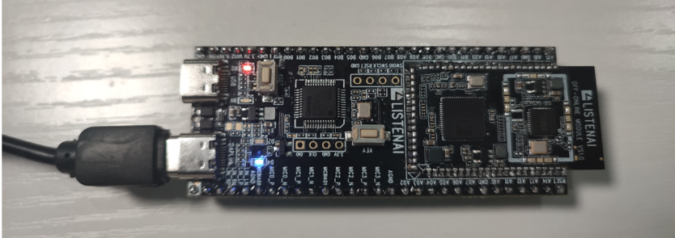

# GPIO

## 概述
GPIO的使用使我们最常用的外设操作之一，本章节将通过一个简单的应用程序Blinky，实现GPIO控制LED灯的亮灭，`CSK6 SDK`提供了基础的实现示例，本章节教你如何基于`csk6002_9s_nano`开发板实现LED灯的闪烁。

## 准备工作
实现Blinky示例的预期效果需要硬件开发板上必须有一个GPIO连接了一个LED灯，在`csk6002_9s_nano`开发板上是有这个设计的，通过查看开发板底板原理图，你可以看到LED对应的电路设计如下图所示，我们可以看到LED1(Green)对应的控制引脚为:GPIOA_05


本文将介绍两种基于`CSK6 SDK`的GPIO控制方式：
- 方式1：通过led0设备树配置完成LED的配置，并在sample中获取led0的配置，完成对LED的控制
- 方式2：绕过设备树对的LED配置，直接操作对应GPIO引脚输出高低电平，完成对LED的控制

## 创建项目
`CSK6 SDK`提供了Blinky的sample，你可以通过一下指令创建一个Blinky项目：
```
lisa zep create
```




Blinky sample创建成功。
## 实现过程
### 组件配置
在prj.conf文件中添加项目基础组件配置配置:
```shell
CONFIG_GPIO=y
```
### 方式1：通过LED0设备树配置完成LED控制
#### 设备树配置
:::note
`csk6002_9s_nano.dts`是我们当前使用开发板的设备树文件，位于SDK目录的 `zephyr/board/arm/csk6002_9s_nano`文件夹中。
:::
- 首先我们需要在当前boad的设备树中添加led0的配置，即在`csk6002_9s_nano.dts`中实现`led0`和`GPIOA_05`的匹配,配置如下:
```c
{
        model = "csk6002 9s nano";
        compatible = "csk,csk6002_9s_nano";
    aliases {
            led0 = &board_led_2;
            ...
    };
    ...
    leds {
            compatible = "gpio-leds";
            board_led_2: board_led_2 {
                    gpios = <&gpioa 5 0>;
                    label = "User BOARD_LED_2";
            };
    };
    ...
};
```
:::note
在`csk6002_9s_nano`这个board中的dts文件中已经默认添加了`led0`的配置，所以我们无需再增加，当你在适配一个新的板子创建新的board时，需要确保led0的配置是存在的。
:::

- 其次，在sample代码中获取设备树led0配置信息
```c
#include <zephyr.h>
#include <device.h>
#include <devicetree.h>
#include <drivers/gpio.h>
...
/* The devicetree node identifier for the "led0" alias. */
#define LED0_NODE DT_ALIAS(led0)

#if DT_NODE_HAS_STATUS(LED0_NODE, okay)
#define LED0	DT_GPIO_LABEL(LED0_NODE, gpios)
#define PIN	DT_GPIO_PIN(LED0_NODE, gpios)
#define FLAGS	DT_GPIO_FLAGS(LED0_NODE, gpios)

```

如果你的board未实现`led0`的配置，那么在编译sample时会遇到如下错误提示：
```
Unsupported board: led0 devicetree alias is not defined
```

#### 获取GPIO设备实例并完成LED控制逻辑
```c
void main(void)
{
...
const struct device *dev;
bool led_is_on = true;

dev = device_get_binding(LED0);

ret = gpio_pin_configure(dev, PIN, GPIO_OUTPUT_ACTIVE | FLAGS);

while (1) {
        gpio_pin_set(dev, PIN, (int)led_is_on);
		led_is_on = !led_is_on;
		k_msleep(SLEEP_TIME_MS);
	}
}
```
### 方式2：直接操作GPIOA_05
基于`Zephyr-CSK-SDK`，我们可以在sample中获取`GPIOA_05`实例，并完成IO电平控制，实现方式如下：

```c
#define PIN 5
#define FLAGS 0

void main(void)
{
	const struct device *dev;
	bool led_is_on = true;

    dev = DEVICE_DT_GET(DT_NODELABEL(gpioa));
    ...
    ret = gpio_pin_configure(dev, PIN, GPIO_OUTPUT_ACTIVE | FLAGS); 
    ...
	while (1) {
        gpio_pin_set(dev, PIN, (int)led_is_on);
		led_is_on = !led_is_on;
		k_msleep(SLEEP_TIME_MS);
	}
}
```

代码实现中使用到了`DEVICE_DT_GET`这个接口获取GPIO实例，如果你对这个接口很陌生，这里给你一些提示，如果你已经很熟悉，那么下面这段说明可以跳过。
`DEVICE_DT_GET`：通过`node_id`获取指向设备对象的指针，我们可以在`zephyr API`中找到对应的描述：
```
DEVICE_DT_GET(node_id)

Obtain a pointer to a device object by node_id.
Return the address of a device object created by DEVICE_DT_INIT(), using the dev_name derived from node_id

Parameters
node_id – The same as node_id provided to DEVICE_DT_DEFINE()

Returns
A pointer to the device object created by DEVICE_DT_DEFINE()
```
那么如何获取对应的node_id呢？答案是通过label获取node_id：`DT_NODELABEL(gpioa)`。
`gpioa`的label在`csk6002_9s_nano.dts`的配置可以找到，当然还有gpiob的`label`配置：

```c
...
&gpioa {
        status = "okay";
};

&gpiob {
        status = "okay";
};
...
```
:::tip
`status = "okay"`表示支持gpio的控制，`status = "disabled"`表示不支持。
:::

## 编译和烧录
- **编译**
在sample根目录下通过一下指令完成编译：
```
lisa zep build -b csk6002_9s_nano
```
编译成功：

- **烧录**
`csk6002_9s_nano`通过USB连接PC，通过烧录指令开始烧录：
```
lisa zep flash
```
烧录成功：

- **效果**
预期的效果应如下两个图片所示，开发板上的LED灯(绿)在不断的闪烁，如果在你的卡发板上实现了这个效果，那么恭喜，你顺利的完成了LED的控制，在CSK6的开发上又迈出了一步！





