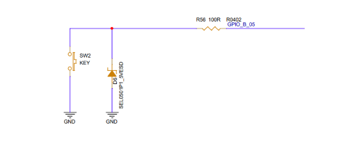

# GPIO

## 概述
GPIO的使用是我们最常用的外设操作之一，本章节主要介绍GPIO的配置和读写操作，并通过两个示例展示应用开发中GPIO的操作。

## GPIO逻辑电平和物理电平

在开始上手GPIO的操作前我们先来学习一下Zephyr中对于GPIO物理电平和逻辑电平的配置。

**物理电平(physical leve)**：一般情况下我们将0当做gpio的低电平，1当做gpio的高电平，这是物理电平。

**逻辑电平(logic level)**：在软件上为提高业务代码的可移植性或易读性，我们会引入逻辑电平，即自行定义0和1对应的电平状态。

在`csk-sdk\include\dt-bindings\gpio\gpio.h`中用两个宏flag表示逻辑电平对应的物理电平:

```c
/** GPIO pin is active (has logical value '1') in low state. */
#define GPIO_ACTIVE_LOW         (1 << 0)
/** GPIO pin is active (has logical value '1') in high state. */
#define GPIO_ACTIVE_HIGH        (0 << 0)
```

在Zephyr开发中通过`gpio_config(struct device *port, gpio_pin_t pin, gpio_flags_t flags)`接口的flags标志对GPIO进行逻辑电平的模式配置，根据宏flag的定义，GPIO逻辑电平和物理电平的对应关系如下：

**当GPIO被配置为GPIO_ACTIVE_LOW时：GPIO上出现低电平时表示逻辑电平1**

| 物理电平（gpio leve） | 逻辑电平(gpio logic level) |
| --------------------- | -------------------------- |
| 0                     | 1                          |
| 1                     | 0                          |

<br/>

**当GPIO被配置为GPIO_ACTIVE_HIGH时：GPIO上出现高电平时表示逻辑电平1**

| 物理电平（gpio leve） | 逻辑电平(gpio logic level) |
| --------------------- | -------------------------- |
| 0                     | 0                          |
| 1                     | 1                          |

<br/>

**当GPIO配置时GPIO_ACTIVE_LOW和GPIO_ACTIVE_HIGH都没设置，将会默认使用GPIO_ACTIVE_HIGH，也就是物理电平和逻辑电平一致。**

<br/>

:::note

了解GPIO逻辑电平和物理电平的对应关系对本章节后续的GPIO引脚的配置和读写操作很有帮助，GPIO逻辑电平的读和写操作接口都会依赖配置的GPIO_ACTIVE_LOW、GPIO_ACTIVE_HIGH标志。

:::

## GPIO的常见配置标志
### GPIO的输入/输出标志
| flag              |说明                                 |
| ----------------- | ------------------------------------ |
| GPIO_INPUT        | 启用GPIO为输入                       |
| GPIO_OUTPUT       | 启用GPIO为输出，不改变输出状态       |
| GPIO_DISCONNECTED | 输入和输出都配置为禁用               |
| GPIO_OUTPUT_LOW   | 将GPIO配置为输出并将其初始化为低     |
| GPIO_OUTPUT_HIGH  | 将GPIO配置为输出并将其初始化为高 |
| GPIO_OUTPUT_INACTIVE  | 将GPIO配置为输出并将其初始化为逻辑电平0 |
| GPIO_OUTPUT_ACTIVE  |  将GPIO配置为输出并将其初始化为逻辑电平1 |


### GPIO的中断标志

中断配置标志`(GPIO_INT_*)`用来指定作为输入的GPIO引脚以何种方式触发中断。中断可由PIN脚的物理电平或逻辑水平触发。GPIO中断的触发也会根据配置的GPIO_ACTIVE_LOW、GPIO_ACTIVE_HIGH标志来判断。

| flag              | 说明                                 |
| ----------------- | ------------------------------------ |
| GPIO_INT_DISABLE   | 禁用 GPIO 管脚中断 |
| GPIO_INT_EDGE_RISING  | 将GPIO中断配置为引脚上升沿触发|
| GPIO_INT_EDGE_FALLING | 将 GPIO 中断配置为在引脚下降沿触发 |
| GPIO_INT_EDGE_BOTH    | 将GPIO中断配置为在引脚上升或下降时触发|
| GPIO_INT_LEVEL_LOW    | 将GPIO中断配置为引脚物理电平拉低并保持|
| GPIO_INT_LEVEL_HIGH   | 将GPIO中断配置为引脚物理电平拉高并保持|
| GPIO_INT_EDGE_TO_INACTIVE | 将GPIO中断配置为引脚变为低电平时触发 |
| GPIO_INT_EDGE_TO_ACTIVE | 将GPIO中断配置为引脚变高电平时触发 |
| GPIO_INT_LEVEL_INACTIVE | 将GPIO中断配置为管脚逻辑电平0时触发 |
| GPIO_INT_LEVEL_ACTIVE | 将GPIO中断配置为管脚逻辑电平1时触发 |

flag配置对应的内容可以在`csk-sdk\include\dt-bindings\gpio\gpio.h`中查看。

### GPIO 引脚上下拉配置

| 状态              | 属性                                 |
| ----------------- | ------------------------------------ |
| GPIO_PULL_UP   | 引脚上拉 |
| GPIO_PULL_DOWN | 引脚下拉 |


## GPIO的操作接口

### GPIO配置

#### **配置GPIO**

```c
int gpio_pin_configure(const struct device *port, gpio_pin_t pin, gpio_flags_t flags)
```
**参数说明**

| 字段  | 说明                                                         |
| ----- | ------------------------------------------------------------ |
| ort   | 指向GPIO设备实例的指针                                       |
| pin   | 要配置的引脚编号                                             |
| flags | 引脚配置的标志:  GPIO 输入/输出配置标志， GPIO 引脚驱动标志， GPIO 引脚偏置标志 |

<br/>

#### **通过设备树配置GPIO**

```c
int gpio_pin_configure_dt(const struct gpio_dt_spec *spec, gpio_flags_t extra_flags)
```
**参数说明**

| 字段        | 说明                                 |
| ----------- | ------------------------------------ |
| spec        | GPIO配置信息结构体，从设备树配置获取 |
| extra_flags | GPIO 标志(输入/输出等)               |

<br/>

#### **配置GPIO的中断**

```c
int gpio_pin_interrupt_configure(const struct device *port, gpio_pin_t pin, gpio_flags_t flags)
```
**参数说明**

| 字段  | 说明                                |
| ----- | ----------------------------------- |
| Port  | 指向GPIO设备实例的指针              |
| pin   | 要配置的引脚编号                    |
| flags | 由`GPIO_ INT_ *` 定义的中断配置标志 |

<br/>

#### **通过设备树配置GPIO中断**

```c
int gpio_pin_interrupt_configure_dt(const struct gpio_dt_spec *spec, gpio_flags_t flags)
```
**参数说明**

| 字段  | 说明                                 |
| ----- | ------------------------------------ |
| spec  | GPIO配置信息结构体，从设备树配置获取 |
| flags | 中断配置标志                         |

<br/>

:::note
gpio_dt_spec为GPIO的设备树配置结构体，通过GPIO_DT_SPEC_GET_OR()接口从设备树获取GPIO的配置信息，结构体内容如下：

```c
struct gpio_dt_spec {
    const struct device *port;//GPIO的设备实例
    gpio_pin_t pin;//GPIO pin脚
    gpio_dt_flags_t dt_flags;//pin脚的功能标志
}
```
:::

### 写GPIO

#### **写输出GPIO逻辑电平**

写gpio逻辑电平操作需要参考GPIO_ACTIVE_LOW或GPIO_ACTIVE_HIGH配置下逻辑电平和物理电平的对应关系，例如当GPIO配置为GPIO_ACTIVE_LOW时，设置逻辑电平为1则GPIO输出低电平。当GPIO配置为GPIO_ACTIVE_HIGH时，设置逻辑电平1则GPIO输出高电平。

```c
int gpio_pin_set(const struct device *port, gpio_pin_t pin, int value)
```
**参数说明**

| 字段  | 说明                   |
| ----- | ---------------------- |
| port  | 指向GPIO设备实例的指针 |
| pin   | 要配置的引脚编号       |
| value | 分配给引脚的值         |

<br/>

#### **写输出GPIO物理电平**

给GPIO写物理电平不需要参考GPIO_ACTIVE_LOW或GPIO_ACTIVE_HIGH配置。

```c
int gpio_pin_set_raw(const struct device *port, gpio_pin_t pin, int value)
```
**参数说明**

| 字段  | 说明                   |
| ----- | ---------------------- |
| port  | 指向GPIO设备实例的指针 |
| pin   | 要配置的引脚编号       |
| value | 分配给引脚的值         |

<br/>  

#### **通过设备树写输出GPIO逻辑电平**

```c
int gpio_pin_set_dt(const struct gpio_dt_spec *spec, int value)
```
**参数说明**

| 字段  | 说明                                 |
| ----- | ------------------------------------ |
| spec  | GPIO配置信息结构体，从设备树配置获取 |
| value | 分配给引脚的值                       |

<br/> 

:::note
如果GPIO配置为GPIO_ACTIVE_HIGH，则gpio_pin_set()函数等效于gpio_pin_set_raw()。
:::

### 读GPIO

#### **读输入引脚的逻辑电平**

```c
int gpio_pin_get(const struct device *port, gpio_pin_t pin)
```
获取GPIO逻辑电平，同时考虑到 GPIO_ACTIVE_LOW、GPIO_ACTIVE_HIGH标志。如果将GPIO配置为GPIO_ACTIVE_HIGH，则GPIO为物理低电平时通过该接口获取的逻辑电平为0。如果将GPIO配置为GPIO_ACTIVE_LOW，则GPIO为物理低电平时通过接口过去的逻辑电平为1。

**参数说明**

| 字段 | 说明                   |
| ---- | ---------------------- |
| port | 指向GPIO设备实例的指针 |
| pin  | 引脚编号               |

<br/>

#### **通过设备树读输入引脚的逻辑电平**

```c
int gpio_pin_get_dt(const struct gpio_dt_spec *spec)
```
**参数说明**

| 字段 | 说明                                 |
| ---- | ------------------------------------ |
| spec | GPIO配置信息结构体，从设备树配置获取 |

<br/>

#### **读输入引脚的物理电平**

```c
int gpio_pin_get_raw(const struct device *port, gpio_pin_t pin)
```
**参数说明**

| 字段 | 说明                   |
| ---- | ---------------------- |
| port | 指向GPIO设备实例的指针 |
| pin  | 引脚编号               |

<br/>

:::note
如果GPIO配置为GPIO_ACTIVE_HIGH，则gpio_pin_get()等效于gpio_pin_get_raw()。
:::

更多GPIO API接口请看Zephyr官网[GPIO Driver APIs](https://docs.Zephyrproject.org/latest/doxygen/html/group__gpio__interface.html)描述。

## 使用示例
### 示例1：GPIO作为输出引脚
本示例将通过一个简单的应用程序，展示如何通过GPIO引脚控制LED灯的亮灭的操作。
#### 准备工作
实现Blinky示例的预期效果需要硬件开发板上必须有一个GPIO连接了一个LED灯，在`csk6002_9s_nano`开发板上是有这个设计的，通过查看开发板底板原理图，你可以看到LED对应的电路设计如下图所示，我们可以看到LED1(Green)对应的控制引脚为:GPIOA_05


#### 获取sample项目
`CSK6 SDK`提供了GPIO作为输出引脚的sample，可以通过以下指令获取示例：
```
lisa zep create
```

> boards→ csk6 → gpio_led

gpio_led sample创建成功。
#### 组件配置
在prj.conf文件中添加项目基础组件配置配置:
```shell
# 打开GPIO配置
CONFIG_GPIO=y
```
#### 设备树配置
在`app/boards/`目录下增加`csk6002_9s_nano.overlay`文件并添加led的GPIO配置，具体内容如下：
```c

 / 
 {
    leds {
            compatible = "gpio-leds";
            board_led_2_label: board_led_2_nodeid {
                    gpios = <&gpioa 5 0>;
                    label = "User BOARD_LED_2";
            };
    };
 
 };
```


**设备树配置说明：**  

| 字段                       | 说明                                                         |
| -------------------------- | ------------------------------------------------------------ |
| board_led_2_label          | led2 设备树的 node label，可通过 node label 获取 led2 设备树的配置信息 |
| board_led_2_nodeid         | led2 设备树的 node id，可通过 node id获取 led2 设备树的配置信息 |
| gpios = <&gpioa 5 0>       | &gpioa 5：gpioa_5；<br />0：gpio flag配置为0，在本示例中没有用到该flag |
| label = "User BOARD_LED_2" | led2 节点 的 label 属性[(Label propert)](https://docs.Zephyrproject.org/latest/build/dts/intro.html#important-properties)，通过传入device_get_binding()接口可以获取gpio设备的实例 |

:::tip

更多关于设备树的内容请学习[设备树](../../../build/dts/intro.md)章节。

:::

#### 应用逻辑实现

```c
#include <Zephyr.h>
#include <device.h>
#include <devicetree.h>
#include <drivers/gpio.h>

/* 1000 msec = 1 sec */
#define SLEEP_TIME_MS   1000

/* 通过label获取board_led_2的GPIO配置信息 */
#define LED0	DT_GPIO_LABEL(DT_NODELABEL(board_led_2), gpios)
#define PIN	DT_GPIO_PIN(DT_NODELABEL(board_led_2), gpios)

void main(void)
{
	const struct device *dev;
	bool led_is_on = true;
	int ret;

    printk("LED0 %s \n", LED0);
    printk("PIN %d \n", PIN);

    /* 获取GPIOA设备实例 */
	dev = device_get_binding(LED0);
	if (dev == NULL) {
		return;
	}
    
	/* 将GPIO配置为输出并将其初始化为逻辑电平1 */
	ret = gpio_pin_configure(dev, PIN, GPIO_OUTPUT_ACTIVE);
	if (ret < 0) {
		return;
	}

	while (1) {
		gpio_pin_set(dev, PIN, (int)led_is_on);
		led_is_on = !led_is_on;
		k_msleep(SLEEP_TIME_MS);
	}
}
```
#### 编译和烧录
##### 编译
在sample根目录下通过以下指令完成编译：
```
lisa zep build -b csk6002_9s_nano
```
##### 烧录
`csk6002_9s_nano`通过USB连接PC，通过烧录指令烧录：
```
lisa zep flash --runner pyocd
```
完成烧录后，可看到终端输出 “烧录成功” 的提示，如图：


##### 查看结果
预期的效果应如下两个图片所示，开发板上的LED灯(绿)在不断的闪烁，如果在你的开发板上实现了这个效果，那么恭喜，你顺利的完成了LED的控制，在CSK6的开发上又迈出了一步！


### 示例2：GPIO作为输入引脚

本示例将通过一个简单的应用程序，展示如何通过GPIO引脚作为输入中断检测实现按键检测的功能，同时通过LED的亮灭(示例1中使用的LED)来展示按键事件的响应结果。
#### 准备工作
本示例基于CSK6-NanoKit开发板来实现，需要做如下准备工作：
- 准备一个CSK6-NanoKit开发板
- 通过串口连接PC端查看日志，日志串口`GPIOA_03 TX GPIOA_02 RX`

CSK6-NanoKit开发板的按键电路：


#### 获取sample项目
`CSK6 SDK`提供了GPIO作为输入的按键检测sample，可以通过以下指令获取示例：
```
lisa zep create
```

> basic → button

Button sample创建成功。

#### 设备树配置
在`csk6002_9s_nano`这个板型dts文件中已经默认添加了按键的配置，配置信息如下：
```c
        gpio_keys {
                compatible = "gpio-keys";
                user_button_0: button_0 {
                        label = "User SW0";
                        gpios = <&gpiob 5 0>;
                };
        };
```
**设备树配置说明：**

| 字段                 | 说明                                                         |
| -------------------- | ------------------------------------------------------------ |
| user_button_0        | button0 设备树的 node label，可通过 node label 获取 button0 设备树的配置信息 |
| button_0             | button0 设备树的 node id，可通过 node id获取 button0 设备树的配置信息 |
| gpios = <&gpiob 5 0> | &gpiob 5：gpiob_5；<br />0：gpio flag配置为0，在本示例中没有用到该flag |
| label = "User SW0";  | button0 节点 的 label 属性[(Label propert)](https://docs.Zephyrproject.org/latest/build/dts/intro.html#important-properties)，通过传入device_get_binding()接口可以获取gpio设备的实例 |


#### 组件配置

在prj.conf文件中添加项目基础组件配置配置:
```shell
# 打开GPIO配置
CONFIG_GPIO=y
```
#### 应用逻辑实现
```c
#include <Zephyr.h>
#include <device.h>
#include <drivers/gpio.h>
#include <sys/util.h>
#include <sys/printk.h>
#include <inttypes.h>

#define SLEEP_TIME_MS	1

#define SW0_NODE	DT_ALIAS(sw0)
#if !DT_NODE_HAS_STATUS(SW0_NODE, okay)
#error "Unsupported board: sw0 devicetree alias is not defined"
#endif
/* 通过GPIO_DT_SPEC_GET_OR接口获取button的设备树配置 */
static const struct gpio_dt_spec button = GPIO_DT_SPEC_GET_OR(SW0_NODE, gpios,
							      {0});
static struct gpio_callback button_cb_data;
/* 通过GPIO_DT_SPEC_GET_OR接口获取led的设备树配置 */
static struct gpio_dt_spec led = GPIO_DT_SPEC_GET_OR(DT_ALIAS(led0), gpios,
						     {0});

/* GPIO中断处理 */
void button_pressed(const struct device *dev, struct gpio_callback *cb,
		    uint32_t pins)
{
	printk("Button pressed at %" PRIu32 "\n", k_cycle_get_32());
}

void main(void)
{
    int ret;

    if (!device_is_ready(button.port)) {
        printk("Error: button device %s is not ready\n",
                button.port->name);
        return;
    }

    /* 将GPIO配置为输入 */
    ret = gpio_pin_configure_dt(&button, GPIO_INPUT);
    if (ret != 0) {
        printk("Error %d: failed to configure %s pin %d\n",
                ret, button.port->name, button.pin);
        return;
    }

    /* 将GPIO中断配置为引脚变高电平时触发中断 */
    ret = gpio_pin_interrupt_configure_dt(&button,
                            GPIO_INT_EDGE_TO_ACTIVE);
    if (ret != 0) {
        printk("Error %d: failed to configure interrupt on %s pin %d\n",
            ret, button.port->name, button.pin);
        return;
    }

    /* 初始化中断回调 */
    gpio_init_callback(&button_cb_data, button_pressed, BIT(button.pin));
    /* 注册回调事件 */
    gpio_add_callback(button.port, &button_cb_data);
    printk("Set up button at %s pin %d\n", button.port->name, button.pin);

    if (led.port && !device_is_ready(led.port)) {
        printk("Error %d: LED device %s is not ready; ignoring it\n",
                ret, led.port->name);
        led.port = NULL;
    }
    if (led.port) {
        /* 通过led设备树配置led的GPIO引脚为输出 */
        ret = gpio_pin_configure_dt(&led, GPIO_OUTPUT);
        if (ret != 0) {
            printk("Error %d: failed to configure LED device %s pin %d\n",
                    ret, led.port->name, led.pin);
            led.port = NULL;
        } else {
            printk("Set up LED at %s pin %d\n", led.port->name, led.pin);
        }
    }

    printk("Press the button\n");
    /* 通过控制LED灯的亮灭来同步按键的响应 */
    if (led.port) {
        while (1) {
            /* 获取按键的逻辑电平 */
            int val = gpio_pin_get_dt(&button);
  
            if (val >= 0) {
                /* 设置LED的逻辑电平，按键按下时LED亮，弹起后LED灭 */
                gpio_pin_set_dt(&led, val);
            }
            k_msleep(SLEEP_TIME_MS);
        }
    }
}

```


**实现逻辑分析**

```
ret = gpio_pin_interrupt_configure_dt(&button,
                            GPIO_INT_EDGE_TO_ACTIVE
```

以上代码段通过gpio_pin_interrupt_configure_dt接口将按键检测的GPIO配置为GPIO_INT_EDGE_TO_ACTIVE，即：将GPIO中断配置为引脚变高电平时触发。未配置GPIO_ACTIVE_LOW或GPIO_ACTIVE_HIGH，则默认电平模式为GPIO_ACTIVE_HIGH，逻辑电平和物理电平一致。

从硬件电路可看到，按键检测GPIO默认为逻辑高电平，当按键按下时接地，GPIO被拉低，此时gpio_pin_get_dt获取的按键逻辑电平为0，通过`gpio_pin_set_dt(&led, val)`接口可将LED点亮，当按键松开时逻辑电平由0变为1，按照gpio config的flag配置：GPIO_INT_EDGE_TO_ACTIVE(引脚电平由低至高触发中断)触发中断回调button_pressed，开发者可在回调函数中做相应的按键事件处理。

#### 编译和烧录

##### 编译

在app根目录下通过以下指令完成编译：
```
lisa zep build -b csk6002_9s_nano
```
##### 烧录

`csk6002_9s_nano`通过USB连接PC，通过烧录指令开始烧录：
```
lisa zep flash --runner pyocd
```
##### 查看结果

**查看串口日志**

CSK6-NanoKit通过板载DAPlink虚拟串口连接电脑，或者将CSK6-NanoKit的日志串口`A03 TX A02 RX`外接串口板并连接电脑。
- 通过lisa提供的`lisa term`命令查看日志
- 或者在电脑端使用串口调试助手查看日志，默认波特率为115200。

按下按键后的日志：
```
*** Booting Zephyr OS build v1.0.3-alpha.1-2-g93840afb5f54  ***
Set up button at GPIO_B pin 5
Set up LED at GPIO_A pin 5
Press the button
Button pressed at 1339031551
Button pressed at 1950727163
Button pressed at 1956531899
Button pressed at 1962377777
Button pressed at 1968272822
Button pressed at 1974199286
```

