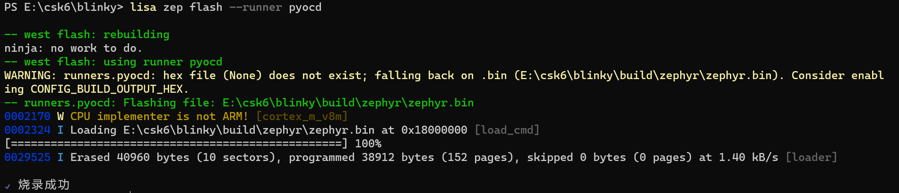

# PWM

## 概述
PWM是我们常用的外设功能之一，csk6总共有8组pwm输出口，本节将通过示例展示PWM API接口和使用方法。

## PWM常用接口

### 设置PWM 输出周期和脉冲宽度

```c
int pwm_pin_set_usec(const struct device * dev, uint32_t channel, uint32_t period, uint32_t pulse, pwm_flags_t flags)	
```

**参数说明**

| 参数    | 说明        |
| ------- | ----------- |
| dev     | pwm设备实例 |
| channel | 通道        |
| period  | 频率        |
| pulse   | 脉冲宽度    |
| flags   | PWM标志     |

其中period和pulse的单位是microseconds。

<br/>

## 使用示例

### 准备工作
首先，实现Blinky_pwm示例的预期效果需要硬件开发板上必须有一个GPIO(带pwm输出功能)连接了一个LED灯，在`csk6011a_nano`开发板上是有这个设计的，通过查看开发板底板原理图，你可以看到LED对应的电路设计如下图所示，我们可以看到LED1(Green)对应的控制引脚为:GPIOA_06，GPIOA_06可复用为pwm输出功能。


### 获取sample项目
`CSK6 SDK`提供了Blinky_pwm的sample，你可以在任一期望放置项目工程的目录下输出以下指令创建一个Blinky_pwm项目：
```
lisa zep create
```


> basic → blinky_pwm

Blinky pwm sample创建成功。

### 示例项目组件配置
在prj.conf文件中添加项目基础组件配置配置:
```shell
CONFIG_STDOUT_CONSOLE=y
CONFIG_PRINTK=y
# 打开pwm配置
CONFIG_PWM=y
# 打开日志配置
CONFIG_LOG=y
CONFIG_LOG_PRINTK=y
CONFIG_LOG_MODE_IMMEDIATE=y
CONFIG_PWM_LOG_LEVEL_DBG=y
```
### 设备树配置
`csk6011a_nano.dts`设备树配置文件中已经实现了`pwmled`的配置，具体如下:

```c
{
    model = "csk6011a nano";
    compatible = "csk,csk6011a_nano";
	/* 定义别名为 pwm-led0 的 pwmled 设备树 */
    aliases {
            pwm-led0 = &green_pwm_led;

    };

	pwmleds {
			compatible = "pwm-leds";
			green_pwm_led: green_pwm_led {
					/* PWM LED will conflict with User LED1 since using the same gpio pin */
					pwms = <&pwm2 2 PWM_MSEC(20) PWM_POLARITY_NORMAL>;
					label = "User BOARD_LED_2 - PWM0";
			};

	};
};
```
**pwmled 设备树配置说明：**

| 字段                                  | 说明                                                         |
| ------------------------------------- | ------------------------------------------------------------ |
| green_pwm_led(第一个)                         | pwm_led 设备树的 node label，可通过 node label 获取 pwm_led设备树的配置信息 |
| green_pwm_led(第二个)                         | pwm_led 设备树的 node id，可通过 node id获取 pwm_led设备树的配置信息 |
|pwms = <&pwm2 2 PWM_MSEC(20) PWM_POLARITY_NORMAL>; | &pwm2 ：pwm_2<br />2：通道<br />PWM_POLARITY_NORMAL： pwm 引脚 flag |
| User BOARD_LED_2 - PWM0               | pwm_led 节点的 label 属性[(Label propert)](https://docs.Zephyrproject.org/latest/build/dts/intro.html#important-properties)，通过传入device_get_binding()接口可以获取pwm的设备实例 |


### 

### 示例实现逻辑

- 此例程使用PWM控制LED灯以1Hz的频率闪烁，每4秒频率翻倍直到64hz，此后每4秒频率减半，直到恢复到1Hz完成一个闪烁周期，以先快后慢的闪烁方式循环。

- 部分PWM硬件无法实现1Hz的频率控制，这个sample在启动时会对硬件进行校准，适当减小最大PWM周期，直到找到匹配硬件的值。

### 示例实现 
```c
#include <zephyr/zephyr.h>
#include <zephyr/sys/printk.h>
#include <zephyr/device.h>
#include <zephyr/drivers/pwm.h>
/* 获取设备树配置 */
static const struct pwm_dt_spec pwm_led0 = PWM_DT_SPEC_GET(DT_ALIAS(pwm_led0));

#define MIN_PERIOD PWM_SEC(1U) / 128U
#define MAX_PERIOD PWM_SEC(1U)

void main(void)
{
	uint32_t max_period;
	uint32_t period;
	uint8_t dir = 0U;
	int ret;

	printk("PWM-based blinky\n");

	if (!device_is_ready(pwm_led0.dev)) {
		printk("Error: PWM device %s is not ready\n",
		       pwm_led0.dev->name);
		return;
	}

	/*
	 * 如果默认的 MAX_PERIOD 值无法匹配一些 PWM 硬件，则降低其值直到可以。
	 * 保持其值至少为 MIN_PERIOD*4，以确保样本改变频率至少是一次。
	 */
	printk("Calibrating for channel %d...\n", pwm_led0.channel);
	max_period = MAX_PERIOD;
	/* 对硬件进行校准，适当减小最大PWM周期，到找匹配的值 */
	while (pwm_set_dt(&pwm_led0, max_period, max_period / 2U)) {
		max_period /= 2U;
		if (max_period < (4U * MIN_PERIOD)) {
			printk("Error: PWM device "
			       "does not support a period at least %lu\n",
			       4U * MIN_PERIOD);
			return;
		}
	}

	printk("Done calibrating; maximum/minimum periods %u/%lu usec\n",
	       max_period, MIN_PERIOD);

	period = max_period;
	while (1) {
		 /* 设置pwm参数，通道、频率(max_period=125000HZ)、脉宽(50%)、标志(PWM_POLARITY_NORMAL) */
		ret = pwm_set_dt(&pwm_led0, period, period / 2U);
		if (ret) {
			printk("Error %d: failed to set pulse width\n", ret);
			return;
		}
		/* 改变pwm频率和脉宽实现LED的动态亮度显示 */
		period = dir ? (period * 2U) : (period / 2U);
		if (period > max_period) {
			period = max_period / 2U;
			dir = 0U;
		} else if (period < MIN_PERIOD) {
			period = MIN_PERIOD * 2U;
			dir = 1U;
		}

		k_sleep(K_SECONDS(4U));
	}

}

```

### 编译和烧录
#### 编译
在sample根目录下通过以下指令完成编译：
```
lisa zep build -b csk6011a_nano
```
#### 烧录
`csk6011a_nano`通过USB连接PC，通过烧录指令开始烧录：

```
lisa zep flash
```
完成烧录后，可看到终端输出 “烧录成功” 的提示，如图：


#### 查看结果 

预期的效果应如下视频所示，开发板上的LED灯(绿)以先快后慢的方式循环闪烁，如果在你的卡发板上实现了这个效果，那么恭喜，你顺利的完成了LED的控制，在CSK6的开发上又迈出了一步！

<video src="https://iflyos-external.oss-cn-shanghai.aliyuncs.com/public/lsopen/zephyr/%E6%96%87%E6%A1%A3%E8%A7%86%E9%A2%91%E4%BB%93/blinky_pwm.mp4" controls="controls" width="500" height="300">您的浏览器不支持播放该视频！</video>