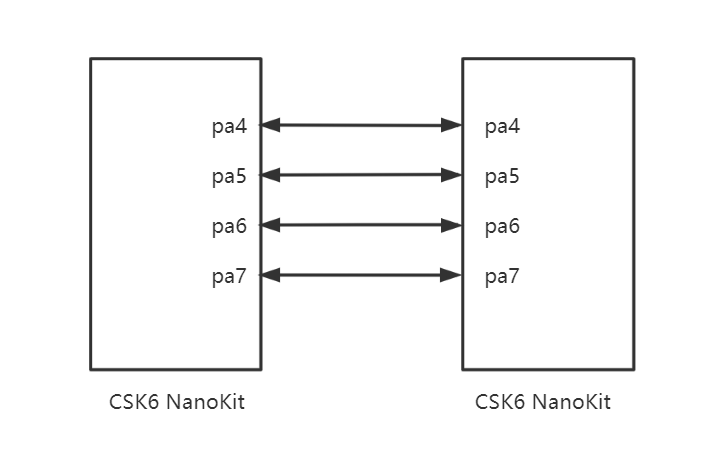
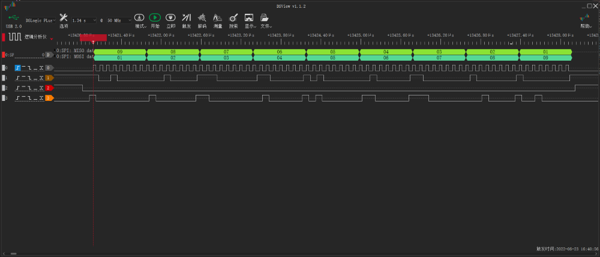

# SPI

## 概述
SPI外设是我们常用的外设功能之一，CSK6 SDK支持SPI外设功能，本章节通过示例介绍SPI外设的基本使用方法。

CSK6 芯片有两组SPI硬件外设，SPI0和SPI1。
CSK6 I2C驱动功能特性如下：
- 支持主模式和从模式。
- 支持DMA硬件握手。
- SPI时钟最高可达50MHZ。

## 准备工作
本示例基于两个CSK6-NanoKit开发板实现SPI数据的通信，其中一个作为SPI主设备，另一设备作为从设备，实现该示例需要以下准备工作:
- 2个CSK6-NanoKit开发板
- 使用杜邦线将`spi1(GPIO_A_04 sclk, GPIO_A_05 cs, GPIO_A_06 miso, GPIO_A_07 mosi)`连接，接线方式如下图示：


## 创建项目
通过Lisa命令创建项目：
```
lisa zep create
```

依次按以下目录选择完成adc sample创建：  
> boards → csk6 → driver → spi_master_slave


## 示例实现
### 组件配置
```
CONFIG_GPIO=y
# SPI外设配置
CONFIG_SPI=y
CONFIG_LOG=y
CONFIG_HEAP_MEM_POOL_SIZE=10240
# SPI接收处理超时时间 
CONFIG_SPI_COMPLETION_TIMEOUT_TOLERANCE=10000
```
### SPI设备树配置
CSK6-NanoKit开发板提供了两组SPI外设。本示例使用`spi1(GPIO_A_04 sclk, GPIO_A_05 cs, GPIO_A_06 miso, GPIO_A_07 mosi)`作为SPI通讯接口，因此需要在设备树中将这GPIO引脚复用为SPI功能，可通过`boad overlay`的方式完成，具体如下：
在app目录下增加`csk6002_9s_nano.overlay`文件并添加如下配置：
```c
&csk6002_9s_nano_pinctrl{
            /* SPIC alternate function */
            pinctrl_spi1_sclk_default: spi1_sclk_default{
                    pinctrls = <&pinmuxa 4 7>;
            };
            
            pinctrl_spi1_mosi_default: spi1_mosi_default{
                    pinctrls = <&pinmuxa 7 7>;
            };

            pinctrl_spi1_miso_default: spi1_miso_default{
                    pinctrls = <&pinmuxa 6 7>;
            };    

            pinctrl_spi1_cs_default: spi1_cs_default{
                    pinctrls = <&pinmuxa 5 7>;
            };
            
};

&spi1{
    pinctrl-0 = <&pinctrl_spi1_sclk_default &pinctrl_spi1_mosi_default &pinctrl_spi1_miso_default &pinctrl_spi1_cs_default>; 
    pinctrl-names = "default";
    status = "okay";
};
```

:::note
如果您想了解更多关于设备树的信息，请学习[设备树](../../device_tree.md)章节。
:::

### 示例实现逻辑
本示例实现以下业务逻辑：
- SPI master设备每隔1S向slave设备发送一包`{1, 2, 3, 4, 5, 6, 7, 8, 9}`数据。
- SPI slave设备接收数据并向master设备返回`{9, 8, 7, 6, 5, 4, 3, 2, 1}`数据。

### API接口
常用SPI API接口：
```c
/*SPI 发送接收*/
int spi_transceive(const struct device * dev, 
const struct spi_config * config, 
const struct spi_buf_set * tx_bufs, 
const struct spi_buf_set * rx_bufs)
参数说明：
dev spi设备实例
config spi配置
tx_bufs 发送数据的缓冲区数组，如果没有数据，则为 NULL
rx_bufs 将要读取的数据写入的缓冲区数组，如果没有，则为 NULL

/*SPI 发送*/
int spi_write(const struct device * dev,
const struct spi_config * config, 
const struct spi_buf_set * tx_bufs)	
dev spi设备实例
config spi配置
tx_bufs 发送数据的缓冲区数组，如果没有数据

/*SPI 接收*/
int spi_read(const struct device * dev,
const struct spi_config * config,
const struct spi_buf_set * rx_bufs 
)	
```
更多SPI API接口请查看zephyr官网[SPI Interface](https://docs.zephyrproject.org/latest/doxygen/html/group__spi__interface.html)。
### 应用逻辑实现
#### master应用逻辑实现
```c
uint8_t master_buffer_tx[BUF_SIZE] = {1, 2, 3, 4, 5, 6, 7, 8, 9};
uint8_t master_buffer_rx[BUF_SIZE] = {};

#define MASTER_STACK_SIZE 4096

K_THREAD_STACK_DEFINE(master_stack_area, MASTER_STACK_SIZE);

struct k_thread master_thread_data;

const struct device *spi_master = NULL;

/*获取spi1设备实例*/
void spi_master_init(void)
{
    spi_master = DEVICE_DT_GET(DT_NODELABEL(spi1));
    if (spi_master == NULL)
    {
        printk("spi_master: Device is not found.\n");
        return;
    }

    if (!device_is_ready(spi_master))
    {
        printk("spi_master: Device is not ready.\n");
        return;
    }
}

/* master线程处理 */
void master_thread(void *v1, void *v2, void *v3)
{
    struct spi_config spi_cfg = {0};
    const struct spi_buf tx_bufs[] = {
        {
            .buf = master_buffer_tx,
            .len = BUF_SIZE,
        },
    };
    const struct spi_buf rx_bufs[] = {
        {
            .buf = master_buffer_rx,
            .len = BUF_SIZE,
        },
    };
    const struct spi_buf_set tx = {
        .buffers = tx_bufs,
        .count = ARRAY_SIZE(tx_bufs)};
    const struct spi_buf_set rx = {
        .buffers = rx_bufs,
        .count = ARRAY_SIZE(rx_bufs)};

    /* 设置SPI配置：8bit数据位, LSB 数据格式，master模式，时钟频率10Mhz */
    spi_cfg.operation = SPI_WORD_SET(8) | SPI_OP_MODE_MASTER | SPI_TRANSFER_LSB;
    spi_cfg.frequency = 10 * 1000000UL;

    while (1)
    {   
        /*每间隔1S触发一次数据发送和接收*/
        k_msleep(1000);
        
        /*清空接收缓冲区*/
        memset(master_buffer_rx, 0, BUF_SIZE);
        printk("[Master]spi send data \n");
        
        /*发送和接收数据*/
        spi_transceive(spi_master, &spi_cfg, &tx, &rx);
        printk("[Master]spi received data \n");
        
        /*打印接收数据*/
        for (uint8_t i = 0; i < BUF_SIZE; i++)
        {
            printk("0x%x", master_buffer_rx[i]);
        }
        printk("\n");
    }
}

void main(void)
{
    printk("SPI test start \n");

    spi_master_init();

    /* 创建线程 */
    int pri = k_thread_priority_get(k_current_get());

    k_thread_create(&master_thread_data, master_stack_area,
                    K_THREAD_STACK_SIZEOF(master_stack_area), master_thread, NULL,
                    NULL, NULL, pri, 0, K_NO_WAIT);

    printk("SPI thread creaeted\n");

    while (1)
    {
        k_msleep(10);
    }
}

```
#### slave应用逻辑实现
```c
uint8_t slave_buffer_tx[BUF_SIZE] = {9, 8, 7, 6, 5, 4, 3, 2, 1};
uint8_t slave_buffer_rx[BUF_SIZE] = {};

#define SLAVE_STACK_SIZE 4096

K_THREAD_STACK_DEFINE(slave_stack_area, SLAVE_STACK_SIZE);

struct k_thread slave_thread_data;

const struct device *spi_slave = NULL;

struct k_thread slave_thread_data;

/*获取spi1设备实例*/
void spi_slave_init(void)
{
    spi_slave = DEVICE_DT_GET(DT_NODELABEL(spi1));
    if (spi_slave == NULL)
    {
        printk("spi_slave: Device is not found.\n");
        return;
    }

    if (!device_is_ready(spi_slave))
    {
        printk("spi_slave: Device is not ready.\n");
        return;
    }
}

/* slave线程处理 */
void slave_thread(void *v1, void *v2, void *v3)
{
    struct spi_config spi_cfg = {0};
    const struct spi_buf tx_bufs[] = {
        {
            .buf = slave_buffer_tx,
            .len = BUF_SIZE,
        },
    };
    const struct spi_buf rx_bufs[] = {
        {
            .buf = slave_buffer_rx,
            .len = BUF_SIZE,
        },
    };
    const struct spi_buf_set tx = {
        .buffers = tx_bufs,
        .count = ARRAY_SIZE(tx_bufs)};
    const struct spi_buf_set rx = {
        .buffers = rx_bufs,
        .count = ARRAY_SIZE(rx_bufs)};

    /* 设置SPI配置：8bit数据位, LSB 数据格式，slave模式，时钟频率10Mhz */
    spi_cfg.operation = SPI_WORD_SET(8) | SPI_OP_MODE_SLAVE | SPI_TRANSFER_LSB;
    spi_cfg.frequency = 10 * 1000000UL;

    while (1)
    {
        /*清空接收缓冲区*/
        memset(slave_buffer_rx, 0, BUF_SIZE);

        /*接收和发送数据*/
        spi_transceive(spi_slave, &spi_cfg, &tx, &rx);
        printk("[Slave]spi receive data, and send back \n");
        
        /*打印接收数据*/
        for (uint8_t i = 0; i < BUF_SIZE; i++)
        {
            printk("0x%x", slave_buffer_rx[i]);
        }
        printk("\n");
    }
}

void main(void)
{
    printk("SPI test start \n");

    spi_slave_init();

    /* 创建线程 */
    int pri = k_thread_priority_get(k_current_get());

    k_thread_create(&slave_thread_data, slave_stack_area,
                    K_THREAD_STACK_SIZEOF(slave_stack_area),
                    slave_thread, NULL, NULL, NULL, pri, 0, K_NO_WAIT);
    printk("SPI thread creaeted\n");

    while (1)
    {
        k_msleep(10);
    }
}

```

:::tip
本示例实现了master和slave代码逻辑，通过宏定义`MASTER_MODE`来设置master和slave模式的实现逻辑，1为master模式，0为slave模式，开发者需要分别编译master和slave模式固件烧录到两个CSK6-NanoKit开发板上。
:::

## 编译和烧录
### 编译

分别配置`MASTER_MODE`为1和0并烧录到两个CSK6-NanoKit开发板上。
在app根目录下通过以下指令完成编译：
```
lisa zep build -b csk6002_9s_nano
```
### 烧录

CSK6-NanoKit通过USB连接PC，通过烧录指令开始烧录：
```
lisa zep flash --runner pyocd
```
### 查看结果 

**查看日志：**

CSK6-NanoKit通过板载DAPlink虚拟串口连接电脑，或者将CSK6-NanoKit的日志串口`A03 TX A02 RX`外接串口板并连接电脑。
- 通过lisa提供的`lisa term`命令查看日志
- 或者在电脑端使用串口调试助手查看日志，默认波特率为115200。

**slave设备接收到master设备发送的数据结果应为：**

```
*** Booting Zephyr OS build 1ecc9604fbc0  ***
SPI test start 
SPI thread creaeted
[Slave]spi receive data, and send back 
0x10x20x30x40x50x60x70x80x9
[Slave]spi receive data, and send back 
0x10x20x30x40x50x60x70x80x9
[Slave]spi receive data, and send back 
0x10x20x30x40x50x60x70x80x9
...
```

**master设备接收到slave设备回传的数据结果应为：**

```
** Booting Zephyr OS build 1ecc9604fbc0  ***
SPI test start 
SPI thread creaeted
[Master]spi send data 
[Master]spi received data 
0x90x80x70x60x50x40x30x20x1
[Master]spi send data 
[Master]spi received data 
0x90x80x70x60x50x40x30x20x1
[Master]spi send data 
[Master]spi received data 
0x90x80x70x60x50x40x30x20x1
...
```
**逻辑分析仪数据分析**



从逻辑分析仪过程数据可以看到，master设备MOSI数据为`01~09`，MISO数据为`09~01`，符合预期。


