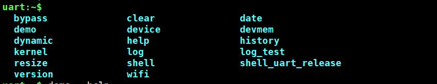
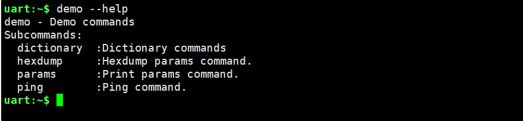
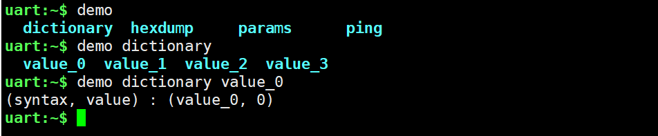
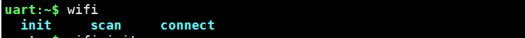
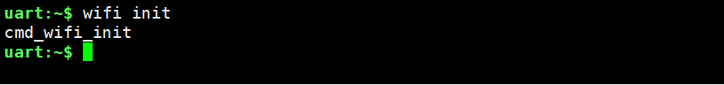
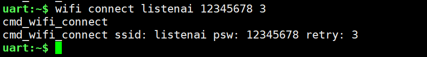

# Shell 的使用

## 概述
zephyr shell在终端提供一个交互式的命令行界面，用于在程序运行时执行特定的命令，本章节通过示例展示zephyr  shell的功能以及如何添加自定义shell命令。

:::tip
在学习本章节前请先学习[系统服务-Shell](../service/shell.md)章节，该章节中详细描述shell的特性、命令、标签、和用法。
:::

## 常用API接口

### SHELL_CMD

```c
SHELL_CMD(_syntax, _subcmd, _help, _handler)
```

**接口说明**

初始化shell命令。

**参数说明**

| 字段     | 说明                       |
| -------- | -------------------------- |
| _syntax  | 命令（例如：history）。    |
| _subcmd  | 指向子命令数组的指针。     |
| _help    | 指向命令help字符串的指针。 |
| _handler | 指向函数处理程序的指针     |


### SHELL_SUBCMD_DICT_SET_CREATE

```c
SHELL_SUBCMD_DICT_SET_CREATE(_name, _handler, ...)
```

**接口说明**

创建一个键值对子命令数组。

**参数说明**

| 字段     | 说明                                                         |
| -------- | ------------------------------------------------------------ |
| _name    | 命令（例如：history）                                        |
| _handler | 指向函数处理程序的指针                                       |
| ...      | 键值对（命令，值），值将作为用户数据传递给_handler处理程序。 |


### SHELL_CMD_REGISTER

```c
SHELL_CMD_REGISTER(syntax, subcmd, help, handler)
```

**接口说明**

用于定义和添加带参数的根命令（级别为0）的宏。

**参数说明**

| 字段    | 说明                       |
| ------- | -------------------------- |
| syntax  | 命令（例如：history）。    |
| subcmd  | 指向子命令数组的指针。     |
| help    | 指向命令help字符串的指针。 |
| handler | 指向函数处理程序的指针     |


### SHELL_STATIC_SUBCMD_SET_CREATE

```c
SHELL_STATIC_SUBCMD_SET_CREATE(name, ...)
```

**接口说明**

用于创建子命令集的宏。

**参数说明**

| 字段 | 说明                                                         |
| ---- | ------------------------------------------------------------ |
| name | 子命令集的名称                                               |
| ...  | 使用[SHELL_CMD_ARG](https://docs.zephyrproject.org/2.7.0/reference/shell/index.html#group__shell__api_1gad762c496a2ced65069b6d1d02a4d925c)或[SHELL_CMD](https://docs.zephyrproject.org/2.7.0/reference/shell/index.html#group__shell__api_1ga24ade9db85af9a8776a45ba0084f4cca)创建的命令列表 |


### SHELL_CMD_ARG_REGISTER

```c
SHELL_CMD_ARG_REGISTER(syntax, subcmd, help, handler, mandatory, optional)
```

**接口说明**

用于定义和添加具有所需数量参数的根命令（级别0）的宏。

**参数说明**

| 字段      | 说明                       |
| --------- | -------------------------- |
| syntax    | 命令（例如：history）      |
| subcmd    | 指向子命令数组的指针       |
| help      | 指向命令help字符串的指针   |
| handler   | 指向函数处理程序的指针     |
| mandatory | 强制参数的数量，包括命令名 |
| optional  | 可选参数的数量             |


### SHELL_COND_CMD_REGISTER

```c
SHELL_COND_CMD_REGISTER(flag, syntax, subcmd, help, handler)
```

**接口说明**

用于定义和添加带参数的条件根命令（级别0）的宏，这个宏比SHELL_CMD_ARG_REGISTER多了对标志flag配置的依赖。

| 字段    | 说明                                                         |
| ------- | ------------------------------------------------------------ |
| flag    | 编译时标志(CONFIG_SHELL_START_OBSCURED)，标志在.conf文件中配置且等于y时，命令才可用 |
| syntax  | 命令（例如：history）                                        |
| subcmd  | 指向子命令数组的指针                                         |
| help    | 指向命令help字符串的指针                                     |
| handler | 指向函数处理程序的指针                                       |

更多API接口请查阅Zephyr官网[Shell API接口](https://docs.zephyrproject.org/2.7.0/reference/shell/index.html#)文档。


## 使用示例

### 准备工作

本示例基于CSK6-NanoKit开发板实现Shell功能的使用，需要做以下准备工作：

- CSK6-NanoKit开发板；

- PC端安装命令行工具(如xshell等）。

### 获取sample

csk6 sdk提供了Shell的使用示例，通过Lisa命令创建项目：

通过Lisa命令创建项目：
```
lisa zep create
```

按以下目录选择完成sample创建：  

> sample → subsys → shell → shell_module

### 组件配置

使用Shell需要打开的组件配置：

```shell
CONFIG_PRINTK=y
# Shell 组件配置
CONFIG_SHELL=y
# 开启日志模块
CONFIG_LOG=y

# 开启初始化线程堆栈的操作
CONFIG_INIT_STACKS=y
# 开启线程信息存储功能
CONFIG_THREAD_STACK_INFO=y
# 开启shell对内核的访问能力
CONFIG_KERNEL_SHELL=y
# 开启内核对线程列表的监控
CONFIG_THREAD_MONITOR=y
# 开启在启动时，向shell终端输入标题功能
CONFIG_BOOT_BANNER=n
# 开启线程命名能力
CONFIG_THREAD_NAME=y
# 开启shell对设备的访问能力
CONFIG_DEVICE_SHELL=y
# 开启shell对POSIX的clock相关接口的访问能力
CONFIG_POSIX_CLOCK=y
# 开启shell对日期的访问能力
CONFIG_DATE_SHELL=y
# 开启收集线程运行时统计信息的能力
CONFIG_THREAD_RUNTIME_STATS=y
# 使用计时函数收集线程运行时统计信息
CONFIG_THREAD_RUNTIME_STATS_USE_TIMING_FUNCTIONS=y
```

Shell_module中实现了Shell Data、Device、Dynamic等指令，故打开了对应的配置，开发者基于自己的应用项目添加Shell功能，仅需打开Shell组件配置即可：

```shell
# Shell 组件配置
CONFIG_SHELL=y
```

### 示例实现

#### 主函数 

```c
void main(void)
{
	if (IS_ENABLED(CONFIG_SHELL_START_OBSCURED)) {
		login_init();
	}

#if defined(CONFIG_USB_UART_CONSOLE)
	const struct device *dev;
	uint32_t dtr = 0;
	
    /* 获取Shell设备实例 */
	dev = DEVICE_DT_GET(DT_CHOSEN(zephyr_shell_uart));
	if (!device_is_ready(dev) || usb_enable(NULL)) {
		return;
	}

	while (!dtr) {
		uart_line_ctrl_get(dev, UART_LINE_CTRL_DTR, &dtr);
		k_sleep(K_MSEC(100));
	}
#endif
}
```

#### 预设Shell命令

```c
/* cmd_bypass命令的功能实现函数 */
static int cmd_bypass(const struct shell *sh, size_t argc, char **argv)
{
	return set_bypass(sh, bypass_cb);
}

/* cmd_bypass命令的功能实现函数 */
static int cmd_dict(const struct shell *shell, size_t argc, char **argv,
		    void *data)
{
	int val = (intptr_t)data;

	shell_print(shell, "(syntax, value) : (%s, %d)", argv[0], val);

	return 0;
}

/* 设置dictionary指令的键值对 */
SHELL_SUBCMD_DICT_SET_CREATE(sub_dict_cmds, cmd_dict,
	(value_0, 0), (value_1, 1), (value_2, 2), (value_3, 3)
);

/* 为demo指令创建子命令集 */
SHELL_STATIC_SUBCMD_SET_CREATE(sub_demo,
    /* 子命令，子命令名称：dictionary */
    /* 子命令dictionary的键值对：&sub_dict_cmds */
    /* 子命令的help提示："Dictionary commands"，子命令的执行函数：cmd_demo_hexdump */
	SHELL_CMD(dictionary, &sub_dict_cmds, "Dictionary commands", NULL),
	/* 子命令hexdump，处理函数：cmd_demo_hexdump，help提示：Hexdump params command.*/
    SHELL_CMD(hexdump, NULL, "Hexdump params command.", cmd_demo_hexdump),
	SHELL_CMD(params, NULL, "Print params command.", cmd_demo_params),
	SHELL_CMD(ping, NULL, "Ping command.", cmd_demo_ping),
#if defined CONFIG_SHELL_GETOPT
	SHELL_CMD(getopt, NULL,	"Cammand using getopt, looking for: \"abhc:\".",
		  cmd_demo_getopt),
#endif
	SHELL_SUBCMD_SET_END /* Array terminated. */
);
/* 创建根命令demo */
SHELL_CMD_REGISTER(demo, &sub_demo, "Demo commands", NULL);
/* 创建根命令version */
SHELL_CMD_ARG_REGISTER(version, NULL, "Show kernel version", cmd_version, 1, 0);
/* 创建根命令bypass */
SHELL_CMD_ARG_REGISTER(bypass, NULL, "Bypass shell", cmd_bypass, 1, 0);
/* 创建根命令login，并依赖CONFIG_SHELL_START_OBSCURED组件宏配置 */
SHELL_COND_CMD_ARG_REGISTER(CONFIG_SHELL_START_OBSCURED, login, NULL,
			    "<password>", cmd_login, 2, 0);
/* 创建根命令logout，并依赖CONFIG_SHELL_START_OBSCURED组件宏配置 */
SHELL_COND_CMD_REGISTER(CONFIG_SHELL_START_OBSCURED, logout, NULL,
			"Log out.", cmd_logout);
```

### 编译和烧录

#### 编译

在app根目录下通过以下指令完成编译：
```shell
lisa zep build -b csk6011a_nano
```
#### 烧录

CSK6-NanoKit通过USB连接PC，通过烧录指令开始烧录：
```shell
lisa zep flash --runner pyocd
```


### Shell命令的执行

#### 查看Shell的命令

通过 `Tab` 补全查看Shell支持的命令，如下图示：


通过Tab键可以看到Shell_module这个sample默认支持的全部指令。

#### 使用help帮助命令
通过`--help`命令查看命令指引，如图示


通过help指引可以看到demo命令的子命令和help提示。

#### 执行指令

这里以执行demo的dictionary指令来设置value_0键值为例：

- 首先输入根命令demo，通过Tab 查看子命令；
- 输入dictionary子命令，通过Tab 查看子命令的命令集
- 选择value_0命令



demo dictionary 指令对应的处理函数为：

```c
static int cmd_dict(const struct shell *shell, size_t argc, char **argv, void *data)
{
  int val = (intptr_t)data;
  shell_print(shell, "(syntax, value) : (%s, %d)", argv[0], val);
  return 0;
}
```

处理函数接收shell命令及参数，并通过shell打印输出到命令行窗口：

```c
(syntax, value) : (value_0, 0)
```


### 如何添加自定义的Shell命令

通过上面的学习开发者掌握了Shell的执行和实现逻辑，那么如何基于应用项目增加自定义的Shell指令？这里以增加WiFi的init、scan、connect三个指令为例展示添加自定义指令的方法，具体如下：

#### 步骤一：添加根命令

首先添加WiFi命令集的根命令:

```c
SHELL_CMD_REGISTER(wifi, &init_deinit_test, "wifi test", NULL);
```

#### 步骤二：添加wifi命令的子命令(init、scan、connect)

```C
SHELL_STATIC_SUBCMD_SET_CREATE(init_deinit_test,
SHELL_CMD(init, NULL, "init wifi", cmd_wifi_init),
SHELL_CMD(scan, NULL, "scan wifi ap", cmd_wifi_scan),
SHELL_CMD(connect, NULL, "<ssid> <pwd> <retry>, exp:AWTest 1qaz@WSX 5", cmd_wifi_connect),
SHELL_SUBCMD_SET_END
);
```

其中connect为带参数的指令，包含三个参数：`<ssid> <pwd> <retry>`，执行connect指令时需要附带ssid、pwd和retry参数，`example:listenai 12345678 3`为参数help提示。

#### 步骤三：添加子命令对应的处理函数

```c
/* init 指令处理函数 */
static int cmd_wifi_init(const struct shell *shell)
{
	printk("cmd_wifi_init\n");
	return 0;
}
/* scan 指令处理函数 */
static int cmd_wifi_scan(const struct shell *shell)
{
	printk("cmd_wifi_scan\n");
	return 0;
}

/* connect 指令处理函数，附带wifi连接的参数 */
static int cmd_wifi_connect(const struct shell *shell, size_t argc, char **argv)
{
	printk("cmd_wifi_connect ssid: %s psw: %s retry: %d \n", argv[1], argv[2], atoi(argv[3]));

	return 0;
}
```

#### 步骤四：执行指令

执行wifi的三个指令，输入wifi根指令并通过Tab键可查看所以的根指令，包含init、scan、connect三个，如下图示：

`Tab`键查看wifi子指令：


执行init指令：


执行scan指令：


其中`listenai 12345678 3`为参数`<ssid> <pwd> <retry>`的对应值。
- 指令的参数数组内容：
- `argv[0]`为子命令本身，即connect;
- `argv[1]`为ssid值;
- `argv[2]`为pwd值;
- `argv[3]`为retry值。


