# 构建系统（ CMake ）

Zephyr 内核使用 CMake 来构建应用程序。构建应用程序分两个阶段。第一阶段为 **配置阶段** ，执行 CMakeLists.txt 中的脚本生成可在主机上运行的构建脚本；第二阶段为 **构建阶段**，即使用 **配置阶段** 生成的构建脚本，来编译生成应用程序。

大多数情况下，当代码发生更改后，构建脚本可以在无需重新进行配置阶段的前提下，重新编译应用程序。在需要重新配置的时候，构建脚本也可以自动检测到并触发重新配置。但也存在某些特定的情况（例如，某个设备树绑定 yaml 文件中的默认值发生了变化），必须手动触发配置阶段，可参阅 [重新构建应用程序](../../application/application_development.md#重新构建应用程序) 了解如何使用。

Zephyr 使用 CMake 的“目标”（ target ）概念来组织构建过程，目标可以是 *可执行文件* 、 *库* 或 *生成的文件*  。在 Zephyr 构建过程中，引入的所有源代码，都是通过包含在库目标中来实现的，包括应用程序代码。因此对于 Zephyr 应用程序开发人员而言，理解库目标是至关重要的。

库目标所包含的源代码通过 `CMakeLists.txt` 构建脚本添加，如下所示：

```c
target_sources(app PRIVATE src/main.c)
```

在上面的 `CMakeLists.txt` 中，一个已存在的名为 `app` 的库目标被配置为包含源文件 `src/main.c` 。 `PRIVATE` 关键字表示我们正在修改（构建库的）内部行为。使用关键字 `PUBLIC` 将修改与应用程序链接的其他库的构建方式。在这种方式下，使用 `PUBLIC` 会导致与 `app` 链接的库也包含源文件 `src/main.c` ，这通常是我们不希望出现的行为。然而在修改目标库的包含路径时， `PUBLIC` 关键字可能很有用。

## 构建与配置阶段

Zephyr 构建过程可以分为两个主要阶段：配置阶段（由 CMake 驱动）和构建阶段（由 Make 或 Ninja 驱动）。

### 配置阶段

配置阶段从调用 CMake 生成构建系统、指定源应用程序目录和板型目标开始。



CMake 从处理应用程序目录中的 `CMakeLists.txt` 文件开始，这一文件将引用 Zephyr 顶级目录中的 `CMakeLists.txt` ，进而通过该文件（直接和间接地）依次引用到构建树中的其他 `CMakeLists.txt` 文件。其主要输出是一组 Makefiles 或 Ninja 文件来驱动构建的过程，但 CMake 脚本也会自己进行一些处理，这正是下文将要解释的内容。

请注意，下文中以 `build/` 开头的路径指的是在运行 CMake 时创建的构建目录。

<h4 style={{
 "background": "var(--ifm-color-info-lightest)",
  padding: 4 }}>设备树</h4>

<div style={{ paddingLeft: 16 }}>

`*.dts` （ *设备树源* ）和 `*.dtsi` （ *设备树源包含* ）文件是从目标的架构、 SoC 、板型和应用程序目录中收集的。

`*.dtsi` 文件通过 C 预处理器在 `*.dts` 文件中被引入（ C 预处理器，即 C preprocessor ，常缩写为 *cpp* ，请勿与 C++ 混淆）。 C 预处理器还用于合并任何设备树 `*.overlay` 文件，以及扩展 `*.dts` 、 `*.dtsi` 和 `*.overlay` 文件中的宏。在 `build/zephyr/zephyr.dts.pre` 中可看到预处理器的输出。

通过 [gen_defines.py](https://cloud.listenai.com/zephyr/zephyr/-/blob/master/scripts/dts/gen_defines.py) 的解析，预处理的设备树源码生成为带有预处理器宏的 `build/zephyr/include/generated/devicetree_unfixed.h` 头文件。

源代码应通过引入 [devicetree.h](https://cloud.listenai.com/zephyr/zephyr/-/blob/master/include/zephyr/devicetree.h) 头文件（ devicetree_unfixed.h 也在其中）来访问从设备树生成的预处理器宏。

`gen_defines.py` 还将最终的设备树写入到构建目录中的 `build/zephyr/zephyr.dts` 中。该文件的内容在调试过程中也许可以发挥作用。

如果安装了设备树编译器 `dtc` ，它将在 `build/zephyr/zephyr.dts` 上运行并捕获生成的任何额外警告和错误；否则不使用 `dtc` 的输出。若未安装 `dtc` ，则跳过此步骤。

以上只是一个简要的概述。有关设备树的更多信息，请参阅 [设备树](../dts/index.md) 。

</div>

<h4 style={{
 "background": "var(--ifm-color-info-lightest)",
  padding: 4 }}>Kconfig</h4>

<div style={{ paddingLeft: 16 }}>

`Kconfig` 文件定义了目标架构、 SoC 、板型和应用程序的可用配置选项，同时也定义了选项之间的依赖关系。

Kconfig 配置存储在若干个配置文件中。初始配置是通过合并来自板型的默认配置和应用程序的配置片段（例如 `prj.conf` ）生成的。

Kconfig 输出一个带有预处理器分配的 `autoconf.h` 头文件以及一个 `.config` 文件， `.config` 文件作为保存的配置以及（用于 CMake 的）配置的输出。在编译时， `autoconf.h` 中的定义会被自动展开，因此无需引入此头文件。

通过 [kconfigfunctions.py](https://cloud.listenai.com/zephyr/zephyr/-/blob/master/scripts/kconfig/kconfigfunctions.py) 中定义的函数，Kconfig 可以使用来自设备树的信息。

有关详细信息，请参阅 [文档的 Kconfig 章节](../kconfig/index.md)。

</div>

## 构建阶段

构建阶段在用户调用 `make` 或 `ninja` 时开始。最终输出一个完整的 Zephyr 应用程序，其格式（ `zephyr.elf` 、 `zephyr.hex` 等）适用于在所需的目标开发板上进行加载或烧录。构建阶段在概念上可以分为四个阶段：预构建、生成二进制初步产物、生成二进制最终产物和后处理。

### 预构建

预构建发生在编译任何源码文件之前，因为在此阶段会生成源码文件可用的头文件。

<h4 style={{
 "background": "var(--ifm-color-info-lightest)",
  padding: 4 }}>生成偏移</h4>

<div style={{ paddingLeft: 16 }}>

高级数据结构和成员的定义并不是立即可用的（例如，在汇编语言中），但我们有时必须使用他们。生成 offsets.h （通过 gen_offset_header.py）解决了这一痛点。

</div>

<h4 style={{
 "background": "var(--ifm-color-info-lightest)",
  padding: 4 }}>生成系统调用模板</h4>

<div style={{ paddingLeft: 16 }}>

将系统调用函数与其实现绑定，最终生成统一的系统调用函数入口（ `syscall_list.h` 和 `syscall_dispatch.c` ）。这一过程由 *gen_syscall.py* 和 *parse_syscalls.py* 脚本协同完成。

</div>


### 生成二进制中间产物

编译实际上从第一个二进制文件中间产物开始。源码文件（ C 和汇编）从各个子系统（取决于配置阶段）收集，并编译进文件中（其中具有若干对头文件的引用，包括在源码树中的头文件，以及在配置阶段和预构建阶段生成的头文件）。


中间二进制文件的确切数量在配置阶段确定。

如果启用了内存保护，那么：

<h4 style={{
 "background": "var(--ifm-color-info-lightest)",
  padding: 4 }}>分区分组</h4>

<div style={{ paddingLeft: 16 }}>

`gen_app_partitions.py` 脚本会扫描上述所有生成的文件和输出的链接脚本，以确保应用程序分区正确地分组且向目标的内存保护硬件对齐。

</div>

然后 C 预处理器用于将来自目标架构或 SoC 的链接脚本片段、内核树、可选的分区输出（如果启用内存保护）以及任何在配置阶段中选择的其他片段组合到一个 *linker.cmd* 文件中。接着，编译后的文件通过 *linker.cmd* 中声明的指定关系，使用 *ld* 建立链接。

<h4 style={{
 "background": "var(--ifm-color-info-lightest)",
  padding: 4 }}>不固定大小的二进制产物</h4>

<div style={{ paddingLeft: 16 }}>

当启用 [用户模式](../../kernel/usermode/index.md) 或使用 [设备树 API](../dts/api/api) 时，会生成不固定大小的中间二进制文件。它会生成一个大小不固定的二进制文件，因此它可以被后处理步骤用于影响二进制最终产物大小。

</div>


<h4 style={{
 "background": "var(--ifm-color-info-lightest)",
  padding: 4 }}>固定大小的二进制产物</h4>

<div style={{ paddingLeft: 16 }}>

固定大小的中间二进制文件在启用 [用户模式](../../kernel/usermode/index.md) 或使用生成的 IRQ 表时生成， [`CONFIG_GEN_ISR_TABLES`](https://docs.zephyrproject.org/latest/kconfig.html#CONFIG_GEN_ISR_TABLES) 生成一个大小固定的二进制文件，且这个大小在二进制文件中间产物和最终产物都不会改变。

</div>


### 二进制中间产物后处理

上一阶段中的二进制文件是不完整的，存在空白或占位符部分，必须通过反射填充。

为了完成构建过程，以下脚本在二进制文件中间产物上执行，生成二进制文件最终产物所需的缺失部分。

当启用 [用户模式](../../kernel/usermode/index.md) 时：

<h4 style={{
 "background": "var(--ifm-color-info-lightest)",
  padding: 4 }}>分区对齐</h4>

<div style={{ paddingLeft: 16 }}>

*gen_app_partitions.py* 脚本扫描不固定大小的二进制文件，并生成一个应用级共享内存对齐的链接器脚本片段，其中分区按降序排序。

</div>


当使用 [设备树 API](../dts/api/api) 时：

<h4 style={{
 "background": "var(--ifm-color-info-lightest)",
  padding: 4 }}>设备依赖</h4>

<div style={{ paddingLeft: 16 }}> 

*gen_handles.py* 脚本扫描不固定大小的二进制文件，并确定在设备树数据中记录的设备之间的关系，并用优化过的、可用于定位应用程序中实际设备的值替换其中的编码关系。

</div>


<h4 style={{
 "background": "var(--ifm-color-info-lightest)",
  padding: 4 }}>当启用 
<a href="https://docs.zephyrproject.org/latest/kconfig.html#CONFIG_GEN_ISR_TABLES"><code>CONFIG_GEN_ISR_TABLES</code></a> 时:
</h4>

<div style={{ paddingLeft: 16 }}> 

*gen_isr_tables.py* 脚本扫描固定大小的二进制文件并创建一个 isr_tables.c 源码文件，该源码文件中带有硬件向量表或软件 IRQ 表。

</div>


当启用 [用户模式](../../kernel/usermode/index.md) 时：


<h4 style={{
 "background": "var(--ifm-color-info-lightest)",
  padding: 4 }}>内核对象哈希</h4>

<div style={{ paddingLeft: 16 }}> 

*gen_kobject_list.py* 可以扫描 *ELF DWARF* （DWARF, debugging with attributed record formats ，一种调试信息格式）调试数据以查找所有内核对象的地址。这个地址列表被传给 `gperf`（一个完美哈希函数生成器，见 [GNU gperf](https://www.gnu.org/software/gperf/) ） ，并生成一个完美的哈希函数和包含这些地址的表，然后这个输出由 *process_gperf.py* 使用我们特殊情况的已知属性进行优化。

</div>


当不需要进行二进制中间产物后处理时，第一个生成的二进制中间产物将直接用作二进制文件最终产物。

### 生成二进制最终产物

上一阶段的二进制文件是不完整的，存在空白或占位符部分，本质上必须通过反射来填充。

重复上一阶段的链接过程，但这次包含填充缺失部分。


### 后处理

最后，如有必要，将完成的内核从 *ELF* 格式转换为目标所需的加载程序或烧录工具所期望的格式。这一步是通过 *objdump* 以简单的方式完成的。


## 支持的脚本和工具

以下是构建过程中使用到的脚本的详细说明。

### [scripts/build/gen_syscalls.py](https://cloud.listenai.com/zephyr/zephyr/-/blob/master/scripts/build/gen_syscalls.py)

生成系统函数调用宏的脚本。

此脚本解析 parse_syscalls.py 提交的系统调用元数据 JSON 文件来创建几个文件：

- 一个文件包含若干弱别名指向任何可能未实现的系统调用，以及关联系统调用类型 ID 映射到它们的处理函数的系统调用调度表。
- 一个头文件，其中定义系统调用的类型 ID ，以及所有系统调用处理函数的函数原型。
- 一个包含头文件的目录。其中的每个头文件对应一个被标识为包含系统调用声明的头文件。这些生成的头文件包含其对应的头文件中每个系统调用的（声明为 inline 的）内联调用函数。

### [scripts/build/gen_handles.py](https://cloud.listenai.com/zephyr/zephyr/-/blob/master/scripts/build/gen_handles.py)

将通用句柄转换为针对应用程序优化的句柄。

不可变的设备数据包括有关依赖关系的信息，例如特定的传感器通过特定的 I2C 总线进行控制，并且它在特定 GPIO 控制器上的引脚上发出事件信号。在设备树派生标识符生成二进制文件初步产物时，对这些信息在二进制文件中进行编码。此脚本提取这些标识符并将其替换为针对实际存在的设备进行优化的标识符。

例如，传感器可能持有一系列初步句柄，指向其设备树定义的自身序号 52 、 I2C 驱动序号 24 和 GPIO 控制器序号 14 。而运行时序号是静态设备树数组中相应设备的索引，它可能分别为 6 、 5 和 3 。

这个过程的输出是一个 C 源码文件，它为引用自不可变设备对象的数组内容提供定义。在最后的链接中，这些定义取代了驱动程序特定目标文件中的定义。

### [scripts/build/gen_kobject_list.py](https://cloud.listenai.com/zephyr/zephyr/-/blob/master/scripts/build/gen_kobject_list.py)

生成内核对象元数据的 gperf 表的脚本。

用户模式线程通过内存地址引用内核对象进行系统调用，因为 Zephyr 中的内核/驱动程序 API 对于用户角色和管理员角色上下文是相同的。对内核来说，通过以下断言验证是否允许对内核对象的访问是非常重要的：

- 内存地址指向一个内核对象
- 内核对象是将被调用的 API 的预期类型
- 内核对象处于预期的初始状态
- 调用线程对此对象有足够的权限

更多详细内容可参阅文档中的 [内核对象](../../kernel/usermode/kernelobjects.md) 章节。

zephyr 构建会生成一个中间 ELF 二进制文件 zephyr_prebuilt.elf ，此脚本通过在 DWARF 调试信息中查找被视为内核对象的数据结构实例，并以此来扫描该二进制文件从而找到内核对象。在构建时出现的设备驱动程序 API 结构体指针也会被检查，这一检查可以消除各种设备驱动程序实例之间的歧义，因为它们都是以设备结构体（ `struct device` ）声明的。

该脚本可以生成五个不同的输出文件：

- 一个 gperf 脚本，用于生成将内核对象内存地址映射到内核对象元数据的哈希表，这些元数据用于跟踪权限、对象类型、初始化状态和任何对象特定的数据。
- 一个头文件，包含生成的用于验证驱动程序实例的宏，这些驱动程序实例来自驱动子系统 API 的系统调用处理程序中。
- 一个由 kernel.h 引入的代码段，其中包含每个内核对象类型和每个驱动示例对应的一个枚举常量。
- 包含若干分支的 switch/case C 语句，在 kernel/userspace.c 中引入，用于将内核对象类型和驱动程序实例映射位于 otype_to_str() 函数中的可读性高的表示方式。
- 包含若干分支的 switch/case C 语句，在 kernel/userspace.c 中引入，为内核对象的类型和它们的大小建立映射。这用于在 obj_size_get() 函数中进行 运行时分配实例  ( CONFIG_DYNAMIC_OBJECTS ) 的过程。

### [scripts/build/gen_offset_header.py](https://cloud.listenai.com/zephyr/zephyr/-/blob/master/scripts/build/gen_offset_header.py)

此脚本扫描指定的目标文件并生成一个头文件，该文件为各种已找到的结构成员（特别是以 `_OFFSET` 或 `_SIZEOF` 结尾的符号）的偏移定义宏，主要用于汇编代码。

### [scripts/build/parse_syscalls.py](https://cloud.listenai.com/zephyr/zephyr/-/blob/master/scripts/build/parse_syscalls.py)

扫描 Zephyr 头文件目录（ include ）并发出系统调用和子系统元数据的脚本。

系统调用需要大量模板代码才能完全实现。该脚本是构建系统自动生成此代码的第一步，它通过对包含 C 或头文件的目录进行文本扫描，并建立系统调用及其函数调用原型的数据库。此信息将发送到生成到一个 JSON 文件以供进一步处理。

该脚本也会扫描 `__subsystem` 和 `__net_socket` 等结构定义，并将一个 JSON 字典映射标签发送到找到的所有用它们标记的结构体声明。

如果输出 JSON 文件已存在，则会检查其内容是否与该脚本将输出的信息相匹配；如果不匹配则进行修改，否则文件将保持原样，不对其修改可避免不必要的增量构建。

### [scripts/build/gen_relocate_app.py](https://cloud.listenai.com/zephyr/zephyr/-/blob/master/scripts/build/gen_relocate_app.py)

此脚本将从所需文件中重定位 .text、.rodata、.data 和 .bss 部分，并将其放置在所需的内存区域中。此内存区域和文件以字符串的形式提供给本 python 脚本。

这一字符串的示例是：

```
SRAM2:COPY:/home/xyz/zephyr/samples/hello_world/src/main.c,\
SRAM1:COPY:/home/xyz/zephyr/samples/hello_world/src/main2.c, \
FLASH2:NOCOPY:/home/xyz/zephyr/samples/hello_world/src/main3.c
```

运行以下脚本：

```bash
python3 gen_relocate_app.py -i input_string -o generated_linker -c generated_code
```

配置需要传给该脚本。

- 如果内存类似于 SRAM1/SRAM2/CCD/AON，则将完整对象放在这些部分中
- 如果内存类型附加了 _DATA / _TEXT/ _RODATA/ _BSS ，则仅将选定的内存放置在所需的内存区域中。其他的被忽略。
- COPY/NOCOPY 定义脚本是否应该在 code_relocation.c 中生成重定位代码

多个区域可以像 SRAM2_DATA_BSS 一样附加在一起，这会将数据和 bss 放在 SRAM2 中。


### [scripts/build/process_gperf.py](https://cloud.listenai.com/zephyr/zephyr/-/blob/master/scripts/build/process_gperf.py)

gperf C 文件后处理器。

我们使用 gperf 建立一个完美的指针值哈希表。 gperf 通过创建一个 `wordlist` 表，其中使用指针地址的字符串表示来索引，然后对传入的字符串执行 `memcmp()` 以进行比较。

我们专门使用 4 字节指针值。该脚本调整生成的代码，以便我们直接使用指针而不是字符串。这节省了大量的空间。

### [scripts/build/gen_app_partitions.py](https://cloud.listenai.com/zephyr/zephyr/-/blob/master/scripts/build/gen_app_partitions.py)

生成用于组织应用程序内存分区的链接描述文件的脚本。

应用程序可以使用 `K_APPMEM_PARTITION_DEFINE` 声明构建时内存域分区，并使用 `K_APP_DMEM` 或 `K_APP_BMEM` 宏为它们分配全局变量。对于这些分区中的每一个，我们需要将它们的所有数据路由到适当大小的内存区域，这些区域满足内存保护硬件的大小/对齐约束。

这个链接描述文件的创建时机在构建过程的初期，处于在构建尝试链接内核二进制文件之前，因为这个工具生成的链接描述文件是内核链接的必要先决条件。我们通过查找已分配给遵循定义命名约定的输入部分的变量，提取出要生成的内存分区集。我们也允许拉入整个库，以通过命令行指令将它们的全局变量分配给特定的内存分区。

此脚本获取以下内容作为输入：

- 查找编译对象的基本目录
- 一组键/值对将静态库文件映射到它们的全局文件最终应该在哪些分区中。

脚本的输出是一个链接描述文件片段，其中包含应用程序共享内存部分的定义，这一应用程序共享内存部分对于找到的每个分区，进一步划分为每个分区的数据和 BSS。
