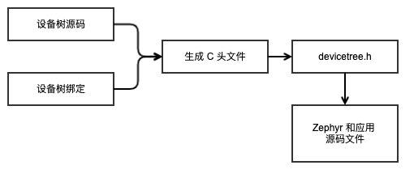
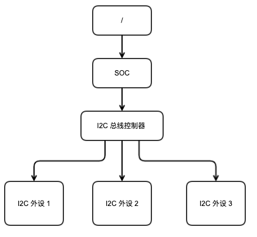

# 设备树概述

<a id="设备树概述"/>

:::info 提示
这是设备树以及 Zephyr 如何使用它的概念性概述。有关分步指南和示例，请参阅 [设备树操作指引](./howtos.md) 。
:::

*设备树* 是描述硬件的分层数据结构。 [设备树](https://www.devicetree.org/) 规范定义了它的源代码和二进制表示。 Zephyr 使用设备树来描述其支持的板型上可用的硬件，以及该硬件的初始配置。

有两种类型的设备树输入文件：*设备树源码* 和 *设备树绑定* 。这里的 *设备树源码* 即设备树本身；*设备树绑定* 则描述了设备树的内容，包括数据类型。[构建系统](../index.md) 使用设备树源码和绑定来生成一个 C 头文件。这一过程让你最终可以通过 `devicetree.h` API 获取你设备树中的信息。

这是该流程的概览：

<div style={{ textAlign: 'center' }}>



*设备树构建流程图*

</div>

所有 Zephyr 和应用程序源代码文件都可以引入并使用 `devicetree.h` 。这包括 [设备驱动程序](https://docs.zephyrproject.org/latest/kernel/drivers/index.html#device-model-api) 、 [应用程序](../../application/application_development.md) 、 [测试](https://docs.zephyrproject.org/latest/develop/test/index.html#testing) 、内核等。

该 API 本身基于 C 宏。此类宏名称都以 `DT_` 开头。一般来说，如果你在 Zephyr 源码中看到一个以 `DT_` 开头的宏，它就可能是存在于 `devicetree.h` 中的宏。生成的 C 头文件也包含以 `DT_` 开头的宏；你可能会在编译器错误消息中看到这些内容。但你总是可以在这些宏中分辨出，哪些是生成的、哪些不是生成的：生成的宏有一些小写字母，而 `devicetree.h` 宏名称全是大写字母。

设备树中定义的一些信息可通过 [Kconfig](../kconfig/index.md) 生成的 `CONFIG_` 宏获得。这通常是为了向后兼容，因为 Zephyr 使用 Kconfig 的时间超过了设备树，并且仍在将一些信息从 Kconfig 转换为设备树。 Zephyr 还允许 Kconfig 重写从设备树获取的默认值。在 Kconfig 中可通过 [Kconfig 函数](../kconfig/preprocessor_functions) 引用设备树信息。有关设备树与 Kconfig 的其他比较，请参阅 [设备树 VS Kconfig](./dt_vs_kconfig) 。

## 语法与结构

顾名思义，设备树就是一个树状结构。这一结构的具备可读性的格式称为 DTS 文件（用于设备树源码），这一文件格式定义在 [设备树规范](https://www.devicetree.org/) 中。

这是一个示例 DTS 文件：

```c
/dts-v1/;

/ {
        a-node {
                subnode_nodelabel: a-sub-node {
                        foo = <3>;
                        label = "SUBNODE";
                };
        };
};
```

`/dts-v1/;` 行表示文件的内容基于版本 1 的 DTS 语法，它已经替换了现在已过时的“版本 0”。

上面这个示例中的设备树有三个节点：

1. 一个根节点：`/`
2. 一个名为 `a-node` 的节点，它是根节点的子节点
3. 一个名为 `a-sub-node` 的节点，它是 `a-node` 的子节点

<a id="node-label" />

节点可以被分配 *节点标签* ，这是唯一的简写方式，标签可提供设备树中其他地方引用该节点。上文中， `a-sub-node` 的 *节点标签* 为 `subnode_nodelabel` 。一个节点可以有零个、一个或多个 *节点标签*。

设备树节点的路径用于标识它们在树中位置。与 Unix 文件系统路径一样，设备树路径是由斜杠 ( `/` ) 分隔的字符串，根节点的路径是单个斜杠： `/` 。其他情况下，每个节点的路径是通过将各个父节点名称与自身的名称连接起来形成的，用斜杠分隔。例如， `a-sub-node` 的完整路径是 `/a-node/a-sub-node` 。

设备节点也可以具有属性。属性是名称/值对（即每个属性需要包含一个名称，且有一个与之对应的值）。属性的值可以是任何字节序列。在某些情况下，这些值是称之为 *单元格( cell )* 的数组。一个单元格只是一个 32 位无符号整数。

节点 `a-sub-node` 有一个名为 `foo` 的属性，其值为值为 3 的单元格。 foo 值的大小和类型由 DTS 中的封闭尖括号（ `<` 和 `>` ）隐含。

参阅下文的 [设置属性值](#设置属性值) 查看更多属性值的例子。

在实践中，设备树节点通常对应一些硬件，节点层级反映了硬件的物理布局。假设一个开发板，包含三个 I2C 外设，且这些外设连接到 SoC 上的 I2C 总线控制器，如下所示：



对应到 I2C 总线控制器和每个 I2C 外围设备的节点将出现在设备树中。为了反映硬件布局，I2C 外设节点将是总线控制器节点的子节点。其他类型硬件的表示也存在类似约定。

DTS 文件看起来像这样：

```c
/dts-v1/;
/ {
        soc {
                i2c-bus-controller {
                        i2c-peripheral-1 {
                        };
                        i2c-peripheral-2 {
                        };
                        i2c-peripheral-3 {
                        };
                };
        };
};
```

属性在实践中用于描述或配置节点所代表的硬件。例如，I2C 外设的节点有一个属性，其值为外设在总线上的地址。

下方是代表相同层级的示例树的示意图，但具有真实的节点名称和属性，你在使用 I2C 设备时可能会看到。

<div style={{ textAlign: 'center' }}>


*具有真实的名称及属性的 I2C 设备树示例。节点名称位于每个节点的顶​​部中背景为灰色的部分。属性在下方显示为“name=value”*

</div>

这是它对应的 DTS 文件内容：

```c
/dts-v1/;
/ {
        soc {
                i2c@40003000 {
                        compatible = "nordic,nrf-twim";
                        label = "I2C_0";
                        reg = <0x40003000 0x1000>;

                        apds9960@39 {
                                compatible = "avago,apds9960";
                                label = "APDS9960";
                                reg = <0x39>;
                        };
                        ti_hdc@43 {
                                compatible = "ti,hdc", "ti,hdc1010";
                                label = "HDC1010";
                                reg = <0x43>;
                        };
                        mma8652fc@1d {
                                compatible = "nxp,fxos8700", "nxp,mma8652fc";
                                label = "MMA8652FC";
                                reg = <0x1d>;
                        };
                };
        };
};
```

除了显示更真实的名称和属性之外，上面的示例还引入了一个新的设备树概念：单元地址。单元地址是节点名称中“at”符号 ( `@` ) 之后的部分，如 `i2c@40003000` 中的 `40003000` 或 `apds9960@39` 中的 `39` 。单元地址是可选的：例如上方的 `soc` 节点就没有。

一些更详细的、有关单元地址和重要属性的信息在下文描述。

## 单元地址示例

在设备树中，单元地址表示了一个节点在其父节点地址空间中的地址。以下是不同类型硬件的一些示例单元地址。

<h4 style={{
 "background": "var(--ra-color-important)",
 "color": "var(--ra-color-note)",
  padding: 4 }}>内存映射外设</h4>

<div style={{ paddingLeft: 16 }}>

外设的寄存器映射起始地址。例如，名为 `i2c@40003000` 的节点表示一个寄存器映射起始地址为 0x40003000 的 I2C 控制器。

</div>

<h4 style={{
 "background": "var(--ra-color-important)",
 "color": "var(--ra-color-note)",
  padding: 4 }}>I2C 外设</h4>

<div style={{ paddingLeft: 16 }}>

I2C 总线上的外设地址。比如上一节中， I2C 控制器的子节点 `apds9960@39` 的 I2C 地址为 0x39 。

</div>

<h4 style={{
 "background": "var(--ra-color-important)",
 "color": "var(--ra-color-note)",
  padding: 4 }}>SPI 外设</h4>

<div style={{ paddingLeft: 16 }}>

表示外设的片选行号的索引。 （如果没有片选行，则使用 0 。）

</div>

<h4 style={{
 "background": "var(--ra-color-important)",
 "color": "var(--ra-color-note)",
  padding: 4 }}>内存</h4>

<div style={{ paddingLeft: 16 }}>

物理起始地址。例如，名为 `memory@2000000` 的节点表示从物理地址 0x2000000 开始的 RAM 。

</div>

<h4 style={{
 "background": "var(--ra-color-important)",
 "color": "var(--ra-color-note)",
  padding: 4 }}>内存映射闪存</h4>

<div style={{ paddingLeft: 16 }}>

与 RAM 一样，是物理起始地址。例如，一个名为 `flash@8000000` 的节点代表一个物理起始地址为 0x8000000 的 flash 设备。

</div>

<h4 style={{
 "background": "var(--ra-color-important)",
 "color": "var(--ra-color-note)",
  padding: 4 }}>固定闪存分区</h4>

<div style={{ paddingLeft: 16 }}>

这适用于设备树用于存储闪存分区表的情况。单元地址是分区在闪存中的起始偏移量。例如，以此闪存设备及其分区为例：

```c
flash@8000000 {
    /* ... */
    partitions {
            partition@0 { /* ... */ };
            partition@20000 {  /* ... */ };
            /* ... */
    };
};
```

名为 `partition@0` 的节点从其闪存设备的开始偏移量为 0，因此其起始地址为 0x8000000 。同样，名为 `partition@20000` 的节点的基地址为 0x8020000 。

</div>

## 重要属性

一些重要的属性是：

<h4 style={{
 "background": "var(--ra-color-important)",
 "color": "var(--ra-color-note)",
  padding: 4 }}>compatible</h4>

<div style={{ paddingLeft: 16 }}>

节点代表的硬件设备的名称。

推荐的格式是 `"vendor,device"` ，如 `"avago,apds9960"` ，或以此格式拼接的序列，如 `"ti,hdc", "ti,hdc1010"` 。 `vendor` 部分是供应商的缩写名称。文件 [dts/bindings/vendor-prefixes.txt](https://cloud.listenai.com/zephyr/zephyr/-/blob/master/dts/bindings/vendor-prefixes.txt) 包含一个普遍接受的 `vendor` 名称列表。 `device` 部分通常取自设备 datasheet 。

当硬件行为是通用的时候，这一值也可使用如 `gpio-keys` 、 `mmio-sram` 、 `fixed-clock` 之类的直接描述行为的词语。

构建系统使用 compatible 属性为节点找到正确的[绑定](./bindings.md)。设备驱动程序使用 `devicetree.h` 来查找具有对应 compatible 的节点，依次确定要管理的硬件中哪些是可用的。

`compatible` 属性允许有多个值。当设备是更通用系列的特定实例时，增加 `compatible` 属性值很有用，这样系统可以从最具体到最不具体的设备驱动程序进行匹配。

在 Zephyr 的绑定语法中，此属性的类型为字符串数组 `string-array` 。

</div>

<h4 style={{
 "background": "var(--ra-color-important)",
 "color": "var(--ra-color-note)",
  padding: 4 }}>label</h4>

<div style={{ paddingLeft: 16 }}>

设备的名称，根据 Zephyr 的 [设备驱动模型](https://docs.zephyrproject.org/latest/kernel/drivers/index.html#device-model-api) 确定。该值可以传给 [`device_get_binding()`](https://docs.zephyrproject.org/latest/kernel/drivers/index.html#c.device_get_binding) 以查找对应的驱动程序级 [struct device*](https://docs.zephyrproject.org/latest/kernel/drivers/index.html#device-struct) 指针。然后，应用程序代码通过将此指针传给正确的驱动程序 API ，从而与设备交互。例如，调用 `device_get_binding("I2C_0")` 将返回一个指向设备结构体的指针，它可以传给 [I2C 的 API](https://docs.zephyrproject.org/latest/hardware/peripherals/i2c.html#i2c-api) 函数，如 [`i2c_transfer()`](https://docs.zephyrproject.org/latest/hardware/peripherals/i2c.html#c.i2c_transfer) 。生成的 C 头文件还将包含一个可展开为此字符串的宏。

请注意，这里的 `label` 属性与上文的 [节点标签](#node-label) 并不同。

</div>

<h4 style={{
 "background": "var(--ra-color-important)",
 "color": "var(--ra-color-note)",
  padding: 4 }}>reg</h4>

<div style={{ paddingLeft: 16 }}>

用于对设备寻址的信息。该值特定于设备（即取决于 compatible 属性而有所不同）。

`reg` 属性是若干组 `(address, length)` 的序列。每一组称为“寄存器块”。以下是一些常见的模式：

- 通过内存映射 I/O 寄存器访问的设备（如 `i2c@40003000` ）：`address` 通常表示 I/O 寄存器空间的基地址， `length` 表示寄存器占用的字节数。

- I2C 设备（如 `apds9960@39` 及其同级设备）： `address` 表示 I2C 总线上的从机地址。没有 `length` 值。

- SPI设备： `address` 表示片选线号；没有 `length` 值。

You may notice some similarities between the `reg` property and common unit addresses described above. This is not a coincidence. The `reg` property can be seen as a more detailed view of the addressable resources within a device than its unit address.

你可能会注意到 `reg` 属性和上面描述通用的单元地址之间的一些相似之处。这并不是巧合。 `reg` 属性可以看作是设备内比其单元地址更详细的可寻址资源的视图。

</div>

<h4 style={{
 "background": "var(--ra-color-important)",
 "color": "var(--ra-color-note)",
  padding: 4 }}>status</h4>

<div style={{ paddingLeft: 16 }}>

描述节点是否启用的字符串。

设备树规范中规定了该属性的值可为 `"okay"` 、 `"disabled"` 、 `"reserved"` 、 `"fail"` 或 `"fail-sss"` 中的一个。目前只有 `"okay"` 和 `"disabled"` 与 Zephyr 相关；使用其他值当前会导致未定义的行为。

如果节点的状态属性为 `"okay"` 或未定义（例如在设备树源码中不存在），则认为节点已启用。状态为 `"disabled"` 的节点被显式禁用。 （为了向后兼容，属性值 `"ok"` 被视为与 `"okay"` 相同，但不推荐使用这种用法。）必须启用对应于物理设备的设备树节点，才能分配并初始化 Zephyr 驱动程序模型中的相应的结构体类型 `struct device` 。

</div>

<h4 style={{
 "background": "var(--ra-color-important)",
 "color": "var(--ra-color-note)",
  padding: 4 }}>interrupts</h4>

<div style={{ paddingLeft: 16 }}>

设备生成的中断的相关信息，编码为一个或多个 *中断说明符* 的数组。每个中断说明符都包含一些单元格。若需要了解更多详细信息，请参阅 [设备树规范 v0.3](https://www.devicetree.org/specifications/) 中的第 2.4 节，*《中断和中断映射 Interrupts and Interrupt Mapping 》*。

</div>

## 设置属性值

本节介绍如何以 DTS 格式语法写入属性值。下表中的属性类型在 [设备树绑定](./bindings.md) 中进行了详细描述。

为了简单起见，下文将略过一些细节；如果你对其中的细节感兴趣，可参阅设备树规范。

| 属性类型 | 如何设置 | 示例 |
| --- | --- | --- |
| string | 双引号 | `a-string = "hello,world!";` |
| int | 用尖括号括起（ `<` 和 `>` ） | `an-int = <1>;` |
| boolean | 对 `true` 以无属性值形式声明（对 `false` 使用 `/delete-property/` 声明） | `my-true-boolean;` |
| array | 用尖括号括起（ `<` 和 `>` ），用空格隔开 | `foo = <0xdeadbeef 1234 0>;` |
| uint8-array | *不以* `0x` 开头的十六进制表示。用方括号（`[` 和 `]`）括起。 | `a-byte-array = [00 01 ab];` |
| string-array | 用逗号隔开 | `a-string-array = "string one", "string two", "string three";` |
| phandle | 用尖括号括起（ `<` 和 `>` ） | `a-phandle = <&mynode>;` |
| phandles | 用尖括号括起（ `<` 和 `>` ），用空格隔开 | `some-phandles = <&mynode0 &mynode1 &mynode2>;` |
| phandle-array | 用尖括号括起（ `<` 和 `>` ），用空格隔开 | `a-phandle-array = <&mynode0 1 2 &mynode1 3 4>;` |

对上表的补充说明：

- 如果存在布尔属性，则为 true 。它们不应该有值。布尔属性只有在 DTS 中完全不存在时才为 false 。

- 上表 array 示例中， `foo` 属性值具有三个 *单元格* ，其值依次为 `0xdeadbeef` 、 `1234` 和 `0` 。请注意，十六进制和十进制数字是允许被使用、且可以混合使用的。由于 Zephyr 最终将 DTS 转换为 C 源码，因此无需在此处指定单个单元格的字节序。

- 64 位整数以大端序（ big-endian ）写入两个 32 位单元。例如值 0xaaaa0000bbbb1111 需要写入为 `<0xaaaa0000 0xbbbb1111>` 。

- 上表 uint8-array 示例中， `a-byte-array` 属性值是三个字节，依次为 0x00、0x01 和 0xab。

- 允许使用括号、算术运算符和位运算符。 下例 `bar` 属性包含一个值为 64 的单元格：

  ```c
  bar = <(2 * (1 << 5))>;
  ```

  请注意，整个表达式必须用尖括号括起来。

- 属性值通过它们的 phandles 引用设备树中的其他节点。假设 `foo` 是一个 [节点标签](#node-label) ，你可以使用 `&foo` 的方式声明一个引用 `foo` 的 phandle 。这是一个示例设备树片段：

  ```c
  foo: device@0 { };
  device@1 {
          sibling = <&foo 1 2>;
  };
  ```

  节点 `device@1` 的 `sibling` 属性包含三个单元格，顺序如下：

  1. `device@0` 节点的 phandle ，因为 `device@0` 节点有一个节点标签 `foo`，所以这里写为 `&foo` 

  2. 数值 1

  3. 数值 2

  在设备树中，一个 phandle 值是一个单元格 —— 这又是一个 32 位无符号整数。但是，Zephyr 设备树 API 通常将这些值公开为 *节点标识符* 。节点标识符将在 [从 C/C++ 访问设备树](./api_usage) 章节中更详细地介绍。

- 数组和类似类型的属性值可以分成若干个 `<>` 块，如下所示：

  ```c
  foo = <1 2>, <3 4>;                         // Okay for 'type: array'
  foo = <&label1 &label2>, <&label3 &label4>; // Okay for 'type: phandles'
  foo = <&label1 1 2>, <&label2 3 4>;         // Okay for 'type: phandle-array'
  ```

  我们建议你设置属性值时尽可能提高可读性，尤其是值可以在逻辑上分组为子值块的时候。

## 别名（ alias ）与被选中的节点（ chosen nodes ）

除了 [节点标签](#node-label) 之外，还有另外两种方式可以在不指定整个路径的情况下引用特定节点：别名（ alias ）或选择的节点 （ chosen node ）。

这是一个使用上述两种方式的示例设备树：

```c
/dts-v1/;

/ {
     chosen {
             zephyr,console = &uart0;
     };

     aliases {
             my-uart = &uart0;
     };

     soc {
             uart0: serial@12340000 {
                     ...
             };
     };
};
```

`/aliases` 和 `/chosen` 节点不是指实际的硬件设备。它们旨在可指向设备树中的其他节点。

上述示例中， `my-uart` 是一个别名，用于指向路径 `/soc/serial@12340000` 的节点。它使用其节点标签 `uart0` 声明为引用，这里的同一节点也设置为所选 `zephyr,console` 节点的值。

有时在 Zephyr 示例应用程序中，一种通用的方式是使用别名来允许覆盖应用程序使用的特定硬件设备。例如， [GPIO 示例](../../application/peripheral/samples/gpio.md) 使用这种方式通过 `led0` 别名来抽象要闪烁的 LED 。

`/chosen` 节点的属性用于配置系统或子系统范围的值。请参阅 [选择的节点](./api#选择的节点) 了解相关详细信息。

## 输入与输出文件

本节更详细地描述了 [本介绍最开始](#设备树概述) 的图中所示的输入和输出文件。

<div style={{ textAlign: 'center' }}>



*设备树输入（绿色）和输出（黄色）文件*

</div>

### 输入文件

有四种类型的设备树输入文件：

- 设备树源码 (`.dts`)
- 设备树包含文件 (`.dtsi`)
- 设备树覆盖 (`.overlay`)
- 设备树绑定 (`.yaml`)

`zephyr` 目录中的设备树文件如下所示：

```
boards/<ARCH>/<BOARD>/<BOARD>.dts
dts/common/skeleton.dtsi
dts/<ARCH>/.../<SOC>.dtsi
dts/bindings/.../binding.yaml
```

一般来说，每个支持的板都有一个 `BOARD.dts` 文件来描述它的硬件。例如， `csk6002_9s_nano` 对应 [boards/arm/csk6002_9s_nano/csk6002_9s_nano.dts](https://cloud.listenai.com/zephyr/zephyr/-/blob/master/boards/arm/csk6002_9s_nano/csk6002_9s_nano.dts) 。

`BOARD.dts` 可包含一个或多个 `.dtsi` 文件。这些 `.dtsi` 文件描述了 Zephyr 运行的 CPU 或板载系统，可能包含其他 `.dtsi` 文件。它们还可以描述多个板共享的其他常见硬件功能。除了这些包含文件之外，`BOARD.dts` 还描述了板型上的特定硬件。

`dts/common` 目录包含 `skeleton.dtsi` ，这是一个用于定义完整设备树的最小包含文件。特定于体系结构的子目录 (`dts/<ARCH>`) 中包含的、用于描述 CPU 或 SoC 的 `.dtsi` 文件都基于 `skeleton.dtsi` 拓展。

为了展开所有宏引用， C 预处理器会在所有设备树文件上运行，并且包含操作通常使用 `#include <filename>` 指令完成，即使在 DTS 中有 `/include/ "<filename>"` 语法。

*overlay* （覆盖）文件可用于对 `BOARD.dts` 进行扩展或修改。 overlay 文件也是 DTS 格式的文件； `.overlay` 扩展名只是一个明确其目的的约定。 overlay 用将基础设备树用于不同的目的：

- Zephyr 应用程序可以使用 overlay 来启用默认禁用的外围设备、为特定应用程序选择板上的传感器等。配合 [配置系统 (Kconfig)](../kconfig/index.md) ，可实现无需修改即可重新配置内核和设备驱动程序源代码。

- 定义 [Shields](https://docs.zephyrproject.org/latest/hardware/porting/shields.html#shields) 时也会使用 overlay 。

构建系统会自动收集存储在特定位置的 `.overlay` 文件。还可以通过 CMake 变量 **DTC_OVERLAY_FILE** 显式列出要包含的 overlay 文件。请参阅 [设置设备树 overlay](./howtos.md#如何设置设备树-overlay) 了解相关详细信息。

构建系统通过将 `BOARD.dts` 和任何 `.overlay` 文件关联起来，将它们组合在一起，overlay 在最后放入。这依赖于 DTS 语法中允许合并设备树中节点的重复定义的设计。有关其工作原理的示例，请参见 [示例：FRDM-K64F 和 Hexiwear K64](https://docs.zephyrproject.org/latest/hardware/porting/board_porting.html#dt-k6x-example) （在 `.dtsi` 文件的上下文中，但 overlay 文件的原理相同）。最后将 `.overlay` 文件的内容放进来以允许它们覆盖 `BOARD.dts` 。

[设备树绑定](./bindings.md) （ YAML 文件）本质上是胶水代码（即用于适配原本不兼容逻辑的代码的）。他们通过允许构建系统生成可供设备驱动程序和应用程序使用的 C 宏的方式，描述了设备树源码、包含（ include ）和覆盖（ overlay ）的内容。  `dts/bindings` 目录包含绑定。

#### 脚本与工具

以下库和脚本位于 [scripts/dts/](https://cloud.listenai.com/zephyr/zephyr/-/blob/master/scripts/dts/) 中，用于从输入文件创建输出文件。他们的源码中包含大量的文档。

<h4 style={{
 "background": "var(--ra-color-important)",
 "color": "var(--ra-color-note)",
  padding: 4 }}>
<a href="https://cloud.listenai.com/zephyr/zephyr/-/blob/master/scripts/dts/python-devicetree/src/devicetree/dtlib.py" style={{
  color: "var(--ra-color-note)"
}}>dtlib.py</a>
</h4>

<div style={{paddingLeft: 16}}>

一个底层 DTS 解析库。

</div>

<h4 style={{
 "background": "var(--ra-color-important)",
 "color": "var(--ra-color-note)",
  padding: 4 }}>
<a href="https://cloud.listenai.com/zephyr/zephyr/-/blob/master/scripts/dts/python-devicetree/src/devicetree/edtlib.py" style={{
  color: "var(--ra-color-note)"
}}>edtlib.py</a>
</h4>

<div style={{paddingLeft: 16}}>

一个层级位于 dtlib 之上的库，它使用绑定来解释属性并提供设备树的更高级别视图。使用 dtlib 进行 DTS 解析。

</div>

<h4 style={{
 "background": "var(--ra-color-important)",
 "color": "var(--ra-color-note)",
  padding: 4 }}>
<a href="https://cloud.listenai.com/zephyr/zephyr/-/blob/master/scripts/dts/gen_defines.py" style={{
  color: "var(--ra-color-note)"
}}>gen_defines.py</a>
</h4>

<div style={{paddingLeft: 16}}>

使用 edtlib 从设备树和绑定生成 C 预处理器宏的脚本。

</div>

除此之外，如果你的系统上安装了标准 `dtc` （设备树编译器）工具，它会在最终的设备树上运行。这只是为了捕获错误或警告，其输出是未被使用的。板型可能需要传递 `dtc` 附加标志，例如用于抑制警告。 板型目录可以包含一个名为 `pre_dt_board.cmake` 的文件，该文件用于配置这些额外的标志，如下所示：

```c
list(APPEND EXTRA_DTC_FLAGS "-Wno-simple_bus_reg")
```

### 输出文件

以下是在应用程序的构建目录中创建的文件。

:::warning 警告
虽然设备树各个节点的信息都将在头文件以宏的形式存在，但不要直接引用他们！ [从 C/C++ 访问设备树](./api_usage.md) 章节中解释了正确的做法是怎样的。
:::


<h4 style={{
 "background": "var(--ra-color-important)",
 "color": "var(--ra-color-note)",
  padding: 4 }}>
<code style={{
 "background": "var(--ra-color-note)",
 "color": "var(--ra-color-important)"
}}>&lt;build&gt;/zephyr/zephyr.dts.pre</code></h4>

<div style={{paddingLeft: 16}}>

预处理的 DTS 源。这是一个中间输出文件，它是 `gen_defines.py` 的输入，用于创建 `zephyr.dts` 和 `devicetree_unfixed.h` 。

</div>

<h4 style={{
 "background": "var(--ra-color-important)",
 "color": "var(--ra-color-note)",
  padding: 4 }}>
<code style={{
 "background": "var(--ra-color-note)",
 "color": "var(--ra-color-important)"
}}>&lt;build&gt;/zephyr/include/generated/devicetree_unfixed.h</code></h4>

<div style={{paddingLeft: 16}}>

生成的宏和附加注释，这里的注释用于描述设备树。包含在 `devicetree.h` 中。

</div>

<h4 style={{
 "background": "var(--ra-color-important)",
 "color": "var(--ra-color-note)",
  padding: 4 }}>
<code style={{
 "background": "var(--ra-color-note)",
 "color": "var(--ra-color-important)"
}}>&lt;build&gt;/zephyr/include/generated/devicetree_fixups.h</code></h4>

<div style={{paddingLeft: 16}}>

任何 `dts_fixup.h` 文件的串联内容。包含在 `devicetree.h` 中。

</div>

<h4 style={{
 "background": "var(--ra-color-important)",
 "color": "var(--ra-color-note)",
  padding: 4 }}>
<code style={{
 "background": "var(--ra-color-note)",
 "color": "var(--ra-color-important)"
}}>&lt;build&gt;/zephyr/zephyr.dts</code></h4>

<div style={{paddingLeft: 16}}>

最终合并的设备树。该文件由 `gen_defines.py` 输出。它对于调试任何问题都很有用。如果安装了设备树编译器 `dtc` ，它也会在此文件上运行，以捕获任何其他警告或错误。

</div>