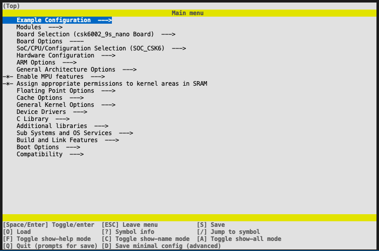
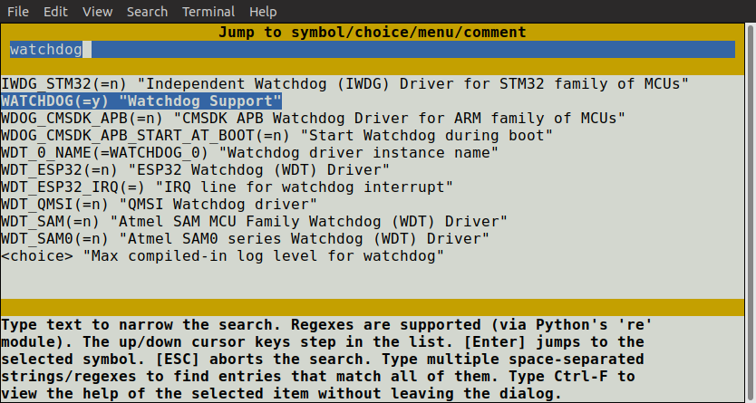

# Kconfig交互界面

## menuconfig

`menuconfig`是在终端中运行的基于curses的界面.

:::info
可通过手动编辑在应用构建目录中的 `zephyr/.config` 来更改配置，使用配置界面进行配置更方便，它们能正确处理配置中的依赖关系,如果你尝试在 `zephyr/.config` 中启用未满足依赖项的选项。重新配置时，配置值将被忽略和覆盖。
:::

在项目中，要使设置永久生效，你应该在`xxx.conf`文件中设置，如[设置Kconfig配置](./Kconfig_configuration.md)中描述的

执行以下命令运行配置界面：

1. 使用 `lisa zep` 像往常一样构建你的应用:

```
lisa zep build -b <board>
```

2. 使用 lisa zep 终端的`menuconfig`界面

```
lisa zep build -t menuconfig -b <board>
```

界面所示如下：



3. 在 `menuconfig` 中通过以下方式来更改配置

* 使用箭头键导航菜单，支持常见的vim键绑定。
  
* 使用 `空格` 和 `回车`键进入菜单和切换值，菜单旁边会显示`--->`。按下`ESC`以返回父菜单。
布尔值配置选项用 `[ ]` 括号显示,数字和字符串值用 `( )` 显示，无法更改的值显示为 `--` 或 `-*-` 。 

:::info
你也可以用`Y`或`N`对布尔值进行设置
:::

* 按 `?` 显示有关当前选项的信息，包括帮助文本。按  `ESC`  或  `Q`  从信息显示返回到菜单
  
4. 按下 `Q`  在menuconfig会弹出保存和退出对话框。


按`Y`将内核配置选项保存为默认文件名`zephyr/.config`

:::info 
构建期间使用的文件始终为 `zephyr/.config`. 如果你有另外一个要构建的已保存配置想构建，可将其复制到 `zephyr/.config`. 复制前确保你的原始配置文件已备份  
另外注意的是，在Linux和macOS上默认情况下 `.` 开头的文件不会显示，可用 `ls -a`  来查看
:::

在菜单树中找到和导航到指定选项非常麻烦，要跳转到指定选项，请按 `/` 键来进行搜索并跳转。


如果你跳转到当前不可见的选项（例如：不满足的依赖关系），则启用全部显示模式。在该模式下，所有选项都会被显示，包括当前不可见的选项，要关闭按 `A` 即可。

:::info
如果当前菜单没有可见项目，则无法关闭全部显示模式。
:::

要找出你跳转到的符号不可见原因，请检查依赖关系，方法是按下 `?` 键。如果你发现该选项依赖另外一个未启用的选项，你可以跳转到该选项查看它是否启用。

:::info
在menuconfig，你可以在不离开对话框的情况下，按 `Ctrl-F` 查看当前选项的帮助。
:::

```
* 上下方向键：移动选项光标；

* 右方向键|空格|回车：选择选项 or 进入选项；

* 左方向键|ESC：返回 or 退出；

* /：进入选项搜索（按 *esc* 返回）；

* shift + ? ：显示选项信息；

* shift + s： 保存配置；

* shift + q： 保存配置；

```

有关 `menuconfig` 的更多信息，请参考 [menuconfig.py](https://cloud.listenai.com/zephyr/zephyr/-/tree/master/scripts/kconfig/menuconfig.py)。
