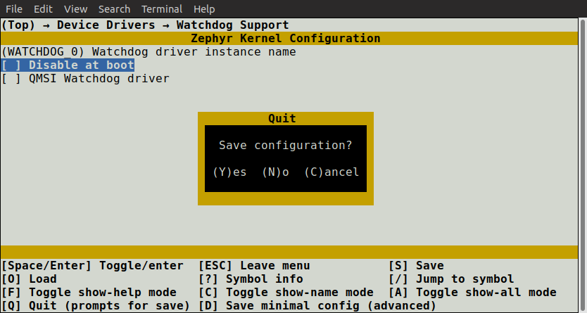

# Kconfig交互界面

## menuconfig

menuconfig is a curses-based interface that runs in the terminal.  
`menuconfig`是在终端中运行的基于curses的界面.

:::info
The configuration can also be changed by editing zephyr/.config in the application build directory by hand. Using one of the configuration interfaces is often handier, as they correctly handle dependencies between configuration symbols.
If you try to enable a symbol with unsatisfied dependencies in zephyr/.config, the assignment will be ignored and overwritten when re-configuring.  
可通过手动编辑在应用构建目录中的 `zephyr/.config` 来更改配置，使用配置界面进行配置更方便，它们能正确处理配置中的依赖关系,如果你尝试在 `zephyr/.config` 中启用未满足依赖项的选项。重新配置时，配置值将被忽略和覆盖。
:::

To make a setting permanent, you should set it in a *.conf file, as described in Setting Kconfig configuration values.  
在项目中，要使设置永久生效，你应该在`xxx.conf`文件中设置，如[设置Kconfig配置](./Kconfig_configuration.md)中描述的

To run one of the configuration interfaces, do this:

执行以下命令运行配置界面：

Build your application as usual using either `lisa zep`:
1. 使用 `lisa zep` 像往常一样构建你的应用:

```
lisa zep build -b <board>
```

To run the terminal-based menuconfig interface, use either of these commands:  
2. 使用 lisa zep 终端的`menuconfig`界面

```
lisa zep build -t menuconfig -b <board>
```

The two interfaces are shown below:
界面所示如下：


Change configuration values in the menuconfig interface as follows:  
3. 在 `menuconfig` 中通过以下方式来更改配置

* Navigate the menu with the arrow keys. Common Vim key bindings are supported as well.

* Use Space and Enter to enter menus and toggle values. Menus appear with ---> next to them. Press ESC to return to the parent menu.

Boolean configuration options are shown with [ ] brackets, while numeric and string-valued configuration symbols are shown with ( ) brackets. Symbol values that can’t be changed are shown as - - or -*-.

* 使用箭头键导航菜单，支持常见的vim键绑定。
  
* 使用 `空格` 和 `回车`键进入菜单和切换值，菜单旁边会显示`--->`。按下`ESC`以返回父菜单。
布尔值配置选项用 `[ ]` 括号显示,数字和字符串值用 `( )` 显示，无法更改的值显示为 `--` 或 `-*-` 。

:::info
你也可以用`Y`或`N`对布尔值进行设置
:::

* 按 `?` 显示有关当前选项的信息，包括帮助文本。按  `ESC`  或  `Q`  从信息显示返回到菜单
  
Pressing Q in the menuconfig interface will bring up the save-and-quit dialog (if there are changes to save):  
1. 按下 `Q`  在menuconfig会弹出保存和退出对话框。



Press Y to save the kernel configuration options to the default filename (zephyr/.config). You will typically save to the default filename unless you are experimenting with different configurations.  
按`Y`将内核配置选项保存为默认文件名`zephyr/.config`

:::info 
The configuration file used during the build is always zephyr/.config. If you have another saved configuration that you want to build with, copy it to zephyr/.config. Make sure to back up your original configuration file.
Also note that filenames starting with . are not listed by ls by default on Linux and macOS. Use the -a flag to see them.   
构建期间使用的文件始终为 `zephyr/.config`. 如果你有另外一个要构建的已保存配置想构建，可将其复制到 `zephyr/.config`. 复制前确保你的原始配置文件已备份  
另外注意的是，在Linux和macOS上默认情况下 `.` 开头的文件不会显示，可用 `ls -a`  来查看
:::

Finding a symbol in the menu tree and navigating to it can be tedious. To jump directly to a symbol, press the / key (this also works in guiconfig). This brings up the following dialog, where you can search for symbols by name and jump to them. In guiconfig, you can also change symbol values directly within the dialog.  
在菜单树中找到和导航到指定选项非常麻烦，要跳转到指定选项，请按 `/` 键来进行搜索并跳转。


If you jump to a symbol that isn’t currently visible (e.g., due to having unsatisfied dependencies), then show-all mode will be enabled. In show-all mode, all symbols are displayed, including currently invisible symbols. To turn off show-all mode, press A in menuconfig  
如果你跳转到当前不可见的选项（例如：不满足的依赖关系），则启用全部显示模式。在该模式下，所有选项都会被显示，包括当前不可见的选项，要关闭按 `A` 即可。

:::info
Show-all mode can’t be turned off if there are no visible items in the current menu.
如果当前菜单没有可见项目，则无法关闭全部显示模式。
:::

To figure out why a symbol you jumped to isn’t visible, inspect its dependencies, either by pressing ? in menuconfig or in the information pane at the bottom in guiconfig. If you discover that the symbol depends on another symbol that isn’t enabled, you can jump to that symbol in turn to see if it can be enabled.  
要找出你跳转到的符号不可见原因，请检查依赖关系，方法是按下 `?` 键。如果你发现该选项依赖另外一个未启用的选项，你可以跳转到该选项查看它是否启用。

:::info
In menuconfig, you can press Ctrl-F to view the help of the currently selected item in the jump-to dialog without leaving the dialog.  
在menuconfig，你可以在不离开对话框的情况下，按 `Ctrl-F` 查看当前选项的帮助。
:::

```
* 上下方向键：移动选项光标；

* 右方向键|空格|回车：选择选项 or 进入选项；

* 左方向键|ESC：返回 or 退出；

* /：进入选项搜索（按 *esc* 返回）；

* shift + ? ：显示选项信息；

* shift + s： 保存配置；

* shift + q： 保存配置；

```

For more information on `menuconfig` , see the Python docstrings at the top of [menuconfig.py](https://cloud.listenai.com/zephyr/zephyr/-/tree/master/scripts/kconfig/menuconfig.py) .  

有关 `menuconfig` 的更多信息，请参考 [menuconfig.py](#)。
