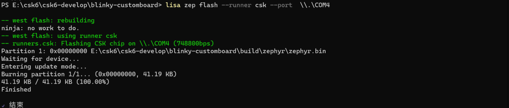

# CSK6 烧录

## 概述
CSK6 Lisa 开发环境集成了烧录工具，开发者可通过指令完成烧录，烧录指令可以附带不同的选项和参数实现不同的操作，通过本章节学习，您将了解到：
- csk6 应用项目的编译产物
- csk6 的烧录方式

## 编译产物
基于 csk6 sdk 创建的 app 项目生成编译产物的方式是在该 app 项目根目录下执行编译指令:

```bash
lisa zep build -b csk6002_9s_nano
```
编译产物为 `zephyr.bin`，默认生成路径：`app\build\zephyr\zephyr.bin`。

### 指定编译产物的输出路径
在执行编译命令时，带上 `--build-dir` 和 `path` 相对路径或绝对路径可指定编译产物生成的路径，如下示例：

```bash
lisa zep build -b csk6002_9s_nano --build-dir C:\Users\xxx\Desktop\build
```
该命令执行后，编译产物会存放到 `C:\Users\xxx\Desktop\build` 目录下。

:::tip
若不想每次都带上 `--build-dir` ，也支持更改默认编译产物输出路径：
lisa zep config build.dir-fmt "you_want_build_path"
:::

## 烧录指令的用法
```bash
lisa zep flash [opts] <args>
```
### 烧录指定编译产物
烧录指定编译产物时，可以通过带入编译产物所在的 build 文件夹路径来完成：
```bash
lisa zep flash --build-dir .\blinky\build
```

:::tip
`lisa zep flash` 暂不支持直接带入 `zephyr.bin` 文件的烧录方式，需要将 `zephyr.bin` 所在的 build目录 带入，当你需要对一个 `zephyr.bin` 进行烧录时，可将`zephyr.bin` 替换到任一项目的 build 目下，使用上述命令进行烧录。
:::

### 指定烧录工具
通过指定烧录工具如：jlink、pyocd、串口等工具来实现`zephyr.bin`编译产物的烧录。例如：
```bash
lisa zep flash --runner pyocd
```
当前烧录产物支持的 `runner`，以及默认设置烧录工具可以在 `app\build\zephyr\runners.yaml` 文件中找到,，具体如下：
```bash
# Available runners configured by board.cmake.
runners:
- jlink
- pyocd
- csk

# Default flash runner if --runner is not given.
flash-runner: pyocd

# Default debug runner if --runner is not given.
debug-runner: pyocd
```

从 `runners.yaml` 配置文件中可以看到，CSK-6-NanoKit 开发板支持以下几种烧录方式:

- jlink

- pyocd

- csk(串口)

从配置文件可以看到，当不指定烧录工具时默认 pyocd 作为烧录工具。

### 烧录方式一：使用 pyOCD 作为烧录工具
CSK6-NanoKit 板载了 DAPLink 调试器芯片，开发者可通过 DAPLink USB 接口对 CSK6 芯片进行固件烧录。

**烧录指令：**

```bash
lisa zep flash --runner pyocd
```

烧录过程日志：


:::note
本烧录方式仅支持带 DAPLink 调试器芯片的开发板，若无 DAPLink 的硬件请选择其他烧录工具进行烧录。

本烧录方式在Windows系统下可能出现烧录速度慢的问题，出现此问题时建议选择其他烧录方式。
:::

### 烧录方式二：使用 J-Link 作为烧录工具
CSK6-NanoKit 开发板预留了 SWD 烧录接口，开发者可以通过 SWD 接口将 J-Link 仿真器和开发板连接。

**烧录指令：**

```bash
lisa zep flash --runner jlink
```
准备工作：
- `J-Link` 仿真器，并成功安装驱动，[J-Link 驱动下载](https://iflyos-external.oss-cn-shanghai.aliyuncs.com/public/lsopen/zephyr/%E5%B7%A5%E5%85%B7/JLink_Windows_V630d.exe)。

- 将 J-Link 仿真器和 CSK6-NanoKit 通过 SWD 接口连接，接线方式如下：


烧录过程日志：


:::tip
该烧录方式需要硬件板子预留 SWD 接口。
:::

### 烧录方式三：使用 csk(串口) 作为烧录工具
CSK6-NanoKit 板载了 DAPLink 调试器芯片，DAPLink 虚拟了一个串口，开发者可通过指定的虚拟串口对 csk6 进行烧录。

**烧录指令：**

```
lisa zep flash --runner csk --port  \\.\COMXX
```

其中，COMXX 为 DAPLink 在电脑设备管理器中的虚拟串口：


烧录过程日志：


:::tip
该烧录方式仅支持带 DAPLink 调试器芯片的硬件板，若无板载 DAPLink 的硬件请选择其他烧录工具进行烧录。
:::