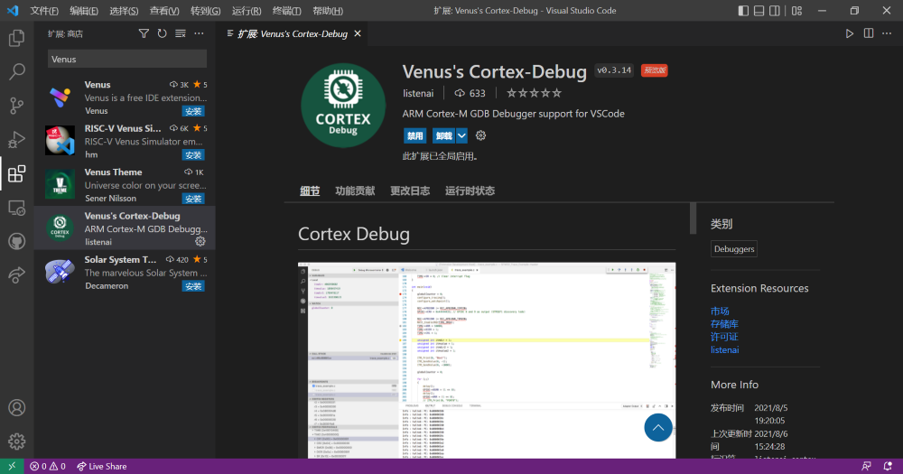
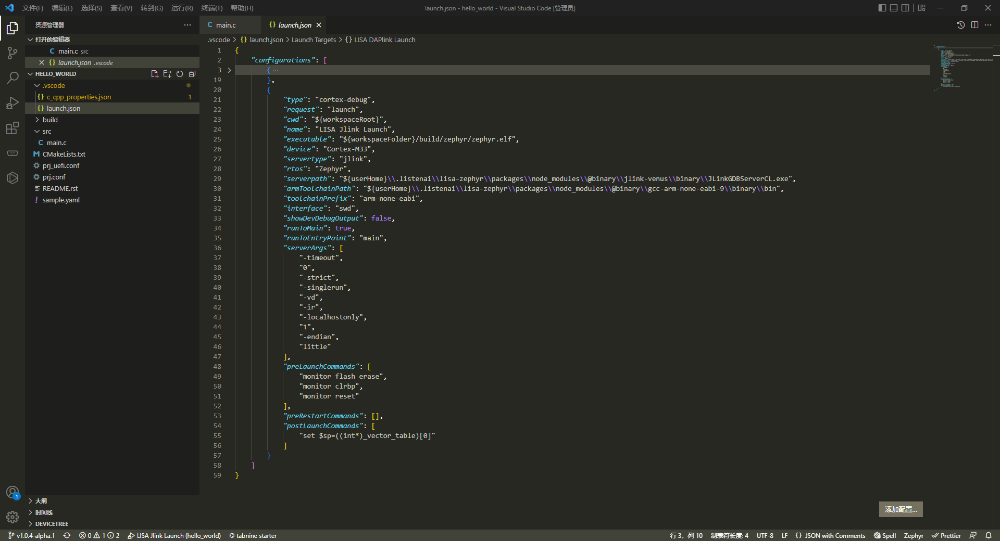
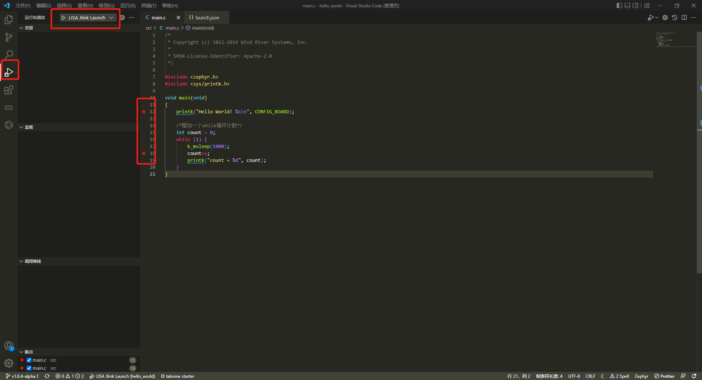
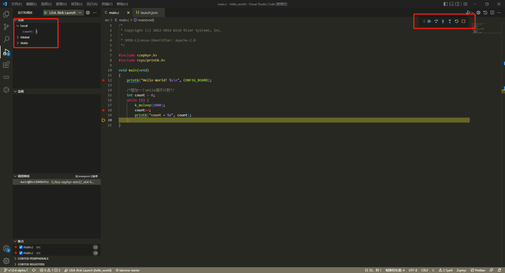
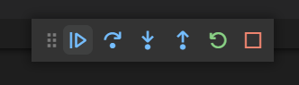

# 基于 J-Link 的 GDB 调试

## 概述

Zephyr 提供了多种 debug 调试方式，支持 GDB 调试，本章节主要介绍如何基于 VS Code 和 J-Link 仿真器实现应用调试。通过本章节学习，开发者可以了解到：
- PC 端如何对应用项目进行调试
- 基于 VS Code 和 J-Link 的调试方法

:::note
Windows 系统和 Ubuntu 系统下配置的基本一致。
:::

## 准备工作
- CSK6-NanoKit 开发板。
- `J-Link` 仿真器，并成功安装驱动，[J-Link驱动下载](https://iflyos-external.oss-cn-shanghai.aliyuncs.com/public/lsopen/zephyr/%E5%B7%A5%E5%85%B7/JLink_Windows_V630d.exe)。
- PC 端安装 `VSCode`，根据系统类型选择对应的 Windows 或 Linux 版本，[Visual Studio Code 官网下载入口](https://code.visualstudio.com/Download)。
- `csk6002_9s_nano` 的日志串口 `A03 TX A02 RX` 接串口板连接电脑，在电脑端使用串口调试助手查看日志，波特率为 115200。

将 CSK6-NanoKit 开发板和 J-Link 仿真器 SWD 接口按以下接线图完整连接：


## 调试过程

### VSCode 调试环境搭建
#### VSCode 安装 `Cortex-Debug` 调试插件
在 VSCode 应用商店中搜索 `Cortex-Debug` 扩展插件，并完成安装，如下图所示：



#### 基于已有项目的完成debug 环境配置

**步骤一：** 在已有项目目录下使用 `lisa zep build -b csk6002_9s_nano` 命令完成编译。

**步骤二：** 在已有项目目录下使用 `lisa zep ide` 生成debug配置文件launch.json。

**步骤三：** 关闭所有已经打开的VSCode，重新运行并打开刚才的项目文件夹。可以查看到该目录下已经存在 `.vscode/launch.json` 文件。


#### 创建新项目并完成 debug 环境配置

**步骤一：** 选择一个目录用于存放我们即将创建的项目，在该目录下使用 `lisa zep create` 命令创建 `hello_world` 项目，并使用 `lisa zep build -b csk6002_9s_nano` 命令完成编译。

**步骤二：** 在VSCode中打开刚刚创建的hello_world项目，可以查看到该目录下已经存在 `.vscode/launch.json` 文件。

#### 配置文件变量说明

`executable`: debug 应用项目的 zephyr.elf 文件路径，本示例为`hello_world` 项目的 zephyr.elf 路径。


`serverpath`: lisa 安装时带入的 `JLinkGDBServerCL` 可执行文件路径。


`armToolchainPath`: lisa 安装时带入编译链的路径。



:::tip
.vscode 下放置的是各种配置文件，如：task.json 文件、launch.json 文件等，如遇配置文件不生效的情况，可关闭所有已打开VSCode之后重新运行。
:::

### 对 `hello_world` 项目进行 debug 调试
#### 步骤一：基于 `hello_world` 应用代码增加简单的代码逻辑
```c
void main(void)
{
	printk("Hello World! %s\n", CONFIG_BOARD);

    /*增加一个while循环计数*/
    int count = 0;
	while (1) {
        k_msleep(1000);
        count++;
        printk("count = %d", count);
	}
}
```
#### 步骤二：编译和烧录  
- **编译**
在 app 根目录下通过以下指令完成编译：
```
lisa zep build -b csk6002_9s_nano
```
- **烧录**   

指定 J-Link 作为烧录方式始烧录固件：
```
lisa zep flash --runner jlink
```

:::tip
待调试的应用程序需要完成编译并烧录到开发板后才能进行调试。
:::

#### 步骤三：断点调试
##### 增加断点

在 main 函数的第 12 行和第 18 行左侧单击鼠标左键增加两个断点，点击 VSCode 侧边栏的运行和调试按钮进入调试模式并选择LISA Jlink Launch调试任务，如下图示：




##### 开始调试  
增加断点后点击运行调试按钮 (F5) 开始运行，变量值及监控变量可以在运行调试过程中显示，如下图示：



从上图可看到，当开始 F5 运行调试后，程序会停在第一个断点，此时 F5 继续执行后程序输出 `Hello world！` 并调到第二个断点等待继续，此后每按一次 F5 继续执行则 while 循环中 count 自增并循环输出日志等待继续执行，同时在侧边栏可以看到 count 在调试过程中值的变化。

##### 调试操作按钮



##### 常用调试快捷键
- F5 继续(执行到下一个断点)
- F10 单步调过
- F11 单步调试
- Shift+F11 单步跳出
- ctrl+shift+F5 重启
- shift+F5 停止

以上就是 Zephyr 应用程序的基本调试方法，开发者可以在使用过程中尝试更多的调试手段。


