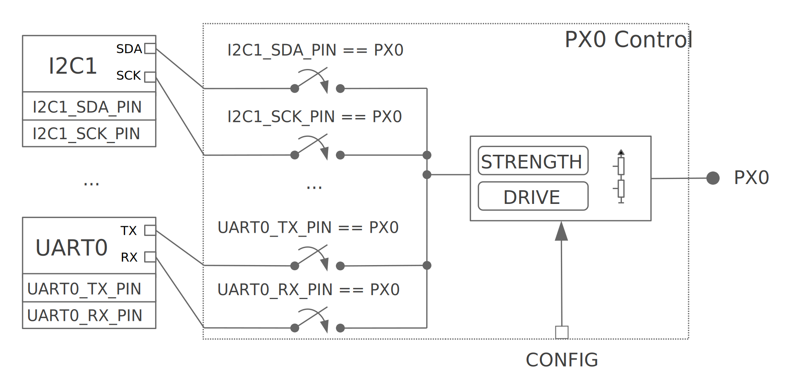

# 引脚控制

This is a high-level guide to pin control. See Pin Control API for API reference material.  
这是引脚控制的高级指南。有关API参考资料，请参考 [引脚控制API](https://docs.zephyrproject.org/latest/hardware/pinctrl/index.html#pinctrl-api)
## 介绍

The hardware blocks that control pin multiplexing and pin configuration parameters such as pin direction, pull-up/down resistors, etc. are named pin controllers. The pin controller’s main users are SoC hardware peripherals, since the controller enables exposing peripheral signals, like for example, map I2C0 SDA signal to pin PX0. Not only that, but it usually allows configuring certain pin settings that are necessary for the correct functioning of a peripheral, for example, the slew-rate depending on the operating frequency. The available configuration options are vendor/SoC dependent and can range from simple pull-up/down options to more advanced settings such as debouncing, low-power modes, etc.  
控制引脚复用和引脚配置参数(如引脚方向、上拉/下拉电阻等)的硬件模块称为**引脚控制器**。引脚控制器的主要使用者是 SoC 硬件外围设备，因为控制器可以公开外微信号，如将 `I2C0` `SDA` 信号映射到引脚 `PX0`。不仅如此，为了外设的正常运行，它还允许配置某些引脚设置，例如，根据工作频率的转速。可用的配置选项是供应商/SoC提供的，范围从简单的上拉/下拉选项到更高级的设置，例如，消抖、低功耗模式等。

The way pin control is implemented in hardware is vendor/SoC specific. It is common to find a centralized approach, that is, all pin configuration parameters are controlled by a single hardware block (typically named pinmux), including signal mapping. Fig. 35 illustrates this approach. PX0 can be mapped to UART0_TX, I2C0_SCK or SPI0_MOSI depending on the AF control bits. Other configuration parameters such as pull-up/down are controlled in the same block via CONFIG bits. This model is used by several SoC families, such as many from NXP and STM32.  
引脚控制在硬件上的实现方式是特定于供应商/SoC的。通常可以找到一种集中式方法，即所有引脚配置参数都由单个硬件模块（通常称为pinmux）控制，包括信号映射。[图35](#picture35)说明了这种方式。根据`AF`控制位, `PX0`可以映射到`UART0_TX`,`I2C0_SCK`或`SPI0_MOSI`。其他配置参数（如上拉/下拉）通过`CONFIG`位在同一块种控制。该模型被多个SoC系列使用，例如NXP 和 STM32等多个系列。

<center><span id="picture35">图35</span>引脚控制集中到单个引脚块的示例</center>

Other vendors/SoCs use a distributed approach. In such case, the pin mapping and configuration are controlled by multiple hardware blocks. Fig. 36 illustrates a distributed approach where pin mapping is controlled by peripherals, such as in Nordic nRF SoCs.  
其他供应商/SoC使用分布式方法。在这种情况下，引脚映射和配置由多个硬件模块控制。[图36](#picture36)说明了一种分布式方法，其中引脚映射由外围设备控制，例如在 Nordic nRF SoC中。


<center><span id="picture36">图36</span>分布在外围寄存器和每个引脚块之间的引脚控制实例</center>

From a user perspective, there is no difference in pin controller usage regardless of the hardware implementation: a user will always apply a state. The only difference lies in the driver implementation. In general, implementing a pin controller driver for a hardware that uses a distributed approach requires more effort, since the driver needs to gather knowledge of peripheral dependent registers.  
从用户角度来看，无论硬件如何实现，引脚控制起的使用都是一样的：用户总是应用一个状态。唯一的区别在于驱动程序的实现。一般来说，为使用分布式方法的硬件实现引脚控制起驱动程序需要更多时间，因为驱动程序需要收集与外围设备相关的寄存器知识。

### 引脚控制与GPIO

Some functionality covered by a pin controller driver overlaps with GPIO drivers. For example, pull-up/down resistors can usually be enabled by both the pin control driver and the GPIO driver. In Zephyr context, the pin control driver purpose is to perform peripheral signal multiplexing and configuration of other pin parameters required for the correct operation of that peripheral. Therefore, the main users of the pin control driver are SoC peripherals. In contrast, GPIO drivers are for general purpose control of a pin, that is, when its logic level is read or controlled manually.  
引脚控制起驱动程序覆盖的一些功能与GPIO驱动程序重叠。例如，上拉/下拉电阻通常可以通过引脚控制驱动程序和 GPIO 驱动程序启用。在csk6上下文中，引脚控制驱动程序的目的是执行外设信号复用和配置该外设正确操作所需的其他引脚参数。因此，引脚控制驱动程序的主要使用者是 SoC 外围设备。

## 状态模型

For a device driver to operate correctly, a certain pin configuration needs to be applied. Some device drivers require a static configuration, usually set up at initialization time. Others need to change the configuration at runtime depending on the operating conditions, for example, to enable a low-power mode when suspending the device. Such requirements are modeled using states, a concept that has been adapted from the one in the Linux kernel. Each device driver owns a set of states. Each state has a unique name and contains a full pin configuration set (see Table 38). This effectively means that states are independent of each other, so they do not need to be applied in any specific order. Another advantage of the state model is that it isolates device drivers from pin configuration.  
为了使设备驱动程序正确运行，需要应用特定的引脚配置。一些设备驱动程序需要静态配置，通常在初始化时设置。其他人则需要根据运行条件在运行时更改配置，例如，在挂起设备时启用低功耗模式。这些需求时使用**状态**建模的，这是一个从Linux内核中改编而来的概念。每个设备驱动程序都拥有一组状态。每个状态都有一个唯一的名称并包含一个完整的引脚配置集（[参考表38](#table38)）。这意味着状态是相互独立的，因此它们不需要以任何特定的顺序使用。状态模型的另外一个优点是它将设备驱动程序与引脚配置隔离开来。

<table>
    <tr>
        <th colspan="4">UART0 外围设备</th>
    </tr>
    <tr>
        <th colspan="2">默认状态</th>
        <th colspan="2">睡眠状态</th>
    </tr>
    <tr>
        <th>TX</th>
        <th>
            * Pin:PA0  
            * Pull:没有  
            * 低功耗：否  
        </th>
        <th>TX</th>
        <th>
            * Pin:PA0 
            * Pull:没有 
            * 低功耗：是  
        </th>
    </tr>
    <tr>
        <th>RX</th>
        <th>
            * Pin:PA1  
            * Pull:上拉  
            * 低功耗：否  
        </th>
        <th>RX</th>
        <th>
            * Pin:PA1  
            * Pull:没有  
            * 低功耗：是 
        </th>
    </tr>
</table>
<center><span id="table38">表38</span>使用状态模型编码的管脚配置示例</center>

### 标准状态

The name assigned to pin control states or the number of them is up to the device driver requirements. In many cases a single state applied at initialization time will be sufficient, but in some other cases more will be required. In order to make things consistent, a naming convention has been established for the most common use cases. Table 39 details the standardized states and its purpose.  
分配给引脚控制状态的名称或它们的数量取决于设备驱动程序的要求。在许多情况下，在初始化时应用单个状态就足够了，但在其他情况下需要更多状态。为了保持一致性，我们为最常见的用例建立了一个变数命名规则。[表39](#table39)详细说明了标准化状态及用途。

|状态|识别符|用途|
|----|----|----|
|`default`|[PINCTRL_STATE_DEFAULT](https://docs.zephyrproject.org/latest/hardware/pinctrl/index.html#c.PINCTRL_STATE_DEFAULT)|State of the pins when the device is in operational state 当设备处于工作状态时引脚的状态|
|`sleep`|[PINCTRL_STATE_SLEEP](https://docs.zephyrproject.org/latest/hardware/pinctrl/index.html#c.PINCTRL_STATE_SLEEP)|State of the pins when the device is in low power or sleep modes 当设备处于低功耗或睡眠模式时引脚的状态|
<center><span id="table39">表39</span>使用状态模型编码的管脚配置示例</center>  

Note that other standard states could be introduced in the future.  
请注意，将来可能会引入其他标准状态。

### 自定义状态

Some device drivers may require using custom states beyond the standard ones. To achieve that, the device driver needs to have in its scope definitions for the custom state identifiers named as PINCTRL_STATE_{STATE_NAME}, where {STATE_NAME} is the capitalized state name. For example, if mystate has to be supported, a definition named PINCTRL_STATE_MYSTATE needs to be in the driver’s scope.  
有些设备驱动程序可能需要使用超出标准状态的自定义状态。为了实现这一点，设备驱动程序需要在它范围内定义名为`PINCTRL_STATE_{STATE_NAME}`自定义状态标识符。其中 `{STATE_NAME}` 是大写的状态名称。例如，如果必须支持 `mystate`，则需要在驱动程序的作用域中包含名为 `PINCTRL_STATE_MYSTATE` 的定义。

:::info 注意
It is important that custom state identifiers start from PINCTRL_STATE_PRIV_START  
自定义状态表示必须从[PINCTRL_STATE_PRIV_START](https://docs.zephyrproject.org/latest/hardware/pinctrl/index.html#c.PINCTRL_STATE_PRIV_START) 开始
:::

If custom states need to be accessed from outside the driver, for example to perform dynamic pin control, custom identifiers should be placed in a header that is publicly accessible.  
如果需要从驱动程序外部访问自定义状态，例如执行动态引脚控制，则应将自定义标识符放在可公开访问的标头中。

### 跳过状态

In most situations, the states defined in Devicetree will be the ones used in the compiled firmware. However, there are some cases where certain states will be conditionally used depending on a compilation flag. A typical case is the sleep state. This state is only used in practice if CONFIG_PM_DEVICE is enabled. If a firmware variant without device power management is needed, one should in theory remove the sleep state from Devicetree to not waste ROM space storing such unused state.  
在大多数情况下，在设备树定义的状态将是编译固件中使用的状态。但是，在某些情况下，一些状态根据编译标志有条件地使用。一个典型的例子是 `睡眠` 状态,只有在`CONFIG_PM_DEVICE`启用的情况下，才会在实际中使用这种状态。如果需要一个没有设备电源管理的固件，理论上应该从设备树移除 `睡眠` 状态，以免浪费存储这种未使用状态的ROM空间。

States can be skipped by the pinctrl Devicetree macros if a definition named PINCTRL_SKIP_{STATE_NAME} expanding to 1 is present when pin control configuration is defined. In case of the sleep state, the pinctrl API already provides such definition conditional to the availability of device power management:  

如果在定义引脚控制配置时存在扩展名为`PINCTRL_SKIP_{STATE_NAME}`的定义，则 `pinctrl` 设备树宏可以跳过状态。对于睡眠状态，`pinctrl` API已经根据电源管理的可用性提供了这样的定义：
```
#ifndef CONFIG_PM_DEVICE
/** If device power management is not enabled, "sleep" state will be ignored. */
#define PINCTRL_SKIP_SLEEP 1
#endif
```

## 动态引脚控制

Dynamic pin control refers to the capability of changing pin configuration at runtime. This feature can be useful in situations where the same firmware needs to run onto slightly different boards, each having a peripheral routed at a different set of pins. This feature can be enabled by setting CONFIG_PINCTRL_DYNAMIC.  
动态引脚控制是指在运行时改变引脚配置的能力。这个特性在同一固件需要运行不同的电路板上的情况下非常游泳，每个电路板都有一个外围设备路由到不同引脚集的。可以通过设置 `CONFIG_PINCTRL_DYNAMIC` 来启用此特性。 

:::info 注意
Dynamic pin control should only be used on devices that have not been initialized. Changing pin configurations while a device is operating may lead to unexpected behavior. Since Zephyr does not support device de-initialization yet, this functionality should only be used during early boot stages.  
动态引脚控制应该只用于尚未初始化的设备。在设备运行时更改引脚配置可能会导致其他意外情况。由于CSK6还不支持设备反初始化，因此这个功能智能在早期启动阶段使用。
:::

One of the effects of enabling dynamic pin control is that pinctrl_dev_config will be stored in RAM instead of ROM (not states or pin configurations, though). The user can then use pinctrl_update_states() to update the states stored in pinctrl_dev_config with a new set. This effectively means that the device driver will apply the pin configurations stored in the updated states when it applies a state.  
启用动态引脚控制的效果之一是 [pinctrl_dev_config](https://docs.zephyrproject.org/latest/hardware/pinctrl/index.html#c.pinctrl_dev_config) 将它存储在RAM而不是ROM中（但不是状态或引脚配置）。然后用户可以使用[pinctrl_update_states()](https://docs.zephyrproject.org/latest/hardware/pinctrl/index.html#c.pinctrl_update_states)来更新存储在[pinctrl_dev_config](https://docs.zephyrproject.org/latest/hardware/pinctrl/index.html#c.pinctrl_dev_config)的状态。实际上意味着设备驱动程序在应用状态时将应用存储在更新状态中的引脚配置。

## 设备树表示

Because Devicetree is meant to describe hardware, it is the natural choice when it comes to storing pin control configuration. In the following sections you will find an overview on how states and pin configurations are represented in Devicetree.  
因为设备树是用来描述硬件的，所以它是存储引脚控制配置的默认选择。在下面的章节中，你会找到有关状态和引脚配置如何在设备树中表示的概述。

### 状态

Given a device, each of its pin control state is represented in Devicetree by pinctrl-N properties, being N the state index starting from zero. The pinctrl-names property is then used to assign a unique identifier for each state property by index, for example, pinctrl-names list entry 0 is the name for pinctrl-0.
给定的一个设备，它的每个引脚控制状态在设备树中用`pinctrl-N`属性表示，表示从零开始的状态指数。然后使用`pinctrl-names`属性按索引为每个状态属性分配一个唯一标识符，例如，`pinctrl-names` 列表条目0是`pinctrl-0`的名称。
```
periph0: periph@0 {
    ...
    /* state 0 ("default") */
    pinctrl-0 = <...>;
    ...
    /* state N ("mystate") */
    pinctrl-N = <...>;
    /* names for state 0 up to state N */
    pinctrl-names = "default", ..., "mystate";
    ...
};
```

### 引脚配置

There are multiple ways to represent the pin configurations in Devicetree. However, all end up encoding the same information: the pin multiplexing and the pin configuration parameters. For example, UART_RX is mapped to PX0 and pull-up is enabled. The representation choice largely depends on each vendor/SoC, so the Devicetree binding files for the pin control drivers are the best place to look for details.  
在设备树有很多方法来表示引脚配置。然而，最后都编码成相同的信息：引脚复用和引脚配置参数。例如，将 `UART_RX` 映射到 `PX0` 并启用上拉。表示选择很大程度上取决每个供应商/SoC，因此引脚控制驱动程序的设备树绑定文件是查找详细信息的最佳途径。

A popular and versatile option is shown in the example below. One of the advantages of this choice is the grouping capability based on shared pin configuration. This allows to reduce the verbosity of the pin control definitions. Another advantage is that the pin configuration parameters for a particular state are enclosed in a single Devicetree node.  
下面示例显示了一个常用的多功能选项。这种选择的优点之一是基于共享引脚配置的分组能力。这样可以减少管脚控制定义的详细程度。另一个优点是，特定状态的管脚配置参数包含在单个设备树节点中。
```
/* board.dts */
#include "board-pinctrl.dtsi"

&periph0 {
    pinctrl-0 = <&periph0_default>;
    pinctrl-names = "default";
};
```

```
/* vnd-soc-pkgxx.h
 * File with valid mappings for a specific package (may be autogenerated).
 * This file is optional, but recommended.
 */
...
#define PERIPH0_SIGA_PX0 VNDSOC_PIN(X, 0, MUX0)
#define PERIPH0_SIGB_PY7 VNDSOC_PIN(Y, 7, MUX4)
#define PERIPH0_SIGC_PZ1 VNDSOC_PIN(Z, 1, MUX2)
...
```

```
/* board-pinctrl.dtsi */
#include <vnd-soc-pkgxx.h>

&pinctrl {
    /* Node with pin configuration for default state */
    periph0_default: periph0_default {
        group1 {
            /* Mappings: PERIPH0_SIGA -> PX0, PERIPH0_SIGC -> PZ1 */
            pinmux = <PERIPH0_SIGA_PX0>, <PERIPH0_SIGC_PZ1>;
            /* Pins PX0 and PZ1 have pull-up enabled */
            bias-pull-up;
        };
        ...
        groupN {
            /* Mappings: PERIPH0_SIGB -> PY7 */
            pinmux = <PERIPH0_SIGB_PY7>;
        };
    };
};
```

Another popular model is based on having a node for each pin configuration and state. While this model may lead to shorter board pin control files, it also requires to have one node for each pin mapping and state, since in general, nodes can not be re-used for multiple states. This method is discouraged if autogeneration is not an option.  
另一个常用的模型是基于每个引脚配置和状态都有一个节点。虽然这个模型可能导致电路板引脚控制文件更短，但它也需要为每个引脚和状态提供一个节点，因为一般来说，节点不能重复用于多个状态。如果不能选择自动生成，则不建议使用此方法。

:::info 注意
Because all Devicetree information is parsed into a C header, it is important to make sure its size is kept to a minimum. For this reason it is important to prefix pre-generated nodes with /omit-if-no-ref/. This prefix makes sure that the node is discarded when not used.  
因为所有设备树信息都被解析为 C 头，所以确保它的大小保持在最小非常重要。出于这个原因，在预先生成的节点添加`/omit-if-no-ref/`前缀很重要。此前缀确保节点在不使用时被丢弃。
:::

```
/* board.dts */
#include "board-pinctrl.dtsi"

&periph0 {
    pinctrl-0 = <&periph0_siga_px0_default &periph0_sigb_py7_default
                 &periph0_sigc_pz1_default>;
    pinctrl-names = "default";
};
```

```
/* vnd-soc-pkgxx.dtsi
 * File with valid nodes for a specific package (may be autogenerated).
 * This file is optional, but recommended.
 */

&pinctrl {
    /* Mapping for PERIPH0_SIGA -> PX0, to be used for default state */
    /omit-if-no-ref/ periph0_siga_px0_default: periph0_siga_px0_default {
        pinmux = <VNDSOC_PIN(X, 0, MUX0)>;
    };

    /* Mapping for PERIPH0_SIGB -> PY7, to be used for default state */
    /omit-if-no-ref/ periph0_sigb_py7_default: periph0_sigb_py7_default {
        pinmux = <VNDSOC_PIN(Y, 7, MUX4)>;
    };

    /* Mapping for PERIPH0_SIGC -> PZ1, to be used for default state */
    /omit-if-no-ref/ periph0_sigc_pz1_default: periph0_sigc_pz1_default {
        pinmux = <VNDSOC_PIN(Z, 1, MUX2)>;
    };
};
```

```
/* board-pinctrl.dts */
#include <vnd-soc-pkgxx.dtsi>

/* Enable pull-up for PX0 (default state) */
&periph0_siga_px0_default {
    bias-pull-up;
};

/* Enable pull-up for PZ1 (default state) */
&periph0_sigc_pz1_default {
    bias-pull-up;
};
```

:::info 注意
It is discouraged to add pin configuration defaults in pre-defined nodes. In general, pin configurations depend on the board design or on the peripheral working conditions, so the decision should be made by the board. For example, enabling a pull-up by default may not always be desired because the board already has one or because its value depends on the operating bus speed. Another downside of defaults is that user may not be aware of them, for example:  
不建议在预定义的节点中添加引脚配置默认值。一般来说，引脚配置取决于板子设计或外围工作条件，所以应该由电路板来决定。例如，默认情况下启用上拉电阻可能并不是最理想的，因为电路板已经有一个上拉或它的值取决于操作总线的速度。默认值的另外一个缺点是用户可能知道它们是什么，例如：
```
/* not evident that "periph0_siga_px0_default" also implies "bias-pull-up" */
/omit-if-no-ref/ periph0_siga_px0_default: periph0_siga_px0_default {
    pinmux = <VNDSOC_PIN(X, 0, MUX0)>;
    bias-pull-up;
};
```
:::

## 实现指南

### 引脚控制驱动器

Pin control drivers need to implement a single function: pinctrl_configure_pins(). This function receives an array of pin configurations that need to be applied. Furthermore, if CONFIG_PINCTRL_STORE_REG is set, it also receives the associated device register address for the given pins. This information may be required by some drivers to perform device specific actions.  
引脚控制驱动程序需要实现一个函数: [pinctrl_configure_pins()](https://docs.zephyrproject.org/latest/hardware/pinctrl/index.html#c.pinctrl_configure_pins)。此函数接收需要应用的引脚配置数组。此外，如果设置了[CONFIG_PINCTRL_STORE_REG](https://docs.zephyrproject.org/latest/kconfig.html#CONFIG_PINCTRL_STORE_REG),它还接收给定引脚的关联设备寄存器地址。某些驱动程序可能需要此信息来执行特定设备的操作。

The pin configuration is stored in an opaque type that is vendor/SoC dependent: pinctrl_soc_pin_t. This type needs to be defined in a header named pinctrl_soc.h file that is in the Zephyr’s include path. It can range from a simple integer value to a struct with multiple fields. pinctrl_soc.h also needs to define a macro named Z_PINCTRL_STATE_PINS_INIT that accepts two arguments: a node identifier and a property name (pinctrl-N). With this information the macro needs to define an initializer for all pin configurations contained within the pinctrl-N property of the given node.  
引脚配置存储在与供应商/SoC的不透明类型中： `pinctrl_soc_pin_t` 。这种类型需要在csk6的包含路径名为`pinctrl_soc.h`的头文件中定义。它的范围可以从简单的整数到具体有多个字段的结构。`pinctrl_soc.h`还需要定义一个名为`Z_PINCTRL_STATE_PINS_INIT`的宏，它接收两个参数：一个节点标识符和一个属性名(`pinctrl-N`)。有了这些信息，宏需要为`pinctrl-N`给定的节点属性中包含所有引脚配置定义一个初始化器。

Regarding Devicetree pin configuration representation, vendors can decide which option is better for their devices. However, the following guidelines should be followed:  
关于设备树引脚配置表示，供应商可以决定哪个选项更适合他们的设备。但是应该遵循以下准则：

* Use pinctrl-N (N=0, 1, …) and pinctrl-names properties to define pin control states. These properties are defined in dts/bindings/pinctrl/pinctrl-device.yaml.  
  使用 `pinctrl-N` (N=0, 1, …)和 `pinctrl-names` 属性来定义引脚控制状态，这些属性在`dts/bindings/pinctrl/pinctrl-device.yaml`中定义。
   
* Use standard pin configuration properties as defined in dts/bindings/pinctrl/pincfg-node.yaml or dts/bindings/pinctrl/pincfg-node-group.yaml.  
  使用`dts/bindings/pinctrl/pincfg-node.yaml`或`dts/bindings/pinctrl/pincfg-node-group.yaml`中定义的标准引脚配置属性。

Representations not following these guidelines may be accepted if they are already used by the same vendor in other operating systems, e.g. Linux.
如果同一供应商已经在其他操作系统（如linux）中使用了不符合这些准则的表示，则可以接受。

### 设备驱动程序

In this section you will find some tips on how a device driver should use the pinctrl API to successfully configure the pins it needs.  
在本节中，你将找到有关设备驱动程序应如何使用 `pinctrl` API成功配置所需引脚的提示。

The device compatible needs to be modified in the corresponding binding so that the pinctrl-device.yaml is included. For example:  
需要在相应的绑定中修改设备兼容性，以便包含`pinctrl-device.yaml`:
```
include: [base.yaml, pinctrl-device.yaml]
```

This file is needed to add pinctrl-N and pinctrl-names properties to the device.  
需要使用此文件向设备添加 `pinctrl-N` 和 `pinctrl-names` 属性。

From a device driver perspective there are two steps that need to be performed to be able to use the pinctrl API. First, the pin control configuration needs to be defined. This includes all states and pins. PINCTRL_DT_DEFINE or PINCTRL_DT_INST_DEFINE macros should be used for this purpose. Second, a reference to the device instance pinctrl_dev_config needs to be stored, since it is required to later use the API. This can be achieved using the PINCTRL_DT_DEV_CONFIG_GET and PINCTRL_DT_INST_DEV_CONFIG_GET macros.  
从设备驱动程序的角度来看，需要执行两个步骤才能使用 `pinctrl` API。首先，需要定义引脚控制配置。这包括所有的状态和引脚。为此，应该使用 [PINCTRL_DT_DEFINE](https://docs.zephyrproject.org/latest/hardware/pinctrl/index.html#c.PINCTRL_DT_DEFINE) 或 [PINCTRL_DT_INST_DEFINE](https://docs.zephyrproject.org/latest/hardware/pinctrl/index.html#c.PINCTRL_DT_INST_DEFINE) 宏。其次，需要存储对设备实例[pinctrl_dev_config](https://docs.zephyrproject.org/latest/hardware/pinctrl/index.html#c.pinctrl_dev_config)的引用, 因为稍后需要使用API。这可以使用[PINCTRL_DT_DEV_CONFIG_GET](https://docs.zephyrproject.org/latest/hardware/pinctrl/index.html#c.PINCTRL_DT_DEV_CONFIG_GET)和[PINCTRL_DT_INST_DEV_CONFIG_GET](https://docs.zephyrproject.org/latest/hardware/pinctrl/index.html#c.PINCTRL_DT_INST_DEV_CONFIG_GET)宏来实现。

It is worth to note that the only relationship between a device and its associated pin control configuration is based on variable naming conventions. The way an instance of pinctrl_dev_config is named for a corresponding device instance allows to later obtain a reference to it given the device’s Devicetree node identifier. This allows to minimize ROM usage, since only devices requiring pin control will own a reference to a pin control configuration.  
值得注意的是，设备与相关引脚控制配置之间的唯一关系是基于变量命名的约定。[pinctrl_dev_config](https://docs.zephyrproject.org/latest/hardware/pinctrl/index.html#c.pinctrl_dev_config)实例根据相应的设备实例命名的方式允许以后根据设备的设备树节点标识符获取对它的引用。这可以最大限度减少ROM的使用，因为只有需要引脚控制的设备才会拥有引脚控制配置的引用。

Once the driver has defined the pin control configuration and kept a reference to it, it is ready to use the API. The most common way to apply a state is by using pinctrl_apply_state(). It is also possible to use the lower level function pinctrl_apply_state_direct() to skip state lookup if it is cached in advance (e.g. at init time). Since state lookup time is expected to be fast, it is recommended to use pinctrl_apply_state().  
一旦驱动程序定义了引脚控制配置并保留了对它的引用，他就可以使用API了。应用状态的最常见方法是使用[pinctrl_apply_state()](https://docs.zephyrproject.org/latest/hardware/pinctrl/index.html#c.pinctrl_apply_state)。还可以使用级别较低的[pinctrl_apply_state_direct()](https://docs.zephyrproject.org/latest/hardware/pinctrl/index.html#c.pinctrl_apply_state_direct)函数来跳过状态查找（如初始化时）。
由于状态查找时间预计会很快，因此建议使用 [pinctrl_apply_state()](https://docs.zephyrproject.org/latest/hardware/pinctrl/index.html#c.pinctrl_apply_state)。

The example below contains a complete example of a device driver that uses the pinctrl API.  
下面的示例包含使用 `pinctrl` API的设备驱动程序的完整示例。

```
/* A driver for the "mydev" compatible device */
#define DT_DRV_COMPAT mydev

...
#include <zephyr/drivers/pinctrl.h>
...

struct mydev_config {
    ...
    /* Reference to mydev pinctrl configuration */
    const struct pinctrl_dev_config *pcfg;
    ...
};

...

static int mydev_init(const struct device *dev)
{
    const struct mydev_config *config = dev->config;
    int ret;
    ...
    /* Select "default" state at initialization time */
    ret = pinctrl_apply_state(config->pcfg, PINCTRL_STATE_DEFAULT);
    if (ret < 0) {
        return ret;
    }
    ...
}

#define MYDEV_DEFINE(i)                                                    \
    /* Define all pinctrl configuration for instance "i" */                \
    PINCTRL_DT_INST_DEFINE(i);                                             \
    ...                                                                    \
    static const struct mydev_config mydev_config_##i = {                  \
        ...                                                                \
        /* Keep a ref. to the pinctrl configuration for instance "i" */    \
        .pcfg = PINCTRL_DT_INST_DEV_CONFIG_GET(i),                         \
        ...                                                                \
    };                                                                     \
    ...                                                                    \
                                                                           \
    DEVICE_DT_INST_DEFINE(i, mydev_init, NULL, &mydev_data##i,             \
                          &mydev_config##i, ...);

DT_INST_FOREACH_STATUS_OKAY(MYDEV_DEFINE)
```

## 引脚控制API

相关内容，请参考[引脚控制API](https://docs.zephyrproject.org/latest/hardware/pinctrl/index.html#pin-control-api)。