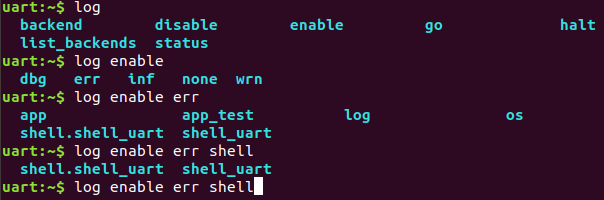
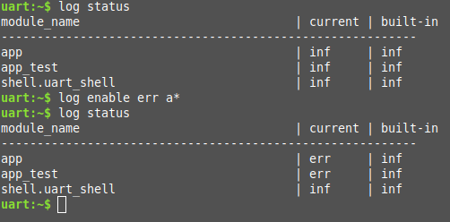

# Shell

* Overview [概述](#overview)
  - Connecting to Segger RTT via TCP (on macOS, for example)  
    [通过 TCP 连接 Segger RTT(例如在macOS上)](#ctsrvt)
* Commands [命令](#commands)
  - Creating commands
    [创建命令](#createcommands)
  - Dictionary commands
    [字典命令](#dictcommands)
  - Commands execution
    [命令执行](#execcommands)
  - Built-in commands
    [内置命令](#bic)
* Tab Feature [标签特性](#tf)
* History Feature [历史特性](#hf)
* Wildcards Feature [通配符特性](#wf)
* Meta Keys Feature [元键特性](#mkf)
* Getopt Feature Getopt特性
* Obscured Input Feature 模糊输入特性
* Shell Logger Backend Feature Shell记录器后端特性
* Usage 用法
* API Reference API参考

## <span id="overview">概述</span>

This module allows you to create and handle a shell with a user-defined command set. You can use it in examples where more than simple button or LED user interaction is required. This module is a Unix-like shell with these features:  
此模块允许你创建和处理具有用户定义命令集的shell。你可以在需要简单的按钮或LED等用户交互的示例中使用它。这个模块是一个类似Unix的shell，具有以下特性：

* Support for multiple instances.  
    支持多个实例。
* Advanced cooperation with the Logging.  
    与Logging高级合作。
* Support for static and dynamic commands.  
    支持静态和动态命令。
* Support for dictionary commands.  
    支持字典命令。
* Smart command completion with the Tab key.  
    使用`Tab`键完成命令补全。
* Built-in commands: clear, shell, colors, echo, history and resize.  
    内置命令：clear, shell, colors, echo, history and resize。
* Viewing recently executed commands using keys: ↑ ↓ or meta keys.  
    使用`↑` `↓`键：或元键查看最近执行的命令。
* Text edition using keys: ←, →, Backspace, Delete, End, Home, Insert.  
    使用 `←`, `→`, `Backspace`, `Delete`, `End`, `Home`, `Insert` 键进行文本编辑。  
* Support for ANSI escape codes: VT100 and ESC[n~ for cursor control and color printing.  
    支持ANSI转义符：`VT100` 和 `ESC[n~` 用于光标控制和彩色打印
* Support for editing multiline commands.  
    支持编辑多行命令。
* Built-in handler to display help for the commands.  
    显示命令帮助的内置处理程序。
* Support for wildcards: * and ?.  

    支持通配符: `*` 和 `?`。
* Support for meta keys.  
    支持元键。
* Support for getopt.  
    支持getopt。
* Kconfig configuration to optimize memory usage.  
   使用Kconfig配置优化内存。

:::info
 Some of these features have a significant impact on RAM and flash usage, but many can be disabled when not needed. To default to options which favor reduced RAM and flash requirements instead of features, you should enable CONFIG_SHELL_MINIMAL and selectively enable just the features you want.  
 其中有一些特性对RAM和FLASH的使用影响很大，但是很多特性在不需要的时候可以禁用它们。默认情况下，应该启用`CONFIG_SHELL_MINIMAL`并选择性地启用你需要的特性。
:::

The module can be connected to any transport for command input and output. At this point, the following transport layers are implemented:  
该模块可以连接到任何传输命令的输入和输出。这将实现以下传输层：

* Segger RTT
* SMP
* Telnet
* UART
* USB接口
* DUMMY - 不是物理传输层.

## <span id="ctsrvt">通过 TCP 连接 Segger RTT(例如在macOS上)</span>

On macOS JLinkRTTClient won’t let you enter input. Instead, please use following procedure:  
在macOS上， JLinkRTTClient 不允许输入，请使用以下步骤：

* Open up a first Terminal window and enter:  
  ```
  JLinkRTTLogger -Device NRF52840_XXAA -RTTChannel 1 -if SWD -Speed 4000 ~/rtt.log
  ```
  (change device if required)  
  (根据需要更换设备)

* Open up a second Terminal window and enter:  
  打开第二个终端窗口并输入：
  ```
  nc localhost 19021
  ```

* Now you should have a network connection to RTT that will let you enter input to the shell.  
  现在你应该有一个到 RTT 的网络连接，它允许你进行shell输入。

## <span id="commands">命令</span>

Shell commands are organized in a tree structure and grouped into the following types:  
Shell命令以树状结构分为以下类型：

* Root command (level 0): Gathered and alphabetically sorted in a dedicated memory section.  
    根命令（等级0）：在专用内存部分中收集并按字母顺序排序。
* Static subcommand (level > 0): Number and syntax must be known during compile time. Created in the software module.  
    静态子命令（等级>0）：在编译期间必须知道编号和语法。在软件模块中创建。
* Dynamic subcommand (level > 0): Number and syntax does not need to be known during compile time. Created in the software module.  
    动态子命令（等级>0）：在编译期间不需要知道编号和语法。在软件模块中创建。

### <span id="createcommands">创建命令</span>

Use the following macros for adding shell commands:  
使用以下宏添加shell命令：

* SHELL_CMD_REGISTER - Create root command. All root commands must have different name.  
  [SHELL_CMD_REGISTER](https://docs.zephyrproject.org/2.7.0/reference/shell/index.html#c.SHELL_CMD_REGISTER) - 创建根命令。所有根命令必须有不同的名称。

* SHELL_COND_CMD_REGISTER - Conditionally (if compile time flag is set) create root command. All root commands must have different name.  
  [SHELL_COND_CMD_REGISTER](https://docs.zephyrproject.org/2.7.0/reference/shell/index.html#c.SHELL_COND_CMD_REGISTER) - 条件（如果设置了编译时标志）创建根命令。所有根命令必须具有不同的名称。

* SHELL_CMD_ARG_REGISTER - Create root command with arguments. All root commands must have different name.  
  [SHELL_CMD_ARG_REGISTER](https://docs.zephyrproject.org/2.7.0/reference/shell/index.html#c.SHELL_CMD_ARG_REGISTER) - 创建带参数的根命令。所有根命令必须具有不同的名称。

* SHELL_COND_CMD_ARG_REGISTER - Conditionally (if compile time flag is set) create root command with arguments. All root commands must have different name.  
  [SHELL_COND_CMD_ARG_REGISTER](https://docs.zephyrproject.org/2.7.0/reference/shell/index.html#c.SHELL_COND_CMD_ARG_REGISTER) - 条件（如果设置了编译时标志）创建带参数的根命令。所有根命令必须具有不同的名称。

* SHELL_CMD - Initialize a command.  
  [SHELL_CMD](https://docs.zephyrproject.org/2.7.0/reference/shell/index.html#c.SHELL_CMD) - 初始化命令。
* SHELL_COND_CMD - Initialize a command if compile time flag is set.  
  [SHELL_COND_CMD](https://docs.zephyrproject.org/2.7.0/reference/shell/index.html#c.SHELL_COND_CMD) - 如果设置了编译时间标志，则初始化命令。

* SHELL_EXPR_CMD - Initialize a command if compile time expression is non-zero.  
  [SHELL_EXPR_CMD](https://docs.zephyrproject.org/2.7.0/reference/shell/index.html#c.SHELL_EXPR_CMD) - 如果编译时表达式不为零，则初始化命令。

* SHELL_CMD_ARG - Initialize a command with arguments.  
  [SHELL_CMD_ARG](https://docs.zephyrproject.org/2.7.0/reference/shell/index.html#c.SHELL_CMD_ARG) - 使用参数初始化命令。

* SHELL_COND_CMD_ARG - Initialize a command with arguments if compile time flag is set.  
  [SHELL_COND_CMD_ARG](https://docs.zephyrproject.org/2.7.0/reference/shell/index.html#c.SHELL_COND_CMD_ARG) - 如果设置了编译时间标志，则使用参数初始化命令。

* SHELL_EXPR_CMD_ARG - Initialize a command with arguments if compile time expression is non-zero.  
  [SHELL_EXPR_CMD_ARG](https://docs.zephyrproject.org/2.7.0/reference/shell/index.html#c.SHELL_EXPR_CMD_ARG) - 如果编译时表达式不为零，则使用参数初始化命令

* SHELL_STATIC_SUBCMD_SET_CREATE - Create a static subcommands array.  
  [SHELL_STATIC_SUBCMD_SET_CREATE](https://docs.zephyrproject.org/2.7.0/reference/shell/index.html#c.SHELL_STATIC_SUBCMD_SET_CREATE) - 创建一个静态子命令数组。

* SHELL_SUBCMD_DICT_SET_CREATE - Create a dictionary subcommands array.  
  [SHELL_SUBCMD_DICT_SET_CREATE](https://docs.zephyrproject.org/2.7.0/reference/shell/index.html#c.SHELL_SUBCMD_DICT_SET_CREATE) - 创建一个字典子命令数组。

* SHELL_DYNAMIC_CMD_CREATE - Create a dynamic subcommands array.  
  [SHELL_DYNAMIC_CMD_CREATE](https://docs.zephyrproject.org/2.7.0/reference/shell/index.html#c.SHELL_DYNAMIC_CMD_CREATE) - 创建一个动态子命令数组。

Commands can be created in any file in the system that includes `include/shell/shell.h`. All created commands are available for all shell instances.  
可以在系统中包含`include/shell/shell.h`的任何文件中创建命令。所有创建的命令都可以用在所有shell实例。

#### <span id="staticcommands">静态命令</span>

Example code demonstrating how to create a root command with static subcommands.  
演示如何使用静态子命令创建根命令的示例代码。


```
/* 创建子命令 (等级 1 命令) 数组示例. */
SHELL_STATIC_SUBCMD_SET_CREATE(sub_demo,
        SHELL_CMD(params, NULL, "Print params command.",
                                               cmd_demo_params),
        SHELL_CMD(ping,   NULL, "Ping command.", cmd_demo_ping),
        SHELL_SUBCMD_SET_END
);
/* Creating root (level 0) command "demo" */
SHELL_CMD_REGISTER(demo, &sub_demo, "Demo commands", NULL);
```

Example implementation can be found under following location:  
示例实现可以在这位置找到：[samples/subsys/shell/shell_module/src/main.c](https://cloud.listenai.com/zephyr/zephyr/-/blob/master/samples/subsys/shell/shell_module/src/main.c)

### <span id="dictcommands">字典命令</span>

This is a special kind of static commands. Dictionary commands can be used every time you want to use a pair: (string <-> corresponding data) in a command handler. The string is usually a verbal description of a given data. The idea is to use the string as a command syntax that can be prompted by the shell and corresponding data can be used to process the command.  
这是一种特殊的静态命令。每当你想在命令处理程序中使用一对：（字符串<->对应数据）时，都可以使用字典命令。字符串通常是对给定数据的口头描述。其思想是使用字符串作为命令语法，可以由shell提示，并且可以使用相应的数据来处理命令。

Let’s use an example. Suppose you created a command to set an ADC gain. It is a perfect place where a dictionary can be used. The dictionary would be a set of pairs: (string: gain_value, int: value) where int value could be used with the ADC driver API.  
举个例子，假设你创建了一个命令来设置ADC增益。这是一个可以使用字典的完美场地。字典将一组对：(string: gain_value, int: value) ,其中 int 值可以与 ADC 驱动程序 API 一起使用。

Abstract code for this task would look like this:  
这个任务的抽象代码如下：
```
static int gain_cmd_handler(const struct shell *shell,
                            size_t argc, char **argv, void *data)
{
        int gain;

        /* data is a value corresponding to called command syntax */
        gain = (int)data;
        adc_set_gain(gain);

        shell_print(shell, "ADC gain set to: %s\n"
                           "Value send to ADC driver: %d",
                           argv[0],
                           gain);

        return 0;
}

SHELL_SUBCMD_DICT_SET_CREATE(sub_gain, gain_cmd_handler,
        (gain_1, 1), (gain_2, 2), (gain_1_2, 3), (gain_1_4, 4)
);
SHELL_CMD_REGISTER(gain, &sub_gain, "Set ADC gain", NULL);
```

This is how it would look like in the shell:  
这是它在shell中的样子：  


#### <span id="dynamiccommands">动态命令</span>

Example code demonstrating how to create a root command with static and dynamic subcommands. At the beginning dynamic command list is empty. New commands can be added by typing:  
演示如何使用静态和动态子命令创建根命令的示例代码。开始时，动态命令列表为空。可以通过输入以下命令添加新命令：
```
dynamic add <new_dynamic_command>
```

Newly added commands can be prompted or autocompleted with the Tab key.  
新添加的命令可以使用`Tab`键提示自动补全。  


```
/* Buffer for 10 dynamic commands */
static char dynamic_cmd_buffer[10][50];

/* commands counter */
static uint8_t dynamic_cmd_cnt;

/* Function returning command dynamically created
 * in  dynamic_cmd_buffer.
 */
static void dynamic_cmd_get(size_t idx,
                            struct shell_static_entry *entry)
{
        if (idx < dynamic_cmd_cnt) {
                entry->syntax = dynamic_cmd_buffer[idx];
                entry->handler  = NULL;
                entry->subcmd = NULL;
                entry->help = "Show dynamic command name.";
        } else {
                /* if there are no more dynamic commands available
                 * syntax must be set to NULL.
                 */
                entry->syntax = NULL;
        }
}

SHELL_DYNAMIC_CMD_CREATE(m_sub_dynamic_set, dynamic_cmd_get);
SHELL_STATIC_SUBCMD_SET_CREATE(m_sub_dynamic,
        SHELL_CMD(add, NULL,"Add new command to dynamic_cmd_buffer and"
                  " sort them alphabetically.",
                  cmd_dynamic_add),
        SHELL_CMD(execute, &m_sub_dynamic_set,
                  "Execute a command.", cmd_dynamic_execute),
        SHELL_CMD(remove, &m_sub_dynamic_set,
                  "Remove a command from dynamic_cmd_buffer.",
                  cmd_dynamic_remove),
        SHELL_CMD(show, NULL,
                  "Show all commands in dynamic_cmd_buffer.",
                  cmd_dynamic_show),
        SHELL_SUBCMD_SET_END
);
SHELL_CMD_REGISTER(dynamic, &m_sub_dynamic,
           "Demonstrate dynamic command usage.", cmd_dynamic);
```

Example implementation can be found under following location: samples/subsys/shell/shell_module/src/dynamic_cmd.c.

示例实现可以在以下位置找到：[samples/subsys/shell/shell_module/src/dynamic_cmd.c](https://cloud.listenai.com/zephyr/zephyr/-/blob/master/samples/subsys/shell/shell_module/src/dynamic_cmd.c)。

### <span id="execcommands">命令执行</span>

Each command or subcommand may have a handler. The shell executes the handler that is found deepest in the command tree and further subcommands (without a handler) are passed as arguments. Characters within parentheses are treated as one argument. If shell wont find a handler it will display an error message.  

每个命令或子命令可以有一个处理程序。Shell 执行在命令树中最里面找到的处理程序，并且进一步的子命令(没有处理程序)作为参数传递。括号内的字符作为一个参数处理。如果 shell 找不到处理程序，它将显示错误消息。

Commands can be also executed from a user application using any active backend and a function shell_execute_cmd(), as shown in this example:  
还可以使用任何活动后端和函数 [shell_execute_cmd()](https://docs.zephyrproject.org/2.7.0/reference/shell/index.html#c.shell_execute_cmd)。 如下所示：

```
void main(void)
{
        /* Below code will execute "clear" command on a DUMMY backend */
        shell_execute_cmd(NULL, "clear");

        /* Below code will execute "shell colors off" command on
         * an UART backend
         */
        shell_execute_cmd(shell_backend_uart_get_ptr(),
                          "shell colors off");
}
```

Enable the DUMMY backend by setting the Kconfig CONFIG_SHELL_BACKEND_DUMMY option.  
通过设置 Kconfig [CONFIG_SHELL_BACKEND_DUMMY](https://docs.zephyrproject.org/2.7.0/reference/kconfig/CONFIG_SHELL_BACKEND_DUMMY.html#std-kconfig-CONFIG_SHELL_BACKEND_DUMMY) 选项启动 DUMMY 后端。

#### <span id="handlercommand">命令处理程序</span>

Simple command handler implementation:  
简单的命令处理程序实现:

```
static int cmd_handler(const struct shell *shell, size_t argc,
                        char **argv)
{
        ARG_UNUSED(argc);
        ARG_UNUSED(argv);

        shell_fprintf(shell, SHELL_INFO, "Print info message\n");

        shell_print(shell, "Print simple text.");

        shell_warn(shell, "Print warning text.");

        shell_error(shell, "Print error text.");

        return 0;
}
```

Function shell_fprintf() or the shell print macros: shell_print, shell_info, shell_warn and shell_error can be used from the command handler or from threads, but not from an interrupt context. Instead, interrupt handlers should use Logging for printing.  
函数 [shell_fprintf()](https://docs.zephyrproject.org/2.7.0/reference/shell/index.html#c.shell_fprintf)或 shell 打印宏：[shell_print](https://docs.zephyrproject.org/2.7.0/reference/shell/index.html#c.shell_print)、[shell_info](https://docs.zephyrproject.org/2.7.0/reference/shell/index.html#c.shell_info)、[shell_warn](https://docs.zephyrproject.org/2.7.0/reference/shell/index.html#c.shell_warn) 和 [shell_error](https://docs.zephyrproject.org/2.7.0/reference/shell/index.html#c.shell_error) 可以从命令处理程序或线程中使用，但不能从中断上下文中使用。相反，中断处理程序应该使用 [Logging](#) 进行打印。

#### <span id="commandhelp">命令帮助</span>

Every user-defined command or subcommand can have its own help description. The help for commands and subcommands can be created with respective macros: SHELL_CMD_REGISTER, SHELL_CMD_ARG_REGISTER, SHELL_CMD, and SHELL_CMD_ARG.  
每个用户定义的命令或子命令都可以有自己的帮助信息。可以使用相应的宏创建命令或子命令帮助：[SHELL_CMD_REGISTER](https://docs.zephyrproject.org/2.7.0/reference/shell/index.html#c.SHELL_CMD_REGISTER) 、[SHELL_CMD_ARG_REGISTER](https://docs.zephyrproject.org/2.7.0/reference/shell/index.html#c.SHELL_CMD_ARG_REGISTER)、[SHELL_CMD](https://docs.zephyrproject.org/2.7.0/reference/shell/index.html#c.SHELL_CMD) 和 [SHELL_CMD_ARG](https://docs.zephyrproject.org/2.7.0/reference/shell/index.html#c.SHELL_CMD_ARG)。

Shell prints this help message when you call a command or subcommand with -h or --help parameter.  
当使用 `-h` 或 `--help` 参数使用命令或子命令时，Shell 将打印此帮助消息。

#### <span id="parentcommands">父命令</span>

In the subcommand handler, you can access both the parameters passed to commands or the parent commands, depending on how you index argv.  
在子命令处理程序中，你可以访问传递给命令或父命令的参数, 具体取决于你对 `argv` 的索引方式。

* When indexing argv with positive numbers, you can access the parameters.  
  使用正数索引`argv`时，可以访问参数。
* When indexing argv with negative numbers, you can access the parent commands.  
  使用负数索引`argv`时，可以访问父命令。
* The subcommand to which the handler belongs has the argv index of 0.    
  处理程序所属的子命令的`argv`索引为0。

```
static int cmd_handler(const struct shell *shell, size_t argc,
                       char **argv)
{
        ARG_UNUSED(argc);

        /* If it is a subcommand handler parent command syntax
         * can be found using argv[-1].
         */
        shell_print(shell, "This command has a parent command: %s",
                      argv[-1]);

        /* Print this command syntax */
        shell_print(shell, "This command syntax is: %s", argv[0]);

        /* Print first argument */
        shell_print(shell, "%s", argv[1]);

        return 0;
}
```

### <span id="bic">内置命令</span>

These commands are activated by CONFIG_SHELL_CMDS set to y.  
`CONFIG_SHELL_CMDS`为`y`时激活这些命令。

* **clear** - Clears the screen.  
  **clear** - 清楚屏幕。
* **history** - Shows the recently entered commands.  
  **history** - 显示最近输入的命令。
* **resize** - Must be executed when terminal width is different than 80 characters or after each change of terminal width. It ensures proper multiline text display and ←, →, End, Home keys handling. Currently this command works only with UART flow control switched on. It can be also called with a subcommand:  
  **resize** - 当终端宽度不超过80个字符或每次改变终端宽度后必须执行。它确保正确的多行文本显示和`←`, `→`, `End`, `Home`键处理。目前，这个命令只能在打开了UART流控制的情况下使用。它也可以用一个子命令来调用： 

  - **default** - Shell will send terminal width = 80 to the terminal and assume successful delivery.  
    **default** - Shell 将终端宽度 = 80 发送到终端并假定成功提交。

These command needs extra activation: CONFIG_SHELL_CMDS_RESIZE set to y.  
下面这些命令需要`CONFIG_SHELL_CMDS_RESIZE` 设置为 `y`额外激活。

* **select** - It can be used to set new root command. Exit to main command tree is with alt+r. This command needs extra activation: CONFIG_SHELL_CMDS_SELECT set to y.  
  **select** - 可用于设置新的root命令。退出到主命令树使用 alt+r。 此命令需要 `CONFIG_SHELL_CMDS_SELECT` 设置为 `y` 额外激活。

* **shell** - Root command with useful shell-related subcommands like:  
  **shell** - 包含有用的shell相关子命令的根命令，如：

  - **echo** - Toggles shell echo.  
    **echo** -  切换 shell echo。

  - **colors** - Toggles colored syntax. This might be helpful in case of Bluetooth shell to limit the amount of transferred bytes.  
    **colors** - 切换彩色语法。在蓝牙shell限制传输的字节数情况下可能有帮助。

  - **stats** - Shows shell statistics.  
    **stats** - 显示shell统计信息。


## <span id="tf">标签特性</span>

The Tab button can be used to suggest commands or subcommands. This feature is enabled by CONFIG_SHELL_TAB set to y. It can also be used for partial or complete auto-completion of commands. This feature is activated by CONFIG_SHELL_TAB_AUTOCOMPLETION set to y. When user starts writing a command and presses the Tab button then the shell will do one of 3 possible things:  
Tab 按钮可用在建议命令或子命令。这个特性是通过[CONFIG_SHELL_TAB](https://docs.zephyrproject.org/2.7.0/reference/kconfig/CONFIG_SHELL_TAB.html#std-kconfig-CONFIG_SHELL_TAB)设置为 `y` 启用的。它还可以用于部分或完全自动补全命令。这个特性通过[CONFIG_SHELL_TAB_AUTOCOMPLETION](https://docs.zephyrproject.org/2.7.0/reference/kconfig/CONFIG_SHELL_TAB_AUTOCOMPLETION.html#std-kconfig-CONFIG_SHELL_TAB_AUTOCOMPLETION) 设置为 `y` 激活。当用户开始编写命令并且按下`Tab`按钮时，shell将可能执行3种操作其中之一：

* Autocomplete the command.   
  自动补全命令。
* Prompts available commands and if possible partly completes the command.  
  提示可用命令，在可能的情况下补全部分命令。
* Will not do anything if there are no available or matching commands.  
  如果没有可用或匹配的命令，则不会执行任何操作。



## <span id="hf">历史特性</span>

This feature enables commands history in the shell. It is activated by: CONFIG_SHELL_HISTORY set to y. History can be accessed using keys: ↑ ↓ or Ctrl + n and Ctrl + p if meta keys are active. Number of commands that can be stored depends on size of CONFIG_SHELL_HISTORY_BUFFER parameter.  
这个特性在 shell 中启动命令历史记录。它通过 [CONFIG_SHELL_HISTORY](https://docs.zephyrproject.org/2.7.0/reference/kconfig/CONFIG_SHELL_HISTORY.html#std-kconfig-CONFIG_SHELL_HISTORY) 设置为 `y` 激活。 可以使用 `↑` `↓` 或 `Ctrl + n` 和 `Ctrl + p`键进行访问。可以存储的命令数量取决于 [CONFIG_SHELL_HISTORY_BUFFER](https://docs.zephyrproject.org/2.7.0/reference/kconfig/CONFIG_SHELL_HISTORY_BUFFER.html#std-kconfig-CONFIG_SHELL_HISTORY_BUFFER) 参数的大小。

## <span id="wf">通配符特性</span>

The shell module can handle wildcards. Wildcards are interpreted correctly when expanded command and its subcommands do not have a handler. For example, if you want to set logging level to err for the app and app_test modules you can execute the following command:
Shell模块可以处理通配符。当扩展命令及其子命令没有处理程序时，通配符会被正确解释。例如： 如果你想把`app`和`app_test`模块日志记录级别设置为`err`  ，可以执行以下命令。
```
log enable err a*
```



This feature is activated by CONFIG_SHELL_WILDCARD set to y.  
这个特性通过[CONFIG_SHELL_WILDCARD](https://docs.zephyrproject.org/2.7.0/reference/kconfig/CONFIG_SHELL_WILDCARD.html#std-kconfig-CONFIG_SHELL_WILDCARD)设置为`y`激活。

## <span id="mkf">元键特性</span>

The shell module supports the following meta keys:  
Shell 模块支持以下元键:

| 元键   | 行为                                                         |
| ------ | ------------------------------------------------------------ |
| Ctrl+a | Moves the cursor to the beginning of the line. 将光标移动到行首。 |
| Ctrl+b | Moves the cursor backward one character. 将光标向后移动一个字符。 |
| Ctrl+c | Preserves the last command on the screen and starts a new command in a new line.保留屏幕上的最后一个命令，并在新行中启动一个新命令。 |
| Ctrl+d | Deletes the character under the cursor.删除光标下的字符。    |
| Ctrl+e | Moves the cursor to the end of the line.将光标移到行尾。     |
| Ctrl+f | Moves the cursor forward one character.将光标向前移动一个字符。 |
| Ctrl+k | Deletes from the cursor to the end of the line.删除从光标到行尾的内容。 |
| Ctrl+l | Clears the screen and leaves the currently typed command at the top of the screen.清除屏幕并将当前键入的命令保留在屏幕顶部。 |
| Ctrl+n | Moves in history to next entry.在历史中移动到下一个条目。    |
| Ctrl+p | Moves in history to previous entry.在历史中移动到以前的条目。 |
| Ctrl+u | Clears the currently typed command. 清除当前类型化的命令。   |
| Ctrl+w | Removes the word or part of the word to the left of the cursor. Words separated by period instead of space are treated as one word.移除光标左侧的单词或单词的一部分。用句点而不是空格分隔的词被视为一个词。 |
| Alt+b  | Moves the cursor backward one word.将光标向后移动一个单词。  |
| Alt+f  | Moves the cursor forward one word.将光标向前移动一个单词。   |

This feature is activated by [`CONFIG_SHELL_METAKEYS`](https://docs.zephyrproject.org/2.7.0/reference/kconfig/CONFIG_SHELL_METAKEYS.html#std-kconfig-CONFIG_SHELL_METAKEYS) set to `y`.

这个特性通过 [CONFIG_SHELL_METAKEYS](https://docs.zephyrproject.org/2.7.0/reference/kconfig/CONFIG_SHELL_METAKEYS.html#std-kconfig-CONFIG_SHELL_METAKEYS) 设置为 `y` 激活.
