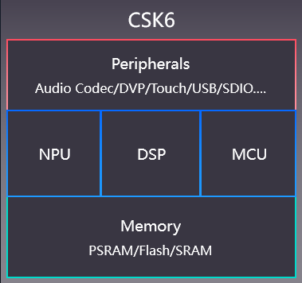

# 芯片

## 芯片简介

CSK6系列是一款由聆思自主研发的高性能、低功耗、外设资源丰富的双核AI芯片，可广泛应用于家居家电、智能车载、智能教育、智能办公、智能安防、工业智能化和消费电子等领域。

## 芯片特性

* 采用 ARM STAR + HIFI4 双核架构，主频最高支持300MHz

* 集成为神经网络操作设计的NPU，深度适配科大讯飞AI算法，算力达128GOPS

* 内置硬件乘法器、硬件除法器

* 支持SWD、JTAG调试接口

* 内置8MB PSRAM，1MB SRAM，可选内置或外置FLASH，

* 内部集成DC-DC，支持2.7V-5.5V供电

* 内部集成音频Codec，内置4路Audio ADC、2路Audio DAC

* 支持硬件VAD，满足低功耗场景

* 支持4路LEDC与8路PWM输出

* 具备丰富的外设接口，支持高灵活度映射

## 芯片通信接口

| 接口 | 数量 | 特性 |
| ---- | ---- | --------------------- |
| DVP | 1 | VGA(640x480)/60fps   720p(1280x720)/30fps |
| UART| 4 | 支持硬件流控(CTS/RTS) |
| SPI | 2 | 支持3线SPI   支持主/从模式 |
| I2C | 2 | 支持3线SPI   支持主/从模式 |
| I2S | 3 | 输入支持TDM扩展 |
| DMIC | 4 | - |
| USB | 1 |USB 1.1 全速   支持1K字节同步传输、64字节的Bulk和中断传输 |
| SDIO | 1 | 兼容SD控制器3.0标准规范   支持UHS50/UHS104 SD卡   支持4位/8位模式|
| PWM | 8 | 支持4路LEDC输出 |
| Touch Pad | 6 | - |
| SAR ADC | 4 | 分辨率:12bit   采样速率:最大1MHz |

:::note
更详细的芯片规格书资料，请联系聆思商务获取。
:::