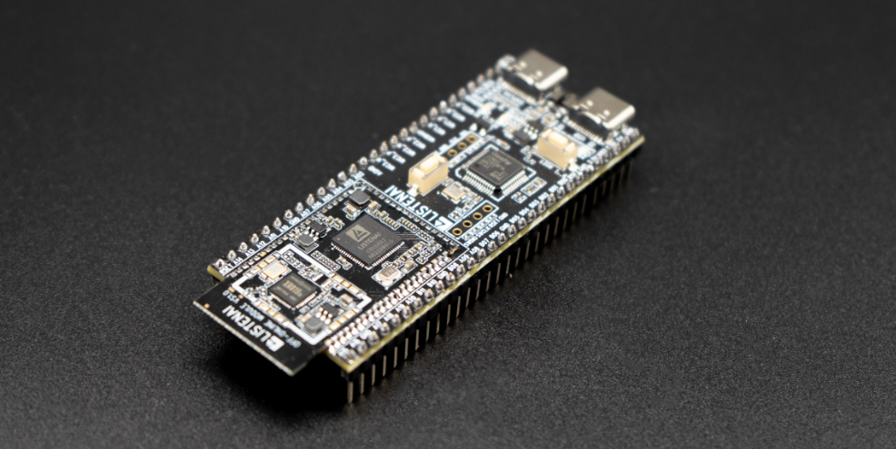
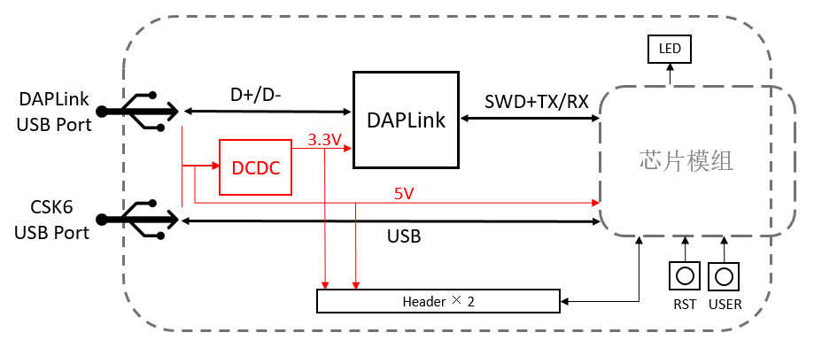
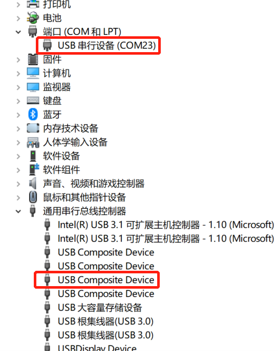
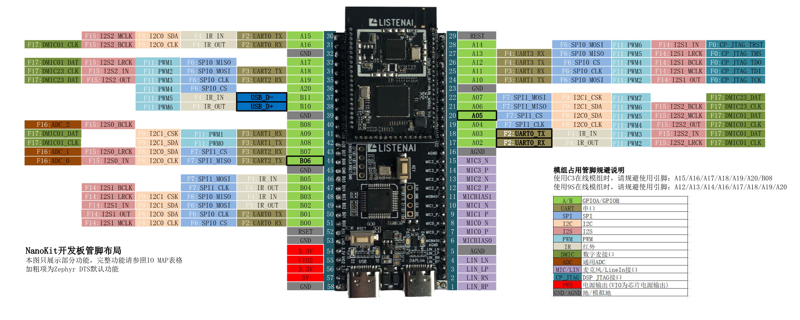

# NanoKit 开发套件

本节主要介绍CSK6芯片配套的NanoKit开发板，开发板型号为CSK-6-NanoKit。通过本章节，你将了解：

* NanoKit开发板的功能与特性

* NanoKit开发板的基础使用方法

* 开发板相关资料的下载

**NOTE**: 若您手中的开发板为不带DAPLink功能的早期版本开发板，请跳转至 [Pico开发板](pico) 章节。

## NanoKit简介

CSK-6-NanoKit是一款是聆思推出的一款高性价比开发板，用户可通过此开发板搭载不同的CSK6核心模组，进行CSK6芯片的应用开发与调试，快速搭建自己的硬件实验平台。

CSK-6-NanoKit 开发板具备以下主要特性：

* 兼容CSK6 纯离线、在线两类模组

* 芯片可用管脚引出至开发板两侧排针，方便开发者调试

* 板载按键与LED，可快速进行基础功能验证

* 板载调试器，外接一条USB 线即可实现供电、烧录、调试、串口监控

* 搭配扩展板可衍生丰富玩法

### 支持的模组

CSK-6-NanoKit 目前支持搭载以下模组进行使用

| 模组型号

 | 说明

 |
| ------------------------------------------ | ---------------------------------------------------------- |  |  |  |  |
| CSK6002-offline

                            | CSK6002 纯离线模组，该模组引出了CSK6002 所有可用引脚。

                        |
| CSK6002-C3

                                 | 除CSK6002 之外集成了ESP32 C3 芯片，具备WIFI&蓝牙联网功能。

                   |
| CSK6002-9S

                                 | 除CSK6002 之外集成了全志819S 芯片，具备WIFI&蓝牙联网功能。

                     |
### 板载资源

**CSK-6-NanoKit 板载资源如下**

| 硬件资源

                                       | 说明

                                                         |
| ------------------------------------------ | ---------------------------------------------------------- |
| 排针座

                                        | 所有可用GPIO管脚已外引至开发板两侧排针，用户可通过对芯片进行编程实现对各个引脚的配置与使用。

           |
| DAPLink IC

                                 | 板载集成的调试器芯片，可提供USB-UART桥接、固件烧录、代码调试等功能。

                     |
| 复位按键[REST]

                                 | 用于复位模组主控芯片的按键。

                                             |
| 用户按键[KEY]

                                  | 连接芯片 **GPIOB_5** 引脚，用户可将其作为功能按键使用。

                             |
| 用户LED[D1-绿]

                                | 连接芯片 **GPIOA_5** 引脚，用户可通过编程进行控制。

                               |
| 电源LED[D2-红]

                                | 开发板正常接通电源后，该指示灯亮起。

                                         |
| DAPLink LED[D3/D4]

                         | 两颗

                                                         |
| DAPLink USB

                                | 调试器USB接口，可同时作为开发板供电接口、串口查看接口、烧录与调试接口。

                      |
| CSK6 USB

                                   | CSK6的USB接口，可进行CSK6芯片USB接口的调试，支持对开发板进行供电。

                   |
**NOTE**: 更详细的硬件电路连接关系，请参考本文 **开发板资料下载** 章节《CSK-6-NanoKit原理图》。

### 系统框图

## NanoKit的使用

### 供电

开发板支持以下几种方式进行供电：

* 使用USB线连接Debug USB TypeC接口进行供电

* 使用USB线连接CSK6 USB TypeC接口进行供电

* 通过排针座5V与GND排针进行供电

### DAPLink USB口的使用

CSK-6-NanoKit板载了DAPLink调试器芯片，开发者可通过DAPLink USB接口对CSK6芯片进行 **固件烧录** 、**代码仿真** 与 **串口查看**。

**使用方法如下：**

* 1.使用TypeC数据线连接电脑USB与开发板DAPLink USB

* 2.若设备运行正常，在电脑设备管理器中会出现一个虚拟串口和USB设备

**串口查看功能：** 对CSK6芯片的 **GPIOA2** 和 **GPIOA3** 【默认UART0】引脚进行了映射，可通过串口上位机工具与串口进行通讯。

**烧录、仿真功能：** 配合CSK6开发工具，可通过DAPLink实现固件快速烧录以及VSCode IDE环境下进行仿真调试，详见开发指引相关章节(跳转链接todo)。

**NOTE**: 若未能识别到设备，请检查使用TypeC数据线是否具备数据传输功能，部分TypeC线只具备供电功能。

### 开发板管脚的使用

CSK-6-NanoKit将CSK6芯片默认的所有可用引脚均引至两侧的2.54mm排针座上，由于板载模组的网络通道芯片会占用CSK6芯片的部分引脚，因此在使用开发板管脚进行开发调试时，需注意规避对这部分引脚的复用。

**在线模组 CSK6002-C3占用引脚**

| 开发板管脚编号

                                    | 管脚标识

                                                       | C3占用关系

 |
| ------------------------------------------ | ---------------------------------------------------------- | ------ |
| 30

                                         | GPIOA_15

                                                   | data_ready

 |
| 31

                                         | GPIOA_16

                                                   | handshake

  |
| 33

                                         | GPIOA_17

                                                   | spi_miso

   |
| 34

                                         | GPIOA_18

                                                   | spi_mosi

   |
| 35

                                         | GPIOA_19

                                                   | spi_clk

    |
| 36

                                         | GPIOA_20

                                                   | spi_clk

    |
| 40

                                         | GPIOB_08

                                                   | C3_RST

     |
**在线模组 CSK6002-9S占用引脚**

| 开发板管脚编号

                                    | 管脚标识

                                                       | 819S占用关系

   |
| ------------------------------------------ | ---------------------------------------------------------- | ---------- |
| 26

                                         | GPIOA_12

                                                   | bt_tx

      |
| 27

                                         | GPIOA_13

                                                   | bt_tx

      |
| 28

                                         | GPIOA_14

                                                   | bt_rst

     |
| 31

                                         | GPIOA_16

                                                   | wifi_wake

  |
| 33

                                         | GPIOA_17

                                                   | wifi_rst

   |
| 34

                                         | GPIOA_18

                                                   | cmd

        |
| 35

                                         | GPIOA_19

                                                   | data

       |
| 36

                                         | GPIOA_20

                                                   | clk

        |
**CSK-6-NanoKit管脚分布图**

**NOTE**: 管脚分布图可前往本文 **开发板资料下载** 章节下载，管脚布局图仅展示引脚支持的部分常用功能，完整管脚功能映射请参照《IO_MAP表格》。

## 开发板资料下载

`CSK-6-NanoKit原理图`

`CSK-6-NanoKit管脚布局通用版V0.2`
