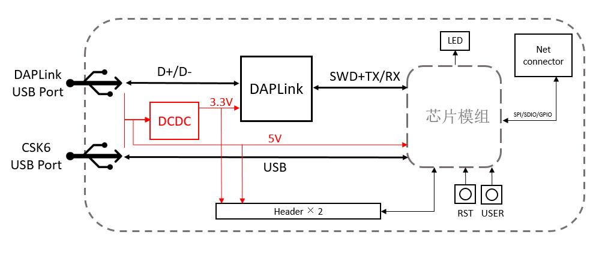

# CSK6012-NanoKit V1

## 开发板简介

CSK6012-NanoKit V1 是一款板载了CSK6012纯离线模组的NanoKit开发板，您可以通过本开发板快速基于CSK6012芯片进行应用开发，并搭配其他功能扩展板搭建更加完整的硬件原型。

> 本开发板的版本丝印标注为 CSK6012-NanoKit V1。

开发板具备以下主要特性：

- 板载**CSK6012**芯片模组，集成16MB Flash
- 板载**网络扩展插槽**，支持外接网络模块进行 WIFI&BLE 联网
- 芯片所有可用管脚引出至两侧2.54mm间距排针，方便使用
- 板载按键与LED，可快速进行基础功能验证
- 板载DAPLink调试器IC，外接一条USB 线即可实现供电、烧录、调试、串口监控
- 搭配扩展板可衍生丰富玩法
- 对应SDK板型 **csk6012_nano**、**csk6012_c3_nano**（连接C3网络模块时）

### 板载资源

**开发板板载资源如下**

| 编号 | 硬件资源 | 说明 |
| -------- | -------- | ------ |
| 1 | 芯片模组 | CSK6011A模组，芯片可用引脚全部引出，板载16M Flash。 |
| 2 | 用户按键[KEY] | 连接芯片 **GPIOB_5** 引脚，用户可将其作为功能按键使用。  |
| 3 | DAPLink IC | 板载集成的调试器芯片，可提供USB-UART桥接、固件烧录、代码调试等功能。|
| 4 | DAPLink LED | D4(蓝色)为DAPLink运行指示灯，正常运行时常亮；D3(橙色)为DAPLink串口数据通讯指示灯，随数据传输动作闪烁。|
| 5 | Debug USB | 调试器USB接口，可同时作为开发板供电接口、串口查看接口、烧录与调试接口。  (若需外接调试器至SWD座，请勿使用此USB接口) |
| 6 | CSK6 USB | CSK6的USB接口，可进行CSK6芯片USB接口的调试，支持对开发板进行供电。|
| 7 | 用户LED[D1-绿] | 连接芯片 **GPIOB_6** 引脚，用户可通过编程进行控制。|
| 8 | 电源LED[D2-红] | 开发板正常接通电源后，该指示灯亮起。|
| 9 | 复位按键[REST] | 用于复位模组主控芯片的按键。|
| 10 | SWD座 | CSK6芯片的SWD接口座，可外接其他调试器，此场景下请勿连接 Debug USB 。|
| 11 | 网络扩展插槽 | 可用于外接网络扩展模块，使开发板具备WIFI与蓝牙联网功能。 |

### 系统框图

## 开发板的使用

### 供电

开发板支持以下几种方式进行供电：

* 使用USB线连接Debug USB TypeC接口进行供电

* 使用USB线连接CSK6 USB TypeC接口进行供电

* 通过排针座5V与GND排针进行供电

### DAPLink USB口的使用

开发板板载了DAPLink调试器芯片，开发者可通过DAPLink USB接口对CSK6芯片进行 **固件烧录** 、**代码仿真** 与 **串口查看**。

**使用方法如下：**

* 1.使用TypeC数据线连接电脑USB与开发板DAPLink USB

* 2.若设备运行正常，在电脑设备管理器中会出现一个虚拟串口和USB设备

**虚拟串口(CDC)功能：** 对CSK6芯片的 **GPIOA2** 和 **GPIOA3** 【默认UART0】引脚进行了映射，可通过串口上位机工具与串口进行通讯。

**烧录、仿真功能：** 配合CSK6开发工具，可通过DAPLink实现固件快速烧录以及VSCode IDE环境下进行仿真调试，详见[《基于 DAPLink 的 GDB 调试》](../../gdbdebug/gdbdebug-daplink)。

:::caution
若未能识别到设备，请检查所用的TypeC数据线是否具备数据传输功能，部分TypeC线只具备供电功能。
:::

:::tip
CSK6系芯片引脚的功能配置指引请参照《CSK6系芯片引脚功能表》，详见[芯片资料下载](../chips#准备工作)。
:::

## 开发板资料下载

| 文件 | 操作 |
| -------------- | -------------|
| CSK6012-NanoKit V1 硬件原理图 | [下载](./_downloads/CSK6012-NanoKit_v1_sch.pdf) |
| 板载CSK6012纯离线模组 硬件原理图 | [下载](./_downloads/CSK6012_OFFLINE.pdf) |
