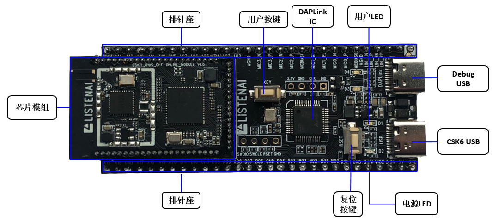
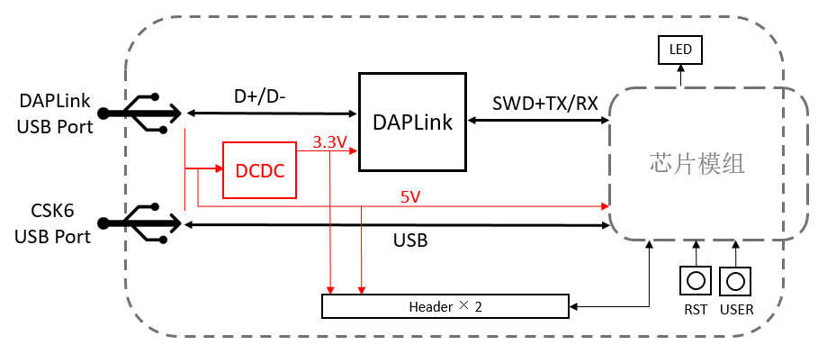
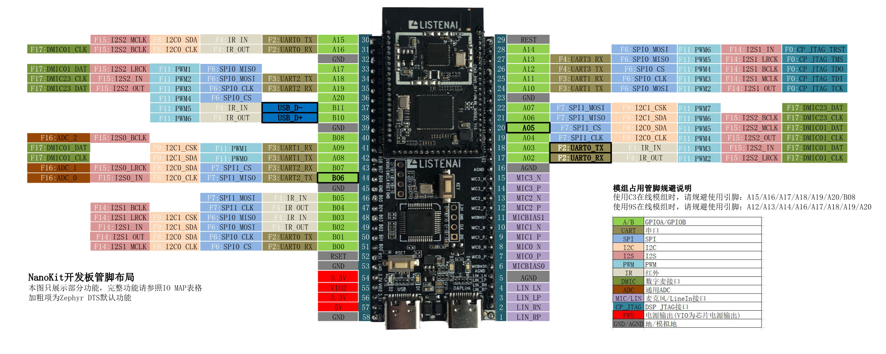

# csk6002-9s-nano

## 开发板简介

csk6002-9s-nano 是一款板载了CSK6002+XR819S模组的NanoKit开发板，您可以通过本开发板快速基于CSK6002芯片进行含无线网络功能在内的应用开发，并搭配其他功能扩展板搭建更加完整的硬件原型。

> csk6002-9s-nano 开发板的版本丝印标注为 CSK-6-NanoKit V1.0。

开发板具备以下主要特性：

- 板载**CSK6002+XR819S**在离线模组，具备WIFI联网功能
- CSK6002芯片内置8MB Flash
- 芯片所有可用管脚引出至两侧2.54mm间距排针，方便使用
- 板载按键与LED，可快速进行基础功能验证
- 板载DAPLink调试器，外接一条USB线即可实现供电、烧录、调试、串口日志查看
- 可搭配功能扩展板使用，衍生丰富玩法
- 对应SDK板型 **csk6002_9s_nano**

### 板载资源

**开发板板载资源如下**

| 硬件资源 | 说明 |
| -------- | ------ |
| 排针座 | 所有可用GPIO管脚已外引至开发板两侧排针，用户可通过对芯片进行编程实现对各个引脚的配置与使用。 |
| DAPLink IC | 板载集成的调试器芯片，可提供USB-UART桥接、固件烧录、代码调试等功能。|
| 复位按键[REST] | 用于复位模组主控芯片的按键。
| 用户按键[KEY] | 连接芯片 **GPIOB_5** 引脚，用户可将其作为功能按键使用。 |
| 用户LED[D1-绿] | 连接芯片 **GPIOA_5** 引脚，用户可通过编程进行控制。|
| 电源LED[D2-红] | 开发板正常接通电源后，该指示灯亮起。|
| DAPLink LED[D3/D4]| 用于指示DAPLink调试器工作状态的LED。 |
| DAPLink USB | 调试器USB接口，可同时作为开发板供电接口、串口查看接口、烧录与调试接口。 |
| CSK6 USB | CSK6的USB接口，可进行CSK6芯片USB接口的调试，支持对开发板进行供电。|

:::info
更详细的硬件电路连接关系，请参考本文 **开发板资料下载** 章节《CSK-6-NanoKit V1.0 硬件原理图》。
:::

### 系统框图

## 开发板的使用

### 供电

开发板支持以下几种方式进行供电：

* 使用USB线连接Debug USB TypeC接口进行供电

* 使用USB线连接CSK6 USB TypeC接口进行供电

* 通过排针座5V与GND排针进行供电

### DAPLink USB口的使用

开发板板载了DAPLink调试器芯片，开发者可通过DAPLink USB接口对CSK6芯片进行 **固件烧录** 、**代码仿真** 与 **串口查看**。

**使用方法如下：**

* 1.使用TypeC数据线连接电脑USB与开发板DAPLink USB

* 2.若设备运行正常，在电脑设备管理器中会出现一个虚拟串口和USB设备

**虚拟串口(CDC)功能：** 对CSK6芯片的 **GPIOA2** 和 **GPIOA3** 【默认UART0】引脚进行了映射，可通过串口上位机工具与串口进行通讯。

**烧录、仿真功能：** 配合CSK6开发工具，可通过DAPLink实现固件快速烧录以及VSCode IDE环境下进行仿真调试，详见[《基于 DAPLink 的 GDB 调试》](../../gdbdebug/gdbdebug-daplink)。

:::note
若未能识别到设备，请检查所用的TypeC数据线是否具备数据传输功能，部分TypeC线只具备供电功能。
:::

### 开发板管脚的使用

csk6002-9s-nano开发板将CSK6002芯片默认的所有可用引脚均引至两侧的2.54mm排针座上，开发者可根据需要自行选用。

由于板载模组的网络通道芯片会占用CSK6芯片的部分引脚，因此在使用开发板管脚进行开发调试时，需注意**规避对这部分引脚的复用**。

**网络通道芯片占用引脚**

| 开发板管脚编号 | 管脚标识 | 819S占用关系 |
| -------------- | -------- | -------------|
| 26 | GPIOA_12 | bt_tx |
| 27 | GPIOA_13 | bt_tx |
| 28 | GPIOA_14 | bt_rst |
| 31 | GPIOA_16 | wifi_wake |
| 33 | GPIOA_17 | wifi_rst |
| 34 | GPIOA_18 | cmd |
| 35 | GPIOA_19 | data |
| 36 | GPIOA_20 | clk |

**开发板管脚功能参考布局图**

:::note
以上管脚布局图仅展示引脚支持的部分常用功能，完整管脚功能映射请参照《IO_MAP表格》。
:::

## 开发板资料下载

| 文件 | 操作 |
| -------------- | -------------|
| CSK-6-NanoKit V1.0 硬件原理图 | [下载](./_downloads/CSK-6-NanoKit_v1_sch.pdf) |
| csk6002-9s-nano 管脚功能参考布局图| [下载](./_downloads/csk6002-9s-nano_pinfun.png) |
